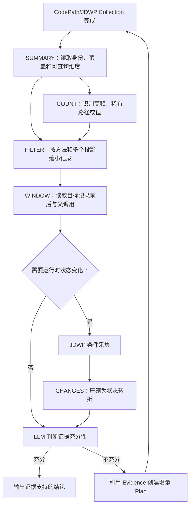

# Dynamic Evidence Discovery 可实施详细设计

- 文档状态：Implemented
- 设计版本：1.0
- 创建日期：2026-09-05
- 负责人：Algorithm Debug Agent
- 目标里程碑：Dynamic Evidence Query v2 / CodePath v5
- 关联需求：从大型 CodePath/JDWP 证据中快速定位决定因果关系的少量记录
- 关联架构与 ADR：ADR-006、ADR-009、ADR-015

## 1. 背景与问题

当前 Agent 已经能够归档算法输入、执行目标 UT、生成 Method Catalog，并通过 CodePath 和
JDWP 采集动态证据。现有能力的主要缺口不是完全采不到数据，而是模型面对大量调用和快照时，
只能使用单个精确值条件和分页读取记录，难以快速完成以下动作：

- 从数万次重复调用中定位目标实体对应的少数调用；
- 从目标调用向前后和调用者方向追踪原因；
- 从数百个 JDWP 快照中找出真正发生变化的状态；
- 判断零结果是“确实未观察到”、采集截断、条件不可用，还是查询条件错误；
- 让后续采集明确引用上一轮证据缺口，而不是无目的重复运行。

本设计不在 Java 中编码 Wafer、Job、腔室、驻留或调度策略语义。代码只处理方法、调用关系、
标量投影、序号、条件、计数、变化和证据覆盖；业务解释继续由 LLM 结合用户问题、算法输入、
Gantt、源码和可选的目标项目知识完成。

## 2. 目标与非目标

### 2.1 目标

- 给 CodePath 和 JDWP 提供一个统一、有界、自描述的动态证据查询入口。
- 明确定义 `SUMMARY`、`FILTER`、`WINDOW`、`COUNT` 和 `CHANGES` 五个查询分支。
- CodePath 支持采集后参数过滤，并新增基于 `scopeMethodKey` 入参投影的采集时过滤。
- CodePath 调用记录能够确定性关联最近的已选择父调用，不新增随机 Invocation ID。
- JDWP 基于现有连续/周期快照生成有界变化视图，不重写 Collector。
- 每个查询结果同时返回源证据覆盖、查询截断和结构语义，防止模型把部分证据解释成完整事实。
- 保持现有 `InvestigationIntent`，使多轮 Plan 通过 Evidence ID、证据缺口和预期观察形成闭环。
- 用复杂、重复、跨实体但无特定调度术语的 Eval 验证模型是否真正缩小证据范围。

### 2.2 非目标

- 不增加数据库、向量库、Embedding、图数据库或常驻查询服务。
- 不对 Gantt 或目标算法字段进行业务语义判断。
- 不自动递归展开对象、集合、Map 或数组。
- 不把不同 UT 重跑的事件拼接成同一条运行时间线。
- 不增加多 OpenCode 会话或跨进程锁。
- 不修改目标算法生产源码来增加 Trace。
- 不将模型生成的分析结论写入 Workspace。

## 3. 当前实现审计

| 能力 | 当前实现 | 结论 |
|---|---|---|
| CodePath 方法选择 | 1 到 50 个精确 `methodKey` | 保留 |
| CodePath 参数投影 | 每方法最多 32 个 `arg[n](.field)*` 或 `return(.field)*` | 保留并用于条件与查询 |
| CodePath 参数过滤 | `evidence_query` 只能在采集后按一个投影精确过滤 | 扩展为多条件；新增 Scope 采集时过滤 |
| CodePath 调用关联 | 有 enter/exit event ID 和 depth，没有父调用字段 | 增加最近已选择父调用关联 |
| CodePath 路径摘要 | 有 Scope invocation 和路径变体 | 保留，作为查询前概览 |
| JDWP 条件 | 每 Tracepoint 最多 4 个 `EQUALS` 条件 | 保留 |
| JDWP 连续采集 | 有首批连续采集和后续周期采样 | 保留 Collector，增加变化查询 |
| JDWP 容量 | 最多 20 个 Tracepoint、单点 200、单 Plan 500 个快照 | 暂不扩大，先验证查询收益 |
| Evidence Query | 精确方法/Tracepoint、单投影、序号、分页 | 升级为五个明确分支 |
| 多轮 Plan | 已有 question、hypothesis、basedOnEvidenceIds、expectedObservations | 保留，收敛 rationale 含义 |
| Evidence lineage | Agent 校验被引用 Evidence 存在于同一 Case | 保留并补零结果闭环测试 |
| Skill 因果约束 | 已要求检查相关实体、更早步骤、共享资源和替代假设 | 强化成可执行查询顺序与停止条件 |

审计结论：当前 Collector 和 Plan 基础能够支撑优化，主要改动应落在 CodePath Scope 过滤、
Normalizer 调用关联、Evidence Query、Tool 契约、Skill 和 Eval。当前没有理由重写 JDWP
Collector，也没有证据支持引入新的存储框架。

## 4. 用例与验收标准

| 用例 | 输入/前置条件 | 预期结果 | 验证层级 |
|---|---|---|---|
| CodePath 多参数筛选 | 同一方法包含不同实体和资源投影 | AND 条件只返回同时满足的调用 | Unit/Integration |
| CodePath Scope 过滤 | 目标实体在重复 Scope 的后部才出现 | 未匹配 Scope 不写路径；匹配 Scope 保留完整已选择子路径 | Unit/E2E |
| CodePath 调用上溯 | 已选择方法之间存在嵌套 | 子调用返回最近已选择父调用的 enterEventId | Unit/Schema |
| 查询上下文窗口 | 已知目标 sequence | 返回目标前后指定数量的记录且顺序稳定 | Unit/Integration |
| 调用/值统计 | 数万条重复调用 | 返回有界计数、topN 和 otherCount | Unit/Performance |
| JDWP 连续变化 | 同一条件实体有多次快照 | 只返回值或状态发生变化的相邻捕获快照 | Unit/E2E |
| JDWP 采样变化 | matchedHit 不连续 | 返回 skippedMatchedHits，禁止宣称完整连续变化 | Unit/Eval |
| 零匹配且完整 | 条件可用、源未截断、无匹配 | 返回 NO_MATCH 和完整覆盖边界，不伪造调用事实 | Unit/Eval |
| 零匹配且部分 | Trace 截断或条件不可用 | 返回 NO_MATCH + PARTIAL；模型必须补采集 | Unit/Eval |
| 多轮补证据 | 第一轮暴露具体缺口 | 第二轮引用第一轮完整 Evidence ID 并改变计划 | Integration/Eval |
| 跨实体因果 | 目标结果受另一个实体影响 | 模型通过 COUNT/FILTER/WINDOW/JDWP 变化发现相关实体 | E2E/Eval |

## 5. 总体方案



这条链路形成漏斗：`SUMMARY` 防止模型猜字段，`COUNT` 和 `FILTER` 从全量数据中缩小候选，
`WINDOW` 恢复局部调用上下文，`CHANGES` 将大量快照压缩成状态转折。任何一个分支都只返回
结构事实，不返回业务结论。

## 6. CodePath v5 设计

### 6.1 两种参数过滤必须区分

| 类型 | 生效时间 | 作用 | 限制 |
|---|---|---|---|
| 采集后过滤 | Trace 已归档后由 Evidence Query 执行 | 在宽范围证据中查找任意已投影参数 | 目标出现前 Trace 已截断时无法补救 |
| Scope 采集时过滤 | `scopeMethodKey` 进入时执行 | 只保留匹配 Scope 及其中的已选择方法路径 | 过早限定目标实体可能漏掉 Scope 外部原因 |

CodePath 当前只具备第一种过滤，而且一次只能匹配一个投影。v5 增加
`scopeConditions`，但只允许作用于 `scopeMethodKey` 的 ARGUMENT 投影：

```json
{
  "scopeMethodKey": "sample.Scheduler#scheduleOne(...)V",
  "scopeConditions": [
    {
      "projectionName": "entityId",
      "expectedType": "STRING",
      "expectedValue": "entity-17"
    }
  ]
}
```

规则：

- `scopeConditions` 最多 4 个并采用 AND。
- 配置条件时必须配置 `scopeMethodKey`。
- 条件引用的投影必须属于 Scope 方法、来源为 ARGUMENT，并且在方法进入时可读取。
- 未匹配 Scope 的所有已选择事件均不写入 Raw Trace。
- 匹配 Scope 从 Scope enter 到对应 exit 保留完整的已选择方法事件结构。
- 条件读取失败计入 unavailable，不得当作未匹配。
- 首轮原因未知时仍应使用宽范围采集；只有已有证据给出实体或区间时才使用 Scope 过滤。

Manifest 增加：

```text
observedScopeInvocations
matchedScopeInvocations
capturedScopeInvocations
unavailableScopeConditions
scopeConditionLimitations
```

模型收到这些值后的动作：

| 返回情况 | 允许判断 | 下一步 |
|---|---|---|
| observed=0 | Scope 方法未被当前 Trace 观察到 | 检查静态候选或扩大 CodePath 方法范围 |
| observed>0, matched=0, unavailable=0, source完整 | 精确条件未在已观察 Scope 中出现 | 拒绝该精确观察或检查条件值，不得声称全程序不存在 |
| unavailable>0 | 条件无法可靠读取 | 修正投影路径或换到值可见的方法，不得作否定结论 |
| captured>0 | 存在可查询的匹配 Scope 路径 | 先 SUMMARY/COUNT，再 FILTER/WINDOW |
| source截断 | 当前路径只有部分覆盖 | 缩小 Scope 或新增 Plan，不得用缺失记录证明路径不存在 |

### 6.2 调用关系

`codepath-invocation-v2` 在现有 `enterEventId` 上增加可空字段：

```json
{
  "enterEventId": 152,
  "parentSelectedEnterEventId": 137
}
```

该字段表示“当前 Trace 中最近的已选择父方法”，不表示真实 JVM 直接调用者。未选择的方法可能
位于二者之间。值由 Normalizer 根据原始 enter/exit 栈确定性生成，不创建随机 Invocation ID。

模型使用闭环：目标 FILTER 结果得到 `parentSelectedEnterEventId`，再查询该 enterEventId 对应
记录和 WINDOW；如果父方法不在 Plan 中，则新 CodePath Plan 扩大到明确的静态边界。

## 7. Evidence Query v2 契约

### 7.1 通用结果

每次查询返回：

```text
schemaVersion = 2.0
artifact / recordType / queryMode / outcome
context.analysisId / planId / collectionId / evidenceId
context.intent
context.sourceCoverage = COMPLETE | PARTIAL
context.availableDimensions
context.limitations
scannedRecords / matchedRecords / returnedRows
queryMoreAvailable / continuationOffset
rowsJsonl
```

`sourceCoverage`描述原始采集和归一化是否完整；`queryMoreAvailable`只描述本次查询输出是否因
limit/maxBytes被截断。两者严禁合并，否则模型会把“查询只返回50条”误解为“源采集不完整”。

### 7.2 SUMMARY

输入：Artifact ID；不接受筛选条件。

返回：Plan intent、Collection/Evidence 身份、采集完成状态、截断原因、方法或 Tracepoint、
投影名称与来源路径、可用查询模式和总记录数。维度列表有硬上限，超出时返回维度截断标志。

模型预期动作：确认数据属于哪个问题和 Plan，先检查覆盖与限制，再选择 COUNT 或 FILTER；
不得从 SUMMARY 的计数直接解释业务根因。

### 7.3 FILTER

支持 CodePath 和 JDWP。最多 8 个投影谓词，同一谓词内匹配同一个值项，不同谓词采用 AND。
方法、Tracepoint 和 sequence 范围仍是顶层结构条件。

返回分支：

| outcome/coverage | 含义 | 模型预期动作 |
|---|---|---|
| MATCHED/COMPLETE | 在完整的已选择范围内找到记录 | 读取 WINDOW、父调用或相关源码 |
| MATCHED/PARTIAL | 部分证据中找到记录 | 可作正向运行线索，不得证明不存在其他路径 |
| NO_MATCH/COMPLETE | 精确条件未在完整的已选择范围中出现 | 检查条件和选定范围，必要时拒绝当前假设 |
| NO_MATCH/PARTIAL | 没找到但源不完整 | 增量采集或修复 unavailable，不得作否定结论 |

### 7.4 WINDOW

输入：唯一 `anchorSequence`、`beforeRecords`、`afterRecords`。窗口按 Artifact 中记录顺序计算，
不是用数值简单相减。CodePath 行同时返回父选择调用字段；JDWP 行保留 tracepoint、hit 计数和栈。

模型预期动作：识别目标记录之前的决策、兄弟调用和之后的结果；如果窗口边缘仍处于同一复杂
过程，应使用新的锚点或扩大窗口，而不是猜测被省略的调用。

### 7.5 COUNT

支持以下结构维度：

```text
METHOD_REF
TRACEPOINT_ID
PROJECTION_VALUE(valueName)
VALUE_STATUS(valueName)
```

返回稳定排序的 topN 和 `otherCount`。COUNT 只说明频率和分布，不证明高频项是原因，也不证明
稀有项是异常。模型预期动作是选择需要 FILTER 的候选组，或比较问题实体与相关实体的路径分布。

### 7.6 CHANGES

第一版只支持 JDWP，因为 JDWP 快照表示同一 Tracepoint 的状态观察；CodePath 调用参数属于
不同调用，直接相邻比较容易把不同实体误当状态变化。

输入必须包含一个精确 Tracepoint、1 到 16 个变化值路径，并满足至少一个条件：Plan 中该
Tracepoint 已有条件，或查询提供至少一个不属于变化值列表的身份谓词。

每条变化记录包含：

```text
fromSequence / toSequence
fromMatchedHit / toMatchedHit
skippedMatchedHits
valuePath
beforeStatus / afterStatus
beforeValue / afterValue
```

`skippedMatchedHits=0`才表示两个快照对应连续 matched hit；大于0表示中间状态未采集。即使为0，
它也只证明该 Tracepoint 上所选值的相邻捕获变化，不证明算法所有状态变化均被观察。

模型预期动作：把变化位置映射到当前源码条件；如只知道“值发生变化”而不知道谁修改，应回到
CodePath WINDOW 或在赋值位置增加新的 JDWP Plan。

## 8. 查询上下文解析

查询入口只接受已注册且 SHA 校验通过的 `CODEPATH_INVOCATIONS` 或
`JDWP_SNAPSHOT_SUMMARY` Artifact。内部解析 Artifact 相对路径中的 Collection/Evidence 身份，
再读取已归档 collection-request、Plan、Manifest、Normalization Manifest 和 Evidence Bundle。

解析器必须交叉校验 caseId、analysisId、runId、planId、collectionId、evidenceId。任一不一致时
返回结构化完整性错误，不允许退化成无上下文查询。查询结果不落盘，不修改 Raw 或派生产物。

## 9. 多轮采集闭环

继续使用现有 `InvestigationIntent`，不增加 conversation state：

| 字段 | 唯一职责 |
|---|---|
| questionToAnswer | 本轮唯一待回答问题 |
| hypothesis | 本轮要验证或拒绝的解释 |
| basedOnEvidenceIds | 触发本轮的同 Case 历史 Evidence |
| rationale | 现有证据具体缺什么、为什么当前工具能补齐 |
| expectedObservations | 哪些观察会改变下一步决策 |

第一轮允许 `basedOnEvidenceIds` 为空。当前 Analysis 已有动态 Evidence 时，后续动态 Plan 必须
至少引用一个当前 Case Evidence；Agent继续校验引用真实存在。语义是否真的合理由Skill和Eval
检查，Java不解释自然语言。

零记录、零匹配、截断和读取不可用的成功 Collection 必须能够形成
`MISSING_EVIDENCE` Evidence Bundle，且不能获得虚假的 VALIDATION 覆盖。这样下一轮仍可引用
其 Evidence ID 说明为什么调整 Plan。Collector/Agent 工具失败只返回失败 Manifest，不生成
可用于目标结论的 Evidence。

## 10. Skill 决策闭环

复杂成功 UT/Gantt 问题采用以下顺序：

1. 从输入和源码建立至少一个上游假设及一个替代假设。
2. 宽范围 CodePath 获取路径变体，不得第一步只过滤用户点名实体。
3. SUMMARY 检查覆盖和查询维度。
4. COUNT 识别重复模式、稀有分支和相关实体值。
5. FILTER 定位候选调用。
6. WINDOW 和父选择调用向前追溯决策来源。
7. 只有命名状态仍不明确时制定 JDWP 条件计划。
8. CHANGES 找状态转折，并检查 skippedMatchedHits。
9. 证据不足时引用前轮 Evidence 追加 Plan；不得原样重复有效 Plan。
10. 只有输入、源码、路径、状态和可见结果之间的关键因果边闭合时才输出确认性根因。

明确分支：目标异常或断言已由堆栈和源码充分解释时，不强制执行上述完整流程；复杂因果流程
只服务于现有证据不能回答的问题。

## 11. 错误处理与模型动作

| 错误/状态 | 含义 | 模型必须执行 | 模型禁止执行 |
|---|---|---|---|
| QUERY_MODE_UNSUPPORTED | Artifact 不支持该模式 | 改用返回的 supportedModes | 不得改读 Raw 猜测 |
| QUERY_DIMENSION_UNKNOWN | 投影/Tracepoint 不存在 | 使用 SUMMARY 返回的维度修正 | 不得假设字段缺失等于值为空 |
| QUERY_COMBINATION_INVALID | 分支参数组合错误 | 按消息修正一次请求 | 不得作为目标 UT 失败 |
| QUERY_NO_MATCH + COMPLETE | 已选择范围内无精确匹配 | 检查范围后拒绝或调整假设 | 不得扩大为全程序不存在 |
| QUERY_NO_MATCH + PARTIAL | 源证据不完整 | 新建增量 Plan | 不得作否定结论 |
| QUERY_OUTPUT_TRUNCATED | 还有匹配行未返回 | 缩小条件或使用 continuationOffset | 不得把返回行当全部匹配 |
| SOURCE_EVIDENCE_PARTIAL | 采集或归一化不完整 | 只作线索或补采集 | 不得提升为完整确认事实 |
| ARTIFACT_INTEGRITY_FAILED | 已注册文件发生变化 | 停止使用并执行 Case audit | 不得绕过 SHA 直接读取 |
| CHANGE_SERIES_UNSCOPED | 无法保证同一逻辑序列 | 增加条件/身份谓词 | 不得比较不同实体为状态变化 |

所有异常保留 cause 并写 Case DFX 日志；ToolResponse只返回有界英文错误和恢复动作。

## 12. 性能与容量预算

| 指标 | 默认/上限 | 超限行为 |
|---|---:|---|
| Query predicates | 最多 8 | 请求失败，不执行扫描 |
| FILTER/COUNT 扫描 | 最多 100000 条，保持现有上限 | 返回 scan-limit 错误并建议 Scope 采集 |
| Query rows | 最多 50 | 返回 continuationOffset |
| Query 输出 | 最多 64 KiB | 返回 queryMoreAvailable |
| WINDOW 前后记录 | 各最多 100 | 请求失败 |
| CHANGES 值路径 | 最多 16 | 请求失败 |
| COUNT 分组 | 最多 50 个返回组 | 其余合并为 otherCount |
| JDWP 输入快照 | 现有最多 500 | 不扩大 |
| CodePath Scope 条件 | 最多 4 | 请求失败 |

CodePath查询继续流式扫描；JDWP Summary在现有硬预算内读取。第一阶段不生成旁路索引。实现前
建立10万条合成调用基线；只有多次查询时间被证明不可接受时，才另行设计稀疏索引。

## 13. 安全、隐私与无侵入性

- 不修改目标算法生产源码。
- Query不执行方法、Getter、JSONPath表达式或任意脚本。
- 返回值只包含采集计划已允许的标量和现有调用身份。
- 仍通过ArtifactReference完成大小和SHA校验。
- 日志不记录完整参数值、算法输入或查询返回行，只记录模式、计数和安全ID。
- 不增加网络依赖和第三方运行库。

## 14. 测试设计

### 14.1 单元测试

- CodePath Scope 条件的编译、AND、不可用和字段来源限制。
- 匹配 Scope 保留完整已选择调用结构，未匹配 Scope 不写事件。
- Normalizer正确生成`parentSelectedEnterEventId`，并明确跳过未选择方法。
- 五种Query分支的参数矩阵、排序、分页、字节和扫描预算。
- FILTER多谓词必须由同一记录中的不同投影分别满足。
- WINDOW按记录位置返回前后数据。
- COUNT稳定排序并正确计算otherCount。
- CHANGES正确计算matched-hit间隔、状态变化和不可用值。
- 零结果Evidence只产生MISSING_EVIDENCE，不产生虚假Validation覆盖。

### 14.2 契约与兼容性测试

- CodePath Plan v5、Invocation v2、Method Path Manifest新版本JSON往返和Schema校验。
- Evidence Query Result v2各分支Golden JSON。
- Query继续读取Invocation v1，但父关系标记为不可用。
- OpenCode旧单条件参数映射为v2 FILTER，避免安装升级瞬间失配。

### 14.3 集成与端到端测试

- 真实JUnit重复调用中目标实体出现在后部，Scope过滤仍能捕获。
- CodePath宽范围到Scope增量采集，再到JDWP条件采集的完整Evidence lineage。
- 100个JDWP快照压缩为少量变化记录。
- 每个Case检查Plan、Manifest、Raw、Derived、Validation、Evidence和DFX日志。
- 不允许空目录、错误Artifact注册或跨Run时间线拼接。

### 14.4 Agent Eval

- 高频路径不是根因，模型必须通过COUNT后继续FILTER/WINDOW。
- 用户点名实体不是原因，模型必须发现共享状态中的另一个实体。
- NO_MATCH/PARTIAL时必须补采集，不得输出否定结论。
- JDWP采样有间隔时不得宣称每一步连续变化。
- 第二轮Plan必须引用第一轮Evidence并说明具体缺口。
- 已有堆栈足够解释异常时不得启动无意义动态采集。

## 15. 兼容、迁移与回滚

- 新写入CodePath Plan、Invocation和Query Result使用新主版本。
- Query读取器兼容Invocation v1；v1结果不提供父选择调用。
- 历史Plan不具备Scope条件时按无条件方式执行。
- 不迁移或改写历史Workspace Artifact。
- 回滚时旧版本仍可读取旧Artifact；新版本Artifact由Schema主版本明确拒绝，不能静默误读。

## 16. 风险与审计结论

| 风险 | 影响 | 缓解措施 | 状态 |
|---|---|---|---|
| Scope过滤过早导致漏掉相关实体 | 因果链偏窄 | Skill要求先宽后窄；PARTIAL不得作否定结论 | Resolved by design |
| 父调用被误解为直接调用者 | 错误源码推断 | 字段命名为parentSelected并返回固定语义 | Resolved by design |
| CHANGES比较了不同实体 | 伪造状态转折 | Tracepoint条件或身份谓词门禁 | Resolved by design |
| 采样快照被解释为连续状态 | 漏掉中间变化 | 返回skippedMatchedHits | Resolved by design |
| Query功能过多导致模型不会用 | 工具误调用 | 单一工具、五个互斥模式、SUMMARY和Skill顺序 | Resolved by design |
| 线性扫描性能不足 | 查询延迟 | 先建立基线，达到证据后再设计索引 | Open, measurement required |

二次设计审计结论：每个新增字段均有明确生产者、消费者和错误分支；没有新增无人读取的
Workspace文件。CodePath负责从大量调用中定位“哪段路径”，JDWP负责从关键区间中定位“哪个
状态发生变化”，Evidence Query负责压缩和关联，LLM负责业务因果解释。该分工直接服务于从
大规模动态证据中找出决定因果关系的小集合，且不绑定具体算法业务。

## 17. 变更记录

| 日期 | 版本 | 变更内容 | 作者 |
|---|---:|---|---|
| 2026-09-05 | 0.1 | 完成动态证据发现、CodePath Scope过滤、JDWP变化查询和模型闭环设计 | Codex |
