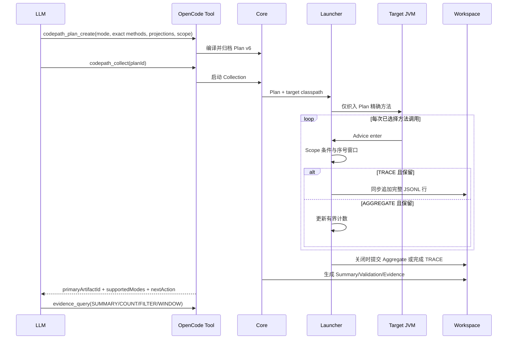

# 可扩展 CodePath 采集设计

状态：已自审，进入实现  
日期：2026-09-06

## 1. 问题与目标

现有 Launcher 在目标 JVM 中对几乎所有具体方法织入 Advice，再在回调中按 Plan 丢弃未选择方法。大型算法的方法调用量很大时，即使最终 Raw Trace 很小，未选择方法仍承担 Advice、配置读取和线程本地状态开销。TRACE 又按时间前缀写盘，预算耗尽后会丢失后续关键调用。

本次目标只包含：

1. 仅对 Plan 精确选择的类和方法织入 Advice。
2. 在读取普通投影和构造 JSON 前完成 Scope 条件及序号窗口判断。
3. 保留逐调用 `TRACE`，新增无逐调用明细的 `AGGREGATE` 探索模式。
4. 复用 `method-path-summary.json`、Artifact Registry 和 `evidence_query`，不增加重复的直方图体系。
5. 所有不完整状态必须向模型返回覆盖范围、原因和下一步动作。

不包含：业务字段自动发现、任意表达式、Getter/集合/Map 遍历、异步写盘、并行采集、JFR 或采样 Profiler。

## 2. 契约

`CodePathCollectionPlan` 升级为 v6，并新增：

- `captureMode`: `TRACE` 或 `AGGREGATE`。
- `scopeStartOrdinal`: 从第几个条件匹配 Scope 开始保留，起始值为 1。
- `maxMatchedScopes`: 最多保留多少个匹配 Scope。

序号只计算通过全部 `scopeConditions` 的 Scope。未配置 `scopeMethodKey` 时窗口必须为默认值。v5 Plan 由 Launcher 兼容读取，并按 `TRACE/1/10000` 解释；新计划只写 v6。

`depth` 明确定义为 `SELECTED_METHOD_DEPTH`，`parentSelectedEnterEventId` 和路径边只表示最近的已选择祖先，不宣称完整 JVM 直接调用者。

## 3. 采集时序

## 4. AGGREGATE 边界

AGGREGATE 记录方法进入/正常退出/异常退出计数、最近已选择祖先边、已选择方法深度、Scope 计数，以及 Plan 显式声明的标量投影值计数。每个投影最多跟踪 256 个不同值，全 Collection 最多跟踪 10000 个不同值。超限值只累计 `otherCount`，并标记：

- `VALUE_CARDINALITY_LIMIT_REACHED`
- `TRACKED_VALUES_ARE_NOT_GLOBAL_TOP_VALUES`

因此 `trackedValueCounts` 不是全局 topN，不能用于证明未保留值不存在。AGGREGATE 不生成 `codepath-invocations.jsonl`，不能证明调用顺序或多个投影值属于同一次调用。需要顺序或相关性时，模型必须据此创建更精确的 TRACE Plan。

## 5. 异常闭环

| 状态 | 证据含义 | 模型下一步 |
| --- | --- | --- |
| 方法未观察到且覆盖完整 | 本次精确范围内未命中 | 回到源码或修正方法选择 |
| Scope 条件不可读 | 不能判断该调用是否属于目标范围 | 修正投影路径，不得宣称值不存在 |
| Scope 窗口为空 | 条件匹配次数不足或窗口设置错误 | 先查 Scope 统计，再调整窗口 |
| 事件/字节预算命中 | 只覆盖已保留前缀 | 使用 AGGREGATE 或缩小 Scope |
| 值基数超限 | 方法/路径计数可用，值分布部分可用 | 缩小 Scope 或直接 TRACE 已知值 |
| 目标 UT 失败 | 目标失败事实，非 Tool 崩溃 | 仅在失败指纹匹配时作确认性证据 |
| Agent/织入/写盘失败 | 无可用目标证据 | 按错误码修复环境或 Plan |

## 6. 性能与测试门禁

- 证明未选择方法不进入 Advice，而不是只证明不写 Raw。
- 证明条件不匹配时不读取普通投影。
- 证明异常退出能闭合栈。
- 证明 100 万次 AGGREGATE 调用的文件和内存有界。
- 证明 Scope 序号、递归、空窗口、高基数和写盘失败均返回结构化状态。
- 性能结论使用至少 5 次运行的中位数，并与相同 UT 的无采集运行对照。

## 7. 自审结论

本设计没有新增业务语义、后台线程、锁、第二套查询协议或第二套 Artifact 身份体系。新增复杂度只位于 CodePath 热路径、一个 Aggregate Raw Schema 和现有 Evidence Query 的 Summary 读取分支，直接对应大型算法的已验证瓶颈。

