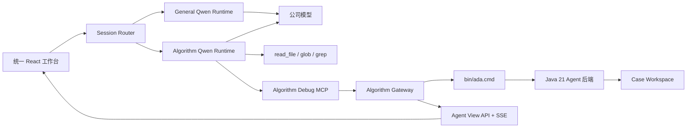
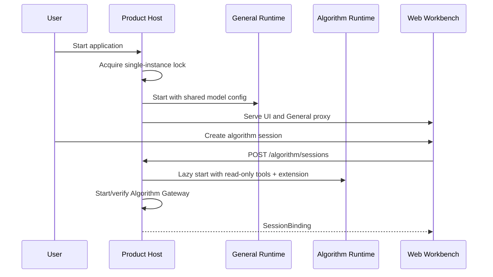
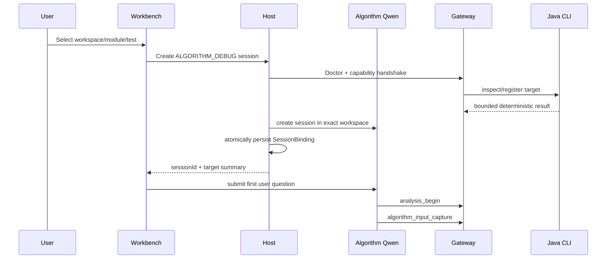

# Qwen MCP 与双 Runtime 统一工作台可实施详细设计

- 文档状态：Accepted
- 设计版本：1.0
- 创建日期：2026-09-20
- 确认日期：2026-09-20
- 负责人：Algorithm Debug Agent 团队
- 目标里程碑：Qwen Adapter、统一工作台、算法专用分析界面
- 关联需求：在一个产品中提供通用 Qwen 会话与算法 UT 分析会话
- 关联架构与 ADR：[模块详细设计](../architecture/algorithm-debug-agent-module-detailed-design-v1.md)、
  [ADR-007](../decisions/ADR-007-opencode-adapter-via-cli.md)、
  [ADR-017](../decisions/ADR-017-qwen-mcp-adapter-and-dual-runtime-workbench.md)
- 实施计划：[总计划](../superpowers/plans/2026-09-20-qwen-dual-session-algorithm-agent.md)、
  [算法仓计划](../superpowers/plans/2026-09-20-qwen-mcp-adapter-and-gateway.md)、
  [跨仓验证计划](../superpowers/plans/2026-09-20-qwen-dual-repository-validation-and-release.md)

## 1. 背景与问题

当前产品以 OpenCode 作为唯一对话 Runtime。OpenCode 的 Agent、Skill 与 13 个 Custom Tool 经
JavaScript Adapter 调用 `bin/ada.cmd`，Java 后端确定性完成 Case、UT、静态分析、CodePath、JDWP、
Evidence 和审计。真实 Qwen CLI 适配实验表明，相同公司模型在 Qwen Runtime 下的分析表现优于当前
OpenCode 路径，因此需要把 Qwen 变成正式受支持的第二客户端，并进一步交付统一产品界面。

产品同时保留两类使用场景：普通编码工作使用完整 Qwen 能力；算法诊断工作绑定一个 Java/Maven 目标 UT，
使用 Algorithm Debug Skill 和受限工具集。两类会话共享模型配置，但算法会话不得因为复用 Qwen 而获得
写源码或任意 Shell 权限，通用会话也不得被算法 Prompt 和工具污染。

只把 13 个工具机械改成 MCP 可以完成 Qwen CLI 能力验证，但不能完成统一会话、权限隔离、目标 UT 选择、
结构化分析界面、跨会话目标执行串行和安装升级。因此本设计把交付拆为可独立验收的 Adapter、Host、UI 与
Release 四个子项目。

## 2. 目标与非目标

### 2.1 目标

- 保持 Java 21/Maven 后端及其 Case、Run、Collection、Evidence 契约不变，新增 Qwen MCP 薄适配。
- Qwen Extension 同时交付规范 Skill 引用与 13 个 MCP Tool，能够从目标模块运行真实 Qwen Eval。
- 一个本地产品入口提供 `GENERAL` 与 `ALGORITHM_DEBUG` 两类会话，共享公司模型配置和视觉体验。
- 两类会话使用隔离的 Qwen Runtime；算法 Runtime 只提供只读源码工具和领域 MCP 工具。
- 算法会话绑定 Workspace、Maven 模块、目标测试、Case 与 Analysis，切换和恢复时不混淆证据。
- 专用界面展示输入解读、源码候选关系、运行路径、JDWP、假设—证据矩阵、充分性和最终结论。
- 所有专用面板从确定性、有界、版本化投影读取数据，保留 provenance 和证据等级。
- 保留 OpenCode 路径并建立同模型 A/B Eval，在证据确认前不宣称 Qwen Runtime 是准确率提升的唯一原因。
- 提供 Windows 本地安装、启动、能力检查、升级与回滚路径。

### 2.2 非目标

- 不重写 Qwen 的模型调用、上下文压缩、会话或工具调度实现。
- 不把算法业务语义、Evidence 规则或 Java Collector 放进 Qwen Core。
- 第一版不实现单 Runtime 会话级 Agent Profile。
- 第一版算法会话不修改目标算法源码，不执行任意 Shell，不自动提交 Git。
- 不接管生产调度，不连接在线设备，不执行生产决策。
- 不把 Raw Trace、完整对象图或无界 Gantt 直接发送到模型或浏览器。
- 不承诺多个产品实例并发运行同一目标 UT；产品保持单实例，目标执行由唯一 Gateway 串行化。
- 不在第一版提供远程多用户服务器部署、权限租户或集中式 Case 数据库。

## 3. 现状与约束

- Java 后端由 20 个 Maven 模块组成，公共契约位于 `ada-contracts`，应用编排位于 `ada-core`，CLI 位于
  `algorithm-debug-cli`。
- OpenCode 暴露 13 个工具，Adapter 负责参数边界、Workspace 注入、有界临时文件、子进程预算、结构化
  错误、交互记录和单 Runtime 目标执行串行。
- `skills/algorithm-debug/SKILL.md` 是规范工作流源；不得产生手工维护的第二份正文。
- Qwen Code 使用 Node.js 22、TypeScript、React 和 `qwen serve`；SDK 支持 MCP、内置 Prompt 追加、
  `coreTools` 限制和 WebShell 嵌入。
- Qwen 当前 Workspace Runtime 内多个会话共享启动期工具和设置。算法与通用会话需要不同权限，因此第一版
  使用两个进程隔离的 Runtime。
- Qwen Code 为 Apache-2.0；分发需保留许可证、NOTICE 与修改声明，不获得 Qwen 商标使用权。
- 两仓均可能独立升级，发布产物必须锁定兼容矩阵，禁止开发机绝对路径进入生产配置。

## 4. 用例与验收标准

| 用例 | 输入/前置条件 | 预期结果 | 验证层级 |
|---|---|---|---|
| 通用会话 | 已配置公司模型 | 行为与未改造 Qwen 基线一致，不加载算法 MCP | Unit/Integration/E2E |
| 创建算法会话 | 选择可信 Workspace、模块和唯一 UT | 建立 SessionBinding，启动 Algorithm Runtime 和 Case | Contract/E2E |
| Qwen 工具适配 | Algorithm Runtime 已启动 | 13 个工具参数、ToolResponse、错误和 Artifact 与 OpenCode 基线一致 | Contract/Integration |
| 算法输入优先 | 目标测试含唯一输入文件 | 首轮执行 `analysis_begin -> algorithm_input_capture`，面板展示有 provenance 的输入投影 | E2E/Eval |
| 证据驱动分析 | 问题需要运行时事实 | 按缺口选择 Run/静态/CodePath/JDWP，不把假设写成事实 | E2E/Eval |
| 修改源码请求 | 算法会话中要求修改 Comparator | 无写工具执行；只返回建议或 Diff 预览 | Security E2E |
| 无关问题 | 算法会话询问无关通用问题 | 不调用算法工具，提供转入通用会话动作 | UI E2E |
| 会话切换 | General 与 Algorithm 会话均存在 | 历史、模型流、Case 和面板保持各自身份 | Integration/E2E |
| 目标执行冲突 | 两个算法会话同时请求动态执行 | 第二请求收到结构化 BUSY，不启动第二目标进程 | Integration |
| Runtime故障隔离 | Algorithm Runtime 或 Gateway 崩溃 | 算法会话显示可恢复错误；General Runtime 继续工作 | E2E |
| 版本不兼容 | View API/ToolResponse版本不匹配 | 算法会话拒绝启动并提示升级；通用会话不受影响 | Contract/E2E |
| 重启恢复 | 应用正常或异常重启 | Qwen会话可恢复，SessionBinding原子读取，未完成目标进程不被错误宣称成功 | E2E |

## 5. 总体方案



产品 Host 是两个 Runtime、Gateway 与浏览器资源的唯一进程所有者。General Runtime 在产品启动后可预热；
Algorithm Runtime 与 Gateway 在首次创建或打开算法会话时按需启动。两个 Runtime 读取同一受保护的模型
配置，但使用不同运行目录、Prompt、Extension 和工具 allowlist。

Qwen MCP Adapter 与 OpenCode Adapter 调用同一 Host-neutral Tool Runtime。Tool Runtime 不解释算法语义，
只执行输入验证、CLI 进程边界、响应 Schema、日志和串行门禁。Java CLI 继续是所有确定性事实的来源。

## 6. 模块与类设计

### 6.1 Algorithm Debug Agent 仓库

| 模块/类 | 职责 | 输入 | 输出 | 依赖 |
|---|---|---|---|---|
| `integrations/shared-runtime` | Host-neutral CLI调用、Schema校验、错误映射、交互记录和执行门禁 | Tool名称、参数、Workspace | ToolResponse 2.0 | Node标准库、现有Schema |
| `integrations/qwen/extension` | Qwen Extension manifest与规范Skill打包 | 构建产物路径 | 可安装扩展目录 | Shared Runtime |
| `AlgorithmDebugMcpServer` | 注册13个MCP Tool并映射到Shared Runtime | MCP CallTool请求 | MCP content/isError | MCP SDK、Zod |
| `AlgorithmGatewayServer` | 托管MCP、View API、SSE、健康检查和生命周期 | loopback HTTP | 版本化JSON/SSE | MCP Server、View Projector |
| `AgentViewProjector` | 从已注册且校验通过的Artifact生成有界只读视图 | caseId/analysisId/view kind | AgentView v1 | CLI/Case contracts |
| `TargetExecutionGate` | 产品进程内串行化Run/CodePath/JDWP | operation + owner | lease或BUSY | Clock/ProcessPort |
| `QwenEvalDriver` | 使用Qwen Runtime执行现有Suite | Eval Suite v1 | 可比较Eval记录 | agent-evals |

### 6.2 Qwen Code 仓库

| 模块/类 | 职责 | 输入 | 输出 | 依赖 |
|---|---|---|---|---|
| `@qwen-code/algorithm-debug-host` | 单实例、子进程、端口、代理、配置和恢复 | ProductConfig | 本地HTTP服务 | qwen serve、Gateway |
| `RuntimeManager` | 启停General/Algorithm Runtime并执行健康检查 | RuntimeProfile | RuntimeHandle | ProcessPort、Clock |
| `ModelConfigBroker` | 向两个Runtime提供同一模型配置而不向浏览器泄密 | QWEN_HOME/env | 启动环境 | 文件系统 |
| `SessionBindingStore` | 原子保存session到类型和Case的映射 | SessionBinding v1 | 当前快照 | 文件系统端口 |
| `SessionRouter` | 根据binding选择daemon base URL与页面 | sessionId | Runtime target | Store、RuntimeManager |
| `@qwen-code/algorithm-debug-web` | 统一会话、通用聊天和算法专用视图 | Host API | React UI | WebShell、SDK |
| `UnifiedSessionSidebar` | 聚合两个daemon的会话目录 | 两个SessionSummary流 | 排序后的会话列表 | DaemonClient |
| `AlgorithmSessionView` | 组合WebShell与领域面板 | SessionBinding | 三栏工作台 | View API |

第一版不修改 `packages/core`、Provider、模型或工具调度器。若 WebShell 已有的受控 `sessionId`、事件回调和
嵌入接口不足，只允许增加通用、产品无关的最小公开接口，并单独测试所有既有消费者。

## 7. 数据与契约设计

### 7.1 MCP工具契约

MCP Server 暴露与当前13个OpenCode Tool一一对应的工具名。输入Schema从现有Tool定义和Java CLI契约生成
或共享，禁止手写两套行为不同的字段。MCP成功结果的文本内容是完整、有界的ToolResponse 2.0 JSON；协议、
启动、超时和Schema失败设置 `isError: true`，但目标UT失败仍是合法ToolResponse，不冒充MCP基础设施失败。

### 7.2 SessionBinding v1

```json
{
  "schemaVersion": "1.0",
  "sessionId": "qwen-session-id",
  "sessionType": "ALGORITHM_DEBUG",
  "runtimeId": "algorithm",
  "workspaceCwd": "D:/work/scheduler",
  "modulePath": "scheduler-core",
  "testSelector": "com.acme.DispatchSchedulerTest#shouldSchedule",
  "caseId": "case-001",
  "analysisId": "analysis-001",
  "createdAt": "2026-09-20T08:00:00Z",
  "updatedAt": "2026-09-20T08:01:00Z"
}
```

`GENERAL` binding只包含 `sessionId`、`sessionType`、`runtimeId`、时间字段和可选Workspace。Store是Host唯一
写者，使用临时文件加原子替换；恢复时拒绝未知主版本、重复sessionId和越界路径。

### 7.3 Agent View v1

View由多个有界文档组成：

- `AnalysisOverviewView`：身份、阶段、工具状态、覆盖与下一步；
- `AlgorithmInputView`：字段、值摘要、JSON Pointer、Artifact和证据等级；
- `SourceArchitectureView`：入口、方法、边、源码锚点、静态覆盖和未解析原因；
- `RuntimePathView`：TRACE/AGGREGATE模式、方法树/边、计数、覆盖、截断和限制；
- `RuntimeStateView`：JDWP命名值、变化、命中计数、采样与限制；
- `EvidenceMatrixView`：假设、支持证据、反证、缺口和状态；
- `ConclusionView`：按五类证据等级列出的结论与引用。

所有View包含 `schemaVersion`、`caseId`、`analysisId`、`generatedAt`、`sourceArtifactIds`、`coverage` 和
`limitations`。View不写回Raw Artifact，不成为新的事实来源。

### 7.4 Capability handshake

Gateway健康响应至少包含：

```json
{
  "agentVersion": "1.0.0",
  "toolResponseVersion": "2.0",
  "viewApiVersion": "1.0",
  "skillVersion": "1.0",
  "supportedTools": ["analysis_begin", "case_inspect", "algorithm_input_capture"]
}
```

Host按主版本和完整工具集合校验。失败时只禁用Algorithm Runtime并返回稳定错误码
`ALGORITHM_GATEWAY_INCOMPATIBLE`。

## 8. 核心流程

### 8.1 产品启动与Runtime隔离



General Runtime失败导致通用会话不可用，但不应损坏Case。Algorithm Runtime或Gateway失败不终止General
Runtime。Host关闭时按Gateway、Algorithm Runtime、General Runtime顺序有界终止并记录退出结果。

### 8.2 算法会话创建



目标检查失败时不创建Case或虚假会话。Qwen会话已经创建但binding提交失败时，Host关闭该新会话或将其标记为
不可恢复的孤儿，并返回结构化错误；不得把未绑定会话展示为可用算法会话。

### 8.3 工具调用

MCP Adapter校验请求、解析Workspace和身份、进入执行门禁、调用CLI、限制stdout/stderr、解析
ToolResponse 2.0、记录interaction并返回。工具不得重写Java返回的eventType、ID、比较状态、Artifact引用或
证据等级。基础设施失败与目标UT失败保持不同错误面。

### 8.4 专用面板刷新

Gateway在成功Tool结束、失败Tool结束、Case/Analysis身份变更和目标执行状态变更时发送有界SSE事件：
`view_invalidated`。事件只携带session/case/analysis/view kind和单调序号，不携带Raw Trace。UI收到后按kind
重新GET对应View；断线后用当前快照恢复，不要求重放全部事件。

## 9. 错误处理与可观测性

稳定错误域分为：

- `PRODUCT_*`：单实例、端口、配置、子进程和代理；
- `QWEN_RUNTIME_*`：daemon启动、健康、会话、流和恢复；
- `ALGORITHM_GATEWAY_*`：握手、认证、MCP/View协议和版本；
- 既有 `ADA_*`：CLI启动、响应、临时文件和Java工具错误；
- 目标行为：Run/Collection的结构化ToolResponse，不映射为基础设施异常。

Host和Gateway日志必须包含 `runtimeId/sessionId/caseId/analysisId/toolCallId` 中当前已知字段，但不得记录模型
密钥、完整算法输入、Raw Trace或未脱敏本地路径。每个子进程保存启动时间、PID、命令标识、退出码、超时与
终止原因；不得记录含凭据的完整命令行。

自动重试只用于无副作用的健康检查和只读View GET。目标UT、CodePath、JDWP和任何可能写Case的操作不自动
重试；响应不确定时保留manifest并要求用户检查Case。

## 10. 性能与容量预算

| 指标 | 默认值 | 上限 | 超限行为 | 验证方式 |
|---|---:|---:|---|---|
| MCP请求JSON | 256 KiB | 1 MiB | 拒绝 `REQUEST_TOO_LARGE` | Contract test |
| MCP ToolResponse文本 | 1 MiB | 1 MiB | 终止CLI并返回现有超限错误 | Integration test |
| View单响应 | 512 KiB | 1 MiB | 截断明细并保留总数/限制 | Projection test |
| SSE事件 | 8 KiB | 16 KiB | 拒绝事件并记录Gateway错误 | Unit test |
| View刷新频率 | 事件驱动 | 每类每秒2次 | 合并失效通知 | UI test |
| SessionBinding数量 | 1000 | 5000 | 归档不可见旧binding，不删除Qwen历史 | Load test |
| Gateway目标执行 | 1 | 1 | 第二请求返回BUSY | Concurrency test |
| 子进程启动等待 | 30秒 | 60秒 | 终止并返回启动超时 | Integration test |
| 子进程关闭等待 | 10秒 | 30秒 | 强制终止并记录原因 | Lifecycle test |

既有Java事件、字节、Scope、值基数和时间预算不因本设计提高。性能结论必须分别记录冷启动、热切换、View
读取和真实目标执行，不能用模型响应时间替代工具性能。

## 11. 安全、隐私与无侵入性

- Algorithm Runtime不注册`edit`、`write_file`、`notebook_edit`和`run_shell_command`；MCP工具只能执行
  明确领域动作。
- General Runtime保持Qwen原权限确认，不获得Algorithm Gateway Token或MCP配置。
- Host通过随机loopback端口和进程内随机Token访问Gateway；浏览器只访问Host同源代理。
- Workspace必须经过用户选择和信任，所有目标路径经规范化后校验位于Workspace或Agent安装目录。
- Gateway不可接受任意可执行文件、任意命令、任意Java主类或任意输出目录。
- 模型凭据保留在Qwen配置/环境层，不进入SessionBinding、Case、日志或浏览器Storage。
- 算法输入、源码与Evidence默认只发给配置的公司模型；产品文档必须说明数据边界。
- 不修改目标算法生产源码来增加Trace；CodePath/JDWP继续使用外部Launcher和Collector。
- 分发Qwen派生产品时保留Apache-2.0许可证、NOTICE、修改声明，并使用自有产品品牌。

## 12. 测试设计

### 12.1 单元测试

- 13个MCP工具的名称、描述、输入Schema和CLI动作一一对应。
- MCP成功、目标失败、Adapter失败和协议失败的结果分类正确。
- SessionBinding序列化、原子提交、未知版本、重复ID和损坏恢复。
- RuntimeManager启动参数、共享模型配置、隔离运行目录、按需启动和反向关闭。
- AgentView投影保持证据等级、Artifact provenance、覆盖与截断。
- UI Router根据sessionType选择正确base URL和布局。

### 12.2 契约与兼容性测试

- 同一fixture经OpenCode与MCP Adapter产生语义相同的ToolResponse 2.0。
- Gateway capability与Host兼容矩阵匹配；主版本不兼容时fail closed。
- Agent View v1通过JSON Schema，新增可选字段不破坏旧UI fixture。
- Qwen通用Runtime不发现Algorithm MCP；Algorithm Runtime不发现写/Shell工具。

### 12.3 集成与端到端测试

- 使用fake model server验证两个daemon读取同一模型配置但工具集隔离。
- 从统一侧边栏创建、切换、重命名、恢复两类会话。
- Algorithm Gateway崩溃后General会话继续流式响应。
- 两个算法会话竞争目标执行时只有一个Java/Maven进程启动。
- Windows路径、空格、Unicode、长路径和目标模块外路径拒绝。
- 真实Demo完成输入、Run、静态、AGGREGATE、TRACE、JDWP、Evidence、Audit全链路。

### 12.4 性能测试与Agent Eval

- 冷启动General、首次Algorithm启动、热会话切换和View刷新基线。
- 10-Case Smoke先作为功能门禁，50-Case Quality作为质量门禁。
- OpenCode与Qwen使用相同模型ID、Prompt/Skill版本、工具版本、Suite版本和温度/思考参数。
- 至少覆盖成功、证据不足、工具失败、错误假设拒绝、无关问题和修改请求拒绝。
- Eval记录Qwen commit、Agent commit、模型配置摘要、Skill版本、工具版本和Case Artifact。

### 12.5 测试夹具与Golden数据

所有单元与契约fixture使用临时目录、固定Clock/ID和fake process，不依赖网络、真实时间或开发机绝对路径。
Golden更新必须由契约变化驱动并在变更中解释；不得为通过测试删除字段或降低断言。

## 13. 实施步骤

1. 完成并批准ADR、两仓设计和兼容矩阵。
2. 用特征测试锁定OpenCode Adapter行为，抽取Host-neutral Shared Runtime。
3. 以TDD实现Qwen Extension、13个MCP Tool和CLI parity测试。
4. 在纯Qwen CLI/daemon中完成真实Smoke，确认Java后端无需改造。
5. 在Qwen仓实现双Runtime Host、共享模型配置、单实例与SessionBinding。
6. 嵌入WebShell并实现统一会话列表、创建、切换和恢复。
7. 实现Agent View Schema、Projector、HTTP/SSE和专业面板。
8. 完成安全、故障隔离、跨会话目标执行串行和恢复测试。
9. 完成同模型A/B Eval、Windows安装包、许可证、升级和回滚验证。
10. 两仓分别执行完整门禁和双轮自审，形成最终审计后发布。

每一步由实施计划拆为Red-Green-Refactor任务；任何发现设计不成立的任务先更新本文和ADR，再修改生产代码。

## 14. 兼容、迁移与回滚

- OpenCode资产、安装器、13 Tool和Eval保持可用；Qwen是新增客户端，不替换既有路径。
- Shared Runtime抽取必须保留OpenCode公开Tool行为和安装布局；无法无损抽取时允许第一阶段少量重复适配，
  但必须由parity测试约束并在后续变更中合并。
- 产品通过版本manifest锁定Qwen commit、Agent版本、ToolResponse、View API和Skill版本。
- 新版Host先完成Gateway handshake再启用算法入口；失败自动隐藏算法创建动作并保留通用Qwen。
- SessionBinding v1只追加可选字段；破坏性变更升级主版本并提供显式迁移命令。
- 回滚Qwen产品时不修改或删除Case Workspace；旧OpenCode仍可读取既有Case。
- 安装器升级使用staging目录和原子切换；回滚保留上一完整版本，不在原目录原地覆盖关键二进制。

## 15. 风险与待确认事项

| 风险/问题 | 影响 | 缓解措施 | 状态 |
|---|---|---|---|
| Qwen上游变更频繁 | Fork维护成本 | 核心零改动优先，锁定版本，产品包依赖公开SDK/WebShell | Resolved |
| 双Runtime资源占用 | 本地内存增加 | Algorithm按需启动、空闲回收、建立基线 | Resolved |
| Skill复制后漂移 | 分析规则不一致 | 构建时从规范Skill生成并做hash测试 | Resolved |
| General与Algorithm工具串用 | 安全与结果污染 | 进程隔离、独立启动参数、E2E能力清单 | Resolved |
| MCP不保留OpenCode Adapter边界 | 稳定性下降 | Shared Runtime与ToolResponse parity测试 | Resolved |
| 两个产品实例竞争目标UT | 外部结果目录冲突 | 第一版单实例；多实例直接拒绝 | Resolved |
| UI从模型文本推导事实 | 展示错误 | 只读View API，不解析自然语言 | Resolved |
| 公司模型参数差异影响A/B | 结论不可比较 | Eval锁定模型和推理参数并记录版本 | Resolved |
| Node/MCP新依赖许可证 | 发布阻塞 | 依赖审计、锁定版本、SBOM和NOTICE | Resolved |
| 是否需要单Runtime Profile | 可能减少资源 | 只在双Runtime基线证明不可接受后另立设计 | Resolved |

本文在进入实现前没有未决的架构选择；数值预算可在基准测试证明不合适时通过设计变更调整。

## 16. 文档同步清单

- [ ] 架构README和ADR索引
- [ ] 当前能力与工作流参与者
- [ ] Qwen Extension/MCP安装、检查与卸载
- [ ] Agent View Schema与示例
- [ ] 两类会话使用说明
- [ ] 双Runtime故障诊断
- [ ] Skill、Prompt和工具版本
- [ ] Eval Suite与A/B报告
- [ ] 许可证、NOTICE、SBOM和品牌说明
- [ ] Windows安装、升级与回滚

## 17. 实现完成记录

实现尚未开始。本节在全部门禁完成后记录实际变更、设计偏差、测试命令、性能结果、已知限制和两仓提交。

## 18. 变更记录

| 日期 | 版本 | 变更内容 | 作者 |
|---|---|---|---|
| 2026-09-20 | 0.1 | 初稿：确定MCP薄适配、双Runtime统一工作台和分阶段交付 | Codex |
