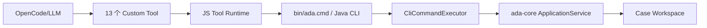
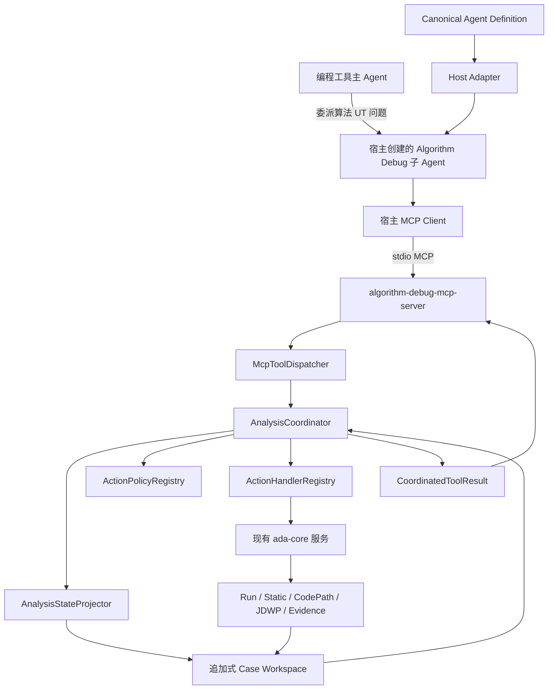
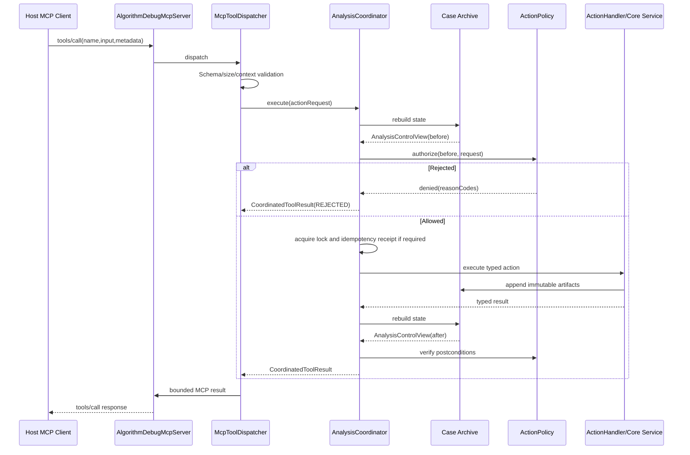
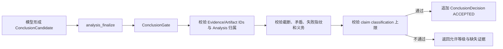

# 可移植 MCP 子 Agent 与确定性 Coordinator 可实施详细设计

- 文档状态：Review
- 设计版本：0.2
- 创建日期：2026-09-25
- 负责人：Algorithm Debug Agent Team
- 目标里程碑：MCP-native portable subagent
- 关联需求：将 Algorithm Debug Agent 从宿主专用工具集合重构为可被 Qwen CLI、DeepSeek Harness 等编程工具注册的统一子 Agent
- 关联架构：[模块详细设计](../architecture/algorithm-debug-agent-module-detailed-design-v1.md)
- 关联 ADR：[ADR-018：采用 Java 原生 MCP Server 交付可移植 Algorithm Debug 子 Agent](../decisions/ADR-018-java-native-mcp-portable-subagent.md)
- 取代范围：本设计实施完成后取代 [Qwen MCP 与双 Runtime 工作台设计](2026-09-20-qwen-mcp-and-dual-runtime-workbench-design.md) 中宿主专用 Gateway、OpenCode 兼容基线和 Node Shared Runtime 作为正式 Agent 边界的方案

## 1. 背景与问题

当前根仓库以 OpenCode Custom Tool 为模型入口。13 个工具定义在
`integrations/opencode/tools/algorithm-debug.ts`，JS Runtime 为每次工具调用准备 Workspace、启动
`bin/ada.cmd`，Java CLI 再由 `CliCommandExecutor` 分派到 `ada-core` 的各个 ApplicationService。
`skills/algorithm-debug/SKILL.md` 和 `integrations/opencode/agents/algorithm-debug.md` 共同描述 Agent
角色、工作流、工具权限和完成要求。

该实现已经具备确定性的 Case、Run、Plan、Collection、Evidence 和 Artifact 能力，但存在以下结构问题：

1. Agent 身份、工具入口和工作流约束绑定 OpenCode 资产，不能直接作为宿主无关的子 Agent 包交付。
2. 工具 Schema 同时存在于 TypeScript Tool 定义、CLI 参数和 Java DTO 中，存在漂移风险。
3. 每个 Tool Call 都启动一次 Java CLI；JS Runtime、CLI 和 Java Core 重复承担参数、错误和生命周期映射。
4. 关键顺序主要由 Skill/Prompt 约束；JS 中的 `activeTargetExecution` 只保护单个 Runtime 进程，不能跨宿主、跨 MCP Server 实例或跨 CLI 进程互斥。
5. `ToolResponse` 明确把下一步选择完全交给 LLM 和 Skill，没有统一的动作门禁、证据缺口、结论等级和收敛状态。
6. 当前“Agent”对宿主可能提供的只读源码工具存在隐含依赖，不满足“所有必需能力都经统一 MCP 服务提供”的可移植目标。
7. 本地仓库只有 13 个已验证工具；公司环境声称已有 18 个工具，但另外 5 个工具的名称、Schema、实现和测试尚未进入当前根仓库，不能在本设计中推测创建。

本次重构不是把 13 个 Custom Tool 机械改成 13 个 MCP Tool。目标是形成一个宿主无关的
Algorithm Debug Agent Package：宿主负责创建模型子 Agent，Agent Definition 规定角色和完成契约，标准
MCP Server 提供统一能力，Coordinator 在服务端不可绕过地执行流程与证据门禁，Java Core 继续负责确定性分析。

## 2. 目标与非目标

### 2.1 目标

- 在当前根仓库新增 Java 原生 `algorithm-debug-mcp-server`，第一版使用 stdio 传输。
- 模型可见的 Algorithm Debug 能力全部通过标准 MCP Tool 暴露。
- MCP Server 直接调用 `ada-core`，正常 Tool Call 不再通过 `bin/ada.cmd` 启动 Java CLI 子进程。
- 引入不可绕过的 `AnalysisCoordinator`，所有模型可调用动作先授权、后执行、再校验后置条件。
- 从追加式 Case 产物重建状态，服务重启后不依赖内存会话恢复分析。
- 将 `evidenceUsable` 一类混合语义拆成独立事实，不允许成功 UT 因缺少失败基准被错误丢弃。
- 为失败 UT 保留结构化失败指纹门禁；只有 `MATCHED` 可用于确认同类失败。
- 建立一份宿主无关、版本化、可生成宿主配置的 Canonical Agent Definition。
- 宿主适配器只负责注册 MCP Server、创建子 Agent、加载 Agent Definition 和映射权限。
- 先适配 Qwen CLI，再以第二个真实宿主验证可移植性；第二宿主不得要求修改 Core、Coordinator 或 Tool Schema。
- 保留现有 Case、Run、Collection、Evidence 和 Artifact 的不可变归档与 provenance。
- 建立单元、Schema、MCP 契约、集成、端到端、并发、恢复、性能和 Agent Eval 门禁。

### 2.2 非目标

- MCP Server 不调用大模型，不实现第二套 Agent Loop、会话压缩或模型配置。
- 不把所有 Java 内部类或模块包装为 MCP；MCP 只作为宿主与 Agent 能力的标准边界。
- 第一版不实现远程共享服务、OAuth、多租户或 Streamable HTTP；只有真实宿主要求时才单独设计。
- 第一版不重写 CodePath Launcher、JDWP Collector、Normalizer、Validator 或 Evidence Engine 的采集算法。
- 不修改目标算法生产源码或目标项目 POM 来增加 Trace。
- 不在 `.worktrees` 下实施，不从已有 worktree 直接覆盖当前根仓库。
- 不凭空实现公司环境另外 5 个工具；必须先导入其明确契约、实现来源和回归用例。
- 不保证 LLM 业务假设永远正确；Coordinator 只保证机械流程、证据纪律和结论等级不越界。
- 不要求所有宿主都具备原生子 Agent；仅支持 MCP 的宿主只能集成能力，不能宣称实现隔离子 Agent。

## 3. 现状与约束

### 3.1 当前调用链



当前 `CliCommandExecutor` 直接持有并调用 `CaseApplicationService`、`RunApplicationService`、
`StaticAnalysisApplicationService`、`CollectionApplicationService` 和
`JdwpCollectionApplicationService`。`ControlPlaneServices` 只是这些服务的组装器，不是全局分析
Coordinator。现有 `JdwpCollectionCoordinator` 只协调一次 JDWP 采集中的目标进程和 Collector 进程，
不能承担整个分析生命周期。

### 3.2 模块约束

- Java 21、Maven、JUnit 5。
- `ada-contracts` 不依赖实现模块。
- Collector Adapter 不包含算法业务语义。
- `Normalizer`、`Validator`、哈希、关联和门禁均确定性执行，不调用 LLM。
- Case、Plan、Run、Collection、Evidence 和 Report 按 ID 追加保存，不覆盖历史。
- 原始证据只读；派生产物保留来源关联。
- JSON/JSONL 有界、稳定、可流式读取。
- 所有目标 JVM、Launcher 和 Collector 保留超时、退出码、stdout/stderr、异常清理和幂等终止。

### 3.3 MCP 依赖约束

初始依赖选择为[官方 MCP Java SDK](https://github.com/modelcontextprotocol/java-sdk) 2.0.1；模块组合按
[官方 Java SDK Quickstart](https://java.sdk.modelcontextprotocol.io/latest/quickstart/)：

- `io.modelcontextprotocol.sdk:mcp-core`
- `io.modelcontextprotocol.sdk:mcp-json-jackson2`

使用 Jackson 2 适配模块，避免把当前仓库从 Jackson 2.17.2 迁移到 Jackson 3。第一版不引入 Spring。
SDK 使用 MIT 许可证；实施前必须确认公司离线 Maven 镜像可解析锁定版本，并更新 NOTICE、SBOM 和依赖审计。
若镜像无法提供该锁定版本，实施停止在依赖预检，不得临时切换未评审 SDK 或自制 MCP 协议实现。

### 3.4 兼容性约束

- 现有 Workspace 和历史 Artifact 必须继续可读。
- MCP 重构不改变 CodePath/JDWP Raw、Normalized、Validation 和 Evidence Schema。
- `algorithm-debug-cli` 暂时保留为人工、CI、诊断和迁移基线入口，但不再是正常 MCP Tool 的内部执行路径。
- 当前 `ToolResponse 2.0` 保留给 CLI；MCP 使用新的 `CoordinatedToolResult 1.0`，避免给旧响应增加字段后破坏严格键校验。

## 4. 用例与验收标准

| 用例 | 输入/前置条件 | 预期结果 | 验证层级 |
|---|---|---|---|
| MCP 初始化 | 标准客户端启动 stdio Server | 协议协商成功，Server identity 和 capability 版本稳定 | Contract/Integration |
| 工具发现 | 初始化完成 | 返回唯一 Canonical Tool Catalog，不依赖宿主配置复制 | Contract |
| 创建分析 | `question + targetTest` | 创建或追加 Case/Analysis，返回控制视图 | Integration |
| 越序 Run | 无有效 Analysis 直接执行 Run | Coordinator 拒绝，Maven 不启动 | Unit/Integration |
| 越序 JDWP | Plan 不存在或不属于 Case | Coordinator 拒绝，目标 JVM 和 Collector 均不启动 | Unit/Integration |
| 成功 UT | 基准 Run 成功 | 归档 Run/Gantt；动态证据不因没有失败基准被丢弃 | Regression/E2E |
| 断言失败 | Run 返回结构化断言差异 | 失败仍是目标事实；Collection 仅在失败指纹 `MATCHED` 时确认同类失败 | Regression/E2E |
| 异常失败 | Run 返回异常链和业务帧 | 保留异常事实，不强制转换为断言失败 | Regression/E2E |
| 采集变化 | Collection 失败指纹为 `CHANGED` | 数据可归档和查看，但确认资格为 false | Unit/E2E |
| 并发目标执行 | 两个 MCP Call 竞争同一目标 Workspace | 只有一个获得文件锁，另一个收到 `TARGET_EXECUTION_BUSY` | Concurrency |
| MCP Server 重启 | 已有 Case/Analysis/Collection | 从追加式归档重建相同控制状态 | Recovery |
| 重复 operationId | 客户端重试写操作 | 不重复启动 UT；完成则返回原操作引用，不确定则要求恢复 | Idempotency |
| 结论门禁 | 关键证据义务未满足 | `analysis_finalize` 拒绝 `CONFIRMED_FACT`，允许受限假设或证据不足 | Unit/Eval |
| Qwen 适配 | 安装 Qwen Host Adapter | 只配置 Agent Definition 和一个 MCP Server，不复制 Tool Schema | E2E |
| 第二宿主适配 | 安装 DeepSeek/其他 Harness Adapter | 不修改 Core、Coordinator 或 Tool Catalog 即可运行同一 Suite | Portability E2E |
| 服务故障 | MCP 请求取消、Server 异常退出 | 目标进程有界清理，失败 Manifest 和操作日志可审计 | Fault injection |

## 5. 总体方案



### 5.1 Agent 的技术定义

重构后的产品级 Agent 由以下部分共同构成：

1. 宿主创建的模型子 Agent：负责理解问题、提出假设、选择允许的 MCP Tool、解释证据。
2. Canonical Agent Definition：提供宿主无关的角色、输入、Prompt 版本、能力要求和完成契约。
3. Algorithm Debug MCP Server：向任意兼容宿主暴露同一工具、资源和 Prompt。
4. Analysis Coordinator：确定性执行动作门禁、状态投影、并发、幂等、证据义务和结论门禁。
5. Java 分析内核：执行 UT、静态分析、CodePath、JDWP、Normalizer、Validator 和归档。
6. Host Adapter：把 Canonical Agent Definition 映射到某一编程工具的子 Agent 配置。

MCP Server 不调用模型。Agent 行为中需要推理的部分仍由宿主子 Agent 的模型完成；需要稳定保证的部分必须由
Coordinator 或现有确定性模块完成。

### 5.2 为什么保留粒度明确的多个工具

不采用一个包含 `action` 字符串和巨大联合参数的 `analysis_execute` 万能工具。保留粒度明确的 Tool 能让 MCP
客户端获得准确的输入 Schema、权限和错误边界。工具不会继续是“散落能力”，因为所有工具都由一个 Catalog
注册、一个 Dispatcher 接收、一个 Coordinator 授权，并共享同一生命周期和返回契约。

### 5.3 传输选择

第一版只支持 stdio：每个宿主启动一个本地 MCP Server 进程，Server 生命周期由宿主拥有。stdio 适合本地
编程工具，不需要监听端口或引入认证。Streamable HTTP、共享 Server 和远程鉴权属于后续独立设计。

## 6. 模块与类设计

### 6.1 新增 Maven 模块 `algorithm-debug-mcp-server`

| 类 | 职责 | 输入 | 输出 | 依赖 |
|---|---|---|---|---|
| `AlgorithmDebugMcpMain` | 解析受限启动参数、构建服务、启动 stdio、注册关闭钩子 | argv/env | 进程退出码 | `McpServerBootstrap` |
| `McpServerBootstrap` | 组装 MCP SDK、Core Runtime、Tool Catalog 和 Dispatcher | 配置、Clock、依赖工厂 | `McpServerHandle` | MCP SDK、`ada-core` |
| `AlgorithmDebugMcpServer` | 协议初始化、工具/资源/Prompt 注册和生命周期 | MCP transport | MCP result | MCP SDK |
| `McpToolCatalog` | 提供唯一、不可变、版本化工具目录 | 无 | `List<McpToolDescriptor>` | `ada-contracts`、Schema resources |
| `McpToolDescriptor` | 描述名称、动作、Schema、说明和副作用等级 | 构造参数 | 不可变元数据 | 无 |
| `McpToolDispatcher` | 解析请求、绑定请求上下文、调用 Coordinator、映射结果 | tool name/input/metadata | `CallToolResult` | Coordinator、mapper |
| `McpRequestContextResolver` | 从 roots、启动配置和 MCP metadata 解析可信 Workspace 与 invocationId | MCP request | `AgentRequestContext` | path policy |
| `McpResultMapper` | 将 `CoordinatedToolResult` 转为有界 MCP content/structuredContent | domain result | MCP result | Jackson 2 |
| `McpProtocolErrorMapper` | 仅映射协议、Schema、取消和基础设施错误 | exception | MCP error/result | error catalog |
| `AgentResourceProvider` | 暴露 Agent manifest、capabilities 和有界 Case 状态 | resource URI | bounded resource | projector |
| `AgentPromptProvider` | 暴露版本化 start/continue/explain Prompt | prompt args | prompt messages | Agent Definition |
| `McpServerLifecycle` | 有界启动、取消、关闭和活动调用等待 | process signals | termination result | executor |

该模块依赖 `ada-contracts`、`ada-core`、官方 MCP SDK、Jackson 2 适配和测试依赖。它不得依赖
`algorithm-debug-cli`，不得通过 `ProcessBuilder` 启动 `ada.cmd`。

### 6.2 `ada-core` 新增 `coordination` 包

| 类 | 职责 | 输入 | 输出 | 依赖 |
|---|---|---|---|---|
| `AnalysisCoordinator` | 统一执行授权、加锁、幂等、调用、后置检查和状态刷新 | `AnalysisActionRequest` | `CoordinatedToolResult<?>` | 下列端口 |
| `AnalysisStateProjector` | 从已校验归档重建当前分析状态 | `AnalysisIdentity` | `AnalysisControlView` | Case read ports |
| `AnalysisActionRegistry` | 按动作类型注册唯一 Policy 和 Handler | action type | registration | immutable map |
| `AnalysisActionPolicy<T>` | 对单类动作执行前置条件和后置条件 | state/request/result | decisions | contracts |
| `AnalysisActionHandler<T,R>` | 调用现有 ApplicationService | typed request | typed result | ApplicationService |
| `EvidenceObligationEvaluator` | 计算系统、工具和调查义务的状态 | control facts | obligation results | evidence engine |
| `ConclusionGate` | 校验 claim 分类、证据引用、矛盾、截断和确认资格 | candidate/state | decision | evidence engine |
| `OperationIdempotencyService` | 管理 operationId 的开始、完成和不确定状态 | operation request | receipt | operation journal |
| `TargetExecutionLockManager` | 对目标 Workspace/Project 获取跨进程文件锁 | target identity | lock handle | case-management port |

`AnalysisCoordinator` 不包含 Maven、CodePath 或 JDWP 的具体实现。Action Handler 只适配已有服务；Policy 只检查
通用动作契约和该工具的机械前后置条件。

### 6.3 `case-management` 新增持久化和锁边界

| 类 | 职责 |
|---|---|
| `AnalysisArtifactIndex` | 有界扫描已注册 Artifact，并按 analysis/run/plan/collection/evidence 建索引 |
| `AnalysisStateRepository` | 读取状态投影所需的版本化文档，不写派生 current-state |
| `WorkspaceExecutionLock` | 使用 OS 文件锁实现跨 MCP Server/CLI 进程互斥 |
| `OperationJournal` | 追加保存 operation STARTED/COMPLETED/FAILED/UNCERTAIN 记录 |
| `CoordinationDecisionArchive` | 追加保存需要审计的拒绝、结论决策和 policyVersion |

锁文件只用于同步，不作为分析事实。进程崩溃后 OS 释放文件锁；未完成 operation 仍保留 `UNCERTAIN` 或可恢复记录。

### 6.4 `ada-contracts` 新增契约

新建不可变公共模型：

```text
AgentCapabilityManifest
AgentRequestContext
AnalysisActionType
AnalysisActionRequest（sealed interface）
AnalysisControlView
ActionDecision
ActionDecisionCode
EvidenceObligation
EvidenceObligationKind
ObligationStatus
EvidenceEligibility
ConclusionCandidate
ConclusionClaim
ConclusionDecision
CoordinatedToolResult<T>
OperationId
OperationReceipt
```

公共模型使用中文 Javadoc；枚举、Schema 字段和错误码使用清晰英文。

### 6.5 Canonical Agent Definition

新增目录：

```text
agent-definition/
  algorithm-debug-agent-v1.json
  system-prompt-v1.md
  completion-contract-v1.schema.json
  README.md
```

Agent Definition 包含：

- `profileVersion`
- `agentId`
- `description`
- `inputContract`
- `requiredMcpServer`
- `requiredCapabilities`
- `allowedToolGroups`
- `prompt.path/sha256/version`
- `completionContract.path/version`
- `defaultModelHints`（只允许温度等非凭据提示，宿主可拒绝）

现有 `skills/algorithm-debug/SKILL.md` 的领域工作流内容迁移到规范 Prompt；硬规则同时由 Coordinator 实现。
各宿主产物必须从 Agent Definition 生成或引用，不维护可独立漂移的第二份正文。

### 6.6 Host Adapter Kit

新增：

```text
integrations/
  host-adapter-kit/
    README.md
    schemas/host-adapter-manifest-v1.schema.json
    scripts/render-host-config.mjs
    test/
  qwen-cli/
    adapter-manifest.json
    templates/
    install.ps1
    check.ps1
    uninstall.ps1
    test/
```

第二宿主在 Qwen 适配通过后新增。Host Adapter 只能完成：

1. 定位 `bin/ada-mcp.cmd`。
2. 写入该宿主要求的 MCP Server 配置。
3. 生成或引用子 Agent Profile。
4. 映射工具权限和只读 Workspace。
5. 执行初始化、工具清单、版本和卸载检查。

Host Adapter 不得包含工具 Schema、证据规则、Case 路径推导或 Collector 逻辑。

## 7. 数据与契约设计

### 7.1 `CoordinatedToolResult 1.0`

MCP 的结构化结果使用独立契约：

```json
{
  "schemaVersion": "1.0",
  "outcome": "SUCCEEDED",
  "code": "JDWP_COLLECTION_COMPLETED",
  "message": "JDWP collection completed",
  "data": {},
  "artifacts": [],
  "control": {
    "policyVersion": "1.0",
    "caseId": "case-1",
    "analysisId": "analysis-2",
    "revision": 8,
    "requestedAction": "JDWP_COLLECT",
    "decision": "ALLOWED",
    "reasonCodes": [],
    "satisfiedObligationIds": ["O1"],
    "remainingObligationIds": ["O2"],
    "contradictionIds": [],
    "allowedActions": ["EVIDENCE_QUERY", "JDWP_PLAN_CREATE", "ANALYSIS_FINALIZE"],
    "terminalEligibility": "HYPOTHESIS_ONLY"
  }
}
```

`outcome` 枚举：

- `SUCCEEDED`：Agent 动作正常完成；目标 UT 可以成功或失败。
- `REJECTED`：Coordinator 确定性拒绝，未执行副作用动作。
- `FAILED`：Agent、Collector、环境或内部执行失败。

MCP 协议级 `isError` 只用于请求无法解析、未知工具、协议不兼容、Server 内部异常等基础设施错误。目标 UT
异常、断言失败、超时和非零退出仍是成功 Tool Call 中的结构化目标结果。

### 7.2 控制状态

`AnalysisControlView` 是派生视图，不是新的可变事实源。它由以下归档重建：

- Case Manifest
- Analysis Request
- Algorithm Input Capture
- Run Summary 与失败指纹
- Method Catalog
- CodePath/JDWP Plan
- Collection Manifest、Normalization、Validation
- Evidence Bundle、Sufficiency Evaluation
- Operation Journal
- Conclusion Decision

不得保存可被覆盖的 `current-state.json`。只有调查契约、操作事件和结论决策追加归档。

新增控制产物采用以下固定布局；每个 JSON 文件只创建一次，不通过覆盖表达状态迁移：

```text
projects/{projectId}/.control/target-execution.lock
projects/{projectId}/cases/{caseId}/analyses/{analysisId}/
  operations/{operationId}/started.json
  operations/{operationId}/completed.json | failed.json | uncertain.json
  coordination/{decisionId}.json
  conclusions/{conclusionId}/candidate.json
  conclusions/{conclusionId}/accepted.json | rejected.json
```

- `.control/target-execution.lock` 是同步设施，不是证据 Artifact，可以复用，但不得包含业务数据。
- `started.json` 与唯一终态文件组成 operation 生命周期；出现多个终态文件时，State Projector 必须报告
  `OPERATION_JOURNAL_CONFLICT`，不得自行挑选一个结果。
- `coordination` 和 `conclusions` 目录中的文档必须包含 `schemaVersion`、`policyVersion`、ID、时间、输入哈希和
  provenance；State Projector 只读取已通过 Schema 与哈希校验的文档。
- Case 级短事务锁使用 `projects/{projectId}/cases/{caseId}/.control/case-write.lock`；锁文件与证据目录分离。

### 7.3 拆分证据语义

禁止继续使用一个布尔同时表达数据可读性和结论资格。至少拆分：

| 字段 | 含义 |
|---|---|
| `artifactReadable` | Artifact 存在、哈希正确且 Schema 可读 |
| `collectionComplete` | Collector 正常结束且未因预算/超时截断 |
| `baselineRequired` | 当前场景是否需要失败复现基准 |
| `baselineComparable` | 若需要，当前 Run 与基准是否可比较 |
| `failureFingerprintMatched` | 失败场景是否复现同类失败 |
| `obligationSatisfied` | 指定证据义务是否被有效观测覆盖 |
| `confirmationEligible` | 当前证据是否允许确认性 claim |

规则：

- 成功 UT：`baselineRequired=false`，不能因为 `baselineComparable=false` 把证据判为不可用。
- 失败 UT：`baselineRequired=true`；只有 `failureFingerprintMatched=true` 才允许动态证据确认同类失败。
- `CHANGED/INCOMPARABLE`：Artifact 可以读取和分析，但 `confirmationEligible=false`。
- 截断、缺失投影和未知覆盖：保留数据，限制能证明的范围，不静默丢弃。

### 7.4 证据义务

义务分三层：

1. 系统义务：身份、Schema、哈希、provenance、失败指纹、矛盾、截断；模型不能删除。
2. 工具义务：由 Plan 和 Tool Descriptor 产生，例如要求特定方法、tracepoint、投影和最少命中。
3. 调查义务：模型在 Plan 中声明要回答的问题、假设和预期观测；Coordinator 只校验是否取得对应类型证据，不判断业务假设真假。

### 7.5 Agent 完成契约

子 Agent 最终返回父 Agent 的结构化语义至少包含：

```text
caseId
analysisId
status: CONFIRMED | BOUNDED_HYPOTHESIS | INSUFFICIENT_EVIDENCE |
        CONTRADICTED | TOOL_BLOCKED | BUDGET_EXHAUSTED
claims[]: classification/text/evidenceIds
missingEvidence[]
limitations[]
capabilitiesUsed[]
```

`analysis_finalize` 校验结构化候选；自然语言解释仍由模型输出，不冒充 Validator 事实。

## 8. MCP Tool、Resource 与 Prompt 设计

### 8.1 Tool Catalog

本地 13 个工具全部迁移为 MCP Tool：

```text
analysis_begin
case_inspect
algorithm_input_capture
case_audit
gantt_inspect
run_test
static_analyze
codepath_plan_create
codepath_collect
jdwp_plan_create
jdwp_collect
artifact_read
evidence_query
```

新增两个闭环工具：

```text
analysis_status
analysis_finalize
```

因此当前根仓库第一阶段目标 Tool Catalog 为 15 个。公司环境另外 5 个工具进入仓库后重新计算总数；不得把
“15”或“18”作为长期协议常量，客户端以 `tools/list` 和 capability manifest 为准。

工具按能力分组：

- `ANALYSIS_LIFECYCLE`
- `INPUT_AND_RUN`
- `SOURCE_AND_STATIC`
- `CODEPATH`
- `JDWP`
- `EVIDENCE_ACCESS`
- `AUDIT`

### 8.2 宿主内置工具依赖审计

实施前对当前 Prompt/Eval 做静态清单，找出所有非 Algorithm Debug Tool 的依赖。重点检查源码读取、源码搜索、
目标 UT 发现和项目结构读取。如果 Agent 完成真实 Case 必须依赖这些能力，则通过当前已有静态分析服务扩展有界
MCP 能力；优先使用 methodKey/source anchor 驱动的读取，不直接暴露任意文件系统或 Shell。

任何新增源码 Tool 必须单独满足：Workspace allowlist、路径规范化、行数/字节限制、敏感文件拒绝和 Artifact/
source provenance。清单证据不足时不得预创建推测性 API。

### 8.3 Resources

第一版提供以下有界 Resource：

```text
ada://agent/manifest
ada://agent/capabilities
ada://cases/{caseId}/digest
ada://cases/{caseId}/analyses/{analysisId}/status
```

带参数的大数据读取仍使用 Tool，不通过 Resource 返回 Raw Trace 或完整 Gantt。

### 8.4 Prompts

第一版提供：

```text
algorithm-debug/start
algorithm-debug/continue
algorithm-debug/explain-evidence
```

Prompt 用于提高模型理解一致性，不承担动作授权。Host Adapter 必须能在宿主不支持 MCP Prompt 自动加载时，将
Canonical Prompt 映射为子 Agent 系统指令。

## 9. 核心流程

### 9.1 MCP Tool 调用



大模型不先调用 Coordinator。它只调用目标 Tool；Server 内部不可绕过地执行 Coordinator。

### 9.2 目标执行互斥

`run_test`、`codepath_collect`、`jdwp_collect` 标记为 `TARGET_EXECUTION`。执行时：

1. 验证 Workspace/Project/Case/Analysis/Plan 身份。
2. 根据规范化目标 Workspace 和 Project 计算固定 lock key。
3. 获取 OS 文件锁。
4. 获取后再次重建状态，防止等待期间状态变化。
5. 原子追加 operation STARTED。
6. 执行目标进程。
7. 追加成功、失败或不确定结果。
8. 重建状态并验证后置条件。
9. 释放文件锁。

只读动作不获取排他目标锁。写 Case 但不执行目标进程的动作使用 Case 级短事务锁。

### 9.3 幂等与取消

- 所有可能写盘或启动目标进程的 MCP 请求必须包含/生成 `operationId`。
- 已完成的相同 operationId 返回历史 receipt，不重复执行。
- 进行中的相同 operationId 返回 `OPERATION_IN_PROGRESS`。
- STARTED 后无法确认结果时标记 `OPERATION_UNCERTAIN`，禁止自动重跑目标 UT。
- MCP 取消信号传入 Coordinator；Coordinator 请求底层有界终止，并等待 Manifest 提交。
- 健康检查、manifest/capability Resource 读取可以安全重试；目标执行不自动重试。

### 9.4 结论闭环



Coordinator 能校验引用、来源、覆盖和等级，不能理解目标算法业务因果。业务语义仍由模型解释，并通过 Eval 和
人工评审控制质量。

## 10. 错误处理与可观测性

### 10.1 错误分层

| 层级 | 示例 | MCP 表达 |
|---|---|---|
| Protocol | JSON-RPC、未知 Tool、Schema 不合法 | MCP error/isError |
| Coordinator Rejection | 越序、跨 Case、缺 Plan、并发占用 | 正常 Tool result，`outcome=REJECTED` |
| Agent/Environment Failure | Maven 缺失、Collector 启动失败、Artifact 损坏 | 正常 Tool result，`outcome=FAILED` |
| Target Outcome | UT 成功、断言失败、异常、目标超时 | 正常 Tool result，`outcome=SUCCEEDED`，data 内表达 |

### 10.2 错误码前缀

```text
MCP_PROTOCOL_*
MCP_SERVER_*
COORDINATION_*
ACTION_*
OPERATION_*
TARGET_EXECUTION_*
ADA_*（保留已有明确错误）
```

### 10.3 日志

- stdio 的 stdout 只允许 MCP 帧，日志全部进入 stderr 或 Workspace DFX 文件。
- 日志关联字段：`serverInstanceId`、`mcpRequestId`、`operationId`、`caseId`、`analysisId`、`actionType`。
- 不记录完整 Prompt、凭据、完整输入 JSON、Raw Trace 或未脱敏绝对路径。
- 每个 Coordinator 决策记录 `policyVersion`、输入状态 revision、decision 和 reasonCodes。

### 10.4 Fail closed

以下情况拒绝有副作用动作和确认性结论：

- 未知 Schema/Policy 主版本。
- Artifact 哈希或 provenance 不匹配。
- Case/Analysis/Plan/Run/Collection 身份冲突。
- 状态投影不完整或超过扫描预算。
- 操作结果不确定。
- 必要义务状态为 `UNSATISFIED`、`CONTRADICTED` 或 `UNCHECKABLE`。

拒绝不删除数据；已归档数据仍可作为受限线索读取。

## 11. 性能与容量预算

| 指标 | 默认值 | 上限 | 超限行为 | 验证方式 |
|---|---:|---:|---|---|
| MCP 请求 JSON | 256 KiB | 1 MiB | 拒绝 `MCP_REQUEST_TOO_LARGE` | Contract |
| MCP 单响应 | 256 KiB | 1 MiB | 截断明细并返回 Artifact 引用；无法有界则失败 | Integration |
| `tools/list` Tool 数 | 15 | 64 | Server 启动失败并报告 Catalog 错误 | Unit |
| 状态投影 Artifact 数 | 10,000 | 100,000 | 返回 `STATE_PROJECTION_LIMIT_EXCEEDED` | Load |
| 状态投影时间 | 500 ms | 5 s | 拒绝副作用动作并记录指标 | Benchmark |
| 同一目标执行数 | 1 | 1 | 第二请求返回 `TARGET_EXECUTION_BUSY` | Concurrency |
| MCP 活动请求 | 16 | 64 | 有界拒绝，不创建无界线程 | Load |
| Server 关闭等待 | 10 s | 30 s | 强制终止受管子进程并记录原因 | Lifecycle |
| Tool 参数/结果对象深度 | 16 | 32 | Schema 拒绝 | Contract |

现有 CodePath/JDWP 的事件、字节、命中、对象深度和超时预算不因 MCP 重构提高。状态投影必须优先读取索引和
Manifest，不反复扫描 Raw Trace。

## 12. 安全、隐私与无侵入性

- 第一版 stdio Server 不监听网络端口。
- Workspace 根由启动配置和 MCP roots 的交集确定；请求不得传入任意可执行文件、Java 主类或输出目录。
- 所有路径规范化后必须位于受信 Workspace、目标 Project 或 Agent 安装目录。
- MCP Tool 不提供任意 Shell、任意文件写入或目标源码修改。
- 源码读取若被证明必要，只暴露有界、只读、Workspace 内能力并拒绝敏感文件模式。
- 模型凭据完全由宿主持有，不进入 MCP Server 配置、Case、日志或 Artifact。
- Maven、Launcher、Collector 命令由已有确定性工厂生成，不接受模型提供完整 argv。
- 官方 MCP Java SDK 依赖锁定版本、MIT 许可证、哈希、NOTICE 和 SBOM。
- 安装器使用 staging 和原子切换；不得覆盖用户的宿主配置而不保留可恢复备份。

## 13. 代码文件修改矩阵

### 13.1 根构建与打包

| 文件 | 动作 | 修改内容 |
|---|---|---|
| `pom.xml` | 修改 | 增加 MCP SDK BOM 2.0.1、`algorithm-debug-mcp-server` 模块；不引入 Spring |
| `scripts/build-agent.ps1` | 修改 | 构建 MCP Server 可执行 JAR、校验 Collector/Launcher/Server 三类产物 |
| `bin/ada-mcp.cmd` | 新增 | 使用 Agent JDK 21 启动 stdio MCP Server；不接受任意主类和任意 classpath |
| `bin/README.md` | 修改 | 区分 `ada.cmd` 管理/诊断入口与 `ada-mcp.cmd` 模型入口 |
| `config/mcp-agent-settings.json` | 新增 | 保存 MCP/Workspace/并发/DFX 配置，不混入宿主专属字段 |
| `config/agent-settings.json` | 迁移期保留 | 旧 OpenCode/CLI 安装继续读取；MCP Server 不读取，阶段 I 后按兼容门禁决定是否退役 |
| `config/README.md` | 修改 | 说明两份配置的消费者、环境覆盖、迁移窗口、路径和安全边界 |

### 13.2 公共契约和 Schema

| 文件/目录 | 动作 | 修改内容 |
|---|---|---|
| `ada-contracts/.../coordination/*.java` | 新增 | Action、ControlView、Obligation、Conclusion、Operation、Result 契约 |
| `ada-contracts/.../SchemaVersions.java` | 修改 | 增加协调与 Agent 契约版本，不破坏现有 Artifact Schema |
| `schemas/coordination/*.schema.json` | 新增 | 上述公共模型的 JSON Schema |
| `schemas/agent/*.schema.json` | 新增 | Agent Definition、Completion Contract、Capability Manifest |
| `schemas/tool/coordinated-tool-result-v1.schema.json` | 新增 | MCP Tool 统一结构化返回 |
| `schemas/tool/tool-response-v2.schema.json` | 保留 | CLI 兼容，不在原位增加 control |

### 13.3 Coordinator 与状态

| 文件/目录 | 动作 | 修改内容 |
|---|---|---|
| `ada-core/.../coordination/AnalysisCoordinator.java` | 新增 | 统一执行管线 |
| `ada-core/.../coordination/AnalysisStateProjector.java` | 新增 | 从追加式产物派生状态 |
| `ada-core/.../coordination/AnalysisActionRegistry.java` | 新增 | 不可变 Policy/Handler 注册 |
| `ada-core/.../coordination/*Policy.java` | 新增 | 每类动作的前置/后置规则 |
| `ada-core/.../coordination/*Handler.java` | 新增 | 适配现有 ApplicationService |
| `ada-core/.../coordination/ConclusionGate.java` | 新增 | 结论候选门禁 |
| `ada-core/.../ControlPlaneServices.java` | 修改 | 组装并暴露唯一 `AnalysisCoordinator`；CLI 和 MCP 复用 |
| `evidence-engine/.../EvidenceObligationEvaluator.java` | 新增 | 义务状态计算 |
| `evidence-engine/.../EvidenceSufficiencyEvaluator.java` | 修改 | 使用拆分事实，不再把基准可比性和 Artifact 可读性混为一体 |
| `case-management/.../AnalysisArtifactIndex.java` | 新增 | 有界状态索引 |
| `case-management/.../WorkspaceExecutionLock.java` | 新增 | OS 文件锁 |
| `case-management/.../OperationJournal.java` | 新增 | 幂等操作事件 |
| `case-management/.../CoordinationDecisionArchive.java` | 新增 | 追加审计决策 |

### 13.4 MCP Server

| 文件/目录 | 动作 | 修改内容 |
|---|---|---|
| `algorithm-debug-mcp-server/pom.xml` | 新增 | Java MCP SDK、Jackson 2、Core 和测试依赖 |
| `algorithm-debug-mcp-server/.../AlgorithmDebugMcpMain.java` | 新增 | stdio 入口和退出码 |
| `algorithm-debug-mcp-server/.../McpServerBootstrap.java` | 新增 | 依赖组装 |
| `algorithm-debug-mcp-server/.../AlgorithmDebugMcpServer.java` | 新增 | MCP 生命周期和注册 |
| `algorithm-debug-mcp-server/.../McpToolCatalog.java` | 新增 | 单一 Tool Catalog |
| `algorithm-debug-mcp-server/.../McpToolDispatcher.java` | 新增 | 所有 tools/call 的唯一入口 |
| `algorithm-debug-mcp-server/.../McpResultMapper.java` | 新增 | 协调结果到 MCP 结果 |
| `algorithm-debug-mcp-server/.../AgentResourceProvider.java` | 新增 | 有界 Resource |
| `algorithm-debug-mcp-server/.../AgentPromptProvider.java` | 新增 | 版本化 Prompt |
| `algorithm-debug-mcp-server/src/main/resources/schemas/` | 新增 | 打包后的只读 Schema |

### 13.5 CLI

| 文件 | 动作 | 修改内容 |
|---|---|---|
| `algorithm-debug-cli/.../CliCommandExecutor.java` | 修改 | 模型相关动作经同一 Coordinator；保留 workspace/project/doctor 管理命令 |
| `algorithm-debug-cli/.../AdaMain.java` | 修改 | 从 `ControlPlaneServices` 获取 Coordinator；保持 ToolResponse 2.0 CLI 输出 |
| `algorithm-debug-cli/.../CliCoordinatedResultAdapter.java` | 新增 | 把协调结果映射为旧 CLI `ToolResponse 2.0`；CLI 不复制 Policy，也不绕过 Coordinator |
| `algorithm-debug-cli/.../CliArguments.java` | 按需修改 | 只增加管理/诊断所需命令，不复制 MCP 参数协议 |

CLI 兼容层只保留历史输出形状。`REJECTED` 映射为稳定 CLI error code/message，旧协议不承载
`allowedActions` 等新增控制信息；完整控制视图仅由 MCP 返回。兼容输出能力不足不能成为 CLI 绕过 Coordinator 的理由。

### 13.6 Agent Definition 与适配器

| 文件/目录 | 动作 | 修改内容 |
|---|---|---|
| `agent-definition/*` | 新增 | Canonical Agent Definition、Prompt 和完成契约 |
| `skills/algorithm-debug/SKILL.md` | 迁移后保留生成源或兼容副本 | 内容由 Canonical Prompt 生成并做 hash 一致性测试 |
| `integrations/host-adapter-kit/*` | 新增 | 宿主配置生成与兼容检查，不含业务逻辑 |
| `integrations/qwen-cli/*` | 新增 | 第一宿主安装、检查、卸载和模板 |
| `integrations/opencode/*` | 最终退役 | 新 MCP 路径完成并通过回滚门禁前不删除；不再作为正式架构基线 |

### 13.7 文档、评测和审计

| 文件/目录 | 动作 | 修改内容 |
|---|---|---|
| `README.md` | 修改 | 以可移植 MCP 子 Agent 为主入口 |
| `docs/architecture/*.md` | 修改 | 更新模块、运行时和流程图 |
| `docs/current-capabilities.md` | 修改 | 按 MCP capability 描述，不写死特定宿主 |
| `docs/algorithm-debug-workflow-and-artifacts.md` | 修改 | 增加 Coordinator/Operation/Conclusion 生命周期 |
| `agent-evals/*` | 修改 | 记录 MCP/Agent Definition/Policy/Host Adapter 版本 |
| `integration-tests/*` | 修改 | 增加 stdio MCP Client、并发、恢复和真实 Fixture 测试 |

### 13.8 精确测试文件清单

| 文件 | 首批覆盖 |
|---|---|
| `ada-core/src/test/java/org/example/algorithmdebug/core/coordination/AnalysisCoordinatorTest.java` | 授权、调用、后置校验、拒绝无副作用 |
| `ada-core/src/test/java/org/example/algorithmdebug/core/coordination/AnalysisStateProjectorTest.java` | 归档重建、乱序稳定性、损坏与冲突产物 |
| `ada-core/src/test/java/org/example/algorithmdebug/core/coordination/RunTestActionPolicyTest.java` | 成功、断言失败、异常失败、越序调用 |
| `ada-core/src/test/java/org/example/algorithmdebug/core/coordination/CodePathCollectActionPolicyTest.java` | Plan 归属、预算、operationId 与成功 UT 语义 |
| `ada-core/src/test/java/org/example/algorithmdebug/core/coordination/JdwpCollectActionPolicyTest.java` | Plan 归属、失败指纹、并发与后置条件 |
| `ada-core/src/test/java/org/example/algorithmdebug/core/coordination/ConclusionGateTest.java` | claim 等级、缺失义务、矛盾和截断 |
| `case-management/src/test/java/org/example/algorithmdebug/casecore/WorkspaceExecutionLockTest.java` | 跨实例互斥、释放、超时和路径隔离 |
| `case-management/src/test/java/org/example/algorithmdebug/casecore/OperationJournalTest.java` | STARTED、唯一终态、冲突和崩溃恢复 |
| `evidence-engine/src/test/java/org/example/algorithmdebug/evidence/EvidenceEligibilityTest.java` | 拆分语义及成功/失败 UT 回归 |
| `evidence-engine/src/test/java/org/example/algorithmdebug/evidence/EvidenceObligationEvaluatorTest.java` | 系统、工具、调查义务 |
| `algorithm-debug-mcp-server/src/test/java/org/example/algorithmdebug/mcp/McpToolCatalogTest.java` | 15 个基线工具、唯一名称与注册完整性 |
| `algorithm-debug-mcp-server/src/test/java/org/example/algorithmdebug/mcp/McpToolDispatcherTest.java` | Schema、上下文、Coordinator 唯一入口 |
| `algorithm-debug-mcp-server/src/test/java/org/example/algorithmdebug/mcp/McpResultMapperTest.java` | 目标 UT 失败与协议错误分层 |
| `algorithm-debug-mcp-server/src/test/java/org/example/algorithmdebug/mcp/StdioMcpContractTest.java` | initialize、list、call、resource、prompt、shutdown |
| `algorithm-debug-cli/src/test/java/org/example/algorithmdebug/cli/CliCoordinatorCompatibilityTest.java` | 旧 CLI 形状与不可绕过的 Coordinator |
| `integration-tests/src/test/java/org/example/algorithmdebug/integration/McpAnalysisLifecycleIT.java` | 完整分析闭环与重启恢复 |
| `integration-tests/src/test/java/org/example/algorithmdebug/integration/McpTargetExecutionConcurrencyIT.java` | 两 Server 进程竞争同一目标 |
| `integration-tests/src/test/java/org/example/algorithmdebug/integration/SuccessfulUtEvidenceIT.java` | 成功 UT 无失败基准时证据不被误丢弃 |
| `integration-tests/src/test/java/org/example/algorithmdebug/integration/FailedUtFingerprintIT.java` | 断言/异常失败与 MATCHED/CHANGED/INCOMPARABLE |

## 14. 测试设计

实现严格遵循 Red-Green-Refactor；每一阶段先提交能复现缺口的失败测试。

### 14.1 单元测试

- `AnalysisStateProjectorTest`：相同 Artifact 集合产生稳定状态，顺序不影响结果。
- `RunTestActionPolicyTest`：无 Analysis、输入未捕获、状态损坏时拒绝且不调用 Handler。
- `CodePathCollectActionPolicyTest`：Plan 身份、analysis、预算和 operationId 校验。
- `JdwpCollectActionPolicyTest`：缺 Plan、跨 Case、行号/计划失效和并发拒绝。
- `EvidenceEligibilityTest`：成功 UT 无失败基准仍可用；失败场景只接受 `MATCHED` 确认资格。
- `EvidenceObligationEvaluatorTest`：满足、缺失、矛盾、不可检查和截断。
- `ConclusionGateTest`：每种 claim classification 的证据和等级规则。
- `WorkspaceExecutionLockTest`：不同进程/线程竞争、异常释放和错误路径。
- `OperationIdempotencyServiceTest`：完成、进行中、不确定和冲突 operationId。
- `McpToolCatalogTest`：名称唯一、Schema 存在、Action/Policy/Handler 完整注册。
- `McpResultMapperTest`：目标失败不映射为 MCP error。

### 14.2 契约与兼容性测试

- 所有 `CoordinatedToolResult`、Agent Definition、ControlView、Conclusion 和 Operation fixture 通过 Schema。
- `tools/list` 的 15 个基线工具与 Canonical Catalog 一一对应。
- Tool 输入拒绝未知字段、越界数组、超长文本、控制字符和非法路径。
- MCP Structured Content 和文本摘要语义一致且有界。
- 历史 ToolResponse 2.0、Case、Run、Collection 和 Evidence fixture 继续可读。
- Prompt、Agent Definition 和生成的宿主配置具有 hash 一致性。

### 14.3 模块集成测试

- 内存/临时目录 Case 经 Coordinator 执行 analysis/input/run/static/plan/collect/query/audit/finalize。
- 使用 fake Action Handler 证明拒绝动作绝不执行副作用。
- stdio MCP Client 完成 initialize、tools/list、tools/call、resources/read、prompts/get 和 shutdown。
- 请求取消向目标执行传播，并保留失败/不确定 Manifest。
- MCP Server 重启后从 Workspace 重建相同控制状态。
- 两个独立 Server 进程竞争同一目标时只有一个执行。

### 14.4 关键链路端到端测试

- 真实成功 UT，无失败基准，CodePath/JDWP Evidence 保留且正确限制结论。
- 真实断言失败，采集复现 `MATCHED`。
- 真实异常失败，异常链和相关业务帧保持。
- `CHANGED` 与 `INCOMPARABLE` 只作为线索。
- CodePath AGGREGATE 到窄 TRACE，再到必要 JDWP 的多轮闭环。
- MCP Tool 错误顺序被拒绝，目标 Maven/JVM 未启动。
- Qwen CLI Adapter 安装、发现、真实 Case、卸载。
- 第二宿主只新增 Adapter 即运行同一 Suite。

### 14.5 属性、故障和安全测试

- 随机 Action 序列永远不能跨 Case 引用 Evidence 或在关键义务缺失时确认结论。
- 写盘中断、Artifact 损坏、Schema 未知、日志失败、子 JVM 崩溃和 MCP 断连。
- Windows 空格、Unicode、长路径、符号链接/重解析点和路径逃逸。
- MCP stdout 不包含日志或非协议字节。
- 任意输入不能指定可执行文件、Java 主类、Collector JAR 或输出目录。

### 14.6 性能与 Eval

- MCP Server 冷启动、热 Tool Call、状态投影、tools/list 和有界 Resource 基线。
- 对比旧 CLI 路径和直接 Core 路径，分别记录启动和目标执行耗时；不得用模型耗时代替工具耗时。
- 10-Case Smoke 作为功能门禁，50-Case Quality 作为质量门禁。
- 每个 Case 至少重复 3 次，比较动作序列、Evidence 引用、结论分类、额外采集次数和停止点，不比较措辞完全一致。
- Eval 记录 Agent Definition、Prompt、MCP、Policy、Tool Catalog、代码、模型和宿主适配器版本。

### 14.7 测试数据

- 单元/契约测试只使用临时目录、固定 Clock、固定 ID、fake process 和有界 fixture。
- 不依赖网络、真实时间、随机顺序或开发机绝对路径。
- Golden 只能因已批准契约变化更新，并在变更中解释差异。

## 15. 可执行实施步骤

以下步骤定义实现顺序和每步退出条件；详细到测试方法和提交粒度的实施计划在本文批准后单独生成。

### 阶段 A：规格、ADR 和依赖预检

1. 批准本文和 ADR-018。
2. 生成逐任务实施计划。
3. 验证 MCP Java SDK 2.0.1、Jackson 2 模块、许可证和离线镜像。
4. 盘点本地 13 个与公司 18 个工具差异，形成不可推测的导入清单。
5. 盘点宿主内置源码能力依赖。

退出条件：无未决架构选择；依赖可解析；Tool/源码能力清单有证据。

### 阶段 B：行为特征基线

1. 为现有 13 个入口、CLI 和 Core 服务补齐特征测试。
2. 固化成功 UT、断言失败、异常失败、Agent 失败和动态采集 fixture。
3. 固化历史 Schema 兼容测试。

退出条件：不改变生产行为，基线测试全部通过。

### 阶段 C：协调契约和语义拆分

1. 先增加 Schema/DTO 失败测试。
2. 实现 Coordination、Operation、Conclusion 和 Agent Definition 契约。
3. 用独立事实替代混合 `evidenceUsable` 语义。
4. 增加成功/失败 UT 回归测试。

退出条件：所有契约通过；成功场景问题被回归测试复现并修复；Artifact Schema 不变。

### 阶段 D：Coordinator 核心

1. 实现 Artifact Index 和 State Projector。
2. 实现 Policy/Handler Registry。
3. 首先接入 `run_test`、`codepath_collect`、`jdwp_collect`。
4. 实现 Workspace 文件锁和 Operation Journal。
5. 接入其余现有动作。
6. 实现 `analysis_status` 和 `analysis_finalize`。

退出条件：全部模型动作只有一条 Coordinator 路径；拒绝动作无副作用；重启恢复和并发测试通过。

### 阶段 E：Java 原生 MCP Server

1. 新增模块和 SDK 依赖。
2. 实现 stdio 生命周期和协议测试。
3. 从 Canonical Catalog 注册现有 13 个工具和两个闭环工具。
4. 实现 Result Mapper、Resource 和 Prompt。
5. 实现 `bin/ada-mcp.cmd` 和打包检查。

退出条件：标准测试 Client 可完成完整 Tool 链；正常 Tool Call 不启动 `ada` CLI；根项目测试通过。

### 阶段 F：可移植 Agent 包

1. 建立 Agent Definition、Prompt 和 Completion Contract。
2. 将现有 Skill 中的宿主无关规则迁移为 Canonical Prompt。
3. 建立 Host Adapter Kit 和生成一致性测试。
4. 更新安装包、NOTICE、SBOM 和文档。

退出条件：构建产物自包含，Agent Definition 与打包 Prompt hash 一致。

### 阶段 G：Qwen CLI 适配

1. 只实现 MCP 注册、子 Agent 配置、权限、安装/检查/卸载。
2. 执行 Qwen 真实 Smoke 和故障测试。
3. 验证 Qwen Adapter 不包含工具/业务规则副本。

退出条件：Qwen 子 Agent 可完成真实 Case；适配器薄边界审计通过。

### 阶段 H：第二宿主与收敛评测

1. 选择一个真实支持子 Agent 或隔离会话的 DeepSeek Harness。
2. 仅增加 Host Adapter。
3. 运行相同 MCP Contract、Fixture 和 Eval。
4. 比较两宿主的动作与结论收敛。

退出条件：第二宿主适配不修改 Core/Coordinator/Catalog；50-Case Quality 达到批准阈值。

### 阶段 I：迁移和清理

1. CLI 降级为管理/诊断入口。
2. MCP 成为唯一正式模型入口。
3. OpenCode 专用资产移出正式安装和文档；在回滚窗口结束后删除重复实现。
4. 更新所有架构、能力、使用、测试和审计文档。

退出条件：无重复 Tool Schema/Prompt；旧 Case 可读；MCP 安装、升级、回滚和卸载通过。

## 16. 兼容、迁移与回滚

### 16.1 数据兼容

- 不迁移或重写历史 Case。
- 新 Operation、Coordination 和 Conclusion 产物只追加新目录/文档。
- State Projector 对缺少新产物的历史 Case 使用明确的 `LEGACY_UNKNOWN`，不得伪造满足状态。

### 16.2 命令兼容

- `ada.cmd` 在迁移窗口保留。
- `ada-mcp.cmd` 是新的模型入口。
- MCP Server 与 CLI 复用同一 Coordinator；若 CLI 暂时仍有直连路径，必须由特征测试标记并在阶段 D 内移除。

### 16.3 发布策略

1. 内部测试：MCP 与 CLI 对同一 Core fixture 做确定性事实对比。
2. 影子模式：Coordinator 计算决策但仅对身份、Schema、哈希、并发等硬约束强制。
3. 告警模式：记录证据义务和结论门禁差异。
4. 强制模式：Eval 通过后启用 `analysis_finalize` 确认等级门禁。

### 16.4 回滚

- 回滚只切换启动入口和安装配置，不删除 Workspace。
- 保留上一个完整 Agent 包，安装使用 staging 加原子切换。
- 新版本写入的新 Schema 必须可被旧版本忽略；若旧版本不能安全读取，发布前提供只读兼容说明而不是自动降级写入。
- 触发回滚：MCP 协议不兼容、真实 Case 误拦截超过阈值、目标进程泄漏、Artifact 完整性回归或 Eval 明显下降。

## 17. 风险与决策状态

| 风险/问题 | 影响 | 缓解措施 | 状态 |
|---|---|---|---|
| MCP Server 被误认为完整 Agent Runtime | 重复实现模型 Loop | 明确宿主创建模型子 Agent，Server 不调用模型 | Resolved |
| Java MCP SDK 离线不可用 | 构建阻塞 | 阶段 A 预检；不可用则停止，不临时换方案 | Resolved by gate |
| Jackson 2/3 冲突 | 运行时序列化故障 | 使用 `mcp-core + mcp-json-jackson2`，依赖树测试 | Resolved |
| Coordinator 变成 God Class | 难测试和扩展 | Policy/Handler/Projector/Lock/Conclusion 分离，Registry 组合 | Resolved |
| 固定状态机状态爆炸 | 新工具难接入 | 使用派生状态、能力和证据义务，不用线性 FSM | Resolved |
| 模型自定义义务过少 | 自证循环 | 系统义务不可删除，工具义务由 Plan 自动产生 | Resolved |
| 两个 Server 执行同一目标 | 结果污染 | OS 文件锁 + 二次状态检查 + Operation Journal | Resolved |
| Tool Schema 在宿主复制 | 漂移 | Canonical Catalog；Adapter 只注册 Server | Resolved |
| 宿主无子 Agent 能力 | 无法隔离角色 | 仅声明 MCP 能力集成，不虚假声明子 Agent | Resolved |
| 当前 13 与公司 18 不一致 | 能力遗漏或推测 API | 阶段 A 清单导入门禁 | Resolved by gate |
| 隐含依赖宿主源码工具 | 可移植性失败 | 先审计，再按真实需要增加有界 MCP 能力 | Resolved by gate |
| 长驻 Server 内存或线程泄漏 | 多轮不稳定 | 有界 executor、关闭钩子、负载与生命周期测试 | Resolved by test gate |
| Coordinator 误拦截合法分析 | 能力下降 | 影子/告警/强制分阶段启用，决策日志和 Eval | Resolved by rollout |

本文在进入实施计划前没有未决架构选择。公司 5 个额外工具和宿主源码能力属于必须以真实清单输入的实施前
资料，不授权创建推测性接口，也不改变已选架构。

## 18. 文档同步清单

- [ ] `docs/architecture/README.md` 增加 ADR-018 和新设计索引
- [ ] `docs/architecture/algorithm-debug-agent-module-detailed-design-v1.md` 更新 MCP 运行时图
- [ ] `docs/current-capabilities.md` 改为宿主无关能力说明
- [ ] `docs/algorithm-debug-workflow-and-artifacts.md` 增加 Operation/Control/Conclusion
- [ ] `README.md` 更新构建、安装和使用入口
- [ ] MCP Tool、Resource、Prompt 和返回 Schema 示例
- [ ] Agent Definition 与 Completion Contract
- [ ] Qwen 和第二宿主安装、检查、卸载说明
- [ ] 许可证、NOTICE 和 SBOM
- [ ] Eval Suite 与版本记录
- [ ] 最终实现审计

## 19. 实现完成记录

本文状态为 `Review`，尚未进入生产代码实施。实现完成后记录：

- 实际变更和提交；
- 相对设计的偏差及批准记录；
- 测试命令和结果；
- MCP SDK 与依赖版本；
- 性能基线；
- 已知限制；
- Qwen 与第二宿主 Eval；
- 安装、回滚和卸载验证。

## 20. 变更记录

| 日期 | 版本 | 变更内容 | 作者 |
|---|---|---|---|
| 2026-09-25 | 0.1 | 初稿：确定 Java 原生 MCP Server、Canonical Agent Definition、确定性 Coordinator 和薄宿主适配器 | Codex |
| 2026-09-25 | 0.2 | 自审修订：明确控制产物路径、追加式 operation 终态、配置兼容、CLI 适配边界和精确测试文件 | Codex |
