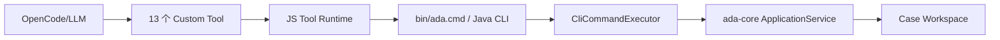
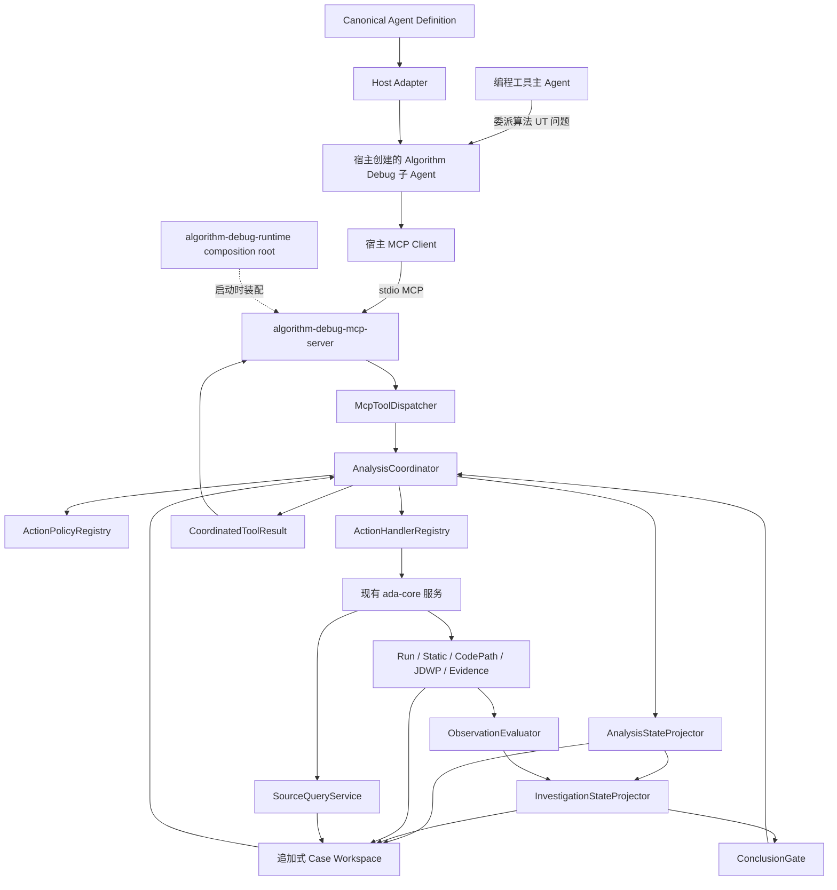
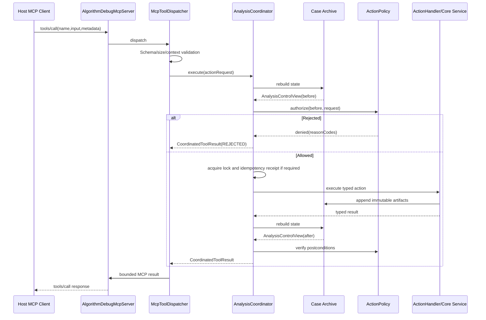
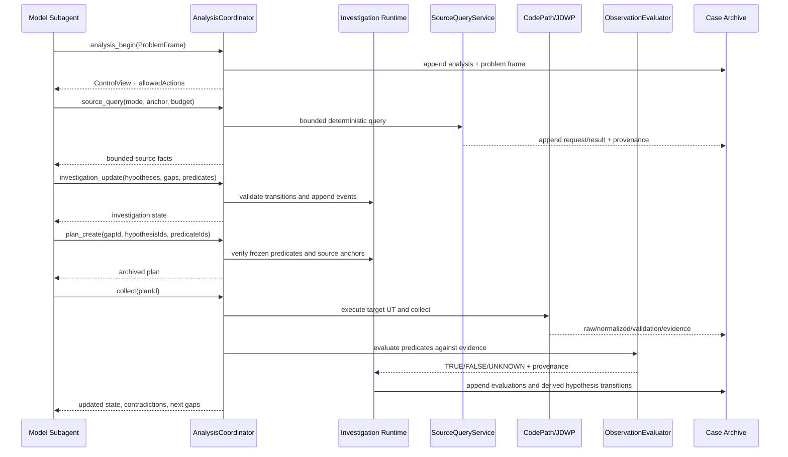
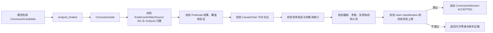

# 可移植 MCP 子 Agent 与证据约束调查运行时可实施详细设计

- 文档状态：Approved
- 设计版本：0.4
- 创建日期：2026-09-25
- 最后修订：2026-09-27
- 批准日期：2026-09-28
- 负责人：Algorithm Debug Agent Team
- 目标里程碑：MCP-native portable evidence-constrained subagent
- 关联需求：将 Algorithm Debug Agent 从宿主专用工具集合重构为可被 Qwen CLI、DeepSeek Harness 等编程工具注册的统一子 Agent
- 关联架构：[模块详细设计](../architecture/algorithm-debug-agent-module-detailed-design-v1.md)
- 关联 ADR：[ADR-018：采用 Java 原生 MCP Server 交付可移植 Algorithm Debug 子 Agent](../decisions/ADR-018-java-native-mcp-portable-subagent.md)
- 取代范围：本设计实施完成后取代 [Qwen MCP 与双 Runtime 工作台设计](2026-09-20-qwen-mcp-and-dual-runtime-workbench-design.md) 中宿主专用 Gateway、OpenCode 兼容基线和 Node Shared Runtime 作为正式 Agent 边界的方案

## 1. 背景与问题

当前根仓库以 OpenCode Custom Tool 为模型入口。13 个工具定义在
`integrations/opencode/tools/algorithm-debug.ts`，JS Runtime 为每次工具调用准备 Workspace、启动
`bin/ada.cmd`，Java CLI 再由 `CliCommandExecutor` 分派到 `ada-core` 的各个 ApplicationService。
`skills/algorithm-debug/SKILL.md` 和 `integrations/opencode/agents/algorithm-debug.md` 共同描述 Agent
角色、工作流、工具权限和完成要求。

该实现已经具备确定性的 Case、Run、Plan、Collection、Evidence 和 Artifact 能力，但存在以下结构问题：

1. Agent 身份、工具入口和工作流约束绑定 OpenCode 资产，不能直接作为宿主无关的子 Agent 包交付。
2. 工具 Schema 同时存在于 TypeScript Tool 定义、CLI 参数和 Java DTO 中，存在漂移风险。
3. 每个 Tool Call 都启动一次 Java CLI；JS Runtime、CLI 和 Java Core 重复承担参数、错误和生命周期映射。
4. 关键顺序主要由 Skill/Prompt 约束；JS 中的 `activeTargetExecution` 只保护单个 Runtime 进程，不能跨宿主、跨 MCP Server 实例或跨 CLI 进程互斥。
5. `ToolResponse` 明确把下一步选择完全交给 LLM 和 Skill，没有统一的动作门禁、证据缺口、结论等级和收敛状态。
6. 当前“Agent”对宿主可能提供的只读源码工具存在隐含依赖，不满足“所有必需能力都经统一 MCP 服务提供”的可移植目标。
7. 本地仓库只有 13 个已验证工具；公司环境声称已有 18 个工具，但另外 5 个工具的名称、Schema、实现和测试尚未进入当前根仓库，不能在本设计中推测创建。
8. 当前 `InvestigationIntent.expectedObservations` 是自由文本。系统能校验字段非空和 Evidence 谱系，却不能在采集后确定性判断观测是支持、否定还是无法判断假设。
9. 当前 `EvidenceSufficiencyEvaluator` 只检查证据维度覆盖，不判断证据是否回答当前假设。结构完整但业务无关的 Method Path、Runtime State 和 Validation 仍可能被标记为 `SUFFICIENT`。
10. 当前 Method Catalog 可归档大量方法和调用边，但模型缺少按方法、调用方向、可达路径和源码窗口查询的有界接口。在大型算法上，模型可能因名称显眼、异常栈邻近或 Artifact 顺序产生首因锚定。
11. 当前没有追加式竞争假设、反证和证据缺口账本，也没有采集前冻结的可证伪判定条件。模型可以在看到采集结果后重新解释“什么算支持”，导致强行关联。
12. 当前 Agent Eval 主要校验工具顺序、Evidence ID 和答案模式，不能证明重复运行收敛、干扰信息抗性、错误假设拒绝或因果链完整性。

本次重构不是把 13 个 Custom Tool 机械改成 13 个 MCP Tool。目标是形成一个宿主无关的
Algorithm Debug Agent Package：宿主负责创建模型子 Agent，Agent Definition 规定角色和完成契约，标准
MCP Server 提供统一能力，Coordinator 在服务端不可绕过地执行流程与证据门禁，Java Core 继续负责确定性分析。
在此基础上，本设计增加证据约束调查闭环：模型可以提出业务假设，但每轮采集必须绑定明确证据缺口和采集前冻结的结构化观测条件；确定性代码计算 `TRUE/FALSE/UNKNOWN` 并保留支持与反证；结论门禁只允许与已验证因果链相匹配的等级。目标不是让模型每次执行完全相同的工具序列，而是让相同问题稳定收敛到相同的受支持机制或相同的证据不足状态。

## 2. 目标与非目标

### 2.1 目标

- 在当前根仓库新增宿主无关的 `algorithm-debug-runtime` 组合根和 Java 原生
  `algorithm-debug-mcp-server`；第一版 MCP 使用 stdio 传输。
- 模型可见的 Algorithm Debug 能力全部通过标准 MCP Tool 暴露。
- MCP Server 直接调用 `ada-core`，正常 Tool Call 不再通过 `bin/ada.cmd` 启动 Java CLI 子进程。
- 引入不可绕过的 `AnalysisCoordinator`，所有模型可调用动作先授权、后执行、再校验后置条件。
- 从追加式 Case 产物重建状态，服务重启后不依赖内存会话恢复分析。
- 引入追加式 `InvestigationLedger`，持久化 Problem Frame、竞争假设、证据缺口、结构化观测条件、支持证据和反证。
- 用固定操作符的 `ObservationPredicate` 取代自由文本 `expectedObservations` 作为结论门禁输入；由确定性 `ObservationEvaluator` 计算 `TRUE/FALSE/UNKNOWN`。
- 将 `source_query` 作为大型算法分析的必需 MCP 能力，提供方法、调用方、被调用方、可达路径、源码窗口和符号查询，不暴露任意文件读取或 Shell。
- 引入 `CausalChain` 与强化后的 `ConclusionGate`，验证症状、运行时状态、源码机制和上游原因之间的引用、反证、覆盖与等级，不把维度齐全误写为根因成立。
- 建立无知识文件也能完成的核心闭环。算法知识 MD 仅作为可选的候选假设和术语解释输入，不进入 Validator，不拥有结论升级权。
- 将 `evidenceUsable` 一类混合语义拆成独立事实，不允许成功 UT 因缺少失败基准被错误丢弃。
- 为失败 UT 保留结构化失败指纹门禁；只有 `MATCHED` 可用于确认同类失败。
- 建立一份宿主无关、版本化、可生成宿主配置的 Canonical Agent Definition。
- 宿主适配器只负责注册 MCP Server、创建子 Agent、加载 Agent Definition 和映射权限。
- 先适配 Qwen CLI，再以第二个真实宿主验证可移植性；第二宿主不得要求修改 Core、Coordinator 或 Tool Schema。
- 保留现有 Case、Run、Collection、Evidence 和 Artifact 的不可变归档与 provenance。
- 建立单元、Schema、MCP 契约、集成、端到端、并发、恢复、性能和 Agent Eval 门禁。
- 建立重复运行、提示改写、无关源码、误导知识、矛盾证据、覆盖不完整和错误假设拒绝 Eval；用根因类别、因果链、关键证据和停止状态衡量收敛，不比较自然语言逐字一致。

### 2.2 非目标

- MCP Server 不调用大模型，不实现第二套 Agent Loop、会话压缩或模型配置。
- 不把所有 Java 内部类或模块包装为 MCP；MCP 只作为宿主与 Agent 能力的标准边界。
- 第一版不实现远程共享服务、OAuth、多租户或 Streamable HTTP；只有真实宿主要求时才单独设计。
- 第一版不重写 CodePath Launcher、JDWP Collector、Normalizer、Validator 或 Evidence Engine 的采集算法。
- 不修改目标算法生产源码或目标项目 POM 来增加 Trace。
- 不在 `.worktrees` 下实施，不从已有 worktree 直接覆盖当前根仓库。
- 不凭空实现公司环境另外 5 个工具；必须先导入其明确契约、实现来源和回归用例。
- 不保证 LLM 业务假设永远正确；Coordinator 只保证机械流程、证据纪律和结论等级不越界。
- 不把知识文件作为运行依赖，不建设知识数据库、通用知识 DSL、自动领域映射引擎或由知识直接产生事实的路径。
- 不引入多 Agent 投票、Critic Agent、LangGraph、AutoGen、DSPy 运行时或第二套模型编排器。
- 不实现通用脚本、SpEL、Groovy 或任意表达式 Observation Predicate；第一版只支持本文列出的固定操作符。
- 不以固定工具序列作为收敛标准，不承诺在缺少可观测数据时确认真实业务根因；此时必须返回证据不足。
- 不要求所有宿主都具备原生子 Agent；仅支持 MCP 的宿主只能集成能力，不能宣称实现隔离子 Agent。

## 3. 现状与约束

### 3.1 当前调用链



当前 `CliCommandExecutor` 直接持有并调用 `CaseApplicationService`、`RunApplicationService`、
`StaticAnalysisApplicationService`、`CollectionApplicationService` 和
`JdwpCollectionApplicationService`。`ControlPlaneServices` 只是这些服务的组装器，不是全局分析
Coordinator。现有 `JdwpCollectionCoordinator` 只协调一次 JDWP 采集中的目标进程和 Collector 进程，
不能承担整个分析生命周期。

### 3.2 模块约束

- Java 21、Maven、JUnit 5。
- `ada-contracts` 不依赖实现模块。
- Collector Adapter 不包含算法业务语义。
- `Normalizer`、`Validator`、哈希、关联和门禁均确定性执行，不调用 LLM。
- Case、Plan、Run、Collection、Evidence 和 Report 按 ID 追加保存，不覆盖历史。
- 原始证据只读；派生产物保留来源关联。
- JSON/JSONL 有界、稳定、可流式读取。
- 所有目标 JVM、Launcher 和 Collector 保留超时、退出码、stdout/stderr、异常清理和幂等终止。

### 3.3 MCP 依赖约束

初始依赖选择为[官方 MCP Java SDK](https://github.com/modelcontextprotocol/java-sdk) 2.0.1；模块组合按
[官方 Java SDK Quickstart](https://java.sdk.modelcontextprotocol.io/latest/quickstart/)：

- `io.modelcontextprotocol.sdk:mcp-core`
- `io.modelcontextprotocol.sdk:mcp-json-jackson2`

使用 Jackson 2 适配模块，避免把当前仓库从 Jackson 2.17.2 迁移到 Jackson 3。第一版不引入 Spring。
SDK 使用 MIT 许可证；实施前必须确认公司离线 Maven 镜像可解析锁定版本，并更新 NOTICE、SBOM 和依赖审计。
若镜像无法提供该锁定版本，实施停止在依赖预检，不得临时切换未评审 SDK 或自制 MCP 协议实现。

### 3.4 兼容性约束

- 现有 Workspace 和历史 Artifact 必须继续可读。
- MCP 重构不改变 CodePath/JDWP Raw、Normalized、Validation 和 Evidence Schema。
- `algorithm-debug-cli` 暂时保留为人工、CI、诊断和迁移基线入口，但不再是正常 MCP Tool 的内部执行路径。
- 当前 `ToolResponse 2.0` 保留给 CLI；MCP 使用新的 `CoordinatedToolResult 1.0`，避免给旧响应增加字段后破坏严格键校验。

## 4. 用例与验收标准

| 用例 | 输入/前置条件 | 预期结果 | 验证层级 |
|---|---|---|---|
| MCP 初始化 | 标准客户端启动 stdio Server | 协议协商成功，Server identity 和 capability 版本稳定 | Contract/Integration |
| 工具发现 | 初始化完成 | 返回唯一 Canonical Tool Catalog，不依赖宿主配置复制 | Contract |
| 创建分析 | `ProblemFrame + targetTest` | 原子创建或追加 Case/Analysis/Problem Frame，返回控制视图 | Integration |
| 越序 Run | 无有效 Analysis 直接执行 Run | Coordinator 拒绝，Maven 不启动 | Unit/Integration |
| 越序 JDWP | Plan 不存在或不属于 Case | Coordinator 拒绝，目标 JVM 和 Collector 均不启动 | Unit/Integration |
| 成功 UT | 基准 Run 成功 | 归档 Run/Gantt；动态证据不因没有失败基准被丢弃 | Regression/E2E |
| 断言失败 | Run 返回结构化断言差异 | 失败仍是目标事实；Collection 仅在失败指纹 `MATCHED` 时确认同类失败 | Regression/E2E |
| 异常失败 | Run 返回异常链和业务帧 | 保留异常事实，不强制转换为断言失败 | Regression/E2E |
| 采集变化 | Collection 失败指纹为 `CHANGED` | 数据可归档和查看，但确认资格为 false | Unit/E2E |
| 并发目标执行 | 两个 MCP Call 竞争同一目标 Workspace | 只有一个获得文件锁，另一个收到 `TARGET_EXECUTION_BUSY` | Concurrency |
| MCP Server 重启 | 已有 Case/Analysis/Collection | 从追加式归档重建相同控制状态 | Recovery |
| 重复 operationId | 客户端重试写操作 | 不重复启动 UT；完成则返回原操作引用，不确定则要求恢复 | Idempotency |
| 结论门禁 | 关键证据义务未满足 | `analysis_finalize` 拒绝 `CONFIRMED_FACT`，允许受限假设或证据不足 | Unit/Eval |
| 无知识文件 | 只提供问题、目标 UT、输入、Gantt 和源码 | 可以建立假设、采集、评估和完成结论，不返回知识依赖错误 | Integration/Eval |
| 可选知识 | 提供正确算法知识 MD | 仅减少候选探索或补充术语，不绕过源码、动态证据和反证门禁 | Eval |
| 误导知识 | 知识提示与运行时事实冲突 | 假设被否定或降级，不能产生确认性结论 | Eval |
| 有界源码理解 | 大型 Method Catalog | `source_query` 按稳定 methodKey/SourceAnchor 返回有界、可追溯结果 | Unit/Integration |
| 静态可达但未运行 | 源码存在候选分支，完整动态覆盖未命中 | 仅保留 `SOURCE_INFERENCE`，不得升级为运行事实 | Unit/Eval |
| 结构化观测 | Plan 绑定 Predicate 后完成采集 | 代码计算 `TRUE/FALSE/UNKNOWN`，模型不能事后修改判定条件 | Unit/Integration |
| 反证保留 | Predicate 返回 FALSE | 追加到 `evidenceAgainst`，原假设不能保持 `SUPPORTED` | Unit/Eval |
| 不完整覆盖 | 未命中但 Evidence Coverage 为 PARTIAL/UNKNOWN | Predicate 结果为 UNKNOWN，不能证明不存在 | Unit/Eval |
| 竞争假设 | 两个假设都能解释当前证据 | 禁止确认单一根因；继续最小区分采集或返回证据不足 | Unit/Eval |
| 重复运行收敛 | 同一 Gold Case 重复 5 次并改写提问 | 根因类别/停止状态、关键因果链和 Evidence 选择达到批准阈值 | Eval |
| Qwen 适配 | 安装 Qwen Host Adapter | 只配置 Agent Definition 和一个 MCP Server，不复制 Tool Schema | E2E |
| 第二宿主适配 | 安装 DeepSeek/其他 Harness Adapter | 不修改 Core、Coordinator 或 Tool Catalog 即可运行同一 Suite | Portability E2E |
| 服务故障 | MCP 请求取消、Server 异常退出 | 目标进程有界清理，失败 Manifest 和操作日志可审计 | Fault injection |

## 5. 总体方案



### 5.1 Agent 的技术定义

重构后的产品级 Agent 由以下部分共同构成：

1. 宿主创建的模型子 Agent：负责理解问题、提出假设、选择允许的 MCP Tool、解释证据。
2. Canonical Agent Definition：提供宿主无关的角色、输入、Prompt 版本、能力要求和完成契约。
3. Algorithm Debug MCP Server：向任意兼容宿主暴露同一工具、资源和 Prompt。
4. Analysis Coordinator：确定性执行动作门禁、状态投影、并发、幂等、证据义务和结论门禁。
5. Investigation Runtime：追加保存 Problem Frame、竞争假设、证据缺口和 Predicate，并确定性更新支持、反证和未知状态。
6. Java 分析内核：执行 UT、静态分析、Source Query、CodePath、JDWP、Normalizer、Validator、Observation Evaluator 和归档。
7. Host Adapter：把 Canonical Agent Definition 映射到某一编程工具的子 Agent 配置。

MCP Server 不调用模型。Agent 行为中需要推理的部分仍由宿主子 Agent 的模型完成；需要稳定保证的部分必须由
Coordinator 或现有确定性模块完成。

### 5.2 为什么保留粒度明确的多个工具

不采用一个包含 `action` 字符串和巨大联合参数的 `analysis_execute` 万能工具。保留粒度明确的 Tool 能让 MCP
客户端获得准确的输入 Schema、权限和错误边界。工具不会继续是“散落能力”，因为所有工具都由一个 Catalog
注册、一个 Dispatcher 接收、一个 Coordinator 授权，并共享同一生命周期和返回契约。

### 5.3 传输选择

第一版只支持 stdio：每个宿主启动一个本地 MCP Server 进程，Server 生命周期由宿主拥有。stdio 适合本地
编程工具，不需要监听端口或引入认证。Streamable HTTP、共享 Server 和远程鉴权属于后续独立设计。

## 6. 模块与类设计

### 6.1 新增 Maven 模块 `algorithm-debug-runtime`

该模块是唯一生产组合根，依赖 `ada-core` 和 CodePath/JDWP/Adapter 的具体实现；CLI 与 MCP Server 都依赖它，
避免各自复制 ServiceLoader、Java/Maven 路径、Collector 和 Doctor Probe 装配。它不处理 CLI/MCP 协议，也不包含
分析流程策略。

| 类 | 职责 | 输入 | 输出 |
|---|---|---|---|
| `AlgorithmDebugRuntimeBootstrap` | 从受限环境和配置组装完整 Core/Coordinator | `RuntimeBootstrapRequest` | `AlgorithmDebugRuntime` |
| `AlgorithmDebugRuntime` | 持有 `ControlPlaneServices`、Coordinator 和关闭资源 | 构造参数 | 服务访问器/`close()` |
| `RuntimeToolchainResolver` | 分离 Agent Java、目标 Java 和 Maven | env/config | `RuntimeToolchain` |
| `CodePathRuntimeFactory` | 组装 Collector、Classpath Resolver 与 Doctor Probe | toolchain/env | `ConfiguredCodePath` |
| `JdwpRuntimeFactory` | 组装 Collector 配置、Coordinator、端口与 Doctor Probe | toolchain/env | `ConfiguredJdwp` |

`algorithm-debug-runtime` 不得依赖 `algorithm-debug-cli`、`algorithm-debug-mcp-server` 或任何宿主适配器。
现有 `AdaMain` 中的组合代码迁移到该模块后删除，CLI 只做参数/输出适配。

### 6.2 新增 Maven 模块 `algorithm-debug-mcp-server`

| 类 | 职责 | 输入 | 输出 | 依赖 |
|---|---|---|---|---|
| `AlgorithmDebugMcpMain` | 解析受限启动参数、构建服务、启动 stdio、注册关闭钩子 | argv/env | 进程退出码 | `McpServerBootstrap` |
| `McpServerBootstrap` | 使用 `AlgorithmDebugRuntimeBootstrap` 组装 SDK、Catalog 和 Dispatcher | 配置、Clock | `McpServerHandle` | MCP SDK、`algorithm-debug-runtime` |
| `AlgorithmDebugMcpServer` | 协议初始化、工具/资源/Prompt 注册和生命周期 | MCP transport | MCP result | MCP SDK |
| `McpToolCatalog` | 提供唯一、不可变、版本化工具目录 | 无 | `List<McpToolDescriptor>` | `ada-contracts`、Schema resources |
| `McpToolDescriptor` | 描述名称、动作、Schema、说明和副作用等级 | 构造参数 | 不可变元数据 | 无 |
| `McpToolDispatcher` | 解析请求、绑定请求上下文、调用 Coordinator、映射结果 | tool name/input/metadata | `CallToolResult` | Coordinator、mapper |
| `McpRequestContextResolver` | 从 roots、启动配置和 MCP metadata 解析可信 Workspace 与 invocationId | MCP request | `AgentRequestContext` | path policy |
| `McpResultMapper` | 将 `CoordinatedToolResult` 转为有界 MCP content/structuredContent | domain result | MCP result | Jackson 2 |
| `McpProtocolErrorMapper` | 仅映射协议、Schema、取消和基础设施错误 | exception | MCP error/result | error catalog |
| `AgentResourceProvider` | 暴露 Agent manifest、capabilities 和有界 Case 状态 | resource URI | bounded resource | projector |
| `AgentPromptProvider` | 暴露版本化 start/continue/explain Prompt | prompt args | prompt messages | Agent Definition |
| `McpServerLifecycle` | 有界启动、取消、关闭和活动调用等待 | process signals | termination result | executor |

该模块依赖 `ada-contracts`、`ada-core`、官方 MCP SDK、Jackson 2 适配和测试依赖。它不得依赖
`algorithm-debug-cli`，不得通过 `ProcessBuilder` 启动 `ada.cmd`。

### 6.3 `ada-core` 新增 `coordination` 包

| 类 | 职责 | 输入 | 输出 | 依赖 |
|---|---|---|---|---|
| `AnalysisCoordinator` | 统一执行授权、加锁、幂等、调用、后置检查和状态刷新 | `AnalysisActionRequest` | `CoordinatedToolResult<?>` | 下列端口 |
| `AnalysisStateProjector` | 从已校验归档重建当前分析状态 | `AnalysisIdentity` | `AnalysisControlView` | Case read ports |
| `AnalysisActionRegistry` | 按动作类型注册唯一 Policy 和 Handler | action type | registration | immutable map |
| `AnalysisActionPolicy<T>` | 对单类动作执行前置条件和后置条件 | state/request/result | decisions | contracts |
| `AnalysisActionHandler<T,R>` | 调用现有 ApplicationService | typed request | typed result | ApplicationService |
| `EvidenceObligationEvaluator` | 计算系统、工具和调查义务的状态 | control facts | obligation results | evidence engine |
| `InvestigationStateProjector` | 从追加式调查事件重建 Problem Frame、假设、缺口、Predicate 和结果 | analysis identity | `InvestigationState` | case read ports |
| `InvestigationUpdatePolicy` | 校验假设、缺口和 Predicate 的合法状态转换，禁止改写历史判定标准 | before/request | decision | contracts |
| `ConclusionGate` | 校验 claim 分类、证据引用、Predicate、反证、因果链、替代假设、截断和确认资格 | candidate/state | decision | evidence engine |
| `OperationIdempotencyService` | 管理 operationId 的开始、完成和不确定状态 | operation request | receipt | operation journal |
| `WorkspaceExecutionLockManager` | 对目标 Workspace/Project 获取跨进程文件锁 | target identity | lock handle | case-management |

`AnalysisCoordinator` 不包含 Maven、CodePath 或 JDWP 的具体实现。Action Handler 只适配已有服务；Policy 只检查
通用动作契约和该工具的机械前后置条件。

### 6.4 `static-analysis` 增加有界源码查询

| 类 | 职责 | 输入 | 输出 | 依赖 |
|---|---|---|---|---|
| `SourceQueryService` | 在当前 Analysis 的 Method Catalog 和允许源码根中执行有界查询 | `SourceQueryRequest` | `SourceQueryResult` | Method Catalog、source reader port |
| `MethodCatalogIndex` | 建立 methodKey、调用方、被调用方和邻接索引，不读取运行时证据 | `MethodCatalog` | immutable index | contracts |
| `ReachablePathFinder` | 在最大深度、节点数和路径数预算内确定性搜索调用路径 | source/target/budget | ordered paths | catalog index |
| `BoundedSourceWindowReader` | 按 SourceAnchor 返回规范化行窗口并拒绝越界、敏感文件和过大内容 | anchor/window | source window | workspace path policy |
| `SourceQueryLimits` | `ada-contracts` 中定义 request/Schema 共同使用的默认值和硬上限 | 无 | named constants | contracts |

`SourceQueryService` 不执行任意文本命令，不接受绝对路径，不扫描 Workspace 外文件。`CALLERS`、`CALLEES` 和
`REACHABLE_PATH` 只表达静态源码关系；结果必须携带 `STATIC_REACHABLE` 或 `STATIC_CANDIDATE`，不得伪装为
`RUNTIME_OBSERVED`。查询结果按 methodKey、source line 和 resolution kind 稳定排序。

### 6.5 `evidence-engine` 增加观测评估

| 类 | 职责 | 输入 | 输出 | 依赖 |
|---|---|---|---|---|
| `ObservationEvaluator` | 将采集前冻结的 Predicate 与已验证 Evidence 对照 | predicate/evidence/coverage | `ObservationEvaluation` | contracts |
| `ObservationOperatorEvaluator` | 每个固定操作符的纯函数实现 | selector/operator/value | TRUE/FALSE/UNKNOWN | 无 |
| `HypothesisEvidenceReducer` | 根据 Predicate 结果聚合支持、反证和未知，不判断业务语义 | hypothesis/evaluations | `HypothesisEvaluation` | contracts |
| `CausalChainEligibilityEvaluator` | 校验因果链引用、关键边覆盖、反证和替代假设状态 | chain/state | eligibility | contracts |
| `InvestigationLimits` | `ada-contracts` 中定义调查契约和 Schema 共同使用的数量/文本预算 | 无 | named constants | contracts |

每个 evaluator 都是无状态、确定性、线程安全的纯计算组件。它们不得调用 LLM、读取任意文件、启动进程或修改
Artifact。操作符通过枚举到 evaluator 的不可变映射注册；未知操作符主版本必须 fail closed，不得落入字符串分支。

### 6.6 `case-management` 新增持久化和锁边界

| 类 | 职责 |
|---|---|
| `AnalysisArtifactIndex` | 有界扫描已注册 Artifact，并按 analysis/run/plan/collection/evidence 建索引 |
| `AnalysisStateRepository` | 读取状态投影所需的版本化文档，不写派生 current-state |
| `WorkspaceExecutionLock` | 使用 OS 文件锁实现跨 MCP Server/CLI 进程互斥 |
| `OperationJournal` | 追加保存 operation STARTED/COMPLETED/FAILED/UNCERTAIN 记录 |
| `CoordinationDecisionArchive` | 追加保存需要审计的拒绝、结论决策和 policyVersion |
| `InvestigationEventArchive` | 原子追加 Problem Frame、Hypothesis、Gap、Predicate、Evaluation 和状态转换事件 |
| `InvestigationJournalReader` | 有界读取并校验 investigation sequence、hash、schema 和 analysis identity |

锁文件只用于同步，不作为分析事实。进程崩溃后 OS 释放文件锁；未完成 operation 仍保留 `UNCERTAIN` 或可恢复记录。

### 6.7 `ada-contracts` 新增契约

新建不可变公共模型：

```text
AgentCapabilityManifest
AgentRequestContext
AnalysisActionType
AnalysisActionRequest（sealed interface）
AnalysisControlView
ActionDecision
ActionDecisionCode
EvidenceObligation
EvidenceObligationKind
ObligationStatus
EvidenceEligibility
ProblemFrame
HypothesisRecord
HypothesisStatus
EvidenceGap
EvidenceGapStatus
ObservationPredicate
ObservationOperator
ObservationTruth
PredicateRole
HypothesisEffect
ObservationEvaluation
HypothesisEvaluation
InvestigationEvent（sealed interface）
InvestigationState
SourceQueryMode
SourceQueryRequest
SourceQueryResult
CausalChain
CausalNode
CausalEdge
ConclusionCandidate
ConclusionClaim
ConclusionDecision
CoordinatedToolResult<T>
OperationId
OperationReceipt
```

公共模型使用中文 Javadoc；枚举、Schema 字段和错误码使用清晰英文。

所有数量、长度、字节、深度、超时和版本值必须来自职责所属的命名常量类，不得在 Policy、Handler、Mapper、
Schema 生成或测试中复制魔鬼数字。稳定错误码、reason code、artifact type、事件类型和字段路径必须使用枚举或
集中常量；测试可以引用生产常量或专用 fixture 常量，不得复制会随契约演进的协议字符串。

### 6.8 Canonical Agent Definition

新增目录：

```text
agent-definition/
  algorithm-debug-agent-v1.json
  system-prompt-v1.md
  completion-contract-v1.schema.json
  README.md
```

Agent Definition 包含：

- `profileVersion`
- `agentId`
- `description`
- `inputContract`
- `requiredMcpServer`
- `requiredCapabilities`
- `allowedToolGroups`
- `prompt.path/sha256/version`
- `completionContract.path/version`
- `defaultModelHints`（只允许温度等非凭据提示，宿主可拒绝）

现有 `skills/algorithm-debug/SKILL.md` 的领域工作流内容迁移到规范 Prompt；硬规则同时由 Coordinator 实现。
各宿主产物必须从 Agent Definition 生成或引用，不维护可独立漂移的第二份正文。

### 6.9 Host Adapter Kit

新增：

```text
integrations/
  host-adapter-kit/
    README.md
    schemas/host-adapter-manifest-v1.schema.json
    scripts/render-host-config.mjs
    test/
  qwen-cli/
    adapter-manifest.json
    templates/
    install.ps1
    check.ps1
    uninstall.ps1
    test/
```

第二宿主在 Qwen 适配通过后新增。Host Adapter 只能完成：

1. 定位 `bin/ada-mcp.cmd`。
2. 写入该宿主要求的 MCP Server 配置。
3. 生成或引用子 Agent Profile。
4. 映射工具权限和只读 Workspace。
5. 执行初始化、工具清单、版本和卸载检查。

Host Adapter 不得包含工具 Schema、证据规则、Case 路径推导或 Collector 逻辑。

## 7. 数据与契约设计

### 7.1 `CoordinatedToolResult 1.0`

MCP 的结构化结果使用独立契约：

```json
{
  "schemaVersion": "1.0",
  "outcome": "SUCCEEDED",
  "code": "JDWP_COLLECTION_COMPLETED",
  "message": "JDWP collection completed",
  "data": {},
  "artifacts": [],
  "control": {
    "policyVersion": "1.0",
    "caseId": "case-1",
    "analysisId": "analysis-2",
    "revision": 8,
    "requestedAction": "JDWP_COLLECT",
    "decision": "ALLOWED",
    "reasonCodes": [],
    "satisfiedObligationIds": ["O1"],
    "remainingObligationIds": ["O2"],
    "contradictionIds": [],
    "openGapIds": ["G2"],
    "supportedHypothesisIds": ["H1"],
    "refutedHypothesisIds": ["H2"],
    "unevaluatedPredicateIds": [],
    "allowedActions": ["EVIDENCE_QUERY", "JDWP_PLAN_CREATE", "ANALYSIS_FINALIZE"],
    "terminalEligibility": "BOUNDED_HYPOTHESIS"
  }
}
```

`outcome` 枚举：

- `SUCCEEDED`：Agent 动作正常完成；目标 UT 可以成功或失败。
- `REJECTED`：Coordinator 确定性拒绝，未执行副作用动作。
- `FAILED`：Agent、Collector、环境或内部执行失败。

MCP 协议级 `isError` 只用于请求无法解析、未知工具、协议不兼容、Server 内部异常等基础设施错误。目标 UT
异常、断言失败、超时和非零退出仍是成功 Tool Call 中的结构化目标结果。

### 7.2 控制状态

`AnalysisControlView` 是派生视图，不是新的可变事实源。它由以下归档重建：

- Case Manifest
- Analysis Request
- Algorithm Input Capture
- Run Summary 与失败指纹
- Method Catalog
- CodePath/JDWP Plan
- Collection Manifest、Normalization、Validation
- Evidence Bundle、Sufficiency Evaluation
- Source Query request/result
- Investigation Event、Observation Evaluation 与 Hypothesis Evaluation
- Operation Journal
- Conclusion Decision

不得保存可被覆盖的 `current-state.json`。只有调查契约、操作事件和结论决策追加归档。

新增控制产物采用以下固定布局；每个 JSON 文件只创建一次，不通过覆盖表达状态迁移：

```text
projects/{projectId}/.control/target-execution.lock
projects/{projectId}/cases/{caseId}/analyses/{analysisId}/
  operations/{operationId}/started.json
  operations/{operationId}/completed.json | failed.json | uncertain.json
  coordination/{decisionId}.json
  investigation/events/{sequence}-{eventId}.json
  source-queries/{queryId}/request.json
  source-queries/{queryId}/result.json
  conclusions/{conclusionId}/candidate.json
  conclusions/{conclusionId}/accepted.json | rejected.json
```

- `.control/target-execution.lock` 是同步设施，不是证据 Artifact，可以复用，但不得包含业务数据。
- `started.json` 与唯一终态文件组成 operation 生命周期；出现多个终态文件时，State Projector 必须报告
  `OPERATION_JOURNAL_CONFLICT`，不得自行挑选一个结果。
- `coordination` 和 `conclusions` 目录中的文档必须包含 `schemaVersion`、`policyVersion`、ID、时间、输入哈希和
  provenance；State Projector 只读取已通过 Schema 与哈希校验的文档。
- `investigation/events` 使用 Analysis 内严格递增 `sequence`。缺号允许表示写入失败并记录 limitation；重复序号、
  重复 eventId、同一 Predicate 内容被覆盖或 hash 冲突必须报告 `INVESTIGATION_JOURNAL_CONFLICT`。
- Source Query 是可追溯源码事实，不是运行时 Evidence。Result 必须引用 Method Catalog Artifact、源码相对路径、
  内容 hash、SourceAnchor 和查询预算；不得复制整个源码树。
- Case 级短事务锁使用 `projects/{projectId}/cases/{caseId}/.control/case-write.lock`；锁文件与证据目录分离。

### 7.3 拆分证据语义

禁止继续使用一个布尔同时表达数据可读性和结论资格。至少拆分：

| 字段 | 含义 |
|---|---|
| `artifactReadable` | Artifact 存在、哈希正确且 Schema 可读 |
| `collectionComplete` | Collector 正常结束且未因预算/超时截断 |
| `baselineRequired` | 当前场景是否需要失败复现基准 |
| `baselineComparable` | 若需要，当前 Run 与基准是否可比较 |
| `failureFingerprintMatched` | 失败场景是否复现同类失败 |
| `obligationSatisfied` | 指定证据义务是否被有效观测覆盖 |
| `confirmationEligible` | 当前证据是否允许确认性 claim |

规则：

- 成功 UT：`baselineRequired=false`，不能因为 `baselineComparable=false` 把证据判为不可用。
- 失败 UT：`baselineRequired=true`；只有 `failureFingerprintMatched=true` 才允许动态证据确认同类失败。
- `CHANGED/INCOMPARABLE`：Artifact 可以读取和分析，但 `confirmationEligible=false`。
- 截断、缺失投影和未知覆盖：保留数据，限制能证明的范围，不静默丢弃。

### 7.4 调查状态与状态转换

核心分析闭环不依赖知识文件。每个 Analysis 必须有且只有一个 `ProblemFrame`，其后可以追加假设、证据缺口、
Predicate 和 Evaluation。历史事件不可覆盖；状态由 `InvestigationStateProjector` 重放得到。

`ProblemFrame` 必填字段：

```text
problemFrameId
symptom
expectedBehavior
actualBehavior
targetTest
scopeAnchors[]
knownFactRefs[]
initialUnknowns[]
createdAt
```

`HypothesisRecord` 必填字段：

```text
hypothesisId
statement
status: OPEN | SUPPORTED | REFUTED | INCONCLUSIVE
sourceAnchorRefs[]
supportingEvaluationIds[]
contradictingEvaluationIds[]
gapIds[]
createdAt
```

`EvidenceGap` 状态固定为 `OPEN | PLANNED | OBSERVED | UNRESOLVED | CLOSED`。一个动态 Plan 必须绑定一个 `gapId`、
至少一个 `hypothesisId` 和一至八个已归档 Predicate；同一 Plan 不得通过自由文本引入未归档判定标准。

新增不可变 `InvestigationBinding`：

```text
gapId
hypothesisIds[]
predicateIds[]
basedOnEvidenceIds[]
```

CodePath Plan 升级为 v7，JDWP Plan 升级为 v6，使用 `InvestigationBinding` 取代用于门禁的自由文本
`InvestigationIntent`。可保留有界 `questionToAnswer` 作为给人的说明，但它不参与机器判定。旧 CodePath v6/JDWP v5
继续可读取和重放采集，投影为 `LEGACY_UNSTRUCTURED`，不能直接满足新调查义务。Plan Compiler 必须验证：绑定对象
属于同一 Analysis、Gap 仍开放、Predicate 已冻结、选择的方法/tracepoint/projection 足以计算对应操作符。

合法假设转换：

```text
OPEN -> SUPPORTED | REFUTED | INCONCLUSIVE
SUPPORTED -> REFUTED | INCONCLUSIVE
INCONCLUSIVE -> SUPPORTED | REFUTED
REFUTED -> REFUTED
```

`REFUTED` 是终态。新证据推翻原解释时创建新 Hypothesis，不恢复或改写旧 Hypothesis。`SUPPORTED` 只表示当前
Predicate 结果支持该假设，不等于根因已确认。

Reducer 规则固定为：任一 CRITICAL Predicate 产生 `REFUTE` 即为 `REFUTED`；所有已登记 CRITICAL Predicate 均已
评估为 `SUPPORT`、不存在 UNKNOWN/REFUTE 且关联 Gap 已关闭时为 `SUPPORTED`；存在未评估或 UNKNOWN 的 CRITICAL
Predicate 时为 `INCONCLUSIVE`；尚未产生有效 Evaluation 时保持 `OPEN`。新增 Gap/Predicate 可以使 SUPPORTED 回到
INCONCLUSIVE，但不能让 REFUTED 恢复。

### 7.5 结构化 Observation Predicate

第一版操作符冻结为：

| 操作符 | 输入来源 | TRUE | FALSE | UNKNOWN |
|---|---|---|---|---|
| `METHOD_OBSERVED` | CodePath summary/trace | 方法在完整匹配范围内命中 | 完整覆盖且未命中 | 覆盖部分、截断或方法未跟踪 |
| `RECORD_EXISTS` | CodePath/JDWP normalized records | 至少一个记录满足 selector | 完整查询且无记录 | 查询 PARTIAL/UNKNOWN |
| `VALUE_EQUALS` | 命名投影 | 标量和值状态满足期望 | 值存在且不同 | 未采集、不可见、截断或多义 |
| `VALUE_CHANGED` | 同一 tracepoint 有序记录 | 指定值按规则发生变化 | 完整窗口内未变化 | 顺序/窗口/覆盖不完整 |
| `COUNT_COMPARE` | 确定性 COUNT 查询 | 比较表达式成立 | 比较表达式不成立 | 计数下界、截断或分组不完整 |
| `PATH_CONTAINS` | Method Path Summary | 路径包含声明 method/edge | 完整路径覆盖且不包含 | 覆盖不完整或多态候选未决 |
| `FAILURE_FINGERPRINT_MATCHES` | Run/Collection baseline | `MATCHED` | `CHANGED` | `INCOMPARABLE` 或无失败场景 |

Predicate 使用 typed selector 和 typed expected value，不接受任意表达式字符串。`COUNT_COMPARE` 的 comparator 仅为
`EQ | NE | LT | LE | GT | GE`。确认资格 Evidence 的 `FALSE` 必须生成反证引用；`UNKNOWN` 不改变支持状态，但必须保留 limitation 和
建议的最小下一动作。Predicate 内容写入后不可修改；需要不同条件时创建新 Predicate 和新 Plan。

每个 Predicate 必须声明 `role: CRITICAL | CORROBORATING`，以及 `onTrue/onFalse: SUPPORT | REFUTE | NO_CHANGE`；
`onUnknown` 固定为 `NO_CHANGE`，Schema 不允许模型覆盖。每个 Plan 至少有一个 `CRITICAL` Predicate。只有 CRITICAL
Predicate 的结果与声明 effect 组合才能直接把假设转为 SUPPORTED/REFUTED；CORROBORATING 只追加支持或反证并使状态
保持 OPEN/INCONCLUSIVE，避免单个弱信号决定根因。

`ObservationEvaluation` 必须包含 `evaluationId/predicateId/truth/evidenceIds/sourceCoverage/evidenceDisposition/`
`effectApplied/limitations/evaluatedAt/evaluatorVersion`。`evidenceDisposition` 固定为
`CONFIRMATION_ELIGIBLE | CLUE_ONLY | INVALID`。只有 `CONFIRMATION_ELIGIBLE` 可以把 Predicate effect 应用到假设状态；
失败指纹 CHANGED/INCOMPARABLE、历史非结构化或其他仅线索证据可以计算有界 truth，但 `effectApplied=false`。INVALID
Evidence 不得参与计算。相同 Predicate 和相同 Evidence 输入哈希必须得到相同结果；重复计算返回同一语义，不追加
冲突状态。Evaluation 不复制 Raw 值，只保存判定所需的有界摘要和 provenance。

### 7.6 证据义务

义务分三层：

1. 系统义务：身份、Schema、哈希、provenance、失败指纹、矛盾、截断；模型不能删除。
2. 工具义务：由 Plan 和 Tool Descriptor 产生，例如要求特定方法、tracepoint、投影和最少命中。
3. 调查义务：由 `gapId + hypothesisId + predicateIds` 产生。系统不仅检查取得何种证据，还必须保存每个 Predicate 的
   `TRUE/FALSE/UNKNOWN`、覆盖范围、Evidence 引用和对假设的支持/反证影响。

Evidence Bundle 的 `SUFFICIENT` 只表示请求维度已覆盖，不得映射为假设成立。假设状态由
`ObservationEvaluator + HypothesisEvidenceReducer` 决定；根因等级由 `ConclusionGate` 决定。

### 7.7 Source Query 契约

`SourceQueryMode` 固定为：

```text
METHOD
CALLERS
CALLEES
REACHABLE_PATH
SOURCE_WINDOW
SEARCH_SYMBOL
```

请求只接受当前 Analysis、methodKey/SourceAnchor、相对符号和有界预算；不接受绝对路径、glob、正则脚本、Shell 或
任意编码。默认预算和硬上限集中在 `SourceQueryLimits`，第一版值为：默认 20 个方法、50 条边、3 层深度、5 条路径、
200 行源码和 64 KiB 响应；硬上限为 100 个方法、500 条边、8 层深度、20 条路径、500 行源码和 256 KiB 响应。
这些值只在常量类和 Schema 单一来源中定义，设计实施时通过契约测试校验一致性。

结果必须返回 `completeness`、`limitations` 和 `provenance`。静态关系只允许支持 `SOURCE_INFERENCE`；只有与
CodePath/JDWP 的 `RUNTIME_OBSERVED` 证据关联后，才允许描述本次执行行为。

### 7.8 可选知识输入边界

无知识文件时，Agent 使用用户问题、UT、算法输入、Gantt、源码和动态 Evidence 完成同一闭环。知识 MD 存在时，
宿主可以把版本化、带来源的片段作为 `KNOWLEDGE_HINT` 提供给模型，用于术语解释、候选假设和源码搜索方向。

知识内容不得注册为 Evidence，不进入 `ObservationEvaluator`，不改变 Predicate 结果，不满足任何系统/工具/调查义务，
也不能单独支持 `CONFIRMED_FACT` 或 `VALIDATOR_CONCLUSION`。第一版不新增知识解析模块；核心契约不得依赖知识目录
存在。使用知识形成的假设仍必须通过源码锚点、动态观测和反证流程。

### 7.9 Agent 完成契约

子 Agent 最终返回父 Agent 的结构化语义至少包含：

```text
caseId
analysisId
status: CONFIRMED | BOUNDED_HYPOTHESIS | INSUFFICIENT_EVIDENCE |
        CONTRADICTED | TOOL_BLOCKED | BUDGET_EXHAUSTED
claims[]: classification/text/evidenceIds
causalChain: nodes/edges/sourceRefs/evidenceRefs
consideredHypothesisIds[]
refutedHypothesisIds[]
missingEvidence[]
limitations[]
capabilitiesUsed[]
```

`analysis_finalize` 校验结构化候选；自然语言解释仍由模型输出，不冒充 Validator 事实。状态规则固定为：

- `CONFIRMED`：关键因果边均有允许等级的源码/动态引用；关键 Predicate 非 UNKNOWN；无未解决关键反证；合理竞争
  假设已 REFUTED；失败场景指纹 MATCHED；无影响结论的截断。至少存在两个有源码锚点或 Evidence 依据的候选假设，
  其中目标假设为 SUPPORTED，至少一个竞争假设为 REFUTED；只有一个候选时最高为 `BOUNDED_HYPOTHESIS`。
- `BOUNDED_HYPOTHESIS`：机制得到部分源码和动态支持，但替代假设、反事实或关键上游原因未完全关闭。
- `INSUFFICIENT_EVIDENCE`：没有可执行区分手段、持续 UNKNOWN、关键截断、多个假设无法区分或证据预算不足。
- `CONTRADICTED`：候选结论与确定性事实、Predicate FALSE 或 Validator 结论冲突。
- `TOOL_BLOCKED`：环境或工具失败阻止继续；不得包装为业务根因。
- `BUDGET_EXHAUSTED`：达到已声明轮次、执行、时间或数据预算；保留已知事实但不得越级。

`CausalNode` 类型固定为 `SYMPTOM | INPUT | RUNTIME_STATE | DECISION | SOURCE_MECHANISM | UPSTREAM_CAUSE`；
`CausalEdge` 必须声明 `from/to/relation/classification/evidenceIds/sourceQueryIds`。`CONFIRMED` 的关键路径至少包含
`SYMPTOM`、`RUNTIME_STATE` 或 `DECISION`、`SOURCE_MECHANISM`，且不能全部依赖 `SOURCE_INFERENCE`。自然语言 claim
必须引用 CausalChain 中的节点或边，防止报告正文出现未经过 Gate 的新根因。

完成状态与单条 claim 分类相互独立：整体为 `BOUNDED_HYPOTHESIS` 或 `INSUFFICIENT_EVIDENCE` 时，仍可包含“UT 返回
断言失败”等有直接 Evidence 的 `CONFIRMED_FACT`；但不得把这些局部事实包装为整体根因 `CONFIRMED`。

## 8. MCP Tool、Resource 与 Prompt 设计

### 8.1 Tool Catalog

本地 13 个工具全部迁移为 MCP Tool：

```text
analysis_begin
case_inspect
algorithm_input_capture
case_audit
gantt_inspect
run_test
static_analyze
codepath_plan_create
codepath_collect
jdwp_plan_create
jdwp_collect
artifact_read
evidence_query
```

新增四个源码理解与调查闭环工具：

```text
source_query
investigation_update
analysis_status
analysis_finalize
```

因此当前根仓库第一阶段目标 Tool Catalog 为 17 个。公司环境另外 5 个工具进入仓库后重新计算总数；不得把
“17”或“18”作为长期协议常量，客户端以 `tools/list` 和 capability manifest 为准。测试通过
`McpToolCatalog.expectedBaselineActions()` 的不可变集合验证完整性，不在 Handler、Prompt 和 Adapter 中复制数量。

工具按能力分组：

- `ANALYSIS_LIFECYCLE`
- `INPUT_AND_RUN`
- `SOURCE_AND_STATIC`
- `CODEPATH`
- `JDWP`
- `EVIDENCE_ACCESS`
- `INVESTIGATION`
- `AUDIT`

### 8.2 `source_query` 必需能力

现状审计已经确认，大型算法真实分析依赖源码读取、符号搜索和调用关系收敛。`source_query` 因此是第一阶段必需
MCP Tool，不再等待宿主能力清单决定。它复用当前 `static-analysis` 的 Method Catalog 和 SourceAnchor，不暴露任意
文件系统或 Shell。

该 Tool 必须满足：Workspace allowlist、路径规范化、相对源码路径、行数/字节/深度/节点/路径限制、敏感文件拒绝、
稳定排序、Catalog 和源码 hash provenance。宿主即使提供源码工具，Canonical Agent 仍以 `source_query` 为可移植
路径；宿主工具只能作为人工辅助，不进入 Agent 完成契约。

### 8.3 `investigation_update` 语义

`investigation_update` 是追加调查事件的唯一模型入口，支持以下 typed command：

```text
ADD_HYPOTHESIS
ADD_EVIDENCE_GAP
REGISTER_PREDICATE
MARK_GAP_UNRESOLVED
```

它不允许模型直接设置 `SUPPORTED`、`REFUTED`、`CONFIRMED` 或写入 Evaluation。假设状态只由确定性
`ObservationEvaluator` 和 reducer 产生。Problem Frame 由 `analysis_begin` 与 Analysis 原子创建且只创建一次；发现
问题范围实质变化时创建新 `analysisId`，不得修改原 Frame。
`codepath_plan_create`/`jdwp_plan_create` 成功后由 Coordinator 自动追加 Gap `PLANNED` 事件；采集和 Evaluation 后
自动追加 `OBSERVED/CLOSED/UNRESOLVED`，模型不能伪造 Plan 或 Evaluation 关联。

### 8.4 Resources

第一版提供以下有界 Resource：

```text
ada://agent/manifest
ada://agent/capabilities
ada://cases/{caseId}/digest
ada://cases/{caseId}/analyses/{analysisId}/status
```

带参数的大数据读取仍使用 Tool，不通过 Resource 返回 Raw Trace 或完整 Gantt。

### 8.5 Prompts

第一版提供：

```text
algorithm-debug/start
algorithm-debug/continue
algorithm-debug/explain-evidence
```

Prompt 用于提高模型理解一致性，不承担动作授权。Host Adapter 必须能在宿主不支持 MCP Prompt 自动加载时，将
Canonical Prompt 映射为子 Agent 系统指令。

## 9. 核心流程

### 9.1 MCP Tool 调用



大模型不先调用 Coordinator。它只调用目标 Tool；Server 内部不可绕过地执行 Coordinator。

### 9.2 目标执行互斥

`run_test`、`codepath_collect`、`jdwp_collect` 标记为 `TARGET_EXECUTION`。执行时：

1. 验证 Workspace/Project/Case/Analysis/Plan 身份。
2. 根据规范化目标 Workspace 和 Project 计算固定 lock key。
3. 获取 OS 文件锁。
4. 获取后再次重建状态，防止等待期间状态变化。
5. 原子追加 operation STARTED。
6. 执行目标进程。
7. 追加成功、失败或不确定结果。
8. 重建状态并验证后置条件。
9. 释放文件锁。

只读动作不获取排他目标锁。写 Case 但不执行目标进程的动作使用 Case 级短事务锁。

### 9.3 幂等与取消

- 所有可能写盘或启动目标进程的 MCP 请求必须包含/生成 `operationId`。
- 已完成的相同 operationId 返回历史 receipt，不重复执行。
- 进行中的相同 operationId 返回 `OPERATION_IN_PROGRESS`。
- STARTED 后无法确认结果时标记 `OPERATION_UNCERTAIN`，禁止自动重跑目标 UT。
- MCP 取消信号传入 Coordinator；Coordinator 请求底层有界终止，并等待 Manifest 提交。
- 健康检查、manifest/capability Resource 读取可以安全重试；目标执行不自动重试。

### 9.4 证据约束调查闭环



一轮采集只回答 Plan 绑定的证据缺口。模型可以选择下一步，但不能自行写入 Predicate 结果或假设状态。意外观测
可以触发新 Hypothesis，却不能被事后解释为原 Predicate 的支持；必须创建新的 gap、Predicate 和 Plan。

无知识文件时流程不变。知识 MD 只可能影响模型在 `ADD_HYPOTHESIS` 和 `source_query` 时的选择，后续门禁完全相同。

### 9.5 结论闭环



Coordinator 不替代模型理解算法业务语义，但可以确定性验证模型提交的因果结构是否引用了真实源码和动态证据、
是否符合采集前 Predicate、是否保留反证、是否仍有同等可行的替代假设，以及 claim 是否超过证据允许等级。

`CausalChain` 至少包含症状节点、运行时状态/决策节点和源码机制节点。`CONFIRMED` 还要求关键边具有动态 Evidence；
只有源码关系的链最多为 `BOUNDED_HYPOTHESIS`。若无法区分剩余假设，Gate 返回结构化 `missingEvidence` 和允许等级，
不得自动选择一个假设。

## 10. 错误处理与可观测性

### 10.1 错误分层

| 层级 | 示例 | MCP 表达 |
|---|---|---|
| Protocol | JSON-RPC、未知 Tool、Schema 不合法 | MCP error/isError |
| Coordinator Rejection | 越序、跨 Case、缺 Plan、并发占用 | 正常 Tool result，`outcome=REJECTED` |
| Agent/Environment Failure | Maven 缺失、Collector 启动失败、Artifact 损坏 | 正常 Tool result，`outcome=FAILED` |
| Target Outcome | UT 成功、断言失败、异常、目标超时 | 正常 Tool result，`outcome=SUCCEEDED`，data 内表达 |

### 10.2 错误码前缀

```text
MCP_PROTOCOL_*
MCP_SERVER_*
COORDINATION_*
ACTION_*
OPERATION_*
TARGET_EXECUTION_*
SOURCE_QUERY_*
INVESTIGATION_*
OBSERVATION_*
CONCLUSION_*
ADA_*（保留已有明确错误）
```

前缀和具体稳定码集中在 `CoordinationErrorCode`、`SourceQueryErrorCode`、`InvestigationErrorCode`、
`ObservationErrorCode` 枚举中。生产代码不得散布字符串字面量；MCP/CLI Mapper 只映射枚举，不重新拼接业务码。

### 10.3 日志

- stdio 的 stdout 只允许 MCP 帧，日志全部进入 stderr 或 Workspace DFX 文件。
- 日志关联字段：`serverInstanceId`、`mcpRequestId`、`operationId`、`caseId`、`analysisId`、`actionType`。
- 不记录完整 Prompt、凭据、完整输入 JSON、Raw Trace 或未脱敏绝对路径。
- 每个 Coordinator 决策记录 `policyVersion`、输入状态 revision、decision 和 reasonCodes。

### 10.4 Fail closed

以下情况拒绝有副作用动作和确认性结论：

- 未知 Schema/Policy 主版本。
- Artifact 哈希或 provenance 不匹配。
- Case/Analysis/Plan/Run/Collection 身份冲突。
- 状态投影不完整或超过扫描预算。
- 操作结果不确定。
- 必要义务状态为 `UNSATISFIED`、`CONTRADICTED` 或 `UNCHECKABLE`。
- Problem Frame 缺失、调查事件冲突、Predicate 被修改或 Plan 未绑定开放证据缺口。
- Predicate 需要完整覆盖但 Evidence 为 `PARTIAL/UNKNOWN`。
- 候选结论忽略 FALSE 反证、仍有同等可行的 OPEN/SUPPORTED 假设或因果链关键边无引用。

拒绝不删除数据；已归档数据仍可作为受限线索读取。

## 11. 性能与容量预算

| 指标 | 默认值 | 上限 | 超限行为 | 验证方式 |
|---|---:|---:|---|---|
| MCP 请求 JSON | 256 KiB | 1 MiB | 拒绝 `MCP_REQUEST_TOO_LARGE` | Contract |
| MCP 单响应 | 256 KiB | 1 MiB | 截断明细并返回 Artifact 引用；无法有界则失败 | Integration |
| `tools/list` Tool 数 | 由 17 个基线 Action 集合计算 | 64 | Server 启动失败并报告 Catalog 错误 | Unit |
| 状态投影 Artifact 数 | 10,000 | 100,000 | 返回 `STATE_PROJECTION_LIMIT_EXCEEDED` | Load |
| 状态投影时间 | 500 ms | 5 s | 拒绝副作用动作并记录指标 | Benchmark |
| 单 Analysis 假设数 | 5 | 20 | 拒绝新增并要求关闭/新建 Analysis | Contract |
| 单 Analysis 开放证据缺口 | 10 | 50 | 拒绝新增并返回当前优先缺口 | Contract |
| 单 Plan Predicate 数 | 4 | 8 | Schema 拒绝 | Contract |
| 单 Analysis 调查事件数 | 1,000 | 10,000 | 只读状态可用，拒绝追加并要求新 Analysis | Load |
| Source Query 方法/边 | 20/50 | 100/500 | 返回 PARTIAL 和 continuation hint | Integration |
| Source Query 深度/路径 | 3/5 | 8/20 | 拒绝越界；预算内返回稳定前缀 | Unit |
| Source Window 行/响应 | 200/64 KiB | 500/256 KiB | 截断并返回 limitation，不扩大读取 | Security/Integration |
| 同一目标执行数 | 1 | 1 | 第二请求返回 `TARGET_EXECUTION_BUSY` | Concurrency |
| MCP 活动请求 | 16 | 64 | 有界拒绝，不创建无界线程 | Load |
| Server 关闭等待 | 10 s | 30 s | 强制终止受管子进程并记录原因 | Lifecycle |
| Tool 参数/结果对象深度 | 16 | 32 | Schema 拒绝 | Contract |

现有 CodePath/JDWP 的事件、字节、命中、对象深度和超时预算不因 MCP 重构提高。状态投影必须优先读取索引和
Manifest，不反复扫描 Raw Trace。表中默认值和硬上限必须在职责所属常量类中单点定义，并由 Schema 一致性测试验证；
不得在生产类中内联数值或通过复制常量保持“看起来一致”。

## 12. 安全、隐私与无侵入性

- 第一版 stdio Server 不监听网络端口。
- Workspace 根由启动配置和 MCP roots 的交集确定；请求不得传入任意可执行文件、Java 主类或输出目录。
- 所有路径规范化后必须位于受信 Workspace、目标 Project 或 Agent 安装目录。
- MCP Tool 不提供任意 Shell、任意文件写入或目标源码修改。
- 源码读取只通过 `source_query` 暴露有界、只读、Workspace 内能力，并拒绝凭据、构建缓存、VCS 元数据和已配置
  敏感文件模式；Tool 不接受绝对路径或任意 glob。
- 模型凭据完全由宿主持有，不进入 MCP Server 配置、Case、日志或 Artifact。
- Maven、Launcher、Collector 命令由已有确定性工厂生成，不接受模型提供完整 argv。
- 官方 MCP Java SDK 依赖锁定版本、MIT 许可证、哈希、NOTICE 和 SBOM。
- 安装器使用 staging 和原子切换；不得覆盖用户的宿主配置而不保留可恢复备份。

## 13. 代码文件修改矩阵

### 13.1 根构建与打包

| 文件 | 动作 | 修改内容 |
|---|---|---|
| `pom.xml` | 修改 | 增加 MCP SDK 2.0.1 版本、`algorithm-debug-runtime` 和 `algorithm-debug-mcp-server` 模块；不引入 Spring |
| `scripts/build-agent.ps1` | 修改 | 构建 MCP Server 可执行 JAR、校验 Collector/Launcher/Server 三类产物 |
| `bin/ada-mcp.cmd` | 新增 | 使用 Agent JDK 21 启动 stdio MCP Server；不接受任意主类和任意 classpath |
| `bin/README.md` | 修改 | 区分 `ada.cmd` 管理/诊断入口与 `ada-mcp.cmd` 模型入口 |
| `config/mcp-agent-settings.json` | 新增 | 保存 MCP/Workspace/并发/DFX 配置，不混入宿主专属字段 |
| `config/agent-settings.json` | 迁移期保留 | 旧 OpenCode/CLI 安装继续读取；MCP Server 不读取，阶段 I 后按兼容门禁决定是否退役 |
| `config/README.md` | 修改 | 说明两份配置的消费者、环境覆盖、迁移窗口、路径和安全边界 |

### 13.2 公共契约和 Schema

| 文件/目录 | 动作 | 修改内容 |
|---|---|---|
| `ada-contracts/src/main/java/org/example/algorithmdebug/contracts/coordination/` | 新增 | Action、ControlView、Obligation、Conclusion、Operation、Result 契约；精确文件见实施计划 Task 3 |
| `ada-contracts/src/main/java/org/example/algorithmdebug/contracts/investigation/` | 新增 | Problem Frame、Hypothesis、Gap、Predicate、Evaluation、CausalChain 与 Source Query 契约 |
| `ada-contracts/src/main/java/org/example/algorithmdebug/contracts/investigation/InvestigationLimits.java` | 新增 | 调查契约唯一预算常量 |
| `ada-contracts/src/main/java/org/example/algorithmdebug/contracts/investigation/SourceQueryLimits.java` | 新增 | Source Query 契约唯一预算常量 |
| `ada-contracts/src/main/java/org/example/algorithmdebug/contracts/SchemaVersions.java` | 修改 | 增加协调与 Agent 契约版本，不破坏现有 Artifact Schema |
| `schemas/coordination/*.schema.json` | 新增 | 上述公共模型的 JSON Schema |
| `schemas/investigation/*.schema.json` | 新增 | 调查事件、状态、Predicate、Evaluation 和 CausalChain Schema |
| `schemas/source-query/*.schema.json` | 新增 | Source Query request/result Schema |
| `schemas/agent/*.schema.json` | 新增 | Agent Definition、Completion Contract、Capability Manifest |
| `schemas/tool/coordinated-tool-result-v1.schema.json` | 新增 | MCP Tool 统一结构化返回 |
| `schemas/tool/tool-response-v2.schema.json` | 保留 | CLI 兼容，不在原位增加 control |

### 13.3 Coordinator 与状态

| 文件/目录 | 动作 | 修改内容 |
|---|---|---|
| `ada-core/src/main/java/org/example/algorithmdebug/core/coordination/AnalysisCoordinator.java` | 新增 | 统一执行管线 |
| `ada-core/src/main/java/org/example/algorithmdebug/core/coordination/AnalysisStateProjector.java` | 新增 | 从追加式产物派生状态 |
| `ada-core/src/main/java/org/example/algorithmdebug/core/coordination/AnalysisActionRegistry.java` | 新增 | 不可变 Policy/Handler 注册 |
| `ada-core/src/main/java/org/example/algorithmdebug/core/coordination/LifecycleActionPolicies.java` | 新增 | 生命周期动作前置/后置规则 |
| `ada-core/src/main/java/org/example/algorithmdebug/core/coordination/ReadActionPolicies.java` | 新增 | 只读动作前置/后置规则 |
| `ada-core/src/main/java/org/example/algorithmdebug/core/coordination/AnalysisActionPolicies.java` | 新增 | 分析与 Plan 动作规则 |
| `ada-core/src/main/java/org/example/algorithmdebug/core/coordination/InvestigationUpdatePolicy.java` | 新增 | 调查事件状态转换与冻结 Predicate 规则 |
| `ada-core/src/main/java/org/example/algorithmdebug/core/coordination/InvestigationStateProjector.java` | 新增 | 调查事件确定性重放 |
| `ada-core/src/main/java/org/example/algorithmdebug/core/coordination/TargetExecutionPolicies.java` | 新增 | 目标执行动作规则 |
| `ada-core/src/main/java/org/example/algorithmdebug/core/coordination/CoreActionHandlers.java` | 新增 | 适配现有 ApplicationService |
| `ada-core/src/main/java/org/example/algorithmdebug/core/coordination/ConclusionGate.java` | 新增 | 结论候选门禁 |
| `ada-core/src/main/java/org/example/algorithmdebug/core/ControlPlaneServices.java` | 修改 | 组装并暴露唯一 `AnalysisCoordinator`；CLI 和 MCP 复用 |
| `evidence-engine/src/main/java/org/example/algorithmdebug/evidence/EvidenceObligationEvaluator.java` | 新增 | 义务状态计算 |
| `evidence-engine/src/main/java/org/example/algorithmdebug/evidence/EvidenceSufficiencyEvaluator.java` | 修改 | 使用拆分事实，不再把基准可比性和 Artifact 可读性混为一体 |
| `case-management/src/main/java/org/example/algorithmdebug/casecore/AnalysisArtifactIndex.java` | 新增 | 有界状态索引 |
| `case-management/src/main/java/org/example/algorithmdebug/casecore/WorkspaceExecutionLock.java` | 新增 | OS 文件锁 |
| `case-management/src/main/java/org/example/algorithmdebug/casecore/OperationJournal.java` | 新增 | 幂等操作事件 |
| `case-management/src/main/java/org/example/algorithmdebug/casecore/CoordinationDecisionArchive.java` | 新增 | 追加审计决策 |
| `case-management/src/main/java/org/example/algorithmdebug/casecore/InvestigationEventArchive.java` | 新增 | 原子追加调查事件，不覆盖历史 |
| `case-management/src/main/java/org/example/algorithmdebug/casecore/InvestigationJournalReader.java` | 新增 | 有界读取、sequence/hash/schema/identity 校验 |

### 13.4 源码查询、调查状态和观测评估

| 文件/目录 | 动作 | 修改内容 |
|---|---|---|
| `static-analysis/src/main/java/org/example/algorithmdebug/staticanalysis/SourceQueryService.java` | 新增 | 六种有界源码查询的统一服务 |
| `static-analysis/src/main/java/org/example/algorithmdebug/staticanalysis/MethodCatalogIndex.java` | 新增 | 不可变方法和调用边索引 |
| `static-analysis/src/main/java/org/example/algorithmdebug/staticanalysis/ReachablePathFinder.java` | 新增 | 有界稳定路径搜索 |
| `static-analysis/src/main/java/org/example/algorithmdebug/staticanalysis/BoundedSourceWindowReader.java` | 新增 | Workspace 内源码窗口读取 |
| `evidence-engine/src/main/java/org/example/algorithmdebug/evidence/ObservationEvaluator.java` | 新增 | Predicate 到 TRUE/FALSE/UNKNOWN 的确定性评估 |
| `evidence-engine/src/main/java/org/example/algorithmdebug/evidence/ObservationOperatorRegistry.java` | 新增 | 固定操作符到 evaluator 的完整不可变注册 |
| `evidence-engine/src/main/java/org/example/algorithmdebug/evidence/HypothesisEvidenceReducer.java` | 新增 | 聚合支持、反证和未知 |
| `evidence-engine/src/main/java/org/example/algorithmdebug/evidence/CausalChainEligibilityEvaluator.java` | 新增 | 因果链引用和完成等级评估 |
| `debug-plan-engine/src/main/java/org/example/algorithmdebug/plan/CodePathPlanCompiler.java` | 修改 | 要求 gap/hypothesis/predicate 绑定并验证 SourceAnchor |
| `debug-plan-engine/src/main/java/org/example/algorithmdebug/plan/JdwpPlanCompiler.java` | 修改 | 要求 gap/hypothesis/predicate 绑定并验证 projection 可评估性 |
| `ada-core/src/main/java/org/example/algorithmdebug/core/StaticAnalysisApplicationService.java` | 修改 | 暴露当前 Analysis 的 Source Query 用例，不泄漏实现类型 |
| `ada-core/src/main/java/org/example/algorithmdebug/core/CollectionPostProcessingService.java` | 修改 | Evidence 完成后调用 ObservationEvaluator 并追加 Evaluation 事件 |

### 13.5 共享运行时组合根

| 文件/目录 | 动作 | 修改内容 |
|---|---|---|
| `algorithm-debug-runtime/pom.xml` | 新增 | 依赖 Core、Adapter 和 CodePath/JDWP 具体实现，不依赖入口模块 |
| `algorithm-debug-runtime/src/main/java/org/example/algorithmdebug/runtime/AlgorithmDebugRuntimeBootstrap.java` | 新增 | 唯一生产组合根 |
| `algorithm-debug-runtime/src/main/java/org/example/algorithmdebug/runtime/AlgorithmDebugRuntime.java` | 新增 | 服务集合与有界关闭 |
| `algorithm-debug-runtime/src/main/java/org/example/algorithmdebug/runtime/RuntimeToolchainResolver.java` | 新增 | 从配置/环境解析 Agent Java、目标 Java 和 Maven |
| `algorithm-debug-runtime/src/main/java/org/example/algorithmdebug/runtime/CodePathRuntimeFactory.java` | 新增 | CodePath 具体装配与 Doctor Probe |
| `algorithm-debug-runtime/src/main/java/org/example/algorithmdebug/runtime/JdwpRuntimeFactory.java` | 新增 | JDWP 具体装配与 Doctor Probe |
| `algorithm-debug-cli/src/main/java/org/example/algorithmdebug/cli/RuntimeToolchain.java` | 删除 | 实现迁移到共享 Runtime，CLI 不保留副本 |

### 13.6 MCP Server

| 文件/目录 | 动作 | 修改内容 |
|---|---|---|
| `algorithm-debug-mcp-server/pom.xml` | 新增 | Java MCP SDK、Jackson 2、Core 和测试依赖 |
| `algorithm-debug-mcp-server/src/main/java/org/example/algorithmdebug/mcp/AlgorithmDebugMcpMain.java` | 新增 | stdio 入口和退出码 |
| `algorithm-debug-mcp-server/src/main/java/org/example/algorithmdebug/mcp/McpServerBootstrap.java` | 新增 | 依赖组装 |
| `algorithm-debug-mcp-server/src/main/java/org/example/algorithmdebug/mcp/AlgorithmDebugMcpServer.java` | 新增 | MCP 生命周期和注册 |
| `algorithm-debug-mcp-server/src/main/java/org/example/algorithmdebug/mcp/McpToolCatalog.java` | 新增 | 单一 Tool Catalog |
| `algorithm-debug-mcp-server/src/main/java/org/example/algorithmdebug/mcp/McpToolDispatcher.java` | 新增 | 所有 tools/call 的唯一入口 |
| `algorithm-debug-mcp-server/src/main/java/org/example/algorithmdebug/mcp/McpResultMapper.java` | 新增 | 协调结果到 MCP 结果 |
| `algorithm-debug-mcp-server/src/main/java/org/example/algorithmdebug/mcp/AgentResourceProvider.java` | 新增 | 有界 Resource |
| `algorithm-debug-mcp-server/src/main/java/org/example/algorithmdebug/mcp/AgentPromptProvider.java` | 新增 | 版本化 Prompt |
| `algorithm-debug-mcp-server/src/main/java/org/example/algorithmdebug/mcp/input/SourceQueryInput.java` | 新增 | 有界源码查询输入 |
| `algorithm-debug-mcp-server/src/main/java/org/example/algorithmdebug/mcp/input/InvestigationUpdateInput.java` | 新增 | typed 调查事件输入 |
| `algorithm-debug-mcp-server/src/main/resources/schemas/` | 新增 | 打包后的只读 Schema |

### 13.7 CLI

| 文件 | 动作 | 修改内容 |
|---|---|---|
| `algorithm-debug-cli/src/main/java/org/example/algorithmdebug/cli/CliCommandExecutor.java` | 修改 | 模型相关动作经同一 Coordinator；保留 workspace/project/doctor 管理命令 |
| `algorithm-debug-cli/src/main/java/org/example/algorithmdebug/cli/AdaMain.java` | 修改 | 从共享 Runtime 获取 Coordinator；保持 ToolResponse 2.0 CLI 输出 |
| `algorithm-debug-cli/src/main/java/org/example/algorithmdebug/cli/CliCoordinatedResultAdapter.java` | 新增 | 把协调结果映射为旧 CLI `ToolResponse 2.0`；CLI 不复制 Policy，也不绕过 Coordinator |
| `algorithm-debug-cli/src/main/java/org/example/algorithmdebug/cli/CliArguments.java` | 保留 | MCP 参数不进入 CLI 兼容协议 |

CLI 兼容层只保留历史输出形状。`REJECTED` 映射为稳定 CLI error code/message，旧协议不承载
`allowedActions` 等新增控制信息；完整控制视图仅由 MCP 返回。兼容输出能力不足不能成为 CLI 绕过 Coordinator 的理由。

### 13.8 Agent Definition 与适配器

| 文件/目录 | 动作 | 修改内容 |
|---|---|---|
| `agent-definition/*` | 新增 | Canonical Agent Definition、Prompt 和完成契约 |
| `skills/algorithm-debug/SKILL.md` | 迁移后保留生成源或兼容副本 | 内容由 Canonical Prompt 生成并做 hash 一致性测试 |
| `integrations/host-adapter-kit/*` | 新增 | 宿主配置生成与兼容检查，不含业务逻辑 |
| `integrations/qwen-cli/*` | 新增 | 第一宿主安装、检查、卸载和模板 |
| `integrations/opencode/*` | 最终退役 | 新 MCP 路径完成并通过回滚门禁前不删除；不再作为正式架构基线 |

### 13.9 文档、评测和审计

| 文件/目录 | 动作 | 修改内容 |
|---|---|---|
| `README.md` | 修改 | 以可移植 MCP 子 Agent 为主入口 |
| `docs/architecture/*.md` | 修改 | 更新模块、运行时和流程图 |
| `docs/current-capabilities.md` | 修改 | 按 MCP capability 描述，不写死特定宿主 |
| `docs/algorithm-debug-workflow-and-artifacts.md` | 修改 | 增加 Coordinator/Operation/Conclusion 生命周期 |
| `agent-evals/*` | 修改 | 记录 MCP/Agent Definition/Policy/Host Adapter 版本 |
| `agent-evals/suites/evidence-convergence-*.json` | 新增 | 重复、改写、干扰、误导知识、反证和证据不足 Eval |
| `agent-evals/convergence-grade.mjs` | 新增 | 比较根因类别、因果链、关键证据和停止状态，不比较措辞 |
| `integration-tests/*` | 修改 | 增加 stdio MCP Client、并发、恢复和真实 Fixture 测试 |

### 13.10 精确测试文件清单

| 文件 | 首批覆盖 |
|---|---|
| `ada-core/src/test/java/org/example/algorithmdebug/core/coordination/AnalysisCoordinatorTest.java` | 授权、调用、后置校验、拒绝无副作用 |
| `ada-core/src/test/java/org/example/algorithmdebug/core/coordination/AnalysisStateProjectorTest.java` | 归档重建、乱序稳定性、损坏与冲突产物 |
| `ada-core/src/test/java/org/example/algorithmdebug/core/coordination/RunTestActionPolicyTest.java` | 成功、断言失败、异常失败、越序调用 |
| `ada-core/src/test/java/org/example/algorithmdebug/core/coordination/CodePathCollectActionPolicyTest.java` | Plan 归属、预算、operationId 与成功 UT 语义 |
| `ada-core/src/test/java/org/example/algorithmdebug/core/coordination/JdwpCollectActionPolicyTest.java` | Plan 归属、失败指纹、并发与后置条件 |
| `ada-core/src/test/java/org/example/algorithmdebug/core/coordination/InvestigationStateProjectorTest.java` | 事件重放、乱序拒绝、Predicate 冻结、REFUTED 终态 |
| `ada-core/src/test/java/org/example/algorithmdebug/core/coordination/InvestigationUpdatePolicyTest.java` | Problem Frame 唯一性、合法命令、数量预算和越权状态修改拒绝 |
| `ada-core/src/test/java/org/example/algorithmdebug/core/coordination/ConclusionGateTest.java` | claim 等级、Predicate、反证、替代假设、因果链、缺失义务、矛盾和截断 |
| `case-management/src/test/java/org/example/algorithmdebug/casecore/WorkspaceExecutionLockTest.java` | 跨实例互斥、释放、超时和路径隔离 |
| `case-management/src/test/java/org/example/algorithmdebug/casecore/OperationJournalTest.java` | STARTED、唯一终态、冲突和崩溃恢复 |
| `case-management/src/test/java/org/example/algorithmdebug/casecore/InvestigationEventArchiveTest.java` | 原子追加、唯一 sequence/eventId、hash、失败不留半文件 |
| `case-management/src/test/java/org/example/algorithmdebug/casecore/InvestigationJournalReaderTest.java` | 有界读取、坏 Schema、跨 Analysis、冲突和缺号 limitation |
| `evidence-engine/src/test/java/org/example/algorithmdebug/evidence/EvidenceEligibilityTest.java` | 拆分语义及成功/失败 UT 回归 |
| `evidence-engine/src/test/java/org/example/algorithmdebug/evidence/EvidenceObligationEvaluatorTest.java` | 系统、工具、调查义务 |
| `evidence-engine/src/test/java/org/example/algorithmdebug/evidence/ObservationEvaluatorTest.java` | 七种操作符的 TRUE/FALSE/UNKNOWN 和 provenance |
| `evidence-engine/src/test/java/org/example/algorithmdebug/evidence/HypothesisEvidenceReducerTest.java` | 支持、反证、未知和 REFUTED 不可恢复 |
| `evidence-engine/src/test/java/org/example/algorithmdebug/evidence/CausalChainEligibilityEvaluatorTest.java` | 关键边、动态引用、替代假设和等级上限 |
| `static-analysis/src/test/java/org/example/algorithmdebug/staticanalysis/SourceQueryServiceTest.java` | 六种 mode、稳定排序、预算、完整性和 provenance |
| `static-analysis/src/test/java/org/example/algorithmdebug/staticanalysis/ReachablePathFinderTest.java` | 环、多态边、深度/节点/路径预算和确定性 |
| `static-analysis/src/test/java/org/example/algorithmdebug/staticanalysis/BoundedSourceWindowReaderTest.java` | 行窗口、Unicode、路径逃逸、敏感文件和字节上限 |
| `debug-plan-engine/src/test/java/org/example/algorithmdebug/plan/InvestigationBoundPlanCompilerTest.java` | gap/hypothesis/predicate 绑定、可评估性和跨 Analysis 拒绝 |
| `algorithm-debug-runtime/src/test/java/org/example/algorithmdebug/runtime/AlgorithmDebugRuntimeBootstrapTest.java` | CLI/MCP 共用组合根、工具缺失降级和关闭 |
| `algorithm-debug-runtime/src/test/java/org/example/algorithmdebug/runtime/RuntimeToolchainResolverTest.java` | Java/Maven 配置、Windows 环境大小写与路径边界 |
| `algorithm-debug-mcp-server/src/test/java/org/example/algorithmdebug/mcp/McpToolCatalogTest.java` | 17 个基线 Action、唯一名称与注册完整性，不使用魔鬼数量 |
| `algorithm-debug-mcp-server/src/test/java/org/example/algorithmdebug/mcp/McpToolDispatcherTest.java` | Schema、上下文、Coordinator 唯一入口 |
| `algorithm-debug-mcp-server/src/test/java/org/example/algorithmdebug/mcp/McpResultMapperTest.java` | 目标 UT 失败与协议错误分层 |
| `algorithm-debug-mcp-server/src/test/java/org/example/algorithmdebug/mcp/StdioMcpContractTest.java` | initialize、list、call、resource、prompt、shutdown |
| `algorithm-debug-cli/src/test/java/org/example/algorithmdebug/cli/CliCoordinatorCompatibilityTest.java` | 旧 CLI 形状与不可绕过的 Coordinator |
| `integration-tests/src/test/java/org/example/algorithmdebug/integration/McpAnalysisLifecycleIT.java` | 完整分析闭环与重启恢复 |
| `integration-tests/src/test/java/org/example/algorithmdebug/integration/McpTargetExecutionConcurrencyIT.java` | 两 Server 进程竞争同一目标 |
| `integration-tests/src/test/java/org/example/algorithmdebug/integration/SuccessfulUtEvidenceIT.java` | 成功 UT 无失败基准时证据不被误丢弃 |
| `integration-tests/src/test/java/org/example/algorithmdebug/integration/FailedUtFingerprintIT.java` | 断言/异常失败与 MATCHED/CHANGED/INCOMPARABLE |
| `integration-tests/src/test/java/org/example/algorithmdebug/integration/SourceToRuntimeCausalLoopIT.java` | Source Query → Hypothesis → Predicate → Collect → Evaluation → Finalize |
| `integration-tests/src/test/java/org/example/algorithmdebug/integration/KnowledgeIndependentCoreIT.java` | 无知识目录完成完整 Core/MCP 调查闭环；Core 无知识依赖 |
| `integration-tests/src/test/java/org/example/algorithmdebug/integration/ContradictoryHypothesisIT.java` | FALSE 反证阻止错误假设确认并保留新分析路径 |

## 14. 测试设计

实现严格遵循 Red-Green-Refactor；每一阶段先提交能复现缺口的失败测试。

### 14.1 单元测试

- `AnalysisStateProjectorTest`：相同 Artifact 集合产生稳定状态，顺序不影响结果。
- `InvestigationStateProjectorTest`：相同合法事件集合产生稳定状态；重复 sequence、冲突 eventId、跨 Analysis 引用和
  Predicate 内容变化 fail closed；REFUTED 假设不能恢复。
- `InvestigationUpdatePolicyTest`：Problem Frame 只能创建一次；模型不能直接写 Evaluation 或状态；Plan 只能引用开放
  gap、存在的 hypothesis 和冻结 Predicate。
- `RunTestActionPolicyTest`：无 Analysis、输入未捕获、状态损坏时拒绝且不调用 Handler。
- `CodePathCollectActionPolicyTest`：Plan 身份、analysis、预算和 operationId 校验。
- `JdwpCollectActionPolicyTest`：缺 Plan、跨 Case、行号/计划失效和并发拒绝。
- `EvidenceEligibilityTest`：成功 UT 无失败基准仍可用；失败场景只接受 `MATCHED` 确认资格。
- `EvidenceObligationEvaluatorTest`：满足、缺失、矛盾、不可检查和截断。
- `ObservationEvaluatorTest`：每个操作符分别覆盖 TRUE/FALSE/UNKNOWN；完整无命中才允许 FALSE，不完整无命中必须
  UNKNOWN；所有 Evaluation 保留 Predicate/Evidence/Coverage provenance；CLUE_ONLY 可以产生 truth 但不能应用 effect，
  INVALID 完全拒绝。
- `HypothesisEvidenceReducerTest`：TRUE 加入支持、FALSE 加入反证、UNKNOWN 只加入 limitation；关键 FALSE 使假设
  REFUTED；反证不得被后续普通 TRUE 隐藏。
- `ConclusionGateTest`：每种 claim classification、完成状态、因果链引用、替代假设、反证、缺失义务、截断和失败
  指纹规则。
- `SourceQueryServiceTest`：六种查询 mode、稳定排序、重复查询一致、Catalog PARTIAL 传播、预算截断和 source hash。
- `WorkspaceExecutionLockTest`：不同进程/线程竞争、异常释放和错误路径。
- `OperationIdempotencyServiceTest`：完成、进行中、不确定和冲突 operationId。
- `McpToolCatalogTest`：名称唯一、Schema 存在、Action/Policy/Handler 完整注册。
- `McpResultMapperTest`：目标失败不映射为 MCP error。

### 14.2 契约与兼容性测试

- 所有 `CoordinatedToolResult`、Agent Definition、ControlView、InvestigationEvent、ObservationEvaluation、Source Query、
  CausalChain、Conclusion 和 Operation fixture 通过 Schema。
- `tools/list` 的 17 个基线 Action 与 Canonical Catalog 一一对应；测试从 Action 集合计算数量，不复制 `17` 到生产代码。
- Tool 输入拒绝未知字段、越界数组、超长文本、控制字符和非法路径。
- JSON Schema 的 maximum/maxItems 与 `SourceQueryLimits`、`InvestigationLimits` 和 MCP limit 常量一致；不允许同一预算在
  多个生产类独立声明。
- MCP Structured Content 和文本摘要语义一致且有界。
- 历史 ToolResponse 2.0、Case、Run、Collection 和 Evidence fixture 继续可读。
- 历史 `InvestigationIntent` 只能投影为 `LEGACY_UNSTRUCTURED`，可以读取但不能自动满足结构化调查义务或获得确认资格。
- Prompt、Agent Definition 和生成的宿主配置具有 hash 一致性。

### 14.3 模块集成测试

- 内存/临时目录 Case 经 Coordinator 执行 analysis/input/run/static/source-query/investigation-update/plan/collect/query/
  evaluate/audit/status/finalize。
- 使用 fake Action Handler 证明拒绝动作绝不执行副作用。
- 使用固定 Method Catalog 和源码 fixture 证明 Source Query 不依赖宿主源码工具、网络或开发机绝对路径。
- 使用相同 Evidence 重放 ObservationEvaluator，证明结果与输入顺序、JVM locale 和时区无关。
- stdio MCP Client 完成 initialize、tools/list、tools/call、resources/read、prompts/get 和 shutdown。
- 请求取消向目标执行传播，并保留失败/不确定 Manifest。
- MCP Server 重启后从 Workspace 重建相同控制状态。
- 两个独立 Server 进程竞争同一目标时只有一个执行。

### 14.4 关键链路端到端测试

- 真实成功 UT，无失败基准，CodePath/JDWP Evidence 保留且正确限制结论。
- 真实断言失败，采集复现 `MATCHED`。
- 真实异常失败，异常链和相关业务帧保持。
- `CHANGED` 与 `INCOMPARABLE` 只作为线索。
- CodePath AGGREGATE 到窄 TRACE，再到必要 JDWP 的多轮闭环。
- 大型算法 fixture 从症状锚点执行 Source Query，创建至少两个竞争假设，用一轮高区分度 Predicate 否定错误假设，
  再用最小动态证据支持剩余机制。
- 无知识目录时完成相同 Core/MCP 闭环；正确知识减少探索和误导知识不能改变为错误确认由 Agent Eval 验证。
- 静态可达但动态完整覆盖未命中的分支只能形成 Source Inference，不能形成运行事实。
- 两个假设在预算内无法区分时，`analysis_finalize` 只接受 `INSUFFICIENT_EVIDENCE` 或 `BOUNDED_HYPOTHESIS`。
- MCP Tool 错误顺序被拒绝，目标 Maven/JVM 未启动。
- Qwen CLI Adapter 安装、发现、真实 Case、卸载。
- 第二宿主只新增 Adapter 即运行同一 Suite。

### 14.5 属性、故障和安全测试

- 随机 Action 序列永远不能跨 Case 引用 Evidence 或在关键义务缺失时确认结论。
- 写盘中断、Artifact 损坏、Schema 未知、日志失败、子 JVM 崩溃和 MCP 断连。
- Windows 空格、Unicode、长路径、符号链接/重解析点和路径逃逸。
- MCP stdout 不包含日志或非协议字节。
- 任意输入不能指定可执行文件、Java 主类、Collector JAR 或输出目录。
- Source Query 拒绝绝对路径、路径逃逸、符号链接/重解析点越界、敏感文件、过大窗口和未知 mode。
- 随机合法 Predicate/Evidence 组合满足：UNKNOWN 不升级、FALSE 不消失、REFUTED 不恢复、PARTIAL 不证明缺失。

### 14.6 性能与 Eval

- MCP Server 冷启动、热 Tool Call、状态投影、tools/list 和有界 Resource 基线。
- 对比旧 CLI 路径和直接 Core 路径，分别记录启动和目标执行耗时；不得用模型耗时代替工具耗时。
- 10-Case Smoke 作为功能门禁，50-Case Quality 作为质量门禁；至少 10 个 Gold Case 覆盖不同真实根因机制，不得用
  同一机制改写问题冒充多样性。
- 收敛子集每个 Case 重复 5 次，并增加提示改写、无关源码/变量、误导知识、证据乱序、矛盾证据和缺失证据变体。
- 比较根因类别/停止状态、CausalChain 关键节点和边、关键 methodKey/SourceAnchor、Predicate 结果、Evidence 引用和
  额外采集次数；动作序列仅作诊断，不要求完全一致，不比较自然语言逐字一致。
- 发布门禁：硬规则违规 0；错误 `CONFIRMED` 0；证据不足 Case 强行确认 0；反证后保持确认 0；最终根因类别或
  停止状态一致率不低于 90%；关键因果链 F1 不低于 0.85；关键 Evidence 集合 Jaccard 不低于 0.70；干扰项捕获率
  不高于 10%。阈值变更必须更新设计和 golden，不得为通过单次 Eval 临时放宽。
- Eval 记录 Agent Definition、Prompt、MCP、Policy、Tool Catalog、代码、模型和宿主适配器版本。

### 14.7 测试数据

- 单元/契约测试只使用临时目录、固定 Clock、固定 ID、fake process 和有界 fixture。
- 不依赖网络、真实时间、随机顺序或开发机绝对路径。
- Golden 只能因已批准契约变化更新，并在变更中解释差异。

### 14.8 测试先行与代码质量门禁

每个实施任务必须按以下不可跳过顺序执行：

1. 在测试源码中写出本文列出的该阶段完整正向、边界、反向、兼容和故障用例。
2. 运行最小受影响测试并记录预期 RED；如果测试意外通过，先证明已有行为已满足或修正测试，不能直接写实现。
3. 写满足测试的最小生产实现并运行 GREEN。
4. 在测试保护下重构，消除重复、过长方法、职责泄漏和临时兼容分支。
5. 运行模块测试、契约测试和 `git diff --check` 后才允许提交该任务。

生产代码质量要求：

- Java 21、不可变公共模型、构造期校验、结构化异常并保留 cause；公共 API/SPI/核心模型写中文 Javadoc。
- 单一职责和依赖倒置：MCP 只映射协议，Coordinator 只编排，Policy 不执行副作用，Handler 不复制 Policy，
  Collector/Normalizer 不包含业务语义。
- 禁止 God Class、循环依赖、静态可变全局状态、通用 `Map<String,Object>` 领域契约和 boolean 多义复用。
- 禁止魔鬼数字、魔鬼字符串和散落错误码；预算、版本、状态、事件类型、Artifact type、reason code 和字段名使用
  职责所属常量、枚举或 value object。单次局部且不承载规则含义的 `0/1` 循环边界不强制抽取。
- 禁止“先兼容再说”的补丁式分支。兼容只允许通过版本化 reader/adapter 实现，并有删除条件、兼容测试和明确边界；
  新生产写入只生成当前 Schema。
- 禁止空实现、占位接口、未使用抽象、无追踪 TODO、注释掉代码、吞异常、静默 fallback 和测试专用生产分支。
- 一个类只有一个变化原因；重复出现两次以上且表达同一业务规则的逻辑必须收敛到唯一组件，不能复制后保持同步。
- 测试不得放宽断言、使用真实时间/随机顺序/网络/本机绝对路径，也不得通过删除 golden 字段隐藏回归。

完成实现后必须执行独立代码审计：按设计逐条建立 requirement-to-code-to-test 映射，扫描重复规则和字面量、检查
模块依赖方向、公共 API、异常、资源关闭、并发、Schema 兼容、日志敏感数据、未使用代码和所有文档偏差。P0/P1
以及范围内 P2 必须修复并重新执行完整验证；未修复项必须阻断完成声明，不能仅记录为“后续优化”。

## 15. 可执行实施步骤

以下步骤定义实现顺序和每步退出条件；详细到测试方法和提交粒度的实施计划在本文批准后单独生成。

### 阶段 A：规格、ADR 和依赖预检

1. 批准本文和 ADR-018。
2. 依据本文重新生成逐任务实施计划；现有 0.3 实施计划不得继续执行。
3. 验证 MCP Java SDK 2.0.1、Jackson 2 模块、许可证和离线镜像。
4. 盘点本地 13 个与公司 18 个工具差异，形成不可推测的导入清单。
5. 固化 17 个基线 Action、Source Query 六种 mode、七种 Predicate 操作符和所有预算常量的单一来源。
6. 建立 requirement-to-test 清单，列出本文全部单元、契约、集成、E2E、故障、性能和 Eval 用例。

退出条件：无未决架构选择；依赖可解析；旧计划已明确失效；每项设计要求都有预定测试和目标文件。

### 阶段 B：行为特征基线

1. 为现有 13 个入口、CLI 和 Core 服务补齐特征测试。
2. 固化成功 UT、断言失败、异常失败、Agent 失败和动态采集 fixture。
3. 固化历史 Schema 兼容测试。
4. 增加当前缺陷特征测试：成功采集无普通 Run、自由文本 expectedObservations 无法确定性评估、Method Catalog 无
   有界源码查询、Evidence 维度齐全不等于根因成立。

退出条件：不改变生产行为，基线测试全部通过。

### 阶段 C：协调契约和语义拆分

1. 先增加 Schema/DTO 失败测试。
2. 实现 Coordination、Operation、Investigation、Source Query、Observation、CausalChain、Conclusion 和 Agent Definition 契约。
3. 用独立事实替代混合 `evidenceUsable` 语义。
4. 增加成功/失败 UT 回归测试。
5. 历史自由文本 InvestigationIntent 投影为 `LEGACY_UNSTRUCTURED`，不得自动获得结构化调查资格。

退出条件：所有契约通过；成功场景问题被回归测试复现并修复；Artifact Schema 不变。

### 阶段 D：追加归档、状态投影和 Coordinator 核心

1. 先写 Operation、Investigation Event、锁、状态投影和拒绝无副作用测试。
2. 实现 Artifact Index、Operation/Decision/Investigation Archive 和 State Projector。
3. 实现 Workspace 文件锁、幂等、冲突和重启恢复。
4. 实现 Policy/Handler Registry 与 Coordinator 执行模板。
5. 首先接入 `run_test`、`codepath_collect`、`jdwp_collect`，再接入其余现有动作。
6. 所有动作必须经过同一 Coordinator；CLI 暂时复用，不允许保留直连旁路。

退出条件：全部现有模型动作只有一条 Coordinator 路径；拒绝动作无副作用；重启恢复、并发和冲突测试通过。

### 阶段 E：有界 Source Query

1. 先写六种 mode、路径预算、环、多态、稳定排序、Unicode、敏感路径和越界失败测试。
2. 实现 Method Catalog Index、Reachable Path Finder 和 Source Window Reader。
3. 实现 `SourceQueryService`、request/result Schema、provenance 和 Artifact 注册。
4. 接入 Core Action/Policy，并验证宿主无源码工具时仍可完成源码理解。

退出条件：六种查询在预算内确定性返回；越界和敏感读取 fail closed；静态结果不会被标记为运行事实。

### 阶段 F：调查账本、观测评估和结论门禁

1. 先写 Problem Frame 唯一性、假设转换、Predicate 冻结、七种操作符三值结果、反证保留和因果链 Gate 测试。
2. 实现 Investigation Event Archive、Projector、Update Policy 和 `investigation_update`。
3. 修改 CodePath/JDWP Plan Compiler，要求 gap/hypothesis/predicate 绑定和可评估投影。
4. 实现 Observation Evaluator、Hypothesis Reducer 和采集后自动追加 Evaluation。
5. 实现 `analysis_status` 调查视图与强化 `analysis_finalize`。
6. 增加无知识 Core 集成测试，以及正确/误导知识、静态可达未运行、多个假设无法区分的 Agent Eval。

退出条件：模型不能直接写假设状态；FALSE/UNKNOWN 语义正确；无知识可闭环；错误假设和未解决替代假设不能确认。

### 阶段 G：Java 原生 MCP Server

1. 新增模块和 SDK 依赖，先写 stdio 生命周期、stdout 纯净性和错误分层测试。
2. 从 Canonical Catalog 注册 17 个 Tool、4 个 Resource 和 3 个 Prompt。
3. 实现 Dispatcher、Context Resolver、Result Mapper、取消和有界关闭。
4. 实现 `bin/ada-mcp.cmd`、打包、依赖、NOTICE 和 SBOM 检查。

退出条件：标准测试 Client 完成完整调查链；所有 Tool 不可绕过 Coordinator；普通 Tool Call 不启动 `ada.cmd`；
MCP stdout 只有协议帧。

### 阶段 H：Canonical Agent 包与 Qwen CLI 适配

1. 建立 Agent Definition、Prompt 和 Completion Contract，并将现有 Skill 宿主无关内容迁移为单一生成源。
2. 建立 Host Adapter Kit 和 hash/Schema 一致性测试。
3. Qwen Adapter 只实现 MCP 注册、子 Agent 配置、权限、安装、检查和卸载。
4. 执行 Qwen 真实 Smoke、知识可选、错误假设拒绝和故障测试。

退出条件：构建产物自包含；Qwen 子 Agent 可完成真实 Case；Adapter 无工具 Schema、证据规则和源码逻辑副本。

### 阶段 I：收敛 Eval、第二宿主与性能

1. 建立至少 10 种不同根因机制的 Gold Case 和全部干扰/矛盾/缺失变体。
2. 每个收敛 Case 重复 5 次，执行本文 14.6 的指标和零容忍门禁。
3. 选择一个真实第二宿主，仅增加 Host Adapter 并运行同一 MCP Contract、Fixture 和 Eval。
4. 记录 MCP 冷启动、热调用、10,000 Artifact/Investigation Event 投影、Source Query 和目标执行开销。

退出条件：全部收敛阈值达到；第二宿主不修改 Core/Coordinator/Catalog；性能未突破预算。

### 阶段 J：完整代码审计、迁移和清理

1. 执行 requirement-to-code-to-test 审计、依赖方向审计、重复规则/字面量扫描、异常/资源/并发/Schema/敏感数据审计。
2. 修复全部 P0/P1 和范围内 P2，重新执行根测试、集成、打包、安装、性能和 Eval。
3. CLI 降级为管理/诊断入口，MCP 成为唯一正式模型入口。
4. OpenCode 专用资产移出正式安装和文档；回滚窗口结束后删除重复实现，不保留永久双写/双规则。
5. 更新全部架构、能力、工作流、Schema 示例、安装、测试和最终审计文档。

退出条件：无 P0/P1/范围内 P2；无空悬逻辑、未使用接口、重复 Tool Schema/Prompt、散落规则常量或未解释偏差；旧 Case
可读；MCP 安装、升级、回滚和卸载通过；最终审计可复现所有命令和结果。

## 16. 兼容、迁移与回滚

### 16.1 数据兼容

- 不迁移或重写历史 Case。
- 新 Operation、Coordination、Investigation、Source Query 和 Conclusion 产物只追加新目录/文档。
- State Projector 对缺少新产物的历史 Case 使用明确的 `LEGACY_UNKNOWN`，不得伪造满足状态。
- 历史 `InvestigationIntent.expectedObservations` 保持可读但投影为 `LEGACY_UNSTRUCTURED`。历史 Evidence 可作为新
  Analysis 的线索引用；只有通过新 Predicate 重新评估且满足当前覆盖/资格规则后才能用于确认性结论。
- 新 Schema 使用新文件和主版本，旧 Schema 不原位修改。Reader 分版本适配，Writer 只写当前版本；兼容代码不得
  反向推断缺失字段为安全默认值。

### 16.2 命令兼容

- `ada.cmd` 在迁移窗口保留。
- `ada-mcp.cmd` 是新的模型入口。
- MCP Server 与 CLI 复用同一 Coordinator；若 CLI 暂时仍有直连路径，必须由特征测试标记并在阶段 D 内移除。

### 16.3 发布策略

1. 内部测试：MCP 与 CLI 对同一 Core fixture 做确定性事实对比，全部 Coordinator 和调查门禁强制启用。
2. 试运行包：仅面向测试 Workspace，执行真实 Case 和收敛 Eval；拒绝结果必须可审计，禁止静默放行。
3. 正式切换：全部发布门禁通过后，MCP 成为正式模型入口；不存在长期影子 Policy、双写调查状态或按宿主分叉规则。
4. 回滚窗口：只保留上一个完整可执行包和入口切换能力，不在新代码中维护两套行为分支。

### 16.4 回滚

- 回滚只切换启动入口和安装配置，不删除 Workspace。
- 保留上一个完整 Agent 包，安装使用 staging 加原子切换。
- 新版本写入的新 Schema 必须可被旧版本忽略；若旧版本不能安全读取，发布前提供只读兼容说明而不是自动降级写入。
- 触发回滚：MCP 协议不兼容、真实 Case 误拦截超过阈值、目标进程泄漏、Artifact 完整性回归或 Eval 明显下降。

## 17. 风险与决策状态

| 风险/问题 | 影响 | 缓解措施 | 状态 |
|---|---|---|---|
| MCP Server 被误认为完整 Agent Runtime | 重复实现模型 Loop | 明确宿主创建模型子 Agent，Server 不调用模型 | Resolved |
| Java MCP SDK 离线不可用 | 构建阻塞 | 阶段 A 预检；不可用则停止，不临时换方案 | Resolved by gate |
| Jackson 2/3 冲突 | 运行时序列化故障 | 使用 `mcp-core + mcp-json-jackson2`，依赖树测试 | Resolved |
| Coordinator 变成 God Class | 难测试和扩展 | Policy/Handler/Projector/Lock/Conclusion 分离，Registry 组合 | Resolved |
| 固定状态机状态爆炸 | 新工具难接入 | 使用派生状态、能力和证据义务，不用线性 FSM | Resolved |
| 模型自定义义务过少 | 自证循环 | 系统/工具义务不可删除，Plan 强制绑定 gap/hypothesis/predicate，结果由代码计算 | Resolved |
| 模型看到结果后改写判定标准 | 强行解释 | Predicate 采集前追加冻结；修改只能创建新 Predicate/Plan | Resolved |
| 维度齐全被误当根因成立 | 错误确认 | Sufficiency 与 Hypothesis/CausalChain eligibility 分离 | Resolved |
| 知识 MD 错误或缺失 | 误导或无法启动 | 知识为可选 hint、无结论权；无知识和误导知识 Eval | Resolved by test gate |
| 静态源码关系被当作运行事实 | 错误因果 | Source Query 类型化静态状态；确认关键边要求动态 Evidence | Resolved |
| Predicate 操作符不足 | 无法验证新机制 | 返回证据不足；只有真实 Eval 证明缺口后版本化新增固定操作符 | Resolved by extension rule |
| 调查规则过严阻塞合法分析 | 能力下降 | BOUNDED_HYPOTHESIS/INSUFFICIENT_EVIDENCE 合法结束；真实 Gold/negative Eval 校准 | Resolved by gate |
| 两个 Server 执行同一目标 | 结果污染 | OS 文件锁 + 二次状态检查 + Operation Journal | Resolved |
| Tool Schema 在宿主复制 | 漂移 | Canonical Catalog；Adapter 只注册 Server | Resolved |
| 宿主无子 Agent 能力 | 无法隔离角色 | 仅声明 MCP 能力集成，不虚假声明子 Agent | Resolved |
| 当前 13 与公司 18 不一致 | 能力遗漏或推测 API | 阶段 A 清单导入门禁 | Resolved by gate |
| 隐含依赖宿主源码工具 | 可移植性失败 | 第一阶段强制提供有界 `source_query`，Canonical Prompt 不依赖宿主源码工具 | Resolved |
| 长驻 Server 内存或线程泄漏 | 多轮不稳定 | 有界 executor、关闭钩子、负载与生命周期测试 | Resolved by test gate |
| Coordinator 误拦截合法分析 | 能力下降 | 影子/告警/强制分阶段启用，决策日志和 Eval | Resolved by rollout |

本文在进入实施计划前没有未决架构选择。公司 5 个额外工具属于必须以真实清单输入的后续能力，不授权创建推测性
接口，也不改变已选架构。算法知识 MD 可有可无，不是实施前输入或阻塞条件。

## 18. 文档同步清单

- [ ] `docs/architecture/README.md` 增加 ADR-018 和新设计索引
- [ ] `docs/architecture/algorithm-debug-agent-module-detailed-design-v1.md` 更新 MCP 运行时图
- [ ] `docs/current-capabilities.md` 改为宿主无关能力说明
- [ ] `docs/algorithm-debug-workflow-and-artifacts.md` 增加 Operation/Control/Investigation/Source Query/Conclusion
- [ ] `README.md` 更新构建、安装和使用入口
- [ ] MCP Tool、Resource、Prompt 和返回 Schema 示例
- [ ] Agent Definition 与 Completion Contract
- [ ] Problem Frame、Hypothesis、Gap、Predicate、Evaluation、CausalChain 和 Source Query Schema 示例
- [ ] Qwen 和第二宿主安装、检查、卸载说明
- [ ] 许可证、NOTICE 和 SBOM
- [ ] Eval Suite 与版本记录
- [ ] 最终实现审计

## 19. 设计自审与需求追踪

| 设计目标 | 主要实现边界 | 主要验证 | 实施阶段 |
|---|---|---|---|
| 成功 UT 无基准不丢证据 | EvidenceEligibility/Evaluator | SuccessfulUtEvidenceIT | C |
| 失败 UT 只确认同类失败 | Fingerprint + disposition | FailedUtFingerprintIT、ObservationEvaluatorTest | C/F |
| 无知识文件可闭环 | Core/MCP 无知识依赖 | KnowledgeIndependentCoreIT | F |
| 知识不能升级结论 | Knowledge 仅进入模型上下文 | 误导知识 Eval、ConclusionGateTest | F/I |
| 大型算法源码理解 | SourceQueryService | 六种 mode 单元/集成/安全测试 | E |
| 防止采集后改解释 | 冻结 Predicate + 三值 Evaluation | InvestigationUpdatePolicyTest、ObservationEvaluatorTest | F |
| 保留反证和替代假设 | Ledger + Reducer + Gate | ContradictoryHypothesisIT、收敛 Eval | F/I |
| MCP 工具不再散落 | Canonical Catalog + Coordinator | Catalog/Dispatcher/stdio contract | D/G |
| 多轮与跨进程安全 | Operation Journal + OS lock | Recovery/Concurrency IT | D/G |
| 分析结果收敛 | CausalChain + convergence grader | 10 Gold × 5 与变体 Eval | I |
| 高内聚低耦合 | contracts/static/evidence/core/mcp 分层 | 依赖方向与代码审计 | 全阶段/J |
| 无魔鬼数字/字符串 | Limits、enum、value object 单一来源 | Schema 一致性与字面量审计 | C/J |
| 无空悬和补丁逻辑 | 测试先行、版本 adapter、最终删除双实现 | requirement-to-code-to-test 审计 | 全阶段/J |

自审结论：目标、契约、模块、流程、错误、预算、安全、文件矩阵、测试、实施、兼容、回滚和最终审计已闭环；
知识文件和公司额外 5 个工具均不是核心实施阻塞项；没有待模型自由决定的硬门禁，没有要求创建占位模块或空接口。
现有 0.3 实施计划与本设计的 17 Tool、Source Query、Investigation、Observation 和 CausalChain 不一致，必须在本文经
用户批准后由新的逐任务计划完整替代，不能通过在旧 Task 中零散插入补丁继续使用。

## 20. 实现完成记录

本文于 2026-09-28 经用户批准，并选择按
`docs/superpowers/plans/2026-09-28-evidence-constrained-portable-mcp-subagent.md` 在当前根仓库原生执行。实现完成后记录：

- 实际变更和提交；
- 相对设计的偏差及批准记录；
- 测试命令和结果；
- MCP SDK 与依赖版本；
- 性能基线；
- 已知限制；
- Qwen 与第二宿主 Eval；
- 安装、回滚和卸载验证。

## 21. 变更记录

| 日期 | 版本 | 变更内容 | 作者 |
|---|---|---|---|
| 2026-09-25 | 0.1 | 初稿：确定 Java 原生 MCP Server、Canonical Agent Definition、确定性 Coordinator 和薄宿主适配器 | Codex |
| 2026-09-25 | 0.2 | 自审修订：明确控制产物路径、追加式 operation 终态、配置兼容、CLI 适配边界和精确测试文件 | Codex |
| 2026-09-25 | 0.3 | 实施计划修订：新增共享 `algorithm-debug-runtime` 组合根，消除 CLI/MCP 具体工具装配重复 | Codex |
| 2026-09-27 | 0.4 | 最终审计修订：知识可选；新增必需 Source Query、追加调查账本、结构化三值观测、反证和因果链门禁；冻结 17 个基线 Tool、测试先行、质量规范、收敛 Eval 与完整审计要求 | Codex |
| 2026-09-28 | 0.4 | 用户批准设计与替代实施计划，并选择当前根仓库原生执行；设计状态转为 Approved | User / Codex |
