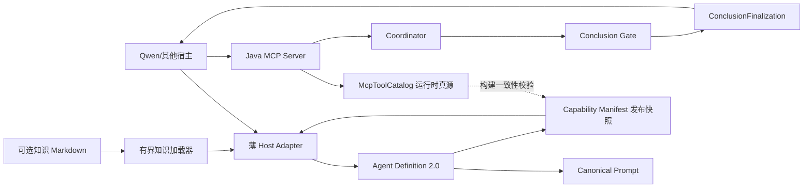
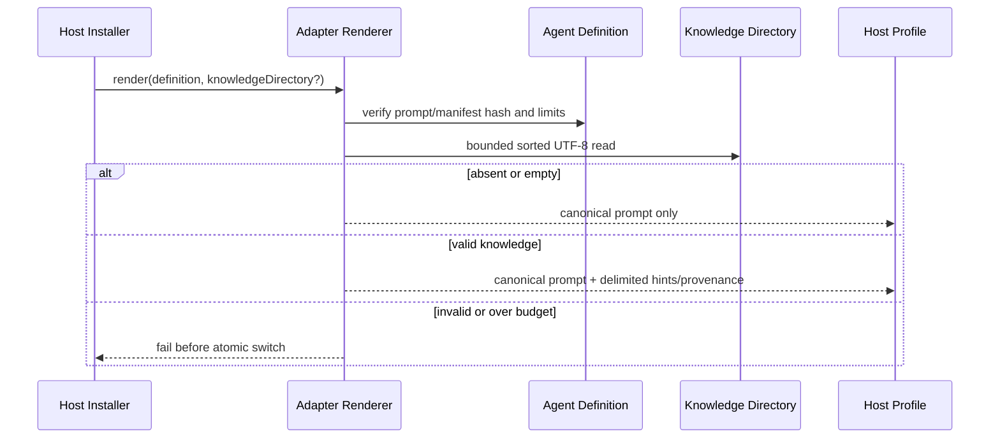
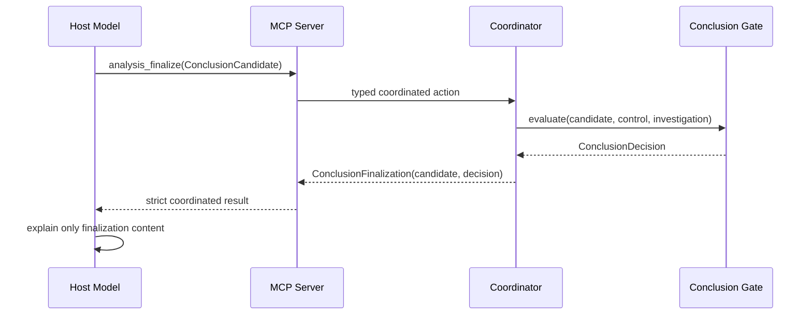

# 可移植 Agent 边界收敛与功能闭环可实施详细设计

- 文档状态：Implemented / Verified
- 设计版本：1.1
- 创建日期：2026-09-29
- 批准日期：2026-09-29
- 负责人：Algorithm Debug Agent Team
- 目标里程碑：MCP-native portable evidence-constrained subagent
- 关联需求：在不削弱证据门禁的前提下消除外围空悬配置、重复契约和宿主耦合
- 关联架构与 ADR：[可移植 MCP 子 Agent 设计](2026-09-25-portable-mcp-subagent-and-coordinator-design.md)、[ADR-018](../decisions/ADR-018-java-native-mcp-portable-subagent.md)

## 1. 背景与问题

当前 17 个 MCP Tool 已经统一经过 Coordinator，证据资格、三值观测、反证和结论等级也由 Java 确定性实现。
核心控制面没有“靠 Prompt 约束模型绕过门禁”的问题，但交付边界仍有三处不闭环：

1. Tool 名称同时出现在 Java `McpToolCatalog`、Capability Manifest 和 Agent Definition，虽然测试会检查一致，
   仍存在没有必要的第三份人工清单。
2. `knowledgeDirectory` 只检查目录是否存在，知识内容没有进入生成的子 Agent 指令；配置字段因此没有实际功能。
3. Agent Definition 声明独立 Completion Contract，Prompt 要求模型自行生成该 JSON；`analysis_finalize` 实际只返回
   `ConclusionDecision`，宿主又不强制校验最终模型输出。这形成了两套完成语义，并制造了“代码已保证最终回答格式”
   的错误印象。

此外，Agent Definition 把 MCP Resources 和 Prompts 声明为必需能力，并包含当前 Qwen CLI 不消费的
`defaultModelHints`。这些字段会缩小宿主可移植范围，却没有增加确定性。

## 2. 目标与非目标

### 2.1 目标

- 保留 Coordinator、Evidence、Predicate、Conclusion Gate、追加式归档和 17 个 Tool 的现有核心边界。
- Agent Definition 不再复制 Tool 清单；宿主工具权限只读取经过 Java Catalog 打包校验的 Capability Manifest。
- Resources 和 Prompts 继续由 MCP Server 提供，但只有 Tools 是宿主必须支持的能力。
- 可选知识 Markdown 被确定性、有界、可追溯地附加到宿主子 Agent 指令；缺失知识不影响闭环。
- `analysis_finalize` 返回不可变的 `ConclusionFinalization(candidate, decision)`；模型最终解释只能来自这个服务端
  结果，不再维护一套宿主无法强制执行的 Completion JSON。
- 所有新增边界具有严格 Schema、预算、失败语义和测试，且不引入新框架、数据库、队列或第 18 个 Tool。

### 2.2 非目标

- 不改变算法证据语义、成功/失败 UT 资格、CodePath/JDWP 采集或现有 Case 目录布局。
- 不实现第二个模型循环，不让 MCP Server 调用 LLM，不在 Java 中编码算法业务语义。
- 不为未知 DeepSeek Harness 猜测配置，不以自造宿主夹具宣称第二宿主兼容。
- 不删除 MCP Resources/Prompts；它们是可选便利能力，不是调查闭环的强依赖。
- 不让代码校验自然语言措辞；代码只校验模型提交的 typed Candidate 和返回的 Gate Decision。

## 3. 现状与约束

- Java 21、Maven、JUnit 5；Node 只用于宿主资产生成和 Eval。
- `McpToolCatalog` 是运行时工具、Action、typed input 和 Schema 的唯一绑定；Capability Manifest 是其发布快照，
  `McpPackagingTest` 必须在构建时逐项校验两者。
- `docs/sharing/` 是用户未跟踪资产，禁止修改、暂存或提交。
- Agent Definition、Prompt 和 Capability Manifest 都是版本化发布资产；破坏字段删除通过 `profileVersion=2.0`
  显式表示，不伪装为 1.0 兼容更新。
- 知识只允许影响假设和源码搜索方向，不能成为 Artifact、Evidence、Predicate Evaluation 或 Gate 输入。

## 4. 用例与验收标准

| 用例 | 输入/前置条件 | 预期结果 | 验证层级 |
|---|---|---|---|
| 无知识安装 | 未配置或目录不存在 | 正常生成 Agent，且没有知识段 | Unit/Installer |
| 有知识安装 | 目录包含 UTF-8 Markdown | 按相对路径稳定排序附加内容，返回文件、字节和 SHA-256 | Unit/Installer |
| 非法知识 | 非 UTF-8、符号链接、深度/文件数/单文件/总字节超限 | 生成失败，原安装目录不被覆盖 | Unit/Installer |
| Tool 权限 | Agent Definition 不含 Tool 名称数组 | Qwen `includeTools` 与 Capability Manifest 完全一致 | Contract/Packaging |
| 最小宿主 | 宿主只实现 MCP Tools | 可以注册并执行完整调查；Resources/Prompts 不作为前置条件 | Contract |
| Finalize 接受 | Candidate 通过 Gate | Tool data 同时返回原 Candidate 和 ALLOWED Decision | Unit/Integration |
| Finalize 拒绝 | Candidate 超出证据等级 | Tool data 保留 Candidate、REJECTED、allowedStatus、missingEvidence 和 allowedActions | Unit/Integration |
| 输出契约 | MCP `analysis_finalize` descriptor | outputSchema 严格约束 `ConclusionFinalization` data | Contract |

## 5. 总体方案



Java Catalog 决定运行时真实能力；Capability Manifest 只是可供安装器读取的稳定发布快照，构建测试阻止漂移。
Agent Definition 只声明 MCP Server、必需的 Tools 能力、发布资产哈希和知识交付预算，不再维护第三份 Tool 清单。
知识由 Adapter 在生成子 Agent 文件时附加，不进入 MCP Server 或 Workspace。结论由 Gate 生成最终化对象；宿主模型
负责面向用户解释，但没有第二套状态枚举和 JSON 完成契约。

## 6. 模块与类设计

| 模块/类 | 职责 | 输入 | 输出 | 依赖 |
|---|---|---|---|---|
| `agent-definition/algorithm-debug-agent-v1.json` | Agent Profile 2.0 元数据 | 版本化资产 | Prompt/Manifest/知识策略 | JSON Schema |
| `render-host-config.mjs` | 校验资产、读取 Manifest、装配宿主配置 | Definition、Manifest、可选知识目录 | 生成文件与知识 provenance | Node 标准库 |
| `loadKnowledgeHints` | 确定性遍历、预算和 UTF-8 校验 | 目录与 Definition limits | 不可变知识 bundle | Node 标准库 |
| `ConclusionFinalization` | Finalize 的唯一 typed 输出 | Candidate、Decision | 不可变闭环对象 | `ada-contracts` |
| `CoreActionHandlers` | 让 finalize handler 返回闭环对象 | `AnalysisFinalize` | `ConclusionFinalization` | Conclusion Gate |
| `McpToolCatalog` | 为 finalize 暴露严格 outputSchema | 通用 envelope + finalization schema | MCP descriptor | MCP schemas |

不新增接口层。知识加载只属于宿主渲染边界；Finalization 只属于协调契约。两者互不依赖。

## 7. 数据与契约设计

### 7.1 Agent Definition 2.0

- 删除：`allowedToolGroups`、`completionContract`、`defaultModelHints`。
- `requiredCapabilities` 只允许 `{ "tools": true }`。
- `capabilityManifest` 仍保存 path/version/SHA-256，Tool 权限直接来自其 `tools`。
- `knowledge` 增加 `delivery=PROMPT_APPEND` 与命名预算：`maxFiles`、`maxDepth`、`maxFileBytes`、
  `maxTotalBytes`。预算由 Definition 配置，但 Schema 还提供不可突破的硬上限。

这是明确的 Profile 主版本升级；当前只有本仓库 Qwen Adapter 消费旧字段，因此不提供双读分支，避免永久兼容代码。

### 7.2 ConclusionFinalization 1.0

```text
schemaVersion: "1.0"
candidate: ConclusionCandidate v2
decision: ConclusionDecision v2
```

构造时强制 conclusion ID、Analysis identity 和 based/evaluated revision 一致。ALLOWED/REJECTED 的证据等级、缺失项
和下一动作继续由 `ConclusionDecision` 表达，不新增同义状态字段。

### 7.3 知识 provenance

Adapter 内部返回：

```text
status: NOT_CONFIGURED | ABSENT_OPTIONAL | AVAILABLE_EMPTY | INCLUDED
files[]: relativePath, sha256, sizeBytes
totalBytes
```

只把相对路径、SHA 和内容写入生成的 Agent Markdown；不写知识绝对目录，不复制知识为 Evidence。

## 8. 核心流程





若 Gate 拒绝，调用本身仍是成功执行的门禁评估，但 `decision=REJECTED`；模型必须继续允许动作或如实结束为证据不足，
不得把拒绝伪装为 MCP 协议失败或已确认根因。

## 9. 错误处理与可观测性

- 知识配置错误以 `HOST_ADAPTER_RENDER_FAILED` 失败，安装器的 staging/previous 原子切换保留旧安装。
- 知识读取不做自动截断；截断会改变语义，因此任何预算超限都明确失败并要求缩小知识集合。
- 未配置/不存在知识是正常状态，不记录为错误。
- Finalization identity/revision 不一致在契约构造时失败；Gate 拒绝继续作为领域结果返回。
- MCP stdout 只保留协议数据；诊断继续走 stderr/现有 DFX，不输出知识正文。

## 10. 性能与容量预算

| 指标 | 默认值 | Schema 硬上限 | 超限行为 | 验证方法 |
|---|---:|---:|---|---|
| 知识文件数 | 32 | 64 | 拒绝生成 | Node unit |
| 目录深度 | 4 | 8 | 拒绝生成 | Node unit |
| 单文件字节 | 65536 | 262144 | 拒绝生成 | Node unit |
| 总知识字节 | 262144 | 1048576 | 拒绝生成 | Node unit |
| MCP 请求帧 | 1 MiB | `McpServerLimits.MAX_REQUEST_BYTES` | 协议拒绝 | MCP contract |
| MCP 结构化结果 | 1.5 MiB | `MAX_REQUEST_BYTES + 512 KiB` | 通用结果有界替代 | Java unit |

512 KiB 是 Coordinator 为 `ConclusionDecision`、`AnalysisControlView` 和结果信封保留的命名预算。
因此，一个能通过 1 MiB 请求帧进入 `analysis_finalize` 的 Candidate 不会在响应中被通用截断逻辑替换；超过
1.5 MiB 的其他工具结果仍执行既有有界替代。知识读取只发生在安装/渲染时，不进入每次 Tool Call 热路径。

## 11. 安全、隐私与无侵入性

- 不修改目标算法源码，不新增目标 JVM 权限。
- 拒绝知识目录中的符号链接和非普通文件，防止越界读取；只接受 `.md` UTF-8 文件。
- 生成文件不包含知识源绝对路径；日志和 stdout 不打印知识正文。
- 知识即使包含指令文本也只能影响模型注意方向；Coordinator/Gate 不读取它，因此不能改变硬门禁。
- 不新增第三方依赖。

## 12. 测试设计

### 12.1 单元测试

- `ConclusionFinalizationTest`: 接受一致 Candidate/Decision，拒绝 ID、identity、revision 不一致。
- `CoreActionRegistryTest`: `ANALYSIS_FINALIZE` handler data 是 `ConclusionFinalization` 且保留 Decision。
- `render-host-config.test.mjs`: 缺失、空、稳定排序、嵌套、UTF-8、符号链接和四类预算边界。

### 12.2 契约与兼容性测试

- `CoordinationSchemaTest`: Finalization v1 Java round-trip 和 JSON Schema 验证。
- `McpToolCatalogTest`: finalize output schema 接受真实 Finalization、拒绝缺字段/未知字段。
- `McpResultMapperTest`: 请求预算大小的数据可完整往返，超过结果预算的通用数据仍有界截断并保留 Control。
- `agent-definition.test.mjs`: Profile 2.0 不含三类空悬字段，Tool 清单只存在于 Capability Manifest。
- `McpPackagingTest`: Catalog = Manifest，Agent Definition/Prompt/Manifest/Finalization schema 均打包且有效。

### 12.3 集成与端到端测试

- Qwen TestProfile 安装、检查、重装、卸载继续通过。
- 真实 MCP initialize/tools/list/call smoke 继续通过，17 个 Tool 不变。

### 12.4 性能测试与 Agent Eval

- 本次不改变证据推理与采集策略，机制收敛 Eval 仍由阶段 8 Task 20 完成；不得把本次结构测试宣称为模型准确率证明。
- 知识总量预算通过边界测试证明不会无界膨胀宿主 Prompt。

## 13. 实施步骤

1. 先增加全部 Java/Node/Schema RED 测试并确认失败原因对应三个闭环缺口。
2. 升级 Agent Definition 2.0，删除空悬字段并让 Adapter 从 Capability Manifest 获取 Tool 权限。
3. 实现有界知识加载、provenance 和 Prompt 追加。
4. 实现 `ConclusionFinalization`、Core handler 返回和 finalize 专用 outputSchema。
5. 同步 Prompt、构建脚本、README、架构、ADR 和验证基线。
6. 运行受影响测试、根 Reactor、Node 全套、打包、MCP wire、Qwen TestProfile 和静态审计。

## 14. 兼容、迁移与回滚

- Case、Run、Evidence、Plan、Conclusion Candidate/Decision 归档完全不迁移。
- 17 个 Tool 名称和输入不变；`analysis_finalize.data` 从 Decision 扩展为 Finalization，是 Profile 2.0 的显式输出契约变更。
- Qwen Adapter 重装会重新生成 Agent 文件；旧 ownership 规则继续保护用户修改。
- 回滚时整体回退本次 Definition、Adapter、Finalization 和文档，不保留双版本分支。

## 15. 风险与待确认事项

| 风险/问题 | 影响 | 缓解措施 | 状态 |
|---|---|---|---|
| 模型仍可能在自然语言中强行解释 | 不能绝对保证措辞正确 | 结论事实仅来自 Finalization；机制 Eval 量化虚假确认 | Resolved by boundary |
| 知识中包含误导性指令 | 影响假设优先级 | Prompt 分区、provenance、硬门禁不读取知识、误导知识 Eval | Resolved by boundary |
| Manifest 与 Java Catalog 漂移 | 安装权限与运行时不一致 | Packaging test fail-fast；不再有第三份清单 | Resolved |
| 第二宿主真实契约缺失 | 不能宣称跨宿主已验证 | 继续阻塞原 Task 19，不猜测 | Open external |
| Completion JSON 删除影响未知消费者 | 只发现本仓库 Qwen Adapter 消费 | Profile 主版本升级；全仓引用扫描 | Resolved |
| 通用结果截断破坏 Finalization 输出 Schema | 合法 Candidate 可能被替换为截断占位 | 结果预算按请求上限加 512 KiB 控制信封预算推导，并以回归测试锁定 | Resolved |

## 16. 文档同步清单

- [x] 架构/ADR
- [x] Schema 与示例
- [x] README/CLI 使用说明
- [x] Mermaid 图
- [x] Prompt/Agent Definition
- [x] Eval 边界说明

## 17. 实现完成记录

- 实际变更：Profile 2.0 删除重复工具清单、模型提示和 Completion Contract；Capability Manifest 成为宿主权限
  唯一发布快照；Adapter 实现有界知识注入；`analysis_finalize` 返回严格 `ConclusionFinalization`；17 个 Tool
  名称、输入和 Coordinator 路径不变。
- 相对设计的偏差：提交前审计发现通用 768 KiB 结果预算可能截断合法 Finalization，因此将结果硬上限改为
  `1 MiB 请求预算 + 512 KiB Coordinator 响应开销`，并增加回归测试；该调整不改变工具、证据或门禁语义。
- 测试与命令：`mvn -Pcodepath-launcher test` 通过；全量 Surefire 1432 项、0 failure、0 error、11 skipped；
  Node/宿主/Eval 90 项全部通过；`scripts/build-agent.ps1` 返回 `AGENT_BUILD_OK`；Qwen TestProfile
  install/check/uninstall 全部通过。
- 性能结果：知识仍只在安装时读取；知识最大 1 MiB，默认 256 KiB；MCP 结构化结果保持 1.5 MiB 硬上限，
  不引入新常驻线程、数据库、模型调用或采集热路径。
- 已知限制：真实第二宿主和机制收敛 Eval 仍按原阶段 8 边界单独验证。
- 提交/版本：在当前根仓库与分支实施；提交记录以本次交付的 Git 历史为准。

## 18. 变更记录

| 日期 | 版本 | 变更内容 | 作者 |
|---|---|---|---|
| 2026-09-29 | 1.0 | 固定外围收敛、知识交付和服务端 Finalization 方案 | Codex |
| 2026-09-29 | 1.1 | 记录完成状态、验证证据，并闭环 Finalization 输出预算审计发现 | Codex |
