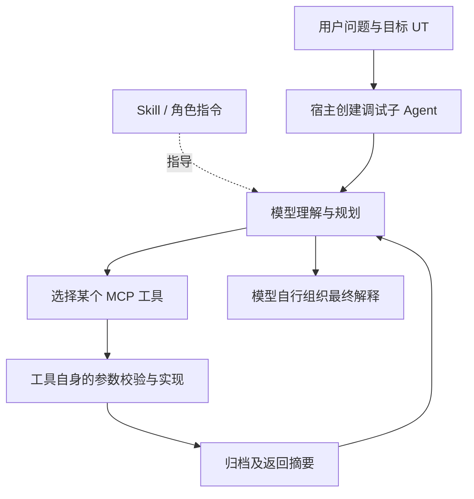
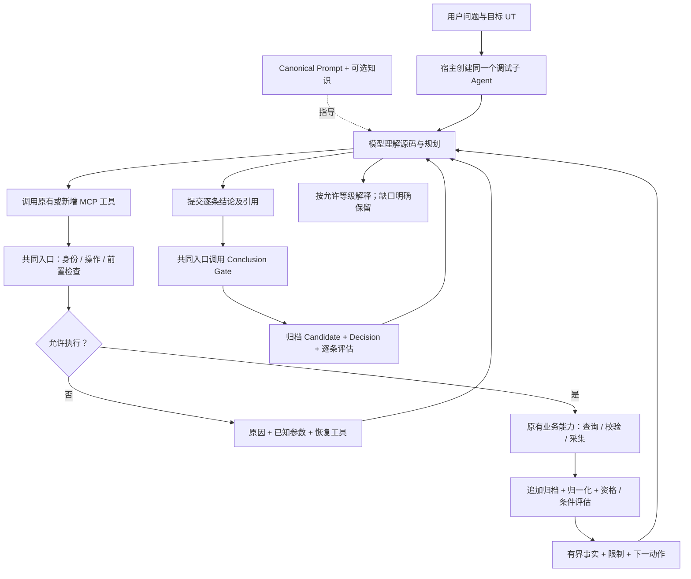
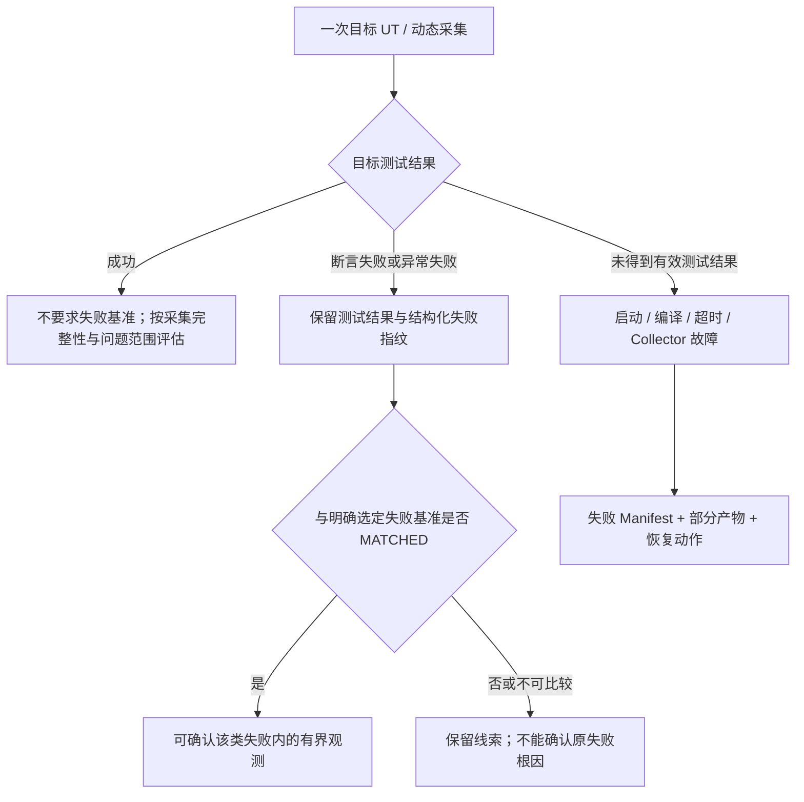

# 01 设计目标、作用与模型交互

- 状态：Approved / Implementing（本地；未完成验收）；版本：1.0；日期：2026-10-06。
- 关联：[交付包索引](README.md)、[详细契约](02-architecture-and-contracts.md)。

## 1. 需要解决的不是“工具不够多”

复杂算法可能有正确运行但业务结果异常的 UT。模型能够看见很多 Gantt、快照和源码，却仍可能只描述末端现象，把最醒目的方法当根因，或者换一次提问就换一种解释。

已有 Skill 可以提醒模型读源码、采集变量和核查反证，已有工具也可以校验参数、预算和数据。缺口在于：跨工具证据身份、调查进展、反证、重试和结论资格没有形成同一可恢复的闭环，模型容易把“调用成功”“看到了数据”“证明了根因”混为一谈。

本地已实现控制层，但审计还发现不必要的限制和实际恢复缺口。因此公司迁移不是照抄本地代码，而是实现下述经过修订的职责与契约。

## 2. 可验收目标与价值

| 编号 | 目标 | 价值与生效位置 | 验收 |
|---|---|---|---|
| G1 | 所有模型可见工具都经过共同调用入口 | 即使模型漏掉前置步骤，也不能直接进入采集实现；错误在执行前可见 | T01、T02 |
| G2 | 大算法源码访问有界、精确、可追溯 | 模型可按方法、调用方向和源码窗口追到上游，不依赖摘要排序碰运气 | T03、E01 |
| G3 | 正常 UT、失败 UT、工具失败分开处理 | 成功数据不因缺失败基准被丢弃；失败证据不跨失败类型强行确认 | T04、T05 |
| G4 | 同一证据缺口支持多次补采 | 不完整采集不会永久锁死；不为绕过状态机复制假设和 Gap | T06、T07 |
| G5 | 条件真假、假设影响、引用资格各自表达 | TRUE 不等于支持，FALSE 不等于反驳，可读不等于可确认 | T08、T09 |
| G6 | 模型收到事实、限制与具体恢复动作 | 拒绝不是一句报错；模型知道缺什么、用哪个已注册工具、带哪些已知参数 | T10、T11 |
| G7 | 逐条结论核查，而不是看全局文件数量 | 无关 Gap 不拖死合理解释；相关反证和无关记录不能被藏起来 | T12、T13、T14 |
| G8 | 并发、重试、取消、崩溃能够恢复 | 不重复启动 UT、不损坏账本、不泄漏目标 JVM，失败产物不丢失 | T15、T16、T17 |
| G9 | 公司扩展工具进入同一闭环 | 预检等已有价值保留，不因迁移成统一服务而倒退 | T18、T19 |
| G10 | 准确性与稳定性可测量 | 防止“统一降级成证据不足”被误当收敛，也防止工具通过被误当根因正确 | E01、E02、E03 |

非目标：不接管生产设备；不改目标生产源码加 Trace；不启动第二个模型；不强制固定采集轮数；不新建万能 MCP 工具；不引入通用业务因果证明引擎、数据库或工作流框架；不承诺 100% 相同措辞或 100% 根因准确。

## 3. 各部分到底是什么

| 部分 | 呈现形式 | 实际职责 | 不做什么 |
|---|---|---|---|
| 宿主 | Qwen/其他编程工具的模型会话与权限配置 | 创建子 Agent，执行模型选出的工具调用，显示结果 | 不拥有本项目证据资格规则 |
| 子 Agent | 宿主中的角色会话，不是另一台 Java 服务 | 理解问题、读源码、提出可检验解释、选择下一步、解释结果 | 不自行宣告 Evidence/Predicate 的确定性状态 |
| Skill/Canonical Prompt | 版本化 Markdown | 教模型如何分析、如何读结果、如何使用恢复提示 | 不作为安全或结论门禁的唯一实现 |
| MCP 工具 | 名称、输入/输出 Schema、描述与 Handler | 让模型发现并调用粒度明确的能力 | 不把工具数量当分析能力 |
| Coordinator | 服务内部的一组普通代码与策略，不单独暴露为 Tool | 每次调用检查身份、前置条件、操作身份、锁、结果与恢复 | 不选择算法根因，不决定模型思考内容 |
| 调查账本 | Case 内追加的结构化记录 | 保存证据需求、冻结条件、评估、反证与 Plan/Collection 关联 | 不保存一份可由模型任意覆写的“正确答案” |
| Conclusion Gate | 最终化应用服务调用的确定性评估代码 | 逐条解析引用，核查范围、限制、反证和请求等级 | 不把自由文本因果关系验证成数学定理 |

Coordinator 类似调用链中的前后置拦截，但本设计不依赖 Java AOP 框架。MCP Handler 必须调用共同 `execute` 入口，入口显式调用策略和实现；没有“先让模型调用 Coordinator，然后再调用其他工具”的步骤。

## 4. 修改前后总流程



这是公司现状的逻辑示意，不代表旧工具没有校验。缺少的是统一的跨工具调查和结论资格；最终解释主要依靠模型记住 Skill 和历史返回。



变化发生在工具服务内部，而不是把 MCP 工具藏掉。模型仍选择工具和分析方向；每次工具返回都提供服务器可复算的状态。最终化评估的成功不等于结论接受，模型也可继续补证据。

## 5. 一个完整例子

以下数值与代码为教学夹具，不是用户公司算法的真实证据。问题：输入允许某任务从 10 开始，实际却从 50 开始，为什么？目标 UT 成功。

```java
void refreshReadyTime(Task task) {
    task.readyAt = Math.max(task.inputReadyAt,
            task.predecessor.finishAt + task.transferDelay);
}
long chooseStart(Task task, Machine machine) {
    return Math.max(task.readyAt, machine.availableAt);
}
```

运行值：`inputReadyAt=10`、`predecessor.finishAt=20`、`transferDelay=30`、`machine.availableAt=10`、更新后 `readyAt=50`、结果 `start=50`。

旧方式可能正确追到 `refreshReadyTime`，也可能只看到结果 50 或 `chooseStart`，解释成“机器空闲时间把开始时间后移”。整改并不让 Java 自动理解业务；它让后一种解释不能拿一个无关 Evidence ID 就包装成确认事实。

| 轮次 | 模型动作 | 服务行为 | 模型真正知道什么 |
|---|---|---|---|
| 1 | 建立问题框架，确认任务身份，读取输入/Gantt | 固定 Case、UT、输入版本与分析身份 | UT 成功只表示测试未报告失败，不能证明开始时间符合业务预期 |
| 2 | 查询 `chooseStart` 的源码和调用者 | 返回精确签名、锚点、代码窗口、调用方向、解析限制 | 开始时间取 ready 与机器可用时间的最大值；还不知道谁贡献了 50 |
| 3 | 记录“哪一个输入贡献了 50”的证据缺口，创建窄采集 Plan | 冻结实体筛选、方法/投影、预算；若验证假设则冻结 Predicate 与效果映射 | 模型不能采集后再把条件换成总能支持自己的条件 |
| 4 | 调用采集工具 | 前置校验通过后执行目标 UT，归档记录并计算条件 | 收到同任务、同次调用的 `readyAt=50` 与 `availableAt=10`；机器解释被反证 |
| 5 | 如果 readyAt 投影缺失，调整 Plan 补采 | 原记录 UNKNOWN 保留，新 Plan/Collection 仍回答同一缺口 | UNKNOWN 是没采够，不是反证；不必复制 Gap 绕过状态机 |
| 6 | 追查 readyAt 赋值与上游变量 | 源码查询 + 必要的下一次值采集 | 运行事实是 `20+30=50` 对应的输入；跨次 UT 不伪装成同一调用 |
| 7 | 提交逐条结论 | 逐条核对值/位置/实体/调用/覆盖/相关反证 | 值是确认事实；源码公式是源码依据；“这就是业务缺陷”尚需业务规则 |
| 8 | 解释结果 | 返回可接受的有界解释与未解决项 | 可以说明最直接的程序机制和上游变量，不强行断言更上游的业务错误 |

这里“20+30 导致 50”的源码解释通常仍为 `SOURCE_INFERENCE`，不是因为数字对上就自动升级为确定性因果证明。若要确认业务缺陷，还需要适用业务规则及其可信验证结果；没有规则时，保留边界但仍提供有用的程序机制解释。

## 6. 成功、失败与工具故障



断言失败和异常失败是测试结果的分类，不是“有没有数据”的开关。失败前的 CodePath/JDWP 数据仍可能存在；是否能支持原失败结论取决于指纹、覆盖和引用范围。测试失败也不等于工具执行失败。

成功采集不要求额外跑一次普通 `run_test`。若成功 UT 的目标问题是结果异常，模型仍应分析成功输出。若模型要确认历史失败，而本次采集成功，则这次数据只能作为与历史失败不同的运行线索，不能偷偷改成“问题已经复现”。

## 7. 最终化与模型自主性

强约束：身份与输入一致、预算、安全、只读 Raw、证据不伪造、条件不可覆写、受控进程、合法引用与等级。

保留自由：先静态还是先动态、选择哪个上游变量、CodePath/JDWP 使用次数、是否引入假设、是否需要知识、是否先排查新方向。验证型采集需要冻结条件；探索型采集只需具体问题与窄范围，不要求编造两条假设。

模型可以不调用最终化就直接向宿主输出文字；标准 MCP 无法阻止宿主生成这段文字。正式成功结果必须引用已接受的服务端 Finalization；宿主 Adapter 能控制交付时应只把该结果作为正式报告来源。不能控制的宿主必须标为“门禁覆盖工具与 typed 结论，但不强制自然语言交付”，并在真实宿主 Eval 中验证是否越级。不能把 Prompt 写了“必须 finalize”说成代码已经强制。

新分析的正式结果还需完成 `case_audit`，确认最终化和证据档案完整；审计失败应报告归档限制，不能宣布正式成功。若继续恢复/调查，先产生新的合法候选与最终化，再执行审计；不是为了“最后一次 audit 后不准调用工具”而阻塞故障恢复。

## 8. 什么叫收敛

同一问题不要求完全相同的措辞或相同工具顺序。可接受的收敛是：关键程序机制、核心变量、适用范围、引用事实和未解边界相容；有证据时不会反复停在末端现象，无证据时不会硬确认。

确定性层保证相同输入与版本得出相同资格，不能保证不同模型必然选择同一假设。准确性与稳定性须同时看正确机制覆盖、错误归因、过度确认、无谓拒答和重复运行一致性，具体测量见 05。
