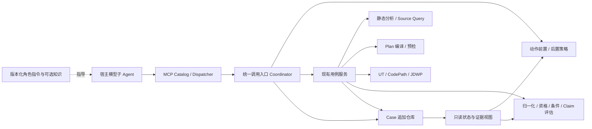
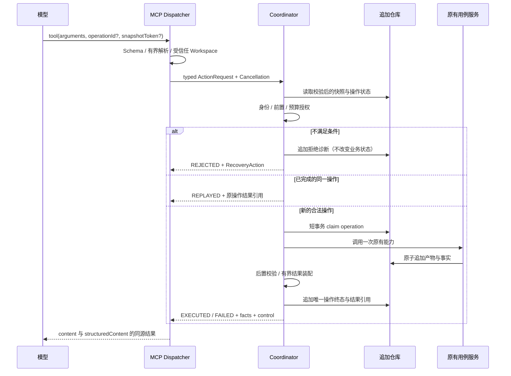
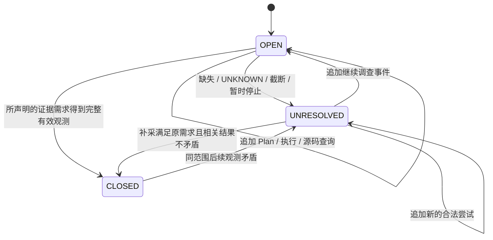

# 02 通用架构、契约与功能闭环

- 状态：Approved / Implementing（本地目标契约，非已发布协议）；版本：1.0；日期：2026-10-06。
- 关联：[目标](01-goals-and-interaction.md)、[本地映射](03-local-code-change-design.md)、[公司迁移](04-company-migration-guide.md)。
- 本文件定义目标契约，不表示这些字段已在本地实现。破坏性变化按第 14 节升级版本。

## 1. 最小架构及依赖方向

箭头表示调用或读取，不代表必须按一条固定分析顺序执行。Coordinator 只管理动作生命周期；业务能力继续由原有用例服务完成。契约层不依赖 Coordinator 实现；Collector 不依赖业务规则和宿主。

| 逻辑职责 | 所有权与输入 | 输出及消费者 | 禁止事项 |
|---|---|---|---|
| Catalog | 唯一工具描述、typed input、Handler、策略绑定 | Dispatcher、安装权限快照、契约测试 | 宿主手写另一份工具业务规则 |
| Coordinator | 调用上下文、Action、操作身份、只读快照 | 统一结果、操作记录、授权记录 | 编码算法业务语义或执行模型推理 |
| 调查应用服务 | 模型允许的命令、Plan 绑定、采集结果 | 追加事件与状态投影 | 模型直接写 Evaluation/假设状态 |
| Source Query | 已登记源码、方法目录、查询类型与预算 | 查询结果、精确锚点、解析限制 | 把调用图可达性当成运行时必经路径 |
| Plan 服务 | 采集意图、方法目录、调查绑定、能力与预算 | 不可变 Plan、预检报告 | 写 Collector 任意表达式或覆写旧 Plan |
| Collector / Harness | 已校验 Plan、目标测试、执行控制 | Raw、Manifest、stdout/stderr、退出状态 | 修改生产源码或把测试失败当进程控制异常 |
| 证据评估 | 只读 Raw/Derived、失败基准、冻结条件 | 可读性/覆盖/适用范围、Truth/Effect | 调用 LLM 或改写 Raw |
| Claim 评估 / Gate | Candidate、同一快照上的有界记录解析器 | 逐条评估、允许等级、Finalization | 只凭 ID 存在证明因果关系 |
| Host Adapter | 包版本、Catalog 快照、Prompt、配置 | 宿主子 Agent 与 MCP 注册 | 把宿主专属开关当服务端硬保证 |

公司可将这些职责实现为现有服务内部类/模块，不要求新增同名物理模块。只有存在至少两个真实调用方或需要替换外部边界时才提取接口；不要为每项职责建立空 SPI。

## 2. 统一工具调用的完整时序

只读业务工具也经过身份与资格入口，但不为了幂等而创建目标执行操作。诊断归档不改变控制快照。`REJECTED` 表示业务能力未执行；拒绝诊断本身可以归档。`FAILED` 表示已开始的动作失败或后置条件失败，必须保留已产生的产物。

所有动作通过注册表分派，不采用大 switch 混入每个工具逻辑。调用路径不依赖模型先调用状态工具；模型跳步时当前工具返回对应恢复步骤。

## 3. 身份、重试与状态快照

| 字段 | 定义与产生者 | 规则 |
|---|---|---|
| projectId / caseId / analysisId | 服务端登记的项目、输入 Case、分析轮次 | 任何引用必须解引用归属；历史复用必须显式记录来源 Analysis |
| planId | 服务端生成或校验的不可变计划 ID | 修改断点/投影/条件必须新 ID；不能写旧 Plan |
| runId / collectionId | 每次真实执行的唯一身份 | 同 Plan 的新 operation 是新执行；不能合并成旧 Run |
| operationId | 业务动作的重试身份 | 相同 ID + 相同 action/inputHash 回放；相同 ID + 不同输入拒绝 |
| transportRequestId | MCP JSON-RPC 请求关联 | 仅用于请求日志/取消；不得生成业务 Case 或幂等 ID |
| snapshotToken | 服务器计算的控制依据 SHA-256 | 用于调查写入和 finalize 的乐观一致性；不证明证据语义正确 |
| revision | 状态展示的递进位置 | 不单独作为授权凭据，不能用事件数加文件数判断身份 |

`snapshotToken` 对规范排序后的输入版本、已注册相关 Artifact 元数据、调查最后提交、操作业务终态及策略版本计算。排除日志、授权诊断、候选/最终化归档本身，避免评估自己的输出使 token 失效。文件总数和扫描顺序不能影响 token。相同快照必须得到相同 token。

读工具无需提交 token。带 token 的写入在短事务中重新读取并比较；不匹配返回 `STATE_CHANGED`，提供最新 token 和状态读取动作，不执行原动作。长采集只在启动前冻结依据，完成后必须允许追加其结果；不得因期间别的查询/合法调查导致 token 变化而丢掉已采数据。

模型可在写工具参数中提供 operationId；未提供时服务器生成并返回。宿主自动重试同一个调用应复用该 ID。若请求在收到服务端 ID 前丢失，不能声称具备 exactly-once：应先用状态工具查询近期操作，再由模型选择是否启动新操作。不得靠输入 Hash 自动去重，因为同 Plan 的第二轮真实采集也是合法需求。

`analysis_begin` 保留本地已有可选 existingCaseId，增加可选 operationId；没有 existingCaseId 时创建新 Case。同一个 begin 重试依赖 operationId 在项目级日志中恢复，不能在 Case 尚未创建时依赖不存在的 Analysis 日志。新分析轮次使用新 analysisId，历史证据仍只读。

begin 的 Case/Analysis ID 由服务端依据 workspace/project 命名空间与业务 operationId 稳定分配，以保持现有 ActionRequest 的完整身份，并在第一次项目级原子 claim 中记录。不使用 wire ID，不在重试时再随机分配身份。输入 Hash 对规范化业务请求计算，排除传输 ID、生成的 Run/Collection ID 与取消 token；相同 operation 的不同业务输入仍必须冲突拒绝。

写动作的操作日志同时保存有界 canonical input 文档及完整性引用，不仅保存不可逆 Hash；恢复需要从这里取得原 gapId、planId、baselineRunId 等参数。敏感配置用已登记 ID 引用，不能把凭据/无界业务输入正文复制进操作日志。

## 4. Gap、Plan 与多轮调查：只冻结历史，不冻结调查

### 4.1 定义

- Gap 是一个具体的**证据需求**，不是整项业务问题，也不是“一次采集”。例如“同任务在 chooseStart 同次调用中的 readyAt 和 availableAt”。
- Plan 是某次获取证据的不可变方法；同一个 Gap 可关联多个 Plan。
- Collection 是一次实际执行；同一个 Plan 可以多次执行，前提是新 operationId。
- Predicate 是验证某项解释前冻结的结构化条件及 Truth→Effect 映射；不是每次探索都必须具有假设。

`EvidenceGap v2` 增加不可变 `observationNeeds[]`（一至十六项）：复用方法身份、实体筛选和命名投影表达 METHOD_OBSERVATION、PROJECTION、SOURCE_LOCATION 三类需求。Gap 在创建时声明所需数据，例如同一任务的 readyAt 和 availableAt；Plan 编译检查覆盖这些需求。后续 Plan 可以改变获取位置/策略但不能缩减 Gap 的需求，从而避免只采一个容易命中的字段就把原问题“关闭”。需求发生实质变化必须新 Gap，不改旧文件。

SOURCE_LOCATION 需求包含精确方法和需读取的行窗口；source_query 增加可选 gapId，不填时仍是正常探索查询。归档成功后，StaticAnalysisApplicationService 调用 `recordSourceQueryEvidence(gapId, result)` 追加 SourceQueryLinked 事件，按实际窗口/Hash/限制计算需求覆盖；查询未覆盖完整窗口仍未关闭，下一查询可以继续。这条路径不生成运行时 Observation、不改变 HypothesisEffect。一个 Gap 的需求只选纯源码组或纯动态组，不让单次动态 Plan 承诺获取源码窗口。

METHOD_OBSERVATION 只要求所选方法有实际观测，允许计数型 AGGREGATE；需要顺序必须用 VERIFICATION 的 PATH_CONTAINS 等条件且采用 TRACE。PROJECTION 记录当前能力能表达的命名路径和实体范围；不同 Collector 路径不能等价验证时建新的关联 Gap，不能由代码猜“task.x”和“arg0.x”业务等价。

### 4.2 探索与验证

`InvestigationBinding v2` 保留 caseId、analysisId、gapId、hypothesisIds、predicateIds、basedOnEvidenceIds，新增 `purpose=DISCOVERY|VERIFICATION`。

DISCOVERY：hypothesisIds/predicateIds 允许为空；必须有具体 Gap 问题、对象范围、所选方法/字段与预算。采集后按 Plan 既有采集义务评估是否得到所需观测，不自动支持任何假设。没有证明原因也可以读取未知字段或路径。

VERIFICATION：至少一个已注册 Predicate；每个 Predicate 对应当前 Gap 和选定假设；必须在采集前冻结。对特定解释有决定作用的条件标为 CRITICAL，不要求每个辅助采集都人为创建 CRITICAL 条件。

`purpose` 用来消除空列表的语义歧义，不新增独立探索引擎。Plan 编译和收集仍是原服务。观察到某字段存在并不代表探索问题的业务含义已被证明。

### 4.3 状态与闭环

PLANNED/OBSERVED 不再是 Gap 的必经生命周期；它们属于 Plan/Collection 历史。旧状态在新读视图映射为未关闭需求，旧文件不改写。`UNRESOLVED` 是可继续状态，不是不可逆终态。

探索 Gap 的 CLOSED 只表示所声明的采集义务满足，验证 Gap 的 CLOSED 还要求相关关键条件得到完整、非 UNKNOWN 的可用评估。FALSE 也可以关闭证据缺口——它回答了问题，但可能反驳假设。所有 CLOSED 都不等于“根因已确认”。若需求变成另一个问题，创建新 Gap；不能改写旧 question。

新增 `LINK_GAP_HYPOTHESIS` 调查命令，用于已有 Gap/假设的关联。一个事件更新两侧投影，模型不能独立维护两份关系。`REGISTER_PREDICATE` 必须引用已存在的关联，服务端派生 Gap 的 predicateIds。没有该命令就不得让模型在采集之后伪造双向关联。

继续已有 Predicate 可调整断点、采样、投影位置，但不得修改条件、实体范围或效果映射。需要改变检验条件时注册新 predicateId，并显式 `supersedesPredicateId` 和理由；旧条件、评估及反证完整保留。替代仅代表新检验版本，不能让旧反证消失。

### 4.4 重复与冲突

相同 evaluationId/inputHash 精确重放不新增评估；同 ID 不同内容拒绝。选取有效观测以提交序列和明确范围为依据，不使用真实时间排序决定胜者。

较新 UNKNOWN 不覆盖此前完整结果；同运行/同实体/同条件的支持与反驳冲突必须作为矛盾保留。不同 Run 的结果首先分组：既不能混成同次调用，也不能仅因来自新 Run 就删除旧结果；候选若跨 Run 概括，必须覆盖这些差异。

账本投影的 Hypothesis SUPPORTED 表示其冻结检验得到支持，不意味着已经证明唯一原因。相同问题允许多个贡献原因。

## 5. Truth、Effect 与资格：三个概念不能合成布尔值

| 概念 | 值 | 回答的问题 |
|---|---|---|
| Truth | TRUE / FALSE / UNKNOWN | 声明的结构化条件在这组观测上是否成立 |
| Effect | SUPPORT / REFUTE / NO_CHANGE | 根据冻结映射，这个条件结果如何影响指定假设 |
| Evidence disposition | CONFIRMATION_ELIGIBLE / CLUE_ONLY / INVALID | 此次观测在声明范围能否作为确认依据 |

例如假设“机器可用时间不是瓶颈”，条件“availableAt 大于 readyAt”；FALSE 可以 SUPPORT，不能被 Gate 一律拒绝。UNKNOWN 固定为 NO_CHANGE。CLUE_ONLY 可以产生可读的 TRUE/FALSE，但不能应用确认性支持或反驳效果；INVALID 只得到 UNKNOWN。

`appliedEffect` 只由评估代码依据冻结 Predicate、覆盖和资格计算，模型不得提交。Reducer 与 Gate 共用一份效果解释逻辑，不再分别实现 TRUE/FALSE 的含义。

原 `EvidenceEligibility` 的可读性/完整性/基准/义务维度保留，不复活 evidenceUsable。`confirmationEligible` 仅表示证据具备使用资格，不代表任何使用它的陈述都正确。

## 6. UT 结果与失败基准

| 情况 | 归档/判定 | 模型可做什么 | 后续恢复 |
|---|---|---|---|
| 采集 UT 成功，问题针对该成功结果 | 基准 NOT_REQUIRED；按覆盖/完整性/谱系判定 | 使用有效记录解释成功运行 | 可继续读源码和补采，不要求普通 run_test |
| 原问题是某个失败，采集复现同类失败 | 明确选定 baselineRunId；结构化指纹 MATCHED | 确认该失败范围的有效观测 | 继续定位，不因测试退出非零丢掉采集 |
| 原问题是失败，采集成功或出现另一失败 | CHANGED；原始证据保留为线索 | 比较差异、提出新解释，不确认原失败 | 提示核查 UT 配置/条件，必要时新 Plan 或新 Analysis |
| 采集失败，未提供可比较基准 | INCOMPARABLE；作为线索 | 描述此次失败和观测边界 | 普通 run_test 建立所选失败基准；可对历史只读 Raw 新生成资格评估，不重写旧评估 |
| 启动/编译失败、Collector 崩溃、超时、取消 | 工具 FAILED；目标结果可能 UNKNOWN | 读取 Manifest/部分记录，不当成“目标算法异常失败” | 修正环境/Plan；新 operation 才能重新执行 |

collect 输入增加可选 `baselineRunId`，只接受同一 Case、明确可比较目标/输入/配置的普通失败 Run。不提供时不能静默选择“最新一次”失败基准；成功为 NOT_REQUIRED，失败为 INCOMPARABLE。基准身份必须进入 Collection 请求/资格 provenance，后续模型可见。

失败指纹需区分断言失败与异常失败及其结构化身份，不仅比较退出码、异常字符串或 Gantt 内容 SHA。普通 Run 与采集 Run 的 JVM/系统属性/classpath/测试选择是否等价必须记录；不能跨不同目标 UT 比较。

如果更晚出现失败基准，`evidence_query` 可返回“建议重评估”动作；实际重评估复用现有派生服务，经注册 Action 追加新 Evidence/Eligibility 版本。公司没有暴露该能力时不得给出不可调用动作，可采用新采集；是否新增重评估 Tool 由能力盘点决定，不在本地本批强行添加。

## 7. 源码访问与观测见证

Source Query 支持 METHOD、CALLERS、CALLEES、REACHABLE_PATH、SOURCE_WINDOW、SEARCH_SYMBOL；返回完整方法签名、模块内相对路径/行范围、源码 SHA、调用方向、距离、预算与 provenance。未解析、多态不确定和越预算必须显式给出 limitation。

现有 `SourceAnchor` 的方法身份与行范围继续复用；不能假设其自身已经包含源码 SHA。新增见证引用包含 `sourceQueryId + sourceSha256 + anchor`，SHA 从已归档查询结果/源码快照获得，不由模型提供的值独立证明。

新增 `ClaimWitness` 是**有界指针**，不是复制完整 Trace：

| 见证类型 | 必填内容 | 服务端如何解析 |
|---|---|---|
| OBSERVATION | evidenceId、collectionId、runId、recordLocator、selection、assertion | 在注册 Derived/Raw 索引范围读取记录，复核字段和值及覆盖 |
| SOURCE | sourceQueryId、sourceSha256、方法 anchor、窗口内行范围 | 复核已归档窗口和源码版本；不调用模型解析含义 |
| VALIDATOR | artifactId、规则 ID/版本、findingId、输入 Evidence IDs | 只接受服务端登记的确定性 Validator 产物，核查规则适用范围 |

OBSERVATION 的 recordLocator 是 typed 联合：`JDWP_EVENT(sequence,jsonlLine,tracepointId)`、`CODEPATH_INVOCATION(invocationId,eventOrdinal)`、`AGGREGATE_ENTRY(entryKey)`。`selection` 使用采集时存在的命名投影和稳定实体键；`assertion` 复用现有固定操作符，不执行任意 Java/脚本表达式。AGGREGATE_ENTRY 只能证明其记录的计数/分布，不证明调用顺序或同次调用值。

同次调用关系必须用 invocationId 或 JDWP 同事件身份证明；不同 Thread、不同实体、不同 Run 不满足。跨 Run 可比较的值保持各自 provenance，并在陈述中限定为多次运行观察，不能生成一个虚构执行轨迹。

不存在的关联字段不猜测补全。若当前 Raw 没有稳定实体/调用关联，返回 `ASSOCIATION_UNAVAILABLE`，保留记录并要求明确投影或降低陈述范围。不能为通过门禁拼接相邻 sequence。

Resolver 优先读取注册的 Derived 记录；必须回到 Raw 时按 Artifact 分组，一次有界流扫描解出本次候选的多个 locator，不能每条 witness 重新扫描整份 Trace。本次 finalize 总 Raw 解引用字节上限为命名常量 `MAX_WITNESS_RAW_BYTES_PER_FINALIZE=50 MiB`，Artifact 数上限 `MAX_WITNESS_ARTIFACTS_PER_FINALIZE=32`。超过返回受限资格与窄引用建议，不创建全量对象图或无界索引。

## 8. 逐条 Claim 与结论门禁

### 8.1 请求与输出

`ConclusionCandidate v3` 保留 identity、conclusionId、basedOnRevision、requestedStatus、claims、causalChains、unresolvedGapIds，新增 basedOnSnapshotToken。每个 Claim 保留既有五类 classification，新增 witnesses、relatedGapIds、relatedHypothesisIds；sourceReferenceIds/evidenceIds 等旧宽引用不再独立满足确认资格。

普通事实回答可使用空 causalChains 和空假设集合。解释因果的 Claim 需要引用对应 Chain；`CausalChain v2` 增加 targetHypothesisIds；每条关键 Edge 使用 witnesses 精确引用。不要为了证明一个值而编造整条因果图。

`ConclusionDecision v3` 增加 evaluatedSnapshotToken、claimAssessments、limitations、RecoveryActions。每条评估包含 claimId、allowedClassification、allowedStatus、acceptedWitnesses、factSummary、reasonCodes、relatedLimitations。factSummary 由服务端按已复核的 typed assertion 渲染，例如“任务 T 在 Run R 的调用 I 上 readyAt=50”；不会渲染“因此这是唯一根因”。Decision 可以 ALLOWED 且保留限制；“接受有界解释”不代表没有缺口。

Candidate.statement 是模型的有界说明，不是代码验证过的自然语言。正式确认事实只来自 Decision.factSummary/可信 Validator 结论；SOURCE_INFERENCE 等解释仍展示原陈述与分类。即使模型在 statement 中夹带“所以必然是根因”，也不能以 CONFIRMED 标记展示该附加句。原 Candidate 只读保留用于审计，不把一条通过 Schema 的自由文本直接变成已核验答案。

`ConclusionFinalization v2` 仍只拥有 candidate + decision。服务器不改写 Candidate；如果请求等级/分类超过允许值，返回 REJECTED 与具体受限 Claim，模型创建新 conclusionId 提交修订后的候选，不能覆写旧候选。

Finalization 始终要求 Candidate/Decision 的 conclusionId 与 identity 相同。ALLOWED 要求提交/评估 revision、snapshotToken 一致；STATE_CHANGED 的 REJECTED 则允许 Decision 记录实际新 revision/token，同时保留 Candidate 的旧依据，不能为了通过构造检查伪造二者相同。

Candidate-first 的恢复：同 conclusionId、相同 canonical payload 已有 Candidate 时读取原文，不重复创建；有 Decision 时直接回放。若 Candidate 已存在但 Decision 缺失，在锁内重新核对依据 token，仍匹配则完成评估；已变化则追加唯一 STATE_CHANGED 拒绝决策并建议新 conclusionId。禁止拿变化后的证据静默“补”出旧候选的确认决策。

### 8.2 计算次序与单一所有者

1. 在短事务中冻结完整的校验后快照，检查 identity/token；加载只读记录解析器，然后释放短锁。记录解析和图评估在不可变快照上完成，不在短写锁内扫描 Raw。
2. 逐 Claim 解析见证，确认值、引用范围、源码版本、覆盖与确定性 Validator 来源。
3. 对相关假设检查冻结条件的实际 effect、所有相关反证与冲突；不检查无关假设数量。相关集合由见证的 Plan/Gap/Predicate/实体范围向账本关系闭包派生，再与模型提交的 related IDs 合并，不能仅靠模型漏填 relatedGapIds 就藏掉已登记反证。代码无法判断自由文本“所有潜在解释”的完备性，不冒充全程序语义证明。
4. 对因果解释检查关键路径与见证范围。自由文本 relation 只能形成 SOURCE_INFERENCE/LLM_HYPOTHESIS，不能因为边连通且 ID 存在升级成确认因果。
5. 根据逐条 allowedClassification 和相关未解项计算 Candidate 的最高允许 status；不使用状态投影先计算的全局 terminalEligibility 再次封顶。
6. 在短锁内重新核对依据未改变，candidate-first 归档，再追加唯一 Decision，返回 Finalization。已变化则明确 STATE_CHANGED，不确认旧请求。相同候选精确重试回放；同 conclusionId 内容冲突拒绝。

`analysis_status` 只显示事实进展、相关限制和可调用动作；删除其全局 terminalEligibility 与永久空的 obligation 列表。唯一结论等级所有者是 Gate 的逐条评估结果，不新建第二套总分。

Control v2 的固定字段为 schemaVersion、policyVersion、identity、revision、snapshotToken、requestedAction、decision、reasonCodes、openGapIds、supportedHypothesisIds、refutedHypothesisIds、unevaluatedPredicateIds、allowedActions、limitations。较大的调查历史/操作回执在 status.data 中分页，不再塞进控制视图。RecoveryAction 的字段示例见 examples/tool-rejection.json。

| status | 严格含义 | 能否回答用户 |
|---|---|---|
| CONFIRMED | 请求范围内的实质陈述都是见证可复核事实或可信确定性规则结论，没有相关未解条件/矛盾 | 可以确认这些限定陈述；不能扩展成全局唯一根因 |
| BOUNDED_HYPOTHESIS | 有有效依据，但关键程序/因果解释仍含 SOURCE_INFERENCE 或 LLM_HYPOTHESIS，或相关范围不完整 | 可以给出有界机制解释和下一验证点；不是“全部数据不可用” |
| MISSING_EVIDENCE | 关键依据不存在、不可读、关联不能建立或无法形成有依据的解释 | 报告已知事实与缺口，不能硬解释 |

因此 CONFIRMED 在真实路径可达：不创建假设，仅提交“该任务这次调用 readyAt=50”的有效观测 Claim 即可。复杂根因不会仅靠这句话确认，程序机制解释可以合理返回 BOUNDED_HYPOTHESIS。对业务规则已有确定性 Validator 的公司能力，验证过的规则结论可确认；不存在时不创建占位规则引擎。

### 8.3 竞争解释不是固定数量门槛

不要求两条假设/一条反驳才准结束。只有 Candidate 声称排除某个已经记录、同范围且互斥的解释时，Gate 才检查其相关检验；多个非互斥贡献原因可以并存。

本批不新增“自动判断任意解释是否互斥”的语义引擎。无此确定性依据时，模型必须把“排他性/唯一根因”标为推断，并保留已记录的相关未决解释；门禁检查遗漏的已记录关联，无法证明模型已经枚举所有可能原因。评测必须检查明显遗漏与错误排除。

## 9. JDWP Plan 预检与公司扩展工具

已有预检工具保留；采集入口调用同一预检服务，而不是要求模型一定先调工具。

| 检查层次 | 可以确认 | 不能确认 |
|---|---|---|
| SOURCE | 方法/源文件/行范围/投影语法与配置安全 | 该行有可执行 bytecode 或运行一定命中 |
| BYTECODE | 编译产物存在、LineNumberTable 对应可执行位置、可检查的调试信息 | 动态加载一定成功、断点一定命中、值在所有路径都可见 |
| LIVE_BINDING | 本次目标 JVM 中 location 可安装、能力可用 | 后续一定命中或业务假设正确 |

新 `PlanPreflightReport v1` 包含 planId、planSha256、目标测试、source/build/classpath 指纹、collectorVersion、validationLevel、checks[]、overall=PASS|FAIL|UNKNOWN、limitations、provenance。每条 check 同样三态，UNKNOWN 不能写 PASS。

Plan 编译阶段强制 SOURCE 检查。BYTECODE 在采集已有 classpath/编译准备完成后强制执行：确定 FAIL 在启动目标 UT 前返回 `PLAN_NOT_EXECUTABLE`；调试信息不足等 UNKNOWN 不一律阻塞采集，但明确不能保证命中，采集 Manifest 保留该状态。LIVE_BINDING 由本次 Collector 安装断点时验证，不能为预检另跑一遍 UT。

复用报告必须匹配 planSha、相关源码/编译/classpath 指纹及规则/Collector 版本；仅“昨天 PASS”不能复用。执行前再次核对，来源改变则报告失效，更新目录/Plan；不能静默移动断点。

外露预检工具和内部强制检查用同一服务和缓存键。报告仅证明采集可执行性，不当成算法 Evidence。预检若启动编译/进程，按 TARGET_EXECUTION 管理；只检查文件但归档报告按 CASE_WRITE。不能因为名称有 validate 就按 READ_ONLY 放行。

本地没有独立 JDWP 预检 MCP 工具，本批只完善内部服务，不凭空增加同名工具。公司已有工具通过真实名称注册并共享该服务，具体适配见 04。

## 10. 模型反馈与错误闭环

统一结果 v2 保留 outcome、code、message、data、artifacts、control，增加 operationId（只读可空）、limitations、recoveryActions。每个恢复动作包含 toolName、arguments、requiredUserInput、reasonCode；arguments 只填已知身份/Plan/Gap/token，未知业务参数写入 requiredUserInput，禁止猜测。

RecoveryAction 由 Catalog + 拒绝/失败分类 + 最新快照生成。服务端测试必须确认工具存在、参数通过对应 Schema、当前可执行；没有可用工具时返回“需用户输入/外部修复”而非悬空名称。它是可执行建议，不自动启动新 UT，也不替模型选择业务根因。

| 结果 | 执行/保存 | 模型可见反馈 |
|---|---|---|
| EXECUTED | 能力执行完；目标 UT 可以失败 | 核心事实、Artifacts、Truth/Effect/资格、限制 |
| REPLAYED | 不再执行；回放原操作 | 原结果与不可变产物引用，不能只给 operationId |
| REJECTED | 未调用业务实现；可以保存拒绝诊断 | 稳定原因、缺失前提、参数/工具恢复建议 |
| FAILED | 已开始的能力失败 | 安全错误分类、部分产物、Manifest、可恢复边界 |

预期领域错误映射为这些 typed 结果，cause 留在 Case DFX，不泄露绝对敏感路径。非法 MCP 消息/参数仍是协议错误；未知程序异常返回脱敏 internal error 和诊断 ID，不能伪装成“证据不足”。

MCP `content` 的文本 JSON 与 `structuredContent` 来自同一个不可变结果；不允许 structuredContent 有恢复内容而文本只显示一句成功。大型数据在工具用例层生成有界摘要并注册完整 Artifact，`artifact_read/evidence_query` 继续分段读取，不把无界对象塞给模型。

Finalize 的 candidate/decision 不做静默截断。提交前检查最终化预算；过大请求明确拒绝并建议缩小陈述或使用已归档证据指针。

## 11. 执行安全、锁与追加恢复

### 11.1 两种锁，固定顺序

项目级 TARGET_EXECUTION 锁覆盖编译/启动/采集/进程清理，避免同项目 UT 并行污染产物。Analysis 短写锁覆盖“读最新账本→计算序列→校验事件→原子提交”。共享 Case 输入/Artifact 登记使用 Case 短写锁。

需要同时持有时固定顺序：Project target → Case write → Analysis write。不能持有 Case/Analysis 锁等待 Project 锁；不能在整个 UT 期间占住短写锁。只读查询使用已提交不可变视图；独立 Analysis 可并行做静态查询。

### 11.2 事务粒度

新调查写入采用一个不可变 batch 文档原子提交一批事件，包含 firstSequence、lastSequence、events、inputHash、operationId、previousCommitSha。批内所有事件先回放验证，提交后才对读者可见。读取器兼容旧逐事件文件，但严格检查重复序列、缺口和版本；不能靠忽略坏文件继续确认。

一次采集跨多个产物不是分布式事务。Manifest/产物登记和调查应用分阶段追加；若 Raw 已提交而 Evaluation 未提交，操作标 UNCERTAIN 或明确 POST_PROCESSING_FAILED。恢复使用新的 recovery operationId，读取 Raw/Manifest，按 inputHash 幂等追加派生/评估，返回 recoveredFromOperationId 与恢复结果；不重新执行 UT。原操作既有 UNCERTAIN/FAILED 终态不修改、不再追加第二个相反终态。尚无终态的崩溃操作先记录 UNCERTAIN，再启动恢复操作。状态视图显示恢复关联，模型读取新结果，不把历史失败抹成成功。没有可证明恢复条件时保留 UNCERTAIN，禁止后台盲重试。

新增恢复行为放在 `analysis_status` 的现有能力中：可选 `inspectOperationId` 查询结果；可选 `recoverOperationId` 执行**仅归档/派生恢复**，两者互斥。恢复调用自身使用独立 operationId，在 MCP 工厂映射到内部 `ANALYSIS_RECOVER_OPERATION` Action 和 CASE_WRITE 策略，不增加 MCP 工具名称。普通 status 保持只读；不得伪装为只读查询而偷偷补写。公司已有专门恢复工具则可保留名称、共享同一恢复服务，不必增加重复入口。恢复还需覆盖“Source Query已归档、SourceQueryLinked未提交”的情况：按原canonical input与结果引用幂等补关联，不再次查询或重跑UT。

### 11.3 取消与资源所有权

公共 `ExecutionControl` 位于契约层，仅提供取消状态、检查和注销式回调注册，不依赖 MCP/ada-core；Core 的 ActionCancellation 通过适配传给 Harness/Collector。

每个真实进程 Handle 注册幂等终止回调，并在 finally 注销、等待 stdout/stderr 排空及清理。Server 停止先取消活动动作再等待有界清理。超时/取消写 Manifest 与 operation 终态。无法确认进程退出不能释放目标执行所有权后宣称安全，应返回 CLEANUP_INCOMPLETE 并阻止该项目的新启动，直到状态恢复检查确认残留已清理。

进程启动后追加归属记录（projectId、operationId、PID、进程开始身份、命令配置指纹），清理后追加结果；不得只依赖内存 Handle。新启动在项目锁内检查尚未确认清理的归属记录。Server 重启可核对同一归属进程是否已退出，无法核对则拒绝新启动并要求人工处理，绝不按复用 PID 杀其他进程。常规取消只终止自己仍持有的可信 Handle；仅归档恢复不承担任意 PID 清理。

启动前先原子登记 STARTING 租约；若在 ProcessBuilder 返回与 PID 归档之间崩溃，不能因缺 PID 当成从未启动。该极窄窗口返回 TARGET_STATE_UNCERTAIN、保留源码/证据查询能力，要求人工核查后通过受控维护流程重建派生租约索引，禁止模型自动删记录放行。取消回调注册与取消状态必须原子协调：注册时若已取消立即调用清理，不能错过“检查后、启动后、注册前”发生的取消。

继续使用现有 ProcessSupervisor 的进程树清理，不新造进程框架。明确“执行完成但响应丢失”与“取消发生在执行中”，避免已成功归档的结果被取消标记覆盖。

## 12. 宿主能力、知识与隐私

工具业务身份来自可信注册 Workspace，而不是模型提交绝对路径。Roots 能力存在时校验登记模块与 Roots；能力不存在时使用启动配置的冻结模块根。Roots 存在但冲突必须拒绝，不能自动忽略。

Tools 是必需能力；Resources/Prompts 为可选便利。宿主必须实际验证子 Agent 权限仅包含发布 Catalog，不得同时开放未协调的旧采集工具形成旁路。若宿主允许任意 shell 执行，同名 MCP 门禁不能阻止模型另启 UT，应在适配说明中明确限制或降级保证。

Agent Definition 格式不变时本地 Profile 2.0 可保留；Prompt 的 version 升为 2.0 并更新 SHA。Capability Manifest 的名称结构不变且工具未增删时无须机械升版，仍需 Packaging test 对齐 Catalog。业务 Schema、后端二进制、Prompt、Adapter 同包发布；不能把旧 Prompt 与新 Truth/Effect 或 Finalization 混装。

可选知识由 Adapter 有界加载、记录来源/适用条件/失效条件与哈希，只用于术语理解和查询方向；不能作为 Evidence 或 Gate 输入。无知识可完成核心流程；误导知识须进入 Eval。

Raw 与证据路径仅返回模块/Case 相对路径，路径检查拒绝越界和不受信符号链接。stdout 仅 MCP 协议；DFX 不打印凭据/知识正文/无界对象。无新增第三方依赖。

## 13. 容量预算与超限动作

以下为目标命名预算。新增传输预算须在本地常量、Schema/序列化测试中统一，不散落数字；公司预算可配置，但不得突破其部署硬上限。

| 命名预算 | 目标值/来源 | 超限行为 | 验证 |
|---|---|---|---|
| MAX_REQUEST_BYTES | 保留本地 1 MiB | 参数/帧拒绝 | T20 |
| MAX_RESULT_BYTES | 保留本地 1.5 MiB，改为包含 content 的完整工具结果预算 | 不输出超限帧 | T20 |
| MAX_INLINE_TOOL_RESULT_BYTES | 新增 128 KiB，普通结果建议远小于上限 | 查询在用例层分页/引用完整 Artifact | T20 |
| MAX_CONCLUSION_CANDIDATE_BYTES | 新增 64 KiB | 在产生候选前拒绝过大请求 | T20 |
| MAX_CONTROL_RESULT_BYTES / MAX_CONCLUSION_DECISION_BYTES | 新增 32 KiB / 16 KiB | 输入集合/状态分页预算提前校验，不能截断最终化 | T20 |
| MAX_WITNESSES_PER_CLAIM | 新增 16；每次解析只读取引用记录 | 拒绝无界候选 | T12、T20 |
| MAX_OBSERVATION_NEEDS_PER_GAP | 新增 16 | 创建/Plan编译拒绝 | T06、T07 |
| MAX_PREFLIGHT_CLASSES / MAX_PREFLIGHT_OUTPUT_BYTES / MAX_PREFLIGHT_DURATION | 新增 20 / 1 MiB / 30秒；总预检时间同时受采集剩余超时预算约束 | UNKNOWN或安全失败，不无限调用javap | T18、T21 |
| Collector 事件/命中/对象深度/字节/超时/队列 | 保留各现有 Plan 与 Collector 的有界默认及硬上限，03 定位其文件 | 原有 truncate/abort + 明确 limitation | T21 |
| 目标执行锁等待 | 保留本地默认 5 秒 / 硬上限 1 分钟 | TARGET_BUSY + 状态查询，不自动排队无限等待 | T16 |
| Server 清理等待 | 保留默认 10 秒 / 上限 30 秒 | CLEANUP_INCOMPLETE；登记残留、阻止新启动 | T17 |
| 知识文件/总字节 | 保留默认 32 文件 / 256 KiB，总量硬上限 1 MiB | 安装前失败，不截断知识含义 | T22 |

128 KiB 的同源 JSON 两份远小于 1.5 MiB 帧预算，但测试仍按最终 UTF-8 序列化字节测量（中文、转义、字段开销均计入）。Finalize 先限制 Candidate，再保证 Decision/Control 的固定上限；多条限制的完整列表归档，模型结果提供数量、影响的 Claim 与分页引用，不能隐瞒影响最终等级的原因。

本批不增加采集事件/暂停预算，不宣称性能提升。新增开销以冷/热源码查询、状态重建、预检、逐见证解引用的重复基线测量；验收阈值在 05 规定。

## 14. 版本与兼容

| 契约 | 当前本地 | 目标 | 破坏性变化 |
|---|---|---|---|
| InvestigationBinding | v1 | v2 | purpose、探索空假设/条件、多个 Plan |
| EvidenceGap / Hypothesis / Predicate / Investigation event/state | v1 | v2 | 关系命令、可继续状态、条件替代关系、批提交投影 |
| CodePath Plan | v7 | v8 | 绑定 v2；插桩/TRACE/AGGREGATE 行为不变 |
| JDWP Plan | v6 | v7 | 绑定 v2；断点/命中/投影语义不变 |
| CodePath Manifest / JDWP Manifest | v5 / v3 | v6 / v4 | 预检/基准引用与执行控制结果；Raw不变 |
| CodePath / JDWP Collection request | v2 / v2 | v3 / v3 | 所选baseline/预检来源；CodePath SPI请求同步类型升级 |
| CausalChain | v1 | v2 | 关联假设、逐边见证 |
| Candidate / Decision | v2 | v3 | 逐条见证与评估、快照 token，普通事实不要求 Chain |
| Finalization | v1 | v2 | candidate/decision 新版本 |
| Coordinated result / Control view | v1 | v2 | RecoveryActions、去掉全局终态上限与空义务字段 |
| PlanPreflightReport / InvestigationCommit | 无 | v1 | 新增不可变归档契约 |
| MCP 参数 Schema | v1 | v2 发布资产 | 可选 operationId/token、调查/最终化新结构；工具名称不因此改变 |

当前版本需以 03 的 Schema 文件核对；公司自己的版本号独立升级，不能硬改成这里的数字。版本变更须先严格 Schema、再 DTO、再读/写适配、再宿主资产发布。Raw Trace、Invocation、快照 Schema 本批不改，新增见证引用只读取已有字段；关联不足返回限制，不伪造 Raw。

旧档案只读兼容：旧资格缺失保守未知；旧宽引用只支持历史浏览/有界解释，不能伪造 v3 确認见证。旧 Plan 可用显式转换服务生成新 planId 和 `migratedFrom`，但冻结条件必须能够无损读取；不能自动放行旧 Plan 绕过绑定/预检。迁移输出另存，不回写历史。

回滚安装入口与二进制/Schema/Prompt 同一版本包；旧服务不能对新写格式的 Analysis 继续写。新档案保留，旧版继续既有旧 Analysis 或另建新 Analysis；不得删除新证据来“完成回滚”。
