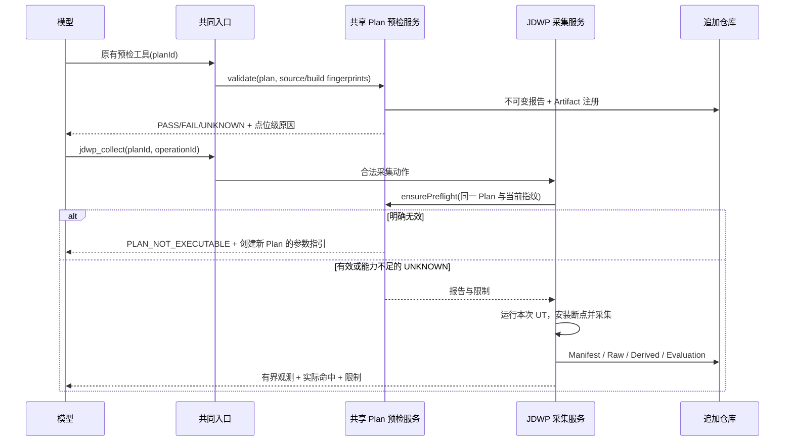

# 04 公司版本整改实施指南

- 状态：迁移设计已交付，公司实施须先完成真实能力/文件映射；版本：1.0；日期：2026-10-06。
- 已知：公司是 Skill + 多 MCP 工具，含 JDWP Plan/断点可用性校验；交互逻辑与初始版本相同。
- 未知：公司真实 Catalog、字段、语言、目录、归档格式、校验覆盖、宿主版本。本文件不假定与本地相同。
- 必须连同 [02 契约](02-architecture-and-contracts.md)、[05 测试](05-tests-and-acceptance.md) 使用。

## 1. 公司需要改什么，不需要改什么

保留：宿主模型子 Agent、已有 Skill 内容中的算法方法论、MCP 工具名称/粒度、已有 JDWP/CodePath 采集实现、已有预检工具、领域知识和已经有效的测试。

改造：在服务端全部 Handler 的共同入口实现确定性协调；归档拥有统一证据身份；追加调查记录支持恢复；模型结果具有具体限制/恢复指引；正式结论通过逐条资格评估。

补足：没有的方法/调用关系/源码窗口查询、调查状态与最终化接口，按能力缺口添加。不是每个公司版本都必须新增同一组四个名字，更不是改到 17/18/19 个工具就算完成。

公司只需要复用本地**职责、语义和测试要求**。不直接复制本地包名、Schema 数字、未通过真实验证的代码，也不先删除公司额外工具再重做。

## 2. 第零阶段：盘点产物是实施输入

先在公司仓库产出 `docs/refactor/company-capability-inventory.md` 和 `company-file-map.json`。名称可按公司的约定调整，但文件必须实际提交评审，不能只口头说“已对齐”。

| 盘点项 | 必须记录 | 不能采用的替代 |
|---|---|---|
| 所有模型可见工具 | 实际 name、Schema、入口文件/类、Handler、调用链 | 仅从 Skill 的列表推断实际暴露工具 |
| 副作用 | 是否写文件、编译、启动 JVM、attach、修改目标目录 | 根据工具名称判定 read-only |
| 输入身份 | UT 选择、项目来源、Case/Plan/Run/Analysis 的实际字段 | 假定本地 caseId 字段都存在 |
| 输出与归档 | stdout/stderr、Manifest、Raw/Derived、引用/校验、失败返回 | 只看成功截图 |
| 前置/后置 | 哪些代码真正校验、哪些只是 Prompt 提醒 | 把 Skill 指令当确定性门禁 |
| 额外工具 | 能力、已有测试、是否与另一工具共享服务 | 为对齐本地工具数量删除 |
| 宿主 | 实际版本、MCP Tools/Roots、子 Agent 权限、模型能看见的返回字段 | 假设 useStructuredOutput/useCleanContext 在任意宿主生效 |
| 质量基线 | 真实复杂 Case、已知机制、现有答案与成本 | 用本地教学 Case 代替公司业务验收 |

`company-file-map.json` 至少包含 logicalResponsibility、existingPaths、existingToolNames、changeKind（REUSE/WRAP/REFACTOR/ADD）、inputVersion、outputVersion、owner、tests。unknown 必须明确标为未映射，相关阶段不能开工；不影响已盘点模块的测试准备。

盘点完成才可以给出公司精确文件修改清单。本文已经给出可执行的映射方法，不会为填满表格编造公司类名。

## 3. 按职责映射，不按名字匹配

| 目标职责 | 公司找到已有能力时 | 未找到时 | 完成证明 |
|---|---|---|---|
| 共同 MCP Dispatcher | 改共同调用入口，不复制每个 Handler 的门禁 | 提取一个显式执行入口，所有 Tool 绑定它 | 任意工具直调均无法绕过；T01 |
| Case/Analysis/Operation 追加仓库 | 用现有归档服务扩展契约/短事务 | 在现有后端补最小文件追加仓库 | 重放/并发/崩溃；T15、T16、T23 |
| Source Query | 适配现有源码读取/调用关系工具，返回精确锚点和限制 | 增加有界源码工具 | 模型从末端追到上游；T03、E01 |
| 调查更新/状态 | 使用已有接口，禁止模型设置评估状态 | 增加对应 MCP 工具与服务 | Gap 多 Plan、Truth/Effect、恢复；T06—T11 |
| Plan 校验 | 保留现有工具，服务被采集入口复用 | 先用现有编译器安全检查，按实际能力补 BYTECODE | 外露/内部结果一致；T18 |
| Evidence 读取/资格 | 复用技术 Validator 与原始证据 | 补覆盖、基准和有界查询 | 成功/失败/线索不混淆；T04、T05 |
| Claim/Gate | 将已有结束/报告工具升级，保留名称 | 新增 finalize 工具 | 逐条见证、正常事实可确认、因果有界；T12—T14 |
| Host Adapter | 使用现有安装脚本注册唯一入口与规范角色资产 | 补薄适配器，不搬业务规则到脚本 | Tools-only/权限/实际反馈；T19、T22 |

公司代码是 Java 时：可以复用 03 的模块职责，保持 Java 21、Maven/JUnit 5 和现有 Adapter SPI。公司已有稳定 Node/Python MCP 服务时：共同入口可在原语言实现 typed dispatch + 调用确定性后端；不为了本设计强制重写整个服务。协调身份/状态只允许一处拥有，不能 Node 和 Java 各保存一套。

默认选择原后端最接近用例执行的一处作为 Coordinator 所有者。MCP 层只转 typed request，不同时实现另一套资格/锁规则。迁移期间旧入口可用于 A/B，但不能在正式调试子 Agent 中与新入口同时开放。

## 4. 公司新增工具如何接入

每个工具注册一个描述符：实际 toolName、Action key、typed input/output Schema、Handler、前置/后置策略、sideEffect、能力与预算、错误映射。Action key 使用明确常量/枚举；公司新增能力可以扩展自己版本的 Action 枚举与 Catalog，但策略实现不能依赖工具总数，也不把未知字符串当放行指令。

注册测试自动遍历 Catalog，验证 Schema、Handler、策略、权限、结果适配与 Eval 都存在。新增工具不修改 Coordinator 主执行流程；如果改变副作用/证据语义，则调整相应策略或稳定契约。不要在 Coordinator 里面为第 18、19、20 个工具逐个写业务分支。

| 扩展工具实际行为 | 推荐策略 | 与模型关系 |
|---|---|---|
| 读取已归档资料，无业务写入 | READ_ONLY | 可反复调用，结果有界且可追溯 |
| 校验 Plan 并写预检报告 | CASE_WRITE | 明确返回可执行性与 limitation，不支持算法根因 |
| 编译、执行测试、拉起调试或 attach 目标 | TARGET_EXECUTION | 项目互斥、操作日志、取消与清理 |
| 验证算法业务规则 | 按真实副作用分类，输出登记的 ValidatorFinding | 规则版本/适用范围必须核查，才能作为 VALIDATOR_CONCLUSION |
| 生成解释文本或报告 | CASE_WRITE / FINALIZATION 既有策略 | 不能绕过 Gate 自封 CONFIRMED |

不保证未知扩展工具能不改任何代码直接插入；保证的是扩展位置清楚、不会为接入工具重新设计整个控制系统。公司真正的新领域能力必须有自己完整契约与测试。

## 5. 公司 JDWP 预检：保留价值，补强闭环

实际工具名称用盘点结果填写，下图中的“预检工具”只是职责称呼。



模型可以先调用预检，提前修正问题；也可以直接 collect，此时内部共享预检仍生效。不要用一个“必须先调用 validate 的布尔标记”代替当前 Plan/源码/编译指纹核查，因为那会接受过期报告。

失败返回必须具体到 tracepointId/方法 descriptor/所选行及原因：行不是可执行位置、调试信息缺失、类找不到、超出方法范围、投影不支持等。建议新位置只有代码能够确定时才给出，否则要求模型读取源码/可执行行信息，不让服务猜断点。

PASS 只表达所列层次检查通过，不表达业务路径一定命中。UNKNOWN 若来自 bytecode 信息不足，应保留运行期验证；确定不安全/无效的 SOURCE 检查不能放过。LIVE_BINDING 失败保留本次日志，不把原 UT 随意再跑一遍。

其他新增校验工具采用同样原则：保留原工具用于提前反馈；关键必需检查由消费该结果的用例入口共享；校验产物的 producer→consumer→失效→恢复链路写清，不让模型承担“记住刚才检过”的唯一责任。

## 6. 公司实施顺序与边界

1. 盘点真实 Catalog、路径、归档和宿主；冻结旧版本复杂 Case 基线。
2. 在原 MCP 共同入口接入身份/结果/操作/安全协调，先保持业务实现不变。
3. 统一追加仓库与短写事务，修复成功/失败资格；保留原始数据和差异日志。
4. 接入源码访问和可继续调查；探索不被假设数量门槛阻塞。
5. 接入逐条见证与 Finalization；旧自由文本结束工具不能继续自封确认性结论。
6. 所有公司扩展工具逐项注册并验证；预检服务内部强制共享。
7. 更新角色指令、权限与安装资产，真实宿主验证内容可见及无旁路。
8. 完成重复质量 Eval、性能、故障注入与审计后再切正式入口。

阶段间可以使用测试 profile/A-B 环境，不在正式模型调用路径保留永久 dual mode。影子评估只读取同一旧调用产物，不再运行 UT/Collector，也不生成第二份可用事实源。正式切换后，非法身份/预算/重复执行等安全规则不得提供“临时跳过”开关。

## 7. 旧数据与回滚

公司旧证据可能没有完整身份/指纹/关联。兼容读取可以展示，不能推断缺失字段、不能借本地 Schema 自动升级为确认级。迁移创建新分析/计划/派生产物并记录 migratedFrom；源文件保持只读。

回滚单位是后端+Schema+角色资产+宿主配置的同一发布包。旧服务不能读写新格式时，用新服务只读保留新档案，旧服务对旧档案或新 Case 工作；不要删除新档案。回滚原因/影响/剩余风险在发布审计记录。

## 8. 公司模型实施指令

可把下面的指令与整个设计包放入公司仓库；这是一份实施约束，不代替公司代码盘点和设计审批。

```text
请先阅读仓库 AGENTS.md 和本设计包 README、01—08。
本轮先做公司版本盘点，不假定工具数量、名称、字段、目录与本地相同。
输出 company-capability-inventory.md 和 company-file-map.json：逐项关联
真实 MCP Catalog/Schema/Handler、归档、Validator、进程、宿主和现有测试。
保留公司现有扩展工具，特别是 JDWP Plan/断点预检；说明如何由外露工具
和采集入口共享同一服务及有效性指纹，严禁删除后倒退为运行时报错。
按职责映射 02 的契约和 03 的修改范围，给出公司实际文件/类/接口/调用者。
发现冲突先更新设计和评审，禁止编造空实现或绕过条件来适配。
设计经批准后才实施：每个任务先补 RED 测试，证明能复现缺口，再最小实现、
重构和验证；新增接口必须同时有真实生产者、消费者和失败恢复。
不得新增第二个 LLM、万能工具、固定采集轮数、任意表达式执行或修改生产源码。
成功 UT 不要求失败基准；失败只按所选结构化指纹判定同类失败确认资格。
调查可继续，Truth/Effect/资格正交；逐 Claim/Edge 解引用，不用 ID 存在证明因果。
CONFIRMED 事实只展示服务端 canonical factSummary；自由文本解释按来源分级。
完成后执行根测试、真实动态采集、MCP/宿主 E2E、复杂 Case 重复 Eval，
逐项记录通过、失败、跳过、未验证，不以编译/模型感觉代替准确性验收。
```

公司新增工具数量越多，越应依靠注册完整性测试，而不是增加一段更长的 Skill 清单。模型指令仍负责分析方法，硬保证来自服务端所有入口共享的代码。
