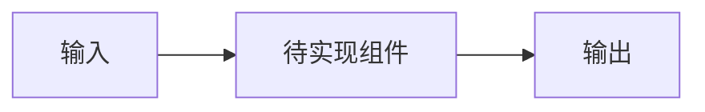
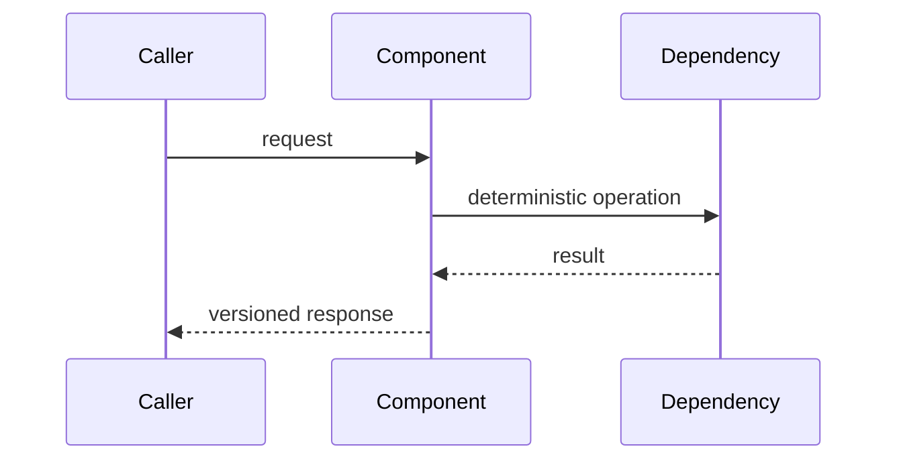

# <功能或模块名称> 可实施详细设计

- 文档状态：Draft / Review / Approved / Implemented / Superseded
- 设计版本：0.1
- 创建日期：YYYY-MM-DD
- 负责人：<name>
- 目标里程碑：<phase/milestone>
- 关联需求：<issue/task/reference>
- 关联架构与 ADR：<links>

## 1. 背景与问题

说明当前行为、用户问题、证据和为什么现在需要修改。

## 2. 目标与非目标

### 2.1 目标

- <可验收目标>

### 2.2 非目标

- <明确不在本次范围内的事项>

## 3. 现状与约束

- 当前实现与模块边界：
- 已验证工具能力：
- 离线/网络/许可证约束：
- 兼容性与迁移约束：
- 大型算法性能约束：

## 4. 用例与验收标准

| 用例 | 输入/前置条件 | 预期结果 | 验证层级 |
|---|---|---|---|
| <case> | <given> | <then> | Unit/Contract/Integration/E2E/Eval |

## 5. 总体方案

说明关键流程以及为什么选择该方案。

## 6. 模块与类设计

| 模块/类 | 职责 | 输入 | 输出 | 依赖 |
|---|---|---|---|---|
| <name> | <responsibility> | <input> | <output> | <dependency> |

说明接口隔离、不可变性、线程安全、资源所有权和扩展点。

## 7. 数据与契约设计

列出 Schema、DTO、枚举、ID、版本、必填字段、错误模型和示例。

- Schema 版本：
- 向后兼容策略：
- Provenance：
- 敏感字段处理：
- 迁移方式：

## 8. 核心流程

补充正常流程、边界流程、失败流程和恢复流程。

## 9. 错误处理与可观测性

- 错误码与异常：
- 超时和重试：
- stdout/stderr 和日志：
- Manifest 与失败产物：
- 指标与诊断字段：

## 10. 性能与容量预算

| 指标 | 默认值 | 上限 | 超限行为 | 验证方法 |
|---|---:|---:|---|---|
| 事件数 | <n> | <n> | truncate/abort/degrade | benchmark |
| 文件大小 | <bytes> | <bytes> | <behavior> | integration test |
| JVM 暂停时间 | <ms> | <ms> | <behavior> | metric |
| 内存/队列 | <n> | <n> | <behavior> | load test |

不涉及性能敏感路径时说明“不适用”及理由。

## 11. 安全、隐私与无侵入性

- 是否修改目标算法源码：
- 凭据和敏感数据处理：
- 文件与进程权限：
- 大对象/生产数据脱敏：
- 外部依赖许可证：

## 12. 测试设计

先列出将要失败的测试，再描述实现。

### 12.1 单元测试

- <test name>: <behavior>

### 12.2 契约与兼容性测试

- <test>

### 12.3 集成与端到端测试

- <test>

### 12.4 性能测试与 Agent Eval

- <benchmark/eval>

### 12.5 测试夹具与 Golden 数据

- 数据来源：
- 确定性处理：
- 更新审批方式：

## 13. 实施步骤

1. <先增加测试/契约>
2. <最小实现>
3. <集成>
4. <文档与 Eval>

每一步应可独立验证，避免一次提交跨越过多模块。

## 14. 兼容、迁移与回滚

- 旧数据/命令兼容：
- 迁移步骤：
- Feature flag 或降级路径：
- 回滚条件和方式：

## 15. 风险与待确认事项

| 风险/问题 | 影响 | 缓解措施 | 状态 |
|---|---|---|---|
| <risk> | <impact> | <mitigation> | Open/Resolved |

## 16. 文档同步清单

- [ ] 架构/ADR
- [ ] Schema 与示例
- [ ] README/CLI 使用说明
- [ ] Mermaid 图
- [ ] 知识库与 Prompt/Skill 版本
- [ ] Eval Case

## 17. 实现完成记录

- 实际变更：
- 相对设计的偏差：
- 测试与命令：
- 性能结果：
- 已知限制：
- 提交/版本：

## 18. 变更记录

| 日期 | 版本 | 变更内容 | 作者 |
|---|---|---|---|
| YYYY-MM-DD | 0.1 | 初稿 | <name> |

