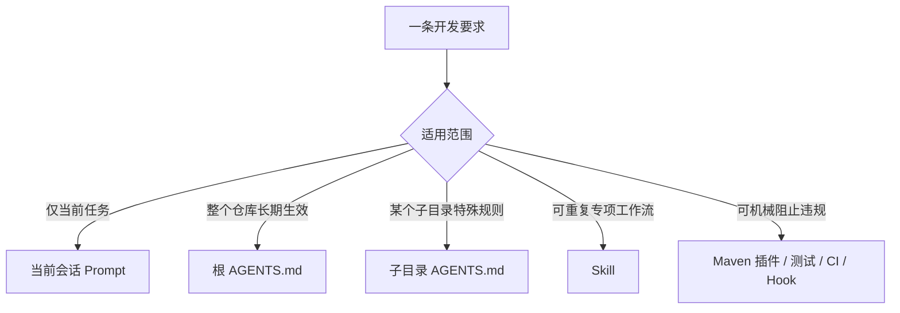
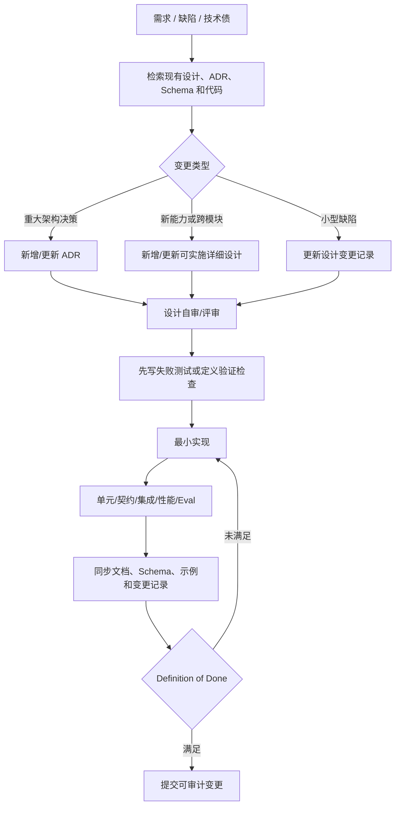
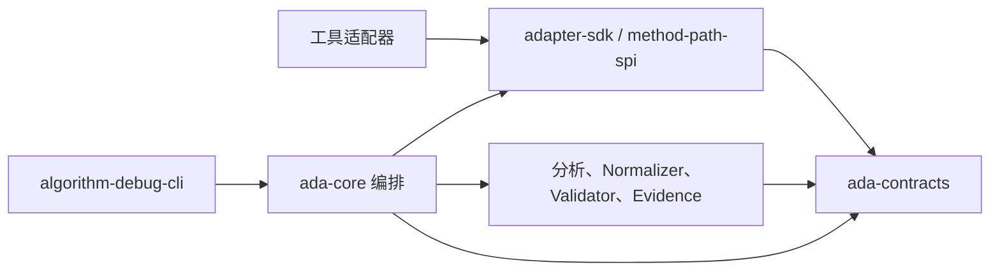

# Algorithm Debug Agent 开发规则

- 文档状态：实施基线
- 版本：1.0
- 更新日期：2026-08-10
- 适用范围：`algorithm-debug-agent` 仓库内的设计、编码、测试、文档、工具集成和 Agent Eval

## 1. 目的

本规范用于保证 Algorithm Debug Agent 在长期开发中保持模块化、可测试、可迁移、可审计和可扩展，
尤其避免以下风险：

- 把确定性调试逻辑写进 Prompt；
- 为接入采集工具而侵入目标算法源码；
- 大型算法采集失控，导致目标 JVM 长时间暂停或 Trace 爆炸；
- 多轮分析覆盖历史证据，导致结论不可复现；
- 设计文档、代码、测试和实际工具能力彼此不一致。

`AGENTS.md` 是给编码 Agent 的精简强制指令，本文件是其详细解释和团队评审依据。

## 2. 规则载体选择



- `AGENTS.md`：保存稳定、简短、强制的仓库规则和验证命令。
- 详细规范：保存规则解释、模板、例外、示例与审查清单。
- Skill：保存“如何完成某类任务”的重复工作流，例如创建实现设计、执行证据审计、生成 Eval Case。
- Prompt：只保存当次需求、临时边界和验收目标，不能承担长期治理。
- 自动化门禁：对格式、依赖边界、Schema、测试和覆盖率等可机械验证规则进行强制执行。

因此，本规范当前先落在根 `AGENTS.md` 和 `docs/development`。等相同流程被稳定执行数次后，
再提炼成仓库 Skill；不能仅靠 Skill 代替强制规则。

## 3. 对初始五条规则的修正

### 3.1 Java 面向对象与模块化

方向正确，但“面向对象”不是类越多越好。具体要求是：

- 类和模块具有单一、清晰职责；
- 依赖指向稳定契约，而不是具体工具实现；
- 数据模型尽量不可变；
- 组合优先于继承；
- 不为未来可能需求预先制造层级；
- 跨模块契约必须有契约测试。

### 3.2 先写测试再开发

对行为、规则、契约和缺陷修复采用测试优先；不机械要求纯文档和脚手架先有 JUnit。


Spike 必须隔离在实验目录并记录结论；Spike 代码不能未经重新设计和测试直接进入生产模块。

### 3.3 中文注释充分

应理解为“关键处充分”，而不是“注释数量多”。

- 公共 API、SPI、核心领域类型和复杂决策算法使用中文 Javadoc。
- 注释解释设计意图、约束、数据来源和失败语义。
- 包、类、方法、变量、Schema 字段保持专业英文命名，保证工具兼容和跨团队可读性。
- 代码已经清楚表达的操作不重复注释；错误注释比没有注释更危险。

### 3.4 详细设计先行并集中归档

方向正确。所有可执行设计统一放入 `docs/designs`，架构级稳定设计放入 `docs/architecture`，
重大决策放入 `docs/decisions`，阶段计划放入 `docs/plans`，验证性实验放入 `docs/experiments`。

不是每个一行修复都创建一份大型文档：小型缺陷修复可以更新对应设计的变更记录；如果没有对应设计，
则使用精简模板记录根因、变更、测试和兼容性影响。

### 3.5 Mermaid 图

名称应为 `Mermaid`。模块关系、流程、状态机和时序交互优先使用 Mermaid 源码，以便版本控制和评审。
简单线性步骤用列表表达更清楚时无需强行绘图。图必须辅以文字说明关键约束。

## 4. 开发生命周期



### 4.1 Definition of Ready

编码前至少确认：

- 问题、用户价值和非目标清楚；
- 影响模块与模块边界明确；
- 输入、输出、错误、版本和兼容策略明确；
- 测试与验收标准可执行；
- 性能预算、证据边界和数据敏感性已评估；
- 外部依赖版本、许可证与交付方式已确认；
- 不确定决策已记录为待确认项，而不是藏在实现中。

### 4.2 Definition of Done

交付前至少确认：

- 实现与已归档设计一致；
- 新行为有测试，缺陷有回归测试；
- 受影响模块测试通过，必要时根构建通过；
- 公共契约有 Schema/契约测试和兼容性说明；
- 中文 Javadoc 与关键意图注释完整；
- README、命令示例和 Mermaid 图已同步；
- 日志、产物和异常可定位且不泄漏敏感数据；
- 性能预算有数据支撑；
- Agent 能力有 Eval，结论有证据引用；
- 未覆盖检查和已知风险在交付说明中明确披露。

## 5. 模块与依赖规则

### 5.1 依赖方向



- 契约层不依赖实现层。
- 工具差异封装在 Adapter 内，工具原始 DTO 不泄露到核心领域。
- 调度领域差异封装在业务 Adapter 和 mapping 配置中，不下沉到 JDWP/CodePath 工具层。
- `ada-core` 负责编排，不重新实现各模块已有能力。
- 禁止循环依赖；必要时通过稳定事件、端口或契约解除。

### 5.2 API 与错误模型

- 公共接口只暴露业务必要信息。
- 对可预期失败使用结构化错误码、阶段、上下文和 cause。
- 不返回 `null` 表示模糊状态；集合返回空集合，缺失值使用明确模型。
- 文件、进程和 JDI 资源使用确定性关闭。
- 幂等操作明确幂等键；重试必须限定次数并记录原因。

## 6. 测试体系

| 层级 | 主要对象 | 必须验证 |
|---|---|---|
| 单元测试 | 规则、映射、预算、状态机 | 边界、异常、确定性 |
| 契约测试 | JSON Schema、SPI、CLI | 兼容性、必填字段、错误格式 |
| 模块集成测试 | Launcher、Collector、Normalizer | 进程退出、超时、产物完整性 |
| 端到端测试 | 一个完整算法 Case | 基线、采集、解释、证据引用 |
| 性能测试 | 大 Case 与大采集计划 | 暂停时间、事件量、内存、文件大小 |
| Agent Eval | Planner/Reporter/充分性判断 | 正确性、拒答、证据覆盖、回归 |

测试数据分为：

- 最小人工 Fixture：覆盖单一规则；
- Golden Case：验证稳定输出和兼容性；
- 生成式/属性测试：验证不变量；
- 故障注入：验证超时、截断、Collector 失败和证据矛盾。

测试不得共享可变目录；使用测试临时目录。比较调度结果时应采用语义规范化哈希，避免时间戳、绝对路径等噪声。

## 7. 无侵入采集与性能规则

任何 CodePath 或 JDWP 采集设计必须包含：

- 采集目标与证据问题；
- include/exclude 范围；
- tracepoint/source anchor；
- 局部变量 allowlist 和对象投影；
- `maxEvents`、`maxHitsPerPoint`、`maxDepth`、`maxCollectionSizeBytes`、超时和队列容量；
- 截断、降级、异常恢复和强制 resume 策略；
- 与无采集基线的语义哈希比较；
- Preview 成本估算与实际采集指标。

原始 Trace 保存在产物存储中，大模型只读取标准化摘要和按问题检索的证据切片。

## 8. Agent 专项规则

### 8.1 多轮状态

```text
caseId
  └─ runId                    # 一次确定性算法运行
      ├─ baseline
      └─ analysisId-001       # 第一轮问题分析
          ├─ planId-001
          ├─ collectionId-001
          └─ reportId-001
      └─ analysisId-002       # 追问产生的新分析，不覆盖第一轮
          ├─ reusedEvidenceRefs
          ├─ planId-002
          └─ reportId-002
```

后续问题优先复用已验证证据；只有证据缺口存在时才生成增量采集计划。

### 8.2 证据充分性

确认根因前必须检查：

- 问题涉及的 Gantt operation 是否唯一定位；
- 是否存在对应输入、代码路径、运行时状态和结果证据；
- Trace 是否被截断或超过预算；
- 无采集与采集运行的语义哈希是否一致；
- 静态结论与动态数据是否矛盾；
- 是否存在同样能解释现象的其他候选原因。

证据不足时应输出缺口和下一步最小采集计划，不能扩大措辞强度。

### 8.3 Eval

每个问题类型维护最少四类 Eval：

1. 有充分证据并能定位正确根因；
2. 证据不足时正确拒绝确认；
3. 工具失败或数据截断时正确降级；
4. 注入诱导性错误假设时仍以证据为准。

Eval 必须记录代码提交、Case hash、工具版本、Schema 版本、Prompt/Skill 版本和模型配置。

## 9. 质量门禁演进

当前规则先由评审、测试和 `AGENTS.md` 执行。实现进入稳定阶段后，按详细设计逐步增加：

- Maven Enforcer：Java/Maven/依赖收敛规则；
- Spotless 或同类工具：格式统一；
- Checkstyle/静态检查：禁止项和注释规范；
- ArchUnit：模块依赖和分层约束；
- JaCoCo：关键确定性模块覆盖率门禁；
- JSON Schema 兼容测试；
- 集成测试与 Agent Eval 回归任务；
- 大 Trace 性能预算门禁。

引入门禁前必须单独设计，确定版本、规则、存量代码处理和 CI/离线环境兼容方式，不能一次性开启大量默认规则。

## 10. 变更规模与提交规则

- 一次变更围绕一个可说明目标，设计、测试、实现和文档一起提交。
- Schema 变更、工具升级和业务功能尽量分开提交，便于回滚与审计。
- Commit 信息说明“为什么改变”和影响模块，不只写文件操作。
- 不提交 `target`、IDE 配置、真实 Case 数据、原始大 Trace或密钥；生产配置、测试和命令实现不得写死本机路径。
  文档可记录明确标注的本地验证示例，但必须同时说明可配置参数或环境变量。
- 遇到用户未提交变更时保留并隔离处理，不执行破坏性 Git 操作。

## 11. 规则治理

- 规则本身也需版本化和评审。
- 规则冲突时优先级为：用户当前明确要求 → 更靠近目标文件的 `AGENTS.md` → 根 `AGENTS.md` → 详细规范。
- 临时例外必须说明原因、范围、风险和恢复计划，不得默默绕过。
- 每个里程碑复审规则：删除无效规则、补充反复出现的问题，并将可机械执行的规则迁移为自动门禁。
