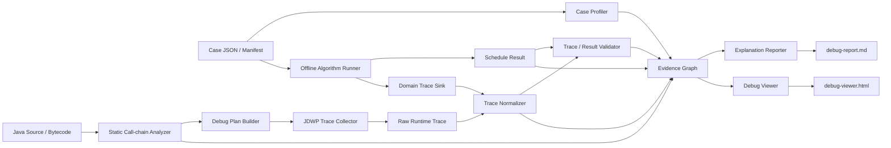

# Algorithm Debug Agent 设计与开发计划

> 历史草案说明：本文档保留早期方案，包含“算法内部 Domain Trace Sink”等已被调整的设计。当前实施请以 [Algorithm Debug Agent 完整架构与开发计划](../architecture/algorithm-debug-agent-complete-design.md) 为准；主方案采用算法源码零侵入、外部 Debug Harness、CodePathTracer、JDWP Batch Collector 和 Derived Domain Trace。

> 2026-08-19 当前状态：ADR-010 的显式最小 Context 与精确方法 CodePath v2 已实施并通过全 Reactor
> 清洁测试及真实 `hellomvn` smoke。本文后续出现的自动 Context Snapshot、包级 CodePath 和二次过滤内容
> 均为历史计划，不再是当前实现要求。当前下一阶段是 OpenCode 一次性安装/端到端模型 Eval，而不是继续扩展
> Context 规则或修改上游 CodePathTracer。

> 2026-08-12 当前实施修订：OpenCode 是唯一 Agent Runtime；Agent 通过仓库内 Skill 与薄
> Custom Tool 调用 `ada` CLI，不实现 Algorithm Debug MCP Server。一次性 OpenCode 适配登记
> Agent 安装目录后，用户进入目标算法仓库直接运行 `opencode`。UT 结果采用结构化摘要、原始 Artifact
> 引用与 Skill 指引协作，异常分类不推断业务根因。

> 2026-08-16 实施状态：Case/Context/Analysis/Run 追加式 Repository、Context Snapshot、Case Digest、
> 真实目标 UT 的 RunOutcome/Artifact 归档，以及 `case open/inspect`、`run execute` CLI 已实现并通过
> 六类隔离 Maven 场景与真实 Wafer UT 验收。2026-08-17 已完成 JSON Token 内容/目标失败指纹、
> write-once Context reproduction reference 和 `MATCHED/CHANGED/INCOMPARABLE` 简单比较。
> 动态采集、Evidence 和 OpenCode 安装器仍待实现。


- 文档状态：Draft for Implementation
- 版本：0.1
- 更新日期：2026-07-21
- 基线项目：`D:\javacode\hellomvn`
- 产品定位：半导体设备晶圆调度算法的离线问题定位助手

## 1. 执行摘要

本项目的目标不是开发生产在线调度组件，而是建设一个可重复、可验证、证据驱动的离线算法问题定位系统。

系统接受一次问题发生时的算法输入快照和对应 Java 算法代码，完成以下闭环：

```text
问题输入 JSON
  -> 离线运行算法
  -> 生成调度结果与业务 Trace
  -> 静态分析算法调用链
  -> 必要时通过 JDWP 采集运行时事实
  -> 校验资源、顺序和策略约束
  -> 建立输入/决策/代码/结果证据链
  -> 生成 debug-report.md 与 debug-viewer.html
```

核心原则是：大模型负责基于证据解释，不负责猜测算法执行过程。所有“发生了什么”“哪个约束过滤了候选”“哪个变量决定了选择”等事实，必须来自确定性工具。

当前 Wafer Scheduling Demo 已具备输入快照、Job/Sequence、SERIAL/PARALLEL、基础防超车、运行中重调度、结果 JSON、UT 和 Gantt Viewer。下一阶段首先需要把调度器重构为可观测的候选决策循环，再在此基础上建设问题助手。

## 2. 当前基线能力

### 2.1 已具备

- Java 21、Maven、JUnit 5、Jackson；
- JSON 输入快照；
- 独立 Job、Sequence、wafer、Chamber 模型；
- `SERIAL/PARALLEL` 机台模式；
- PICK、PLACE、RECIPE 物理操作拆分；
- Robot、Load Port、Chamber 资源占用；
- Chamber occupant 校验；
- 同 Job 基础防超车；
- 运行中 RECIPE 的剩余时间重调度；
- 调度结果 JSON；
- 基于资源泳道的 Gantt HTML；
- 初始串行、初始并行、运行中重调度、复杂五腔 Case；
- 约束型 UT 与结果 JSON 输出。

### 2.2 当前重要限制

1. 调度器以“整片 wafer 的完整路线”为调度单元，而不是按时刻选择下一候选操作。
2. 多 Chamber Case 尚未形成真正的流水并发；复杂五腔 Case 当前 makespan 为 300。
3. 没有显式的 candidate、filter、score、rank、select 决策模型。
4. `schedulingReason` 是结果摘要，不是可回放的完整决策 Trace。
5. 没有记录未选候选及其被过滤原因。
6. 没有 Input 字段到运行时决策、结果操作和代码位置的统一证据 ID。
7. 没有独立 trace validator 和 finding schema。
8. 没有 Java 静态调用链、策略识别和断点计划生成能力。
9. 尚未接入现有 JDWP MCP 作为自动 Trace 采集层。
10. Viewer 目前只能看结果，不能从异常 Gantt 条目回溯决策链。

## 3. 产品目标与非目标

### 3.1 产品目标

系统应能够回答：

- 为什么某片 wafer 在某个时间进入某个 Chamber？
- 为什么空闲 Chamber 没有接收某片 wafer？
- 为什么某个 Job 被另一个 Job 延后？
- 哪个 SERIAL/PARALLEL 或防超车规则过滤了候选？
- 哪个输入字段改变了候选可行性或优先级？
- 某个 Gantt 条目对应哪个 Sequence step、运行时变量和代码位置？
- 调度结果是否存在资源冲突、位置不连续、进腔违规或重调度不一致？
- 相同 Case 在两个算法版本间为什么产生不同结果？

### 3.2 非目标

- 不直接控制生产设备；
- 不连接在线 PLC、MES 或实时设备控制总线；
- 不让大模型修改或执行生产调度决策；
- 不把 JDWP MCP 写成晶圆调度业务引擎；
- 不以大模型自然语言判断替代确定性约束校验；
- 第一阶段不追求覆盖所有厂商和所有设备模型。

## 4. 设计原则

### 4.1 Evidence First

每条解释必须引用至少一种可定位证据：

- 输入 JSON Path；
- Trace event ID；
- Schedule operation ID；
- Validator finding ID；
- Java 类、方法和代码行；
- JDWP snapshot ID。

### 4.2 Deterministic Core

以下能力必须由代码完成：

- JSON 解析和 Schema 校验；
- Case 摘要；
- 调度运行；
- Trace 归一化；
- 资源和业务约束验证；
- 调用链和代码位置提取；
- 证据关联；
- Gantt 数据生成。

### 4.3 LLM as Explainer

大模型输入应是经过裁剪和验证的 Evidence Bundle，而不是完整大对象和未经整理的 JDWP dump。

### 4.4 Offline and Replayable

同一代码版本、输入 Case 和配置必须生成可重复结果。每次运行的所有产物保存在独立 `runId` 下，不覆盖历史证据。

### 4.5 Domain Layer Above JDWP

JDWP 只提供线程、断点、栈帧、变量、表达式和对象快照。晶圆、Job、候选、规则、评分和资源状态由上层 normalizer 解释。

### 4.6 Progressive Observability

采集优先级：

```text
领域事件 > 批量表达式 > 小对象快照 > 大对象展开
```

避免对大输入、全量候选和深层对象图做无边界展开。

## 5. 目标架构



## 6. 核心组件设计

### 6.1 Case Registry 与 Case Profiler

职责：

- 读取 Case Manifest 和输入 JSON；
- 校验 Schema 版本；
- 输出 Job、wafer、Sequence、Chamber、运行中操作摘要；
- 识别异常规模和高风险字段；
- 生成稳定对象索引与 JSON Path。

建议产物：

```text
runs/{runId}/case-profile.json
runs/{runId}/case-profile.md
```

Case Manifest 建议字段：

```json
{
  "caseId": "COMPLEX-PARALLEL-001",
  "schemaVersion": "1.0",
  "algorithmVersion": "demo-v1",
  "entrypoint": "org.example.scheduler.Main",
  "inputFile": "input.json",
  "expectedMode": "PARALLEL",
  "tags": ["multi-job", "five-chambers", "anti-overtake"]
}
```

### 6.2 Offline Algorithm Runner

职责：

- 通过 CLI 或 JUnit 启动算法；
- 记录代码版本、JVM、参数、输入 Hash 和运行时间；
- 捕获 stdout、stderr、异常和退出码；
- 生成结果、领域 Trace 和 Run Manifest；
- 支持 normal run、debug/JDWP run、compare run。

推荐命令：

```text
algorithm-debug run --case <case-dir>
algorithm-debug run --case <case-dir> --trace domain
algorithm-debug run --case <case-dir> --trace jdwp --debug-plan plan.json
algorithm-debug compare --baseline <runA> --candidate <runB>
```

### 6.3 Candidate-based Scheduler Observability

这是当前 Demo 最优先的算法重构点。

调度主循环应显式包含：

```text
1. 生成当前时刻可考虑的 wafer/operation candidates
2. 应用资源、位置、Sequence、SERIAL/PARALLEL、防超车过滤器
3. 对剩余候选计算优先级或 score
4. 排序并选择 candidate
5. 提交操作并更新资源/wafer/Chamber 状态
6. 推进模拟时间或进入下一决策点
```

必须保留未选候选及原因，不能只记录 selected。

第一版领域事件：

- `case_loaded`
- `decision_started`
- `candidate_generated`
- `constraint_filtered`
- `score_calculated`
- `candidate_ranked`
- `candidate_selected`
- `operation_scheduled`
- `resource_state_updated`
- `chamber_owner_changed`
- `wafer_state_updated`
- `schedule_committed`
- `result_exported`

### 6.4 Domain Trace Sink

在 Demo 算法中先提供轻量、可关闭的领域事件接口，作为 Trace Schema 的参考实现和 JDWP normalizer 的校准真值。

建议接口：

```java
public interface SchedulingTraceSink {
    void emit(SchedulingTraceEvent event);
}
```

实现：

- `NoOpTraceSink`
- `JsonLinesTraceSink`
- `InMemoryTraceSink`，供 UT 使用

Trace 使用 JSONL，避免大 Case 全量驻留内存：

```text
runs/{runId}/trace/domain-trace.jsonl
```

### 6.5 Static Call-chain Analyzer

职责：

- 从入口类/方法建立调用图；
- 识别 scheduler main loop；
- 识别 Strategy、Rule、Filter、Scorer、Selector、Dispatcher；
- 提取关键方法参数、局部变量名和源码位置；
- 输出可用于 JDWP 的采集点候选。

建议第一阶段使用 JavaParser Symbol Solver；如果真实算法的 Lombok、生成代码或复杂类型解析不足，再评估 Spoon 或字节码分析。

产物：

```text
runs/{runId}/static/call-chain.json
runs/{runId}/static/strategy-inventory.json
runs/{runId}/static/source-locations.json
```

### 6.6 Debug Plan Builder

输入：

- Case Profile；
- Static Analysis；
- 用户关注的问题或 Gantt operation ID；
- 可选算法知识配置。

输出示例：

```json
{
  "planId": "PLAN-001",
  "entrypoint": "schedule",
  "tracepoints": [
    {
      "className": "...Scheduler",
      "methodName": "selectCandidate",
      "line": 123,
      "condition": "decisionIndex < 100",
      "expressions": [
        "candidates.size()",
        "selected.waferId",
        "selected.targetChamber",
        "filterReasonByCandidate"
      ],
      "maxHits": 100
    }
  ]
}
```

Debug Plan 必须支持采集预算：

- 最大 Tracepoint 数；
- 每点最大命中次数；
- 每次最大表达式数；
- collection preview；
- topN 和最大对象深度；
- 总 Trace 大小上限。

### 6.7 JDWP Trace Collector

基于现有 `jdwp_inspector`/JDWP MCP 适配，不向底层加入 wafer 业务语义。

需要的能力：

- `collect_trace_by_plan`
- `batch_evaluate`
- `collection_preview`
- `object_snapshot`
- `resume_until_exit`

运行模式：

```text
命中 Tracepoint
  -> 短暂停线程
  -> 批量 evaluate
  -> 限深快照
  -> 写入 raw trace
  -> 立即 resume
```

原始产物：

```text
runs/{runId}/trace/jdwp-raw-trace.jsonl
```

### 6.8 Trace Normalizer

职责：

- 将 JDWP 类名、对象、集合和表达式转换成统一领域事件；
- 对齐 Job、wafer、Sequence、Chamber 和 operation ID；
- 去除重复、大对象噪音和 JVM 实现细节；
- 标记缺失值、截断值和推断值；
- 保留 raw event 引用，确保可追溯。

归一化结果：

```text
runs/{runId}/trace/normalized-trace.jsonl
```

每个字段需要 provenance：

```json
{
  "value": "CH3",
  "sourceType": "JDWP_EXPRESSION",
  "sourceRef": "raw-event-182",
  "expression": "selected.targetChamber"
}
```

### 6.9 Trace / Result Validator

Validator 必须独立于大模型。

首批规则：

- Robot 资源无重叠；
- Chamber 资源无重叠；
- LP/slot 资源无重叠；
- wafer 位置链连续；
- PICK 后 PLACE 连续；
- Recipe 只能在 wafer 所在 Chamber 执行；
- SERIAL Chamber owner 合法；
- PARALLEL 不违反同 Chamber 容量；
- 同 Job 每个 Sequence step 无超车；
- running operation 与输入快照一致；
- 最终 wafer 回到预期 Load Port；
- Trace selected candidate 与结果 operation 一致；
- makespan 与最后结束时间一致；
- 相同输入重复运行结果一致。

Finding Schema：

```json
{
  "findingId": "FINDING-001",
  "ruleId": "RESOURCE_OVERLAP",
  "severity": "ERROR",
  "message": "CH3 has overlapping recipes",
  "evidenceRefs": ["OP-18", "OP-29", "TRACE-441"],
  "timeRange": {"start": 18, "end": 21}
}
```

### 6.10 Evidence Graph

统一关联：

```text
Input JSON Path
  -> Domain Object
  -> Candidate
  -> Filter/Score/Selection
  -> Scheduled Operation
  -> Gantt Bar
  -> Validator Finding
  -> Java Source Location
  -> JDWP Raw Snapshot
```

建议核心 ID：

- `runId`
- `decisionId`
- `candidateId`
- `operationId`
- `traceEventId`
- `findingId`
- `sourceLocationId`
- `inputRefId`

Evidence Graph 第一版可以用 JSON adjacency list，不需要立即引入图数据库。

### 6.11 Explanation Reporter

Reporter 输入必须是 Evidence Bundle，不直接读取全部项目和全部 Trace。

报告结构：

```text
# Case Summary
# Observed Symptom
# Scheduling Timeline
# Decision Explanation
# Constraint and Score Evidence
# Root Cause Candidates
# Confirmed Validator Findings
# Input Fields Involved
# Code Locations
# Missing Evidence / Uncertainty
# Recommended Next Debug Step
```

解释内容必须区分：

- Confirmed fact；
- Validator conclusion；
- Source-code inference；
- LLM hypothesis；
- Missing evidence。

### 6.12 Debug Viewer

在当前 Gantt Viewer 基础上增加：

- Run/Case 选择；
- 资源 Gantt；
- wafer 路径；
- Job/Sequence 过滤；
- decision timeline；
- candidate 列表与过滤原因；
- score breakdown；
- Chamber owner 时间线；
- validator findings；
- 输入 JSON Path；
- Java source location；
- raw/normalized trace 证据跳转；
- 两次 Run 的结果 Diff。

点击 Gantt Bar 后的目标信息：

```text
Operation
  -> 为什么此时开始
  -> 为什么选择该 Chamber
  -> 哪些候选被拒绝
  -> 使用了哪些输入字段
  -> 对应哪条策略和源码
  -> 是否存在 Validator Finding
```

## 7. 产物目录规范

建议每次运行使用不可变目录：

```text
runs/
  {caseId}/
    {runId}/
      run-manifest.json
      input/
        scheduling-input.json
        case-profile.json
      result/
        schedule-result.json
        result-validation.json
      trace/
        domain-trace.jsonl
        jdwp-raw-trace.jsonl
        normalized-trace.jsonl
      static/
        call-chain.json
        strategy-inventory.json
        source-locations.json
      evidence/
        evidence-graph.json
        findings.json
      report/
        debug-report.md
        debug-viewer.html
```

`output/` 继续作为人工快速查看目录，`runs/` 作为正式可追溯产物目录。

## 8. 代码组织演进

### 8.1 第一阶段：保持单 Maven Module

在契约稳定前，避免过早拆成大量模块。先按包分层：

```text
org.example.algorithmdebug
  caseprofile
  runner
  trace.api
  trace.domain
  trace.jdwp
  trace.normalize
  staticanalysis
  debugplan
  validation
  evidence
  reporting
  cli

org.example.scheduler.wafer
  model
  algorithm
  trace
```

### 8.2 第二阶段：契约稳定后拆 Multi-module

```text
algorithm-debug-parent
  wafer-scheduling-demo
  algorithm-debug-domain
  algorithm-debug-runner
  algorithm-debug-static-analysis
  algorithm-debug-trace
  algorithm-debug-validator
  algorithm-debug-reporter
  algorithm-debug-cli
```

拆分触发条件：

- Trace Schema 稳定；
- Case Manifest 稳定；
- Runner 与算法模块边界明确；
- JDWP adapter 可以独立集成测试。

## 9. 分阶段开发路线

## Phase 0：基线冻结与契约版本化

状态：核心 Maven Runner 已于 2026-08-11 实现；2026-08-13 完成早期 Case/Context Resolution、
RunOutcomeSummary、Surefire 通用诊断和 OpenCode 有界适配契约；2026-08-16 已完成正式
Case/Context/Analysis/Run Repository、Context Snapshot、Case Digest 和可执行 Case/Run CLI。
JSON 内容/失败指纹和简单 Baseline 比较已于 2026-08-17 实现；OpenCode 安装器与采集/Evidence 链仍未实现。

目标：把当前 Demo 固化成后续迭代的可比较基线。

交付物：

- `schemaVersion`、`algorithmVersion`；
- Case Manifest；
- 当前四类 Case 的 golden summary；
- 结果 Schema 文档；
- Run Start/Outcome；
- 可重复运行 Hash。
- 运行前 `CaseFingerprint` 与运行后 `ExecutionIdentity`；
- 动态输出目录运行前后差分；
- 不可变 Run 结果捕获；
- 可选的 `BASELINE_STABLE/BASELINE_UNSTABLE` 判定；
- Case 新建、Context 复用与新增决策。
- 同一问题修改源码、输入或 UT 内容时追加 Context Snapshot，不自动拆分 Case；
- 同一 Case 下多轮 Analysis 对历史 Run、Artifact 和 Evidence 的显式复用；
- 面向 LLM 的有界 RunOutcomeSummary，明确本轮 runId、目标/Agent 结果和 Artifact 引用；
- 异常类、消息、cause 和业务栈帧的通用提取，不建立异常到业务根因的穷举规则；
- 仓库内唯一 `skills/algorithm-debug` 与 OpenCode 适配目录；
- 幂等的一次性 OpenCode 适配安装，安装后直接使用 `opencode`（待实现）。

验收：

- 首次无采集 Run 默认作为复现参考；检测到漂移、并发/随机因素或用户要求时再执行重复稳定性验证；
- 所有 Case 可生成独立 run 目录；
- 结果中可确认输入 Hash、算法版本和模式。
- 动态采集运行与参考 Gantt Hash 或异常特征不一致时，相关证据不得用于确认根因。
- 不同 Context 的 Gantt 内容 Hash 变化形成 `CHANGED` 事实并保留两份 Artifact；同一 Context 采集前后
  不一致才视为采集行为干扰。字段级 Diff 按真实使用需求后置。

## Phase 1：候选决策循环与领域 Trace

目标：让算法第一次具备“可解释决策事实”。

交付物：

- candidate/filter/score/select 主循环；
- `SchedulingTraceSink`；
- JSONL Trace；
- SERIAL、PARALLEL、防超车过滤事件；
- complex five-chamber Case 的流水并发改进。

验收：

- 每个 operation 可关联一个 `decisionId` 和 `candidateId`；
- 每次选择至少记录 selected 和主要 rejected candidates；
- 能解释某个空闲 Chamber 为什么没有选某 wafer；
- 复杂五腔 Case 不再按整片路线完全串行；
- Trace 关闭时不改变调度结果。

## Phase 2：Validator 与 Evidence Graph MVP

目标：形成无需大模型即可定位确定性错误的最小问题助手。

交付物：

- validator rule framework；
- 首批资源、位置、模式、防超车规则；
- finding schema；
- input/trace/operation/finding 关联；
- `debug-report.md` 确定性模板。

验收：

- 人工注入资源冲突时能生成明确 finding；
- 人工交换同 Job wafer 进腔顺序时能识别超车；
- finding 可以定位两个冲突 operation 和相关 trace event；
- 正常 golden Cases 无 ERROR finding。

## Phase 3：Case Profiler 与离线 Runner CLI

目标：不依赖手工点击 UT 完成标准化复现。

交付物：

- `algorithm-debug run/profile/validate/compare` CLI；
- Case Registry；
- Run Manifest；
- stdout/stderr/exception 捕获；
- run artifact 目录。

验收：

- 一条命令完成输入读取、算法运行、Trace、校验和报告；
- 失败 Case 也保留完整运行元数据；
- 支持两个 Run 的 operation/finding Diff。

## Phase 4：Java 静态分析与 Debug Plan

目标：自动识别真实算法入口、决策阶段和适合采集的变量。

交付物：

- JavaParser 调用链；
- strategy/rule/filter/scorer detector；
- source location inventory；
- debug plan builder；
- 对当前 Demo 的静态分析 golden output。

验收：

- 从 `Main` 或 UT 入口定位到 scheduler main loop；
- 识别主要过滤/选择方法；
- 自动生成可执行 Tracepoint 计划；
- Debug Plan 包含采集预算和退出条件。

## Phase 5：JDWP 自动 Trace Collector

目标：在不修改真实算法业务代码的情况下采集运行时事实。

交付物：

- JDWP MCP adapter；
- `collect_trace_by_plan` 工作流；
- batch evaluate；
- object snapshot 限深；
- 自动 resume；
- raw trace artifact。

验收：

- 能从命令行启动带 JDWP 的 UT；
- 自动 attach、命中、采集、resume 到退出；
- 无需人工逐步点击；
- Trace 预算超限时安全停止采集，不阻塞 JVM；
- Demo 领域 Trace 与 JDWP normalized Trace 的关键 selected 事件一致。

## Phase 6：Trace Normalizer 与证据对齐

目标：让 JDWP 原始对象变成稳定业务 Trace。

交付物：

- mapping configuration；
- normalizer pipeline；
- provenance；
- raw/normalized diff；
- 缺失和截断标记。

验收：

- JDWP Trace 可还原 Job、wafer、candidate、rule、Chamber；
- 每个 normalized 字段可以回到 raw source；
- 真实算法类名变化可通过配置适配，而不修改核心 Schema。

## Phase 7：LLM Explanation Reporter

目标：基于 Evidence Bundle 生成可审计解释。

交付物：

- Evidence Bundle builder；
- 报告 Prompt/Skill；
- 引用校验；
- confirmed/inferred/hypothesis 分类；
- debug-report.md。

验收：

- 报告中的关键事实均有 evidence reference；
- 缺少 Trace 时明确说明不能确认；
- 不允许把 LLM hypothesis 写成 validator conclusion；
- 能回答至少五类核心“为什么”问题。

## Phase 8：Debug Viewer 与 OpenCode 适配完善

目标：形成可交互的完整问题定位体验。

交付物：

- Gantt + decision + finding 综合 Viewer；
- operation 到证据链的交互跳转；
- compare view；
- 版本化工作流 Skill；
- OpenCode Agent、Command 和薄 Custom Tool；
- OpenCode 适配安装、升级、检查与卸载。

验收：

- 点击异常 Gantt Bar 可以看到输入字段、候选、过滤器、代码位置和 finding；
- OpenCode Custom Tool 原样返回 CLI 结构化事实和 Artifact 引用，不返回未经约束的大对象；
- Skill 只指导模型理解证据和选择下一步，不承担确定性判断；
- 一次适配后，用户在目标算法仓库直接运行 `opencode` 即可提问；
- 当前阶段没有 Algorithm Debug MCP Server 运行依赖。

## 10. 推荐近期迭代 Backlog

优先完成以下顺序：

1. 为 Input、Result 增加 `schemaVersion/algorithmVersion/runId`；
2. 新增 Case Manifest 和 run artifact 目录；
3. 定义 `SchedulingTraceEvent` sealed hierarchy；
4. 新增 `SchedulingTraceSink` 和 JSONL writer；
5. 将 `SimpleWaferScheduler` 重构为 candidate decision loop；
6. 为 SERIAL、PARALLEL、防超车生成 `constraint_filtered` 事件；
7. 为 selected candidate 生成 `candidate_selected` 和 `operation_scheduled`；
8. 将现有 UT 约束抽取为独立 validator；
9. 生成第一版 deterministic debug-report.md；
10. 在 Viewer 中加入 operation -> decision trace 面板。

完成这十项后，再开始静态分析和 JDWP 集成。这样 JDWP normalizer 有稳定的领域 Trace 可以校准，能够显著降低直接解析真实算法对象的风险。

## 11. 测试策略

### 11.1 Golden Cases

- 初始 PARALLEL 双 Job；
- 初始 SERIAL 双 Job；
- 运行中 RECIPE 重调度；
- 三 Job、五 Chamber、每 Job 五片；
- SERIAL 多 Chamber 共享；
- 同 Job 人工超车；
- Chamber disabled；
- running operation 与快照不一致；
- 资源冲突注入；
- 两次重调度结果 Diff。

### 11.2 单元测试

- Candidate generator；
- 每个 filter/rule；
- Score calculator；
- Selector；
- State transition；
- Normalizer mapping；
- Validator rule；
- Evidence link resolver。

### 11.3 属性测试

对随机小 Case 校验：

- 同资源不重叠；
- wafer 位置连续；
- 每个 Sequence step 恰好执行一次；
- SERIAL owner 不被跨 Job 插队；
- 同 Job 不超车；
- 每片 wafer 最终状态合法。

### 11.4 集成测试

- CLI end-to-end；
- JDWP attach/collect/resume；
- Domain Trace 与 JDWP Trace 对齐；
- Report evidence reference 完整性；
- Viewer artifact 加载。

### 11.5 性能与体积测试

- 5、25、100 片 wafer；
- 5、20、100 个 Chamber/资源；
- Trace event 数量和文件大小；
- topN、采集预算和对象深度限制；
- 静态分析耗时；
- Viewer 加载大 Trace 的分页/虚拟列表。

## 12. Definition of Done

一个问题 Case 被认为完成定位，需要满足：

1. 输入、代码版本和运行参数已冻结；
2. 离线运行可重复；
3. 调度结果通过或明确未通过 validator；
4. 关键 decision 有 candidate/filter/select Trace；
5. finding 或异常 operation 有证据链；
6. 证据可以定位输入 JSON Path 和代码位置；
7. 报告区分事实、推断和未知；
8. Viewer 可以从 Gantt 条目跳到对应证据；
9. 所有产物保存在独立 runId 下；
10. 没有依赖人工单步调试才能复现的关键事实。

## 13. 风险与应对

| 风险 | 影响 | 应对 |
|---|---|---|
| 真实输入对象巨大 | JDWP Trace 过大、暂停过久 | topN、summary expression、限深快照、采集预算 |
| 编译优化或无调试符号 | 局部变量不可读 | 方法参数、字段表达式、字节码位置、领域 Trace 兜底 |
| 真实算法类型复杂 | Normalizer 易碎 | 配置化 mapping、provenance、raw trace 保留 |
| LLM 过度推断 | 错误根因结论 | 强制 evidence reference 和结论类型 |
| Trace 改变时序 | Heisenbug | 最小 Tracepoint、批量 evaluate、立即 resume、对比无 Trace 结果 |
| 当前 Demo 过于串行 | 无法验证并行决策解释 | Phase 1 优先 candidate loop 和多腔流水 |
| Schema 快速变化 | 工具之间不兼容 | schemaVersion、JSON Schema、兼容性测试 |
| 直接拆多模块过早 | 开发成本增加 | 先包分层，契约稳定后拆模块 |

## 14. 关键决策记录

### ADR-001：先领域 Trace，后 JDWP Trace

原因：领域 Trace 可以定义业务真值和稳定 Schema，JDWP normalizer 可据此校准。直接从 JDWP 大对象开始，会把 JVM 实现细节误当成领域模型。

### ADR-002：Validator 不调用 LLM

原因：资源冲突、顺序和一致性必须可重复、可测试。

### ADR-003：Evidence Graph 第一版使用 JSON

原因：当前数据规模不需要图数据库，JSON 更便于离线打包和 Viewer 使用。

### ADR-004：当前 Demo 作为 Reference Algorithm

原因：Demo 可主动增加 Trace Hook 和故障注入，用于验证工具链；真实算法则优先使用静态分析和 JDWP 无侵入采集。

### ADR-005：先单模块分层，后 Maven Multi-module

原因：避免在 Trace、Case、Finding 等契约尚未稳定时产生跨模块迁移成本。

## 15. 下一步启动建议

Phase 0 的结果发现、稳定性原型、正式 Maven/JUnit Runner 和 Case/Run 归档纵向切片已完成。当前可执行链路为：

```text
TestLaunchSpec
  -> 安全 Maven argv
  -> 有界 stdout/stderr 与结构化 RunResult
  -> 超时进程树清理
  -> 文件稳定轮询
  -> ScheduleResultCapture
  -> RunOutcome + 不可变 Artifact
  -> CaseDigest 查询
```

JSON 内容指纹和 Baseline 简单比较已完成，当前 Run 可可靠报告 `MATCHED/CHANGED/INCOMPARABLE`；
字段级 Gantt Diff 继续后置，变化后由大模型按需读取参考与当前 Artifact。下一步进入静态调用关系、
CodePathTracer 采集计划/执行，再以其结果驱动 JDWP 方法内聚焦采集。OpenCode 一次性安装器
在后端能力稳定后接入。后续同样不引入复杂 Case 状态机、线程转储或事件溯源。静态与动态分析的第一个
可交付目标仍为：

```text
运行 complex-parallel-three-jobs-five-chambers Case
  -> 生成 candidate/filter/select JSONL Trace
  -> 生成 schedule result
  -> validator 校验
  -> 点击一个 CH3 Gantt RECIPE
  -> 查看为何选择该 wafer、哪些 wafer 被过滤、依据哪些输入字段
```

这个目标一旦完成，项目就从“调度算法 + Gantt Demo”跨越为真正的“算法问题定位助手 MVP”。
