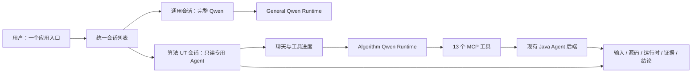

# Qwen Dual-Session Algorithm Agent Implementation Plan

> **For agentic workers:** REQUIRED SUB-SKILL: Use superpowers:subagent-driven-development (recommended) or superpowers:executing-plans to implement this plan task-by-task. Steps use checkbox (`- [ ]`) syntax for tracking.

**Goal:** 在一个 Qwen 产品中交付通用会话与算法 UT 专用会话，并复用现有 Java Algorithm Debug Agent、公司模型配置和全部确定性证据链。

**Architecture:** 一个产品 Host 管理 General 与 Algorithm 两个隔离的 Qwen Runtime；Algorithm Runtime 通过 Qwen Extension/MCP 调用现有 `ada.cmd`，通过版本化 View API 向统一 React 工作台提供结构化分析。两个 Runtime 共享模型配置但不共享工具权限和运行目录。

**Tech Stack:** Java 21、Maven、JUnit 5、Node.js 22、TypeScript、MCP SDK、Zod、Qwen Extension、Qwen `serve`、React 19、WebShell、Vitest、Playwright、JSON Schema、SSE

**Spec:** `docs/designs/2026-09-20-qwen-mcp-and-dual-runtime-workbench-design.md`、`docs/decisions/ADR-017-qwen-mcp-adapter-and-dual-runtime-workbench.md`、`D:/agent/qwen-code/docs/design/2026-09-20-algorithm-debug-dual-runtime-workbench.md`

**Execution status:** Approved；2026-09-20 开始执行 Phase 0。

## Global Constraints

- 执行前把 ADR-017 从 `Proposed` 改为 `Accepted`，并在两仓分别创建隔离分支/Worktree；计划文档本身不等于实施授权。
- 不修改目标算法生产源码来增加 Trace，不把生产设备或生产决策纳入产品控制面。
- 第一版不修改 Qwen `packages/core`；若特征测试证明必须修改，暂停实施，补充两仓设计和 ADR 后重新评审。
- Algorithm 会话只声明只读源码工具和 13 个领域 MCP 工具，不声明写文件、Patch、任意 Shell 或 Git 修改工具。
- Java CLI 与 ToolResponse 2.0 是确定性边界；MCP、Host 和 UI 不复制 Java 领域判断。
- `skills/algorithm-debug/SKILL.md` 是唯一规范 Skill 源；Qwen 安装资产必须由构建生成并校验内容哈希。
- Raw Artifact 不可变；View 是只读、有界投影，不写回原始证据，也不成为新的事实来源。
- 两仓分别小步提交；不得用一个仓的未提交文件作为另一个仓的隐式依赖。
- 每个行为变更遵循 Red-Green-Refactor；每个阶段先通过局部门禁，再进入跨仓门禁。
- OpenCode 路径在整个实施和灰度期保留，作为行为基线和回滚路径。

---

## 改造背景与当前差距

当前 Algorithm Debug Agent 已经具备 Java 21 确定性后端、Algorithm Debug Skill、13 个 OpenCode Custom
Tool、Case/Run/Analysis/Evidence 产物和真实 Eval。它不是缺少算法分析能力，而是能力目前依附在 OpenCode
的对话 Runtime 和工具协议上。实际适配表明，在相同公司模型下，Qwen Runtime 的上下文管理与模型适配更适合
当前算法分析，但这仍需正式 A/B Eval 证明，不能用个别会话体验代替量化结论。

仅把 13 个工具改为 MCP，可以完成“Qwen CLI 能调用算法 Agent”的第一阶段，但不能完成最终产品，仍缺少：

- 通用会话与算法会话的硬权限隔离；
- 一个入口内的统一会话列表、创建、切换、恢复和归档；
- Workspace、Maven 模块、目标 UT、Case、Analysis 与 Qwen session 的稳定 binding；
- 算法输入、源码架构、运行路径、JDWP、证据充分性和结论的结构化界面；
- 跨会话目标执行串行、故障隔离、版本协商、Windows 安装、升级和回滚；
- OpenCode/Qwen 同模型、同 Skill、同工具后端的可比较质量证据。

因此最终交付不是“一段 Java 代码”或“另一个聊天框”，而是一个安装包内的专用 Agent 产品：Qwen 提供模型
对话、上下文、会话和工具调度；现有 Java 仓提供确定性算法分析；产品 Host 负责两类 Runtime 和权限；Web
工作台同时提供聊天和可验证的领域视图。

## 最终呈现形式



用户只配置一次公司模型。普通问题进入通用会话；算法问题先选择目标 Workspace、Maven 模块和唯一 UT，再进入
算法会话。算法会话仍然使用输入框，但能力和权限由 Runtime 工具声明限制，而不是依赖用户“自觉只问算法”。
无关问题可以一键转到通用会话；修改源码请求在第一版只生成建议或 Diff 预览，不直接落盘。

## 两个代码仓的改造责任

| 代码仓 | 保留不动的核心 | 新增/改造内容 | 明确不承担 |
|---|---|---|---|
| `D:/javacode/algorithm-debug-agent` | Java 领域模块、CLI、ToolResponse 2.0、Case/Evidence、规范 Skill | Shared Runtime、Qwen Extension、13 工具 MCP Server、Gateway、View Schema/Projector/SSE、Qwen Eval Driver、安装诊断 | Qwen 会话/模型实现、通用聊天 UI、浏览器模型密钥管理 |
| `D:/agent/qwen-code` | Core Agent Loop、Provider、上下文压缩、工具调度、WebShell 聊天 | 双 Runtime Host、共享模型配置代理、SessionBinding、统一目录/路由、算法会话创建、结构化分析 UI、产品构建 | Java 算法语义、Evidence 真假判断、Collector、目标 UT 实现 |

两个仓通过四个版本化边界协作：ToolResponse 2.0、Gateway capability、Agent View 1.0、SessionBinding 1.0。
任何一方独立升级时先做 capability handshake；主版本不兼容只关闭算法入口，不能影响通用 Qwen。

## 建议里程碑与工作量

| 里程碑 | 主要结果 | 前置依赖 | 预估工程量 |
|---|---|---|---|
| M0 设计与基线 | ADR Accepted、两仓 clean baseline、Worktree | 用户确认本计划 | 1–2 人日 |
| M1 Shared Runtime + MCP | OpenCode 无回归、Qwen CLI 可调用 13 工具 | M0 | 5–7 人日 |
| M2 Gateway + View | 安全 Gateway、串行门禁、七类 View、Qwen Smoke | M1 | 5–7 人日 |
| M3 双 Runtime Host | 一个 Host 管理 General/Algorithm、Binding、路由、恢复 | M2 capability 冻结 | 6–8 人日 |
| M4 统一工作台 | 统一列表、两类创建流程、聊天和算法专用面板 | M3、View API 1.0 | 7–10 人日 |
| M5 加固与发布 | 安全/故障/Windows、10+50 A/B、许可证、回滚 | M1–M4 | 7–10 人日 |

总量约 31–44 工程人日，不包含公司内部模型/安全审批等待时间。单人串行约 7–10 个工作周；两人可在 M2
契约冻结后并行推进 Qwen Host/UI 与算法仓加固，约 5–7 个工作周。估算用于排期，不可替代每个 Gate 的
验收结果。

建议设置四个需要业务方明确确认的检查点：

1. **G0 方案确认：** 接受双 Runtime、算法只读和第一版不改 Qwen Core；
2. **G1 MCP 可用：** 在真实 Qwen CLI 上审阅 10-case Smoke 和 13 工具 parity，再投入产品 UI；
3. **G2 产品试用：** 审阅统一会话、目标选择和六类专用面板，再投入完整质量/打包；
4. **G3 灰度批准：** 审阅 50-case A/B、安全、Windows 和回滚审计，决定是否默认开放算法入口。

## Plan Set and Mandatory Order

| 阶段 | 执行文档 | 进入条件 | 退出条件 |
|---|---|---|---|
| 0 | 本总计划 | 用户确认设计与范围 | 两仓工作区隔离、基线绿、版本记录完成 |
| 1 | [算法仓 MCP/Gateway 计划](2026-09-20-qwen-mcp-adapter-and-gateway.md) | 阶段 0 完成 | Extension、MCP、View API、Eval Driver 的算法仓门禁全绿 |
| 2 | [Qwen 双 Runtime 工作台计划](../../../../../agent/qwen-code/docs/plans/2026-09-20-algorithm-debug-dual-runtime-workbench.md) | 阶段 1 的 capability/契约冻结 | 双 Runtime Host、统一会话和专用 UI 的 Qwen 仓门禁全绿 |
| 3 | [跨仓验证与发布计划](2026-09-20-qwen-dual-repository-validation-and-release.md) | 阶段 1、2 各自完成 | 确定性、真实模型、Windows、许可证及回滚门禁全绿 |

阶段顺序是依赖顺序，不代表必须一次性合并。阶段 1 可先合入不影响 OpenCode 的兼容代码；阶段 2 的 Host 必须锁定阶段 1 发布的 capability 版本；阶段 3 通过之前，产品入口保持默认关闭。

## Phase 0: Confirmation and Baseline

### Task 0.1: 确认设计并冻结初始兼容版本

**Files:**
- Modify: `docs/decisions/ADR-017-qwen-mcp-adapter-and-dual-runtime-workbench.md`
- Modify: `docs/designs/2026-09-20-qwen-mcp-and-dual-runtime-workbench-design.md`
- Modify: `D:/agent/qwen-code/docs/design/2026-09-20-algorithm-debug-dual-runtime-workbench.md`
- Modify: `D:/agent/qwen-code/docs/design/2026-09-20-algorithm-debug-dual-runtime-workbench.zh-CN.md`

- [x] **Step 1: 记录评审结论**

把 ADR 状态改为 `Accepted`，记录确认日期、确认范围和第一版兼容版本：ToolResponse `2.0`、View API `1.0`、SessionBinding `1.0`、Skill `1.0`。

- [ ] **Step 2: 校验中英文设计结构一致**

Run from `D:/agent/qwen-code`:

```powershell
$en = (Select-String -Path docs/design/2026-09-20-algorithm-debug-dual-runtime-workbench.md -Pattern '^## ').Count
$zh = (Select-String -Path docs/design/2026-09-20-algorithm-debug-dual-runtime-workbench.zh-CN.md -Pattern '^## ').Count
if ($en -ne $zh) { throw "Design heading counts differ: EN=$en ZH=$zh" }
```

Expected: command exits 0 and the reciprocal links resolve in both files.

- [ ] **Step 3: Commit design acceptance separately in each repository**

Algorithm repository:

```powershell
git add docs/decisions/ADR-017-qwen-mcp-adapter-and-dual-runtime-workbench.md docs/designs/2026-09-20-qwen-mcp-and-dual-runtime-workbench-design.md docs/superpowers/plans
git commit -m "docs: approve qwen dual-session agent design"
```

Qwen repository:

```powershell
git add docs/design/2026-09-20-algorithm-debug-dual-runtime-workbench.md docs/design/2026-09-20-algorithm-debug-dual-runtime-workbench.zh-CN.md docs/plans/2026-09-20-algorithm-debug-dual-runtime-workbench.md
git commit -m "docs: define algorithm debug dual-runtime workbench"
```

### Task 0.2: 建立可比较基线

**Files:**
- Create during execution: `docs/audits/2026-09-20-qwen-dual-session-baseline.md`
- Create during execution: `D:/agent/qwen-code/docs/plans/evidence/2026-09-20-algorithm-debug-baseline.md`

- [ ] **Step 1: 在 Algorithm Debug Agent 仓运行完整基线**

Run:

```powershell
mvn -Pcodepath-launcher test
$tests = Get-ChildItem agent-evals/test,integrations/opencode/test -Filter *.test.mjs
node --test $tests.FullName
```

Expected: Maven reactor 和全部 Node tests 通过；记录 Java、Maven、Node 版本、Git SHA、测试数和耗时。

- [ ] **Step 2: 在 Qwen 仓运行受影响基线**

Run:

```powershell
npm run build
npm run typecheck
npm -w packages/web-shell run test:ci
```

Expected: 全部通过；若仓库基线已有失败，必须在证据文档中记录命令、失败测试和未改代码下的复现，不能把既有失败归因于本项目。

- [ ] **Step 3: 记录环境和源码身份**

两份 baseline 文档记录两仓 commit、dirty files、模型配置标识（不含密钥）、Qwen 版本、OpenCode 版本和 Eval Suite 哈希；不得记录真实凭据或敏感路径。

### Task 0.3: 创建隔离实施环境

- [ ] **Step 1: 使用 `superpowers:using-git-worktrees` 为两仓创建独立 Worktree**

分支名称分别使用 `codex/qwen-mcp-gateway` 和 `codex/algorithm-debug-workbench`。创建前检查两仓未跟踪文件，保留用户已有修改，不移动、不清理 `docs/sharing/`。

- [ ] **Step 2: 在两个 Worktree 中复跑最小基线**

Algorithm Worktree：OpenCode Node tests；Qwen Worktree：WebShell unit tests。Expected: 与 Task 0.2 一致。

## Program-Level Stop Conditions

出现以下任一情况必须停止当前阶段，更新设计后再继续：

- Algorithm 与 General 的有效工具集合无法在不修改 Qwen Core 的情况下隔离；
- 同一 `QWEN_HOME` 导致两个 Runtime 相互覆盖运行状态或泄漏密钥；
- MCP 适配必须改变 Java ToolResponse 的事实或错误语义；
- WebShell 不能被受控 `sessionId` 和受控代理地址安全嵌入；
- 跨会话目标执行不能由单一 Gateway 在进程内可靠串行；
- Windows 打包必须要求用户另外安装 Node、MCP CLI 或手工复制 Skill；
- 许可证审查不允许按计划分发派生产品或依赖。

## Program Definition of Done

- 三份子计划全部完成，所有 checkbox 有对应提交和验证证据。
- 一个安装入口、一个模型配置入口、一个会话列表可以稳定使用两类会话。
- 权限隔离由工具声明和实际执行测试证明，而非 Prompt 或 UI 隐藏。
- 13 个 MCP 工具与 OpenCode 基线在成功、目标失败和基础设施失败路径上契约一致。
- 专用面板不解析聊天文本，不展示隐藏思维链，所有结论可回到 Artifact 或源码锚点。
- General 会话在 Algorithm Runtime/Gateway 故障下继续工作。
- 10 条 Smoke 和 50 条 Quality A/B 评测具有版本、输入、输出和评分 provenance，并达到批准阈值。
- Windows 安装、空格/中文路径、升级、降级和回滚验证通过。
- 两仓最终审计文档列出测试命令、结果、已知限制、许可证和回滚步骤。
