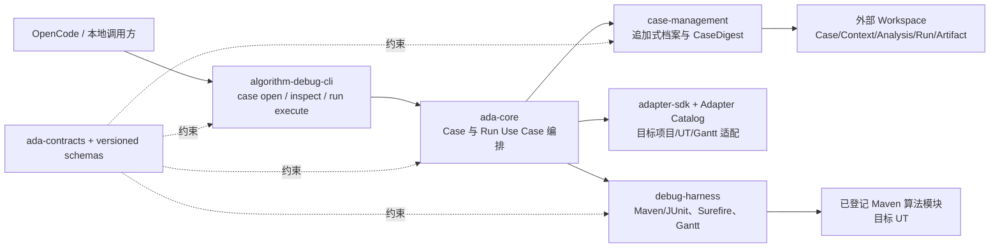
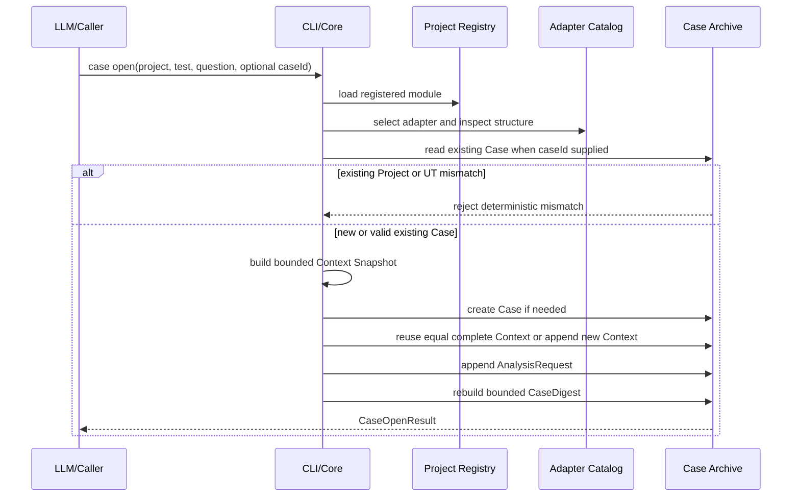
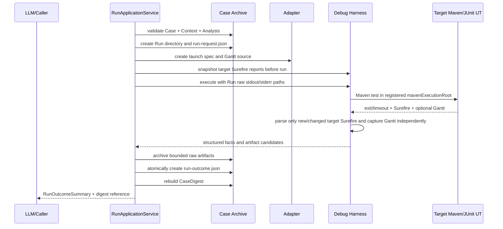

# Case 持久化、真实 UT 执行与 RunOutcome 归档可实施设计

> **历史设计说明（2026-08-18）：** 本文的 RunOutcome 归档仍有效；其中 `ContextSnapshot`、
> 自动源码/输入/构建扫描已由 ADR-010 和 `docs/designs/2026-08-18-context-codepath-simplification-design.md`
> 的显式最小 Context 取代，不代表当前契约。

- 文档状态：Implemented
- 设计版本：1.0
- 创建日期：2026-08-16
- 负责人：Codex / mh90901119-oss
- 目标里程碑：P0 - 首个可使用诊断纵向切片
- 关联需求：用户确认按推荐顺序实施 Case 持久化、真实 UT 执行和 RunOutcome 归档
- 关联决策：`ADR-006-case-as-analysis-dossier.md`、`ADR-007-opencode-adapter-via-cli.md`
- 前置设计：`2026-08-16-external-workspace-control-plane-design.md`

## 1. 背景与问题

> 实施说明：本节列出的是实施前差距。纵向切片已于 2026-08-16 完成，实际结果见第 21 节。

外部 Workspace 控制面已经能够初始化 Agent 数据目录、登记大型软件仓库中的独立 Maven 算法模块、执行 Doctor，
并通过稳定 JSON CLI 对外提供这些能力。仓库中也已经存在受控 Maven/JUnit 进程执行、Surefire 失败事实提取、
Gantt 捕获和 Wafer Demo Adapter 等底层组件。

但是这些能力尚未被组合成用户可以真正使用的诊断链路：

- Case、Context、Analysis 和 Run 目前只有部分内存模型和目录辅助类，没有可恢复的版本化持久化；
- CLI 还不能创建/续接 Case、查看历史摘要或运行指定 UT；
- Harness 结果没有统一归档到外部 Workspace，也没有稳定的 `run-outcome.json`；
- UT 抛异常、断言失败、编译失败、测试未发现与 Agent 自身失败尚未通过同一纵向流程保存；
- Surefire Reader 目前会直接读取报告目录，若编译在测试前失败，可能误读上一次运行残留的目标 XML；
- 大模型无法先读取历史再自主决定是否重跑 UT，因为缺少“打开分析”和“执行运行”两个独立工具动作；
- 已有 `RunOutcomeSummary.latestRunForAnalysis` 会随未来 Run 追加而失真，不适合写入不可变历史产物；
- Wafer Demo Adapter 把输入文件存在性作为项目识别前提，会在 UT 运行前拦截“输入不存在”这一应由 UT 暴露的场景。

本切片把已有底层能力组成一个最小但完整的闭环：先建立或续接分析档案，大模型读取摘要并决定是否需要执行，
需要时再真实运行目标 UT，最后把结构化摘要和原始产物引用追加保存。它不会提前实现 Baseline 比较、静态分析或动态采集。

## 2. 目标与非目标

### 2.1 目标

- 在 `<workspace>/projects/<projectId>/cases` 中追加保存 Case、Context、Analysis、Run 和 Artifact；
- 同一问题通过显式 `caseId` 续接，不使用自然语言相似度或复杂状态机猜测；
- 每次用户问题都创建新的 `analysisId`，但不自动运行 UT；
- 打开分析时生成有界 Context Snapshot，并让调用方明确知道源码、输入或构建声明是否变化；
- 由独立命令按需执行一个已登记 Maven 模块中的目标 JUnit UT；
- 运行前先持久化 `run-request.json`，运行结束后持久化 `run-outcome.json`；
- 将 stdout、stderr、匹配的 Surefire XML 和完整 Gantt 保存为不可变原始 Artifact；
- 将成功、断言失败、算法/输入异常、编译/发现失败、超时和 Agent 失败按正交维度表达；
- 返回适合大模型直接分析的有界 `RunOutcomeSummary`，同时保留原始 Artifact 引用；
- 允许断言失败或算法异常的 Run 同时具有 Gantt，不能用测试退出码推断 Gantt 一定不存在；
- 保持目标源码、UT、POM 和输入文件不被 Agent 修改；
- 使用 Red-Green-Refactor 实施，并在每个受影响模块完成后审计、修复缺陷并运行测试。

### 2.2 非目标

- 不选择或验证 Baseline，不比较 Gantt 语义 Hash 或失败指纹；本切片统一记录 `NOT_COMPARED`；
- 不分析 Gantt 业务问题，不实现 Input Analysis、Static Analysis、CodePathTracer 或 JDWP；
- 不生成 Evidence Bundle、根因结论或最终解释报告；
- 不实现 OpenCode 一次性安装器或修改现有 OpenCode Skill；
- 不支持任意未知算法项目的自动 Gantt 发现；首个真实链路只支持已加载且能识别目标 UT 的 Adapter；
- 不穷举异常类型，也不根据异常文本自动推断“输入错误”或“算法错误”等业务根因；
- 不扫描整个大型 Git 仓库，不解析完整 Maven 依赖图；
- 不引入数据库、事件溯源框架、全局 Case 锁或工作流状态机。

## 3. 关键方案选择

### 3.1 将“打开分析”和“执行 UT”拆成两个动作

采用：

```text
case open/inspect -> 大模型阅读历史和 Context 变化 -> 可选 run execute
```

不采用“一问问题就自动运行 UT”。这样大模型可以在用户只追问上一轮结果时复用历史；发现证据不足时再执行一次或多次 UT。
确定性代码负责创建档案、检测可见变化和执行命令，不替代大模型判断证据是否足够。

### 3.2 使用显式 caseId 表达同一问题

- 不提供 `caseId`：创建新 Case；
- 提供已有 `caseId`：续接该 Case，并创建新的 Analysis；
- 已有 Case 的 Project 或目标 UT 与请求不同：拒绝续接；
- 同一 UT 的另一个问题：调用方不传旧 `caseId`，创建新 Case；
- 不同 UT：必须创建新 Case。

“同一个问题”属于大模型和用户的语义判断；Agent 代码只执行显式身份规则，不比较自然语言问题。

### 3.3 结构化摘要、原始产物引用与后续 Skill 指引分层

本切片实现前两层：

1. `CaseDigest` 和 `RunOutcomeSummary` 提供有界、确定性的结构化事实；
2. stdout、stderr、Surefire XML 和 Gantt 通过带 Hash 的 `ArtifactReference` 指向只读文件。

OpenCode Skill 如何读取摘要、何时重跑或采集属于后续适配切片。本切片的 ToolResponse 必须自解释，不能依赖未来 Skill 才能理解。

### 3.4 Context 使用有界内容快照，不冒充完整执行身份

Context 只用于告诉大模型“本轮打开 Case 时，可观察的源码、输入或构建声明是否变化”。它不声称已经解析 Maven 最终 classpath。

快照范围为：

- 算法模块的 `pom.xml`；
- `src/main/java` 和 `src/test/java` 下的普通 `.java` 文件；
- Adapter 能确定性定位的本次算法输入文件；
- 当前 Java 运行时、Adapter ID 和版本；
- 可获取时的 Git HEAD，仅作为 provenance，不替代工作区内容 Hash。

若文件数或总字节预算超限、文件在扫描中变化、输入无法定位或读取失败，快照明确标记为不完整。两个完整快照 Hash 相同才复用
Context；当前快照不完整时保守地追加新 Context，避免把变化误判为未变化。

## 4. 总体架构



依赖方向：

```text
algorithm-debug-cli -> ada-core -> case-management -> ada-contracts
algorithm-debug-cli -> adapters/wafer-demo-adapter -> adapter-sdk -> ada-contracts
ada-core -> debug-harness -> adapter-sdk -> ada-contracts
ada-core -> adapter-sdk
```

CLI 在装配层使用 `ServiceLoader` 加载 Adapter，并将不可变 Adapter 列表传给 Core。Core 不依赖具体业务 Adapter；
`wafer-demo-adapter` 不反向依赖 Core。Shade 构建必须合并 `META-INF/services`，否则 fat JAR 中无法发现 Adapter。

## 5. 外部 Workspace 目录契约

```text
projects/<projectId>/cases/<caseId>/
├─ case.json
├─ contexts/
│  └─ <contextId>/
│     └─ context.json
├─ analyses/
│  └─ <analysisId>/
│     └─ analysis-request.json
├─ runs/
│  └─ <runId>/
│     ├─ run-request.json
│     ├─ run-outcome.json              # 若本次尝试已被可靠收尾
│     └─ raw/
│        ├─ stdout.log
│        ├─ stderr.log
│        ├─ surefire/
│        │  └─ TEST-<target-class>.xml # 存在且在预算内时
│        └─ gantt.json                 # 完整捕获时
└─ evidence/                           # 本切片保留目录，不写 Evidence
```

约束：

- `case.json`、`context.json`、`analysis-request.json`、`run-request.json` 和 `run-outcome.json` 均为 create-new；
- 目录名只使用已校验的不透明 ID，不接受调用方路径片段；
- 原始 Artifact 一旦归档不得回写；
- 不创建可变 `current.json`、Case 状态文件或 Run Registry；
- `CaseDigest` 从目录中的有效不可变文档按 `createdAt + ID` 确定性重建；
- 只有 `run-request.json` 而没有 `run-outcome.json` 表示不完整 Run，读取时如实报告，不补写伪造的 `ABORTED`；
- 未识别文件、临时文件和符号链接不进入 Digest。

## 6. 数据与契约设计

### 6.1 新增持久化契约

| 契约 | 关键字段 | 说明 |
|---|---|---|
| `CaseManifest` | schemaVersion、caseId、projectId、targetTest、initialQuestion、createdAt | Case 不可变身份 |
| `ContextSnapshot` | schemaVersion、caseId、contextId、source/input/build 快照、adapter、fingerprint、completeness、createdAt | 本轮可见执行上下文 |
| `AnalysisRequest` | schemaVersion、caseId、contextId、analysisId、question、createdAt | 每次用户问题/追问 |
| `RunRequest` | schemaVersion、caseId、contextId、analysisId、runId、targetTest、mode、createdAt | 进程启动前事实 |
| `CaseOpenResult` | caseId、contextId、analysisId、caseCreated、contextChanged、digest | `case open` 返回值 |
| `CaseDigest` | 身份、最新 Context、最新 Analysis、最近 Run 摘要、不完整 Run、归档警告、总数、截断标记 | 面向大模型的当前档案摘要 |

以上持久化契约分别新增 V1 JSON Schema。字段为不可变值对象，所有列表在构造时复制，所有文本有长度上限。

### 6.2 Context Snapshot

`ContextSnapshot` 不复用当前 `CaseFingerprint`。后者属于旧 Baseline 契约并声称包含最终测试 classpath Hash；本切片无法在不执行
构建的前提下诚实得到该事实。后续 Baseline 设计将决定是迁移、替换还是保留旧契约，本切片不伪造 `classpathHash`。

建议结构：

```json
{
  "schemaVersion": "1.0",
  "caseId": "case-...",
  "contextId": "ctx-...",
  "projectId": "algorithm-module-...",
  "targetTest": {
    "className": "org.example.scheduler.wafer.WaferSchedulingReproductionTest",
    "methodName": "reproduceComplexSchedulingFromTimestampedInput"
  },
  "repositoryRevision": "<git-head-or-UNAVAILABLE>",
  "sourceSnapshot": {
    "status": "COMPLETE",
    "sha256": "<sha256>",
    "fileCount": 42,
    "totalBytes": 123456
  },
  "inputSnapshot": {
    "status": "PRESENT",
    "relativePath": "input/cases/20260810101501.json",
    "sha256": "<sha256>",
    "sizeBytes": 1234
  },
  "buildSnapshot": {
    "pomSha256": "<sha256>",
    "javaVersion": "21.0.x",
    "adapterId": "wafer-demo",
    "adapterVersion": "0.2.0"
  },
  "completeness": "COMPLETE",
  "fingerprintSha256": "<canonical-content-hash>",
  "createdAt": "2026-08-16T00:00:00Z"
}
```

`fingerprintSha256` 不包含 Case/Context ID、绝对路径和 `createdAt`；包含状态标记，使 `MISSING` 与空文件不同。
只比较同一 Snapshot Schema 版本。输入路径只保存相对算法模块路径；Adapter 返回模块外路径时记录脱敏逻辑标识，
不把任意绝对路径发送给大模型。

### 6.3 `RunOutcomeSummary` 修订

- 删除持久化字段 `latestRunForAnalysis`；它是查询时派生状态，不能成为不可变历史事实；
- 保留 Process、Test、Gantt、TargetFailure、AgentFailure 和 Comparison 六个正交维度；
- 本切片所有正常收尾 Run 的 `comparisonOutcome` 为 `NOT_COMPARED`，说明为“Baseline comparison is not implemented in this slice”；
- Artifact 引用包含类型、相对 Run 路径、mediaType、SHA-256 和字节数；
- `eventType=TARGET_TEST_RUN_COMPLETED` 表示一次运行尝试已经收尾，不表示目标进程一定启动或测试一定通过；
- `CaseDigest.latestRunId` 在读取时派生，不回写旧 RunOutcome。

当前契约尚未发布，本次在 V1 实施前修正字段；Schema 示例与兼容测试必须同步，禁止只改 Java DTO。

### 6.4 失败维度映射

| 观察事实 | ProcessOutcome | TestOutcome | TargetFailure | AgentFailure | GanttOutcome |
|---|---|---|---|---|---|
| UT 通过并产生 Gantt | SUCCEEDED | PASSED | 无 | 无 | PRESENT |
| 断言失败且产生 Gantt | FAILED | FAILED | TEST_FAILURE | 可选 | PRESENT |
| 算法空指针/业务异常 | FAILED | ERROR | TEST_ERROR | 可选 | PRESENT/ABSENT/INCOMPLETE |
| 输入不存在且 UT 断言失败 | FAILED | FAILED | TEST_FAILURE | 可选 | PRESENT/ABSENT/INCOMPLETE |
| Maven 编译失败 | FAILED | NOT_EXECUTED | BUILD_FAILURE | 无 | ABSENT |
| 目标测试未发现 | FAILED | NOT_EXECUTED | TEST_NOT_EXECUTED | 无 | ABSENT |
| 超时 | TIMED_OUT | UNKNOWN 或已解析结果 | 可选 | 无 | PRESENT/ABSENT/INCOMPLETE |
| Maven 进程无法启动 | NOT_STARTED | NOT_EXECUTED | 无 | `PROCESS_START_FAILED` | ABSENT |
| Surefire XML 损坏但进程已结束 | 按进程事实 | UNKNOWN | 无 | `SUREFIRE_PARSE_FAILED` | 独立判断 |
| Gantt 解析/复制失败 | 按进程事实 | 按 Surefire 事实 | 可选 | `GANTT_PROCESSING_FAILED` | INCOMPLETE |

确定性解析只提取失败阶段、异常类、规范化消息、cause 和稳定业务栈帧。没有 Surefire 事实时，不凭日志猜测异常类型；
编译失败和测试未发现只使用 Maven/Surefire 的稳定标记做粗粒度分类，其余为 `UNKNOWN`。

## 7. 模块与类设计

### 7.1 `ada-contracts`

新增上述 DTO、枚举与 Schema 版本常量；修订 `RunOutcomeSummary`。公共契约提供中文 Javadoc 和构造不变量。

### 7.2 `case-management`

| 类 | 职责 |
|---|---|
| `CaseArchiveRepository` | 原子创建/读取 Case、Context、Analysis、Run 文档，拒绝覆盖和路径逃逸 |
| `CaseArchiveLayout` | 从受信任的项目 cases 根和不透明 ID 派生标准路径 |
| `CaseDigestReader` | 有界读取并重建 Case 摘要，跳过临时文件并显式报告损坏终态文档 |
| `ContextSnapshotBuilder` | 有界扫描源码、输入和构建声明，生成完整性与 canonical Hash |
| `CaseSessionService` | 新建或续接 Case，验证 Project/UT，复用或追加 Context，创建 Analysis |
| `OpaqueIdGenerator` | 生产使用安全随机 ID，测试注入固定序列 |
| `ImmutableArtifactStore` | 有界流式复制、Hash、原子 create-new，不支持原子移动时明确失败 |

现有 `CaseWorkspace` 只保留为布局兼容入口，并委托 `CaseArchiveLayout`；不继续增加持久化职责。
现有 `ManagedCase`/`CaseResolutionService` 的有效规则迁入 `CaseSessionService` 后应删除重复内存事实源，不能并存两套 Case 判定。

### 7.3 `debug-harness`

| 类 | 职责 |
|---|---|
| `MavenTestExecutor` | 继续负责有界子进程、超时、日志和进程树清理 |
| `ScheduleProducingTestRunner` | 继续保持目标进程结果与 Gantt 后处理结果分离 |
| `SurefireDiagnosticReader` | 确定性读取目标测试 XML，不做业务根因推断 |
| `SurefireReportSnapshotter` | 运行前后快照目标报告，只选择本次新增或内容变化的 XML，拒绝残留报告 |
| `SurefireTestResultReader` | 从本次目标报告确定 PASSED/FAILED/ERROR 与诊断，复用安全 XML 解析规则 |
| `SurefireReportCapture` | 将本次匹配的目标报告在预算内复制到 Run raw 目录 |
| `RunOutcomeAssembler` | 将 RunResult、Surefire 事实、Gantt 事实和 Artifact 引用映射为契约摘要 |

`RunOutcomeAssembler` 是纯确定性组件，不访问 Workspace、不调用 LLM。Maven 启动前错误由 Core 组合为相同契约。
Maven 退出码为 0 但没有本次新增/变化的目标 Surefire 报告时，不得仅凭退出码声明目标 UT `PASSED`。

### 7.4 `ada-core`

| 类 | 职责 |
|---|---|
| `CaseApplicationService` | `open` 和 `inspect` Use Case；解析登记项目并调用 Case 服务 |
| `RunApplicationService` | 验证 Case/Analysis/Context，先写 RunRequest，再调用 Adapter/Harness，最后归档结果 |
| `AdapterCatalog` | 对注入的 Adapter 做稳定排序、显式 ID 选择和唯一匹配检查 |
| `RunArtifactArchiver` | 协调原始产物归档；不解析业务内容 |

Core 不吞掉 Harness cause；对外返回稳定错误码，对本地 `run-outcome.json` 写入有界 `AgentFailureDiagnostic`，不写完整堆栈。

### 7.5 `algorithm-debug-cli`

新增命令：

```text
ada case open \
  --workspace <workspaceRoot> \
  --project-id <projectId> \
  --test <fully.qualified.Class#method> \
  --question-file <utf8File> \
  [--case-id <caseId>] \
  [--adapter <adapterId>]

ada case inspect \
  --workspace <workspaceRoot> \
  --project-id <projectId> \
  --case-id <caseId>

ada run execute \
  --workspace <workspaceRoot> \
  --project-id <projectId> \
  --case-id <caseId> \
  --analysis-id <analysisId>
```

`question-file` 最大 64 KiB，只读取 UTF-8 普通文件并将问题内容归档；未来 OpenCode Wrapper 在外部 Workspace 的 `temp`
目录创建短生命周期文件，不写目标项目。CLI stdout 仍只输出一个 `ToolResponse 2.0` JSON，stderr 不输出目标日志全文。

## 8. 核心流程

### 8.1 新建或续接分析



该流程不运行 UT。大模型从 Digest 得知最近 Run、历史错误、Artifact 引用和 `contextChanged` 后，自主决定直接回答、读取原始产物，
还是调用 `run execute`。

### 8.2 执行并归档目标 UT



同一 Analysis 可调用 `run execute` 多次，每次生成新的 `runId`，不覆盖上一轮数据。

### 8.3 失败收尾顺序

1. Run 目录和 `run-request.json` 成功创建后才允许启动 Maven；
2. Maven 结果一旦取得，先保留 stdout/stderr，再处理 Surefire 和 Gantt；
3. Surefire 或 Gantt 后处理失败不得覆盖已经取得的进程事实；
4. 可构造可信摘要时，始终写 `run-outcome.json`，即使目标 UT 失败或 Maven 未启动；
5. 若 Workspace 本身无法写最终摘要，返回 `RUN_ARCHIVE_WRITE_FAILED`；保留已成功创建的 RunRequest 和原始文件，
   `case inspect` 将其显示为不完整 Run；
6. 不自动重试目标 UT。重试会产生新的运行事实，必须由大模型或用户显式决定。

## 9. Adapter 边界与首个真实目标

- Adapter Catalog 只接收显式加载的无状态 Adapter；按 Adapter ID 排序，结果可重复；
- 显式 `--adapter` 不存在或不支持目标模块/UT时返回结构化错误；
- 未显式选择时，零个匹配返回 `ADAPTER_NOT_FOUND`，多个匹配返回 `ADAPTER_AMBIGUOUS`；
- Workspace `ProjectId` 是用户登记的档案身份；Adapter 内部 `ProjectDescriptor.projectId` 不得要求与其相等；
- `WaferDemoAdapter.inspect` 只校验模块结构、POM 和识别所需的测试源码，不再要求输入文件存在；
- `InputLocator` 返回 `ADAPTER_INPUT_NOT_FOUND` 时，Context Builder 将其记录为 `MISSING` 而不终止 `case open`；
- 输入不存在时仍然运行原始 UT，由 Surefire 报告断言或异常，并归档为目标失败；其他输入定位错误记录为
  `UNRESOLVED` 并使 Context 不完整，但不在运行前冒充目标 UT 结果；
- Wafer Demo Adapter 首批只支持其目录中明确登记的复现 UT。通用 Maven UT 与通用 Gantt 发现需要后续 Adapter/SPI 设计，
  本切片不假装已经支持。

## 10. 错误码与可观测性

新增稳定错误码至少包括：

| 错误码 | 含义 |
|---|---|
| `CASE_NOT_FOUND` | 指定 Case 不存在 |
| `CASE_PROJECT_MISMATCH` | Case 与请求 Project 不一致 |
| `CASE_TARGET_TEST_MISMATCH` | Case 与请求 UT 不一致 |
| `CASE_DOCUMENT_INVALID` | 持久化终态文档损坏或版本不支持 |
| `CONTEXT_SNAPSHOT_INCOMPLETE` | 快照有预算/读取缺口；作为结果警告，不一定中止 |
| `ANALYSIS_NOT_FOUND` | Run 请求引用的 Analysis 不存在 |
| `ADAPTER_NOT_FOUND` | 没有 Adapter 支持目标模块和 UT |
| `ADAPTER_AMBIGUOUS` | 多个 Adapter 匹配且调用方未明确选择 |
| `RUN_ARCHIVE_WRITE_FAILED` | Run 控制文档或 Artifact 无法安全写入 |
| `HARNESS_PROCESS_START_FAILED` | Maven 子进程没有启动 |
| `SUREFIRE_PARSE_FAILED` | 目标报告存在但无法安全解析 |
| `HARNESS_GANTT_PROCESSING_FAILED` | Gantt 等待、解析、Hash 或复制失败 |

Agent 运行日志本切片只使用现有 stderr 和 Run 诊断，不新增全局日志框架。stdout/stderr Artifact 由 `MavenTestExecutor` 直接有界写入
Run raw 目录，避免先写目标模块外的任意临时位置再无界复制。

## 11. 性能与容量预算

| 项目 | 默认上限 | 硬上限/超限行为 |
|---|---:|---|
| 问题文本 | 64 KiB | 拒绝 `case open` |
| 单个控制 JSON | 1 MiB | 拒绝读写 |
| Context 源文件数 | 20,000 | 标记不完整并追加新 Context |
| Context 源文件总字节 | 512 MiB | 标记不完整并停止扫描 |
| 单个 Context 源文件 | 16 MiB | 标记不完整，不读取 |
| Context 扫描耗时 | 10 秒 | 标记不完整并停止扫描 |
| stdout / stderr | 各 10 MiB | 截断并在 RunLog/诊断中标记 |
| 单个 Surefire XML | 10 MiB | 不解析/不归档，记录 AgentFailure |
| 单个 Gantt | 64 MiB | 不归档完整 Gantt，标记 INCOMPLETE |
| CaseDigest 最近 Analysis | 20 | 超出仅计数并 `truncated=true` |
| CaseDigest 最近 Run | 20 | 超出仅计数并 `truncated=true` |
| CLI ToolResponse | 1 MiB | 返回结构化有界失败，不输出无界内容 |

Context 扫描只访问算法模块的固定 allowlist 目录，不跟随符号链接，不读取 `target`、`.git`、输出目录或兄弟模块。
排序后逐文件流式 Hash，不把全部文件内容加载到内存。

## 12. 安全、无侵入与并发

- Agent 不修改目标算法生产源码、UT、POM、输入或 IDE 配置；
- Maven/UT 自身正常产生的 `target/`、Surefire 和算法输出属于运行副作用，允许产生，等同用户直接运行 UT；
- Agent 只把这些结果复制到外部 Workspace，不把 Agent 文件写回目标模块；
- 真实验收在运行前后比较目标模块被 Git 跟踪的源码、UT、POM 和输入 Hash，证明 Agent 未修改它们；
- 所有 Workspace 写入都验证最终规范化路径仍位于对应项目 Case 根下，并拒绝符号链接逃逸；
- ID 使用足够随机的不透明值；目录 create-new 使并发调用不会覆盖；
- 同一 Analysis 并发运行允许产生两个不同 Run，不引入全局锁；
- 同一个调用请求发生 ID 碰撞时仅重新生成 ID，不复用现有目录；
- 原始日志和异常消息不默认进入最终报告；CLI 摘要执行已有路径脱敏和长度限制；
- 不读取网络，不执行目标项目提供的自定义 Agent 脚本。Maven 依赖解析是否访问网络由用户本机 Maven 配置控制。

## 13. 测试设计

所有行为先写失败测试，再实现最小代码并重构。

### 13.1 `ada-contracts`

- Case/Context/Analysis/RunRequest/CaseDigest 构造不变量和 JSON round-trip；
- 每个示例通过对应 JSON Schema；
- `RunOutcomeSummary` 不再持久化 `latestRunForAnalysis`；
- 各 Process/Test/Gantt/Failure 组合的有效与无效矩阵；
- 旧 Workspace/Project/Doctor Schema 回归不变。

### 13.2 `case-management`

- 新 Case 创建完整固定布局，重复 ID 拒绝覆盖；
- 显式续接验证 Project 和目标 UT；
- 同一完整 Context Hash 复用 Context，不同 Hash 追加 Context；
- 不完整 Context 每次保守追加并标记原因；
- Analysis 每次追加且问题文本原样归档；
- RunRequest 先于 RunOutcome，只有请求的 Run 被 Digest 识别为不完整；
- Digest 正确派生最新 Run，历史 RunOutcome 不变化；
- `case.json` 损坏时拒绝打开；子 Context/Analysis/Run 文档损坏时在 Digest 的有界 `archiveWarnings` 中报告并继续读取其他事实；
- 路径逃逸、符号链接和超预算文件被拒绝或降级；
- Artifact 原子 create-new，不支持原子移动时失败，不降级覆盖。

### 13.3 `debug-harness`

- 目标测试通过、assertion failure、error、timeout 的映射；
- 编译失败、测试未发现且无目标 Surefire XML 的映射；
- 编译失败时忽略上一次运行残留的 Surefire XML；只有本次新增或内容变化的目标报告可决定 TestOutcome；
- 参数化测试方法名匹配；
- Surefire XML 损坏、超预算、XXE 拒绝；
- 测试失败但 Gantt 存在时两维事实同时保留；
- Gantt 后处理失败不隐藏 RunResult；
- stdout/stderr 截断标记和进程树清理回归。

### 13.4 `ada-core` 与 CLI

- `case open` 首次创建、显式续接、不同 UT 拒绝；
- `case inspect` 不运行 Maven；
- `run execute` 写请求后启动、归档后返回摘要；
- 一个 Analysis 可追加多个 Run；
- Adapter 零匹配、多匹配、显式选择与 ServiceLoader 顺序确定；
- CLI 未知/重复/缺失选项，question-file 非 UTF-8、超限和不存在；
- stdout 始终为单个 ToolResponse JSON，退出码保持 0/2/3/10 契约；
- shaded JAR 能加载 Wafer Demo Adapter 的 Service Provider。

### 13.5 集成与真实验收

- 用隔离临时 Maven Fixture 覆盖：通过、断言失败、业务异常、编译失败、测试未发现和超时；
- Fixture 不依赖网络、真实时间或开发机绝对路径；外部进程端口和时钟通过测试端口控制；
- 对真实 `D:\javacode\hellomvn` 的已登记 Wafer 复现 UT 执行成功链路，确认 RunOutcome、日志、Surefire 和 Gantt 均归档；
- 真实验收前后比较被跟踪源码、UT、POM 和输入 Hash，允许 `target/` 与算法正常输出变化；
- 不通过修改/重命名 `hellomvn` 输入文件制造失败。当前 UT 把输入路径写死，失败类场景由隔离 Fixture 验证；
- 运行受影响模块测试、根项目 `mvn test`、fat JAR 命令验收和既有 Node OpenCode Wrapper 回归。

## 14. 实施顺序与模块门禁

1. `ada-contracts`：先新增/修订契约与 Schema 测试，实现后审计并运行模块测试；
2. `case-management`：先写 Repository、Snapshot、Digest 和 Artifact 原子性失败测试，实现后审计并运行依赖链测试；
3. `debug-harness`：先写结果映射和报告归档失败矩阵，实现后审计并运行 Harness 测试；
4. `ada-core`：先写 Case/Run Use Case 和 Adapter Catalog 测试，实现确定性编排后审计；
5. `algorithm-debug-cli` 与分发装配：先写命令/JSON/ServiceLoader 测试，再实现并审计；
6. 隔离 Maven Fixture 集成测试；
7. 真实 `hellomvn` 成功链路验收和目标源码只读审计；
8. 同步架构、开发计划、Schema README、各模块 README 和 CLI 使用说明；
9. 执行根 Reactor、Node Wrapper 和打包验证，审计工作树只包含本切片预期文件。

每一步形成独立可审计提交；任何测试失败先按系统化调试定位根因，不削弱测试断言。

## 15. 兼容、迁移与回滚

- 外部 Workspace 控制面 Schema 不变；新 Case 文档使用独立 V1 Schema；
- 当前仓库中的 Case/Baseline 原型未作为发布格式使用，不自动迁移；发现旧不兼容文档时只读失败并提示版本；
- `RunOutcomeSummary` V1 在正式持久化前删除不正确的 `latestRunForAnalysis` 字段，不提供错误字段的兼容别名；
- 现有 `CaseWorkspace.create` 可暂时保留二进制/测试兼容，但新入口只通过 `CaseArchiveRepository`；
- 回滚代码不得删除已产生的 Case 目录。旧版本无法识别新 Schema 时必须拒绝写入；
- 若 ServiceLoader 装配失败，CLI 返回 `ADAPTER_NOT_FOUND`，不得退化为硬编码具体 Adapter。

## 16. 风险与已决事项

| 风险/问题 | 影响 | 决策 |
|---|---|---|
| 自动运行 UT 降低对话灵活性 | 无需运行时也产生副作用 | 拆分 `case open` 与 `run execute` |
| `latestRunForAnalysis` 写入历史后失真 | 不可变摘要包含过期状态 | 从 RunOutcome 删除，由 Digest 派生 |
| 用日志自由猜异常 | 分类误判 | 优先 Surefire XML；日志只做极少稳定阶段分类 |
| 输入缺失被 Adapter 预检查拦截 | 无法观察真实 UT 失败 | Adapter inspect 不要求输入存在，仍运行原始 UT |
| Context 冒充完整 classpath 身份 | 错误复用历史 | 单独 ContextSnapshot，声明扫描范围和完整性 |
| 大型模块递归扫描过重 | 打开 Case 卡顿 | 固定 allowlist、文件数/字节预算、流式 Hash |
| 真实 demo 没有现成失败 UT | 为验收修改用户仓 | 失败矩阵用隔离 Fixture，真实仓只验成功链路 |
| fat JAR 丢失 Service Provider | CLI 找不到 Adapter | Shade ServicesResourceTransformer + 打包测试 |
| RunOutcome 持久化失败 | 只有部分事实 | 保留 RunRequest/原始文件，Digest 标记不完整 |
| 旧 Surefire XML 被当成本次结果 | 编译失败被误判成测试通过/失败 | 运行前后报告快照，只解析新增或内容变化文件 |
| 当前工作区存在大量未提交修改 | 误提交用户工作 | 逐文件精确暂存，每步提交前检查 staged diff |

## 17. 文档同步清单

实施完成时同步：

- [x] `docs/architecture/algorithm-debug-agent-module-detailed-design-v1.md`
- [x] `docs/architecture/algorithm-debug-agent-complete-design.md` 中仍有效的旧状态/固定三次 Baseline 表述
- [x] `docs/plans/algorithm-debug-agent-development-plan.md`
- [x] `ada-contracts`、`case-management`、`debug-harness`、`ada-core`、`algorithm-debug-cli` README
- [x] Case/Context/Analysis/Run/CaseDigest Schema 与示例
- [x] 根 README 的当前能力和命令示例
- [x] OpenCode README 仅同步“后端命令已存在”，不宣称安装器已实现

## 18. 自审结论

- 设计遵守 ADR-006：Case 是追加式分析档案，不是工作流状态机；
- 大模型拥有“是否运行、是否多次运行”的决策权，代码只执行明确动作；
- UT 失败是目标事实，不会导致 Agent 失去归档和继续分析能力；
- Process、Test、Gantt、TargetFailure、AgentFailure 和 Comparison 维度没有互相覆盖；
- 所有核心动作具有版本化载体，且原始产物可追溯；
- Context Snapshot 没有伪装成完整 Maven classpath 或 Baseline 身份；
- 首个切片只承诺已支持 Adapter 的真实 UT，不夸大为通用任意算法；
- 未提前引入 CodePathTracer、JDWP、Evidence、OpenCode 安装器、数据库或复杂状态机；
- 已明确大模块预算、进程安全、目标仓库允许的运行副作用和原子写入边界；
- 测试覆盖正常、断言失败、业务异常、编译失败、测试未发现、超时、工具失败和持久化失败；
- 实施可以按模块拆分提交，每一阶段都能独立审计和测试。

## 19. 待用户复核的实现边界

本设计没有待技术猜测项。需要用户确认的只有整体范围：本切片完成后，用户可以建立/续接 Case、查看历史、按需运行已支持的
真实 UT，并得到可继续分析的结构化 RunOutcome 与原始 Artifact；Baseline、Gantt 业务分析、CodePathTracer、JDWP 和 OpenCode
一次性安装仍按后续切片实现。

## 20. 变更记录

| 日期 | 版本 | 变更内容 | 作者 |
|---|---|---|---|
| 2026-08-16 | 0.1 | 定义 Case 持久化、真实 UT 执行与 RunOutcome 归档纵向切片 | Codex / mh90901119-oss |
| 2026-08-16 | 1.0 | 完成实现、六类离线 Fixture、fat JAR SPI 验证和真实 hellomvn 只读验收 | Codex / mh90901119-oss |

## 21. 实施结果与偏差

已实现 `case open`、`case inspect` 和 `run execute`；Case、Context、Analysis、RunRequest、RunOutcome 与
Artifact 按 `caseId/contextId/analysisId/runId` 追加保存。`run execute` 返回不可变 `RunOutcomeSummary`；
最新 Digest 由调用方随后执行 `case inspect` 获取，不把会随未来 Run 变化的 Digest 嵌入历史 RunOutcome。

验证结果：

- 隔离 Maven Fixture 以离线模式覆盖通过、断言失败、业务异常、编译失败、测试未发现和超时；
- shaded CLI JAR 通过 `ServiceLoader` 恰好发现一个 `wafer-demo` Adapter；
- 真实 `D:\javacode\hellomvn` UT 得到 `SUCCEEDED/PASSED/PRESENT`，归档 stdout、stderr、Surefire XML、Gantt；
- 验收前后比较 POM、主源码、UT 和输入目录共 26 个文件，内容 Hash 变化数为 0；
- 第一次真实验收在受限网络中因目标 POM 声明的 Maven Resources Plugin 未缓存而失败，Agent 正确归档为
  `FAILED/UNKNOWN/ABSENT`；允许 Maven 解析该依赖后重跑成功。该事实说明目标构建依赖可用性仍由本机 Maven 环境决定。

与初稿的明确偏差：随机 UUID 碰撞当前采用 create-new 后失败关闭，没有在同一次调用中自动重生成；
`RunOutcomeSummary` 不携带 Digest 引用，调用方通过 `case inspect` 获取最新摘要。这两点不改变“不覆盖历史”和
“不自动重试目标 UT”的边界。Baseline 比较、Gantt 业务分析、CodePathTracer、JDWP、Evidence 与 OpenCode
一次性安装器仍未实现，不得从本切片文档推断为可用。
