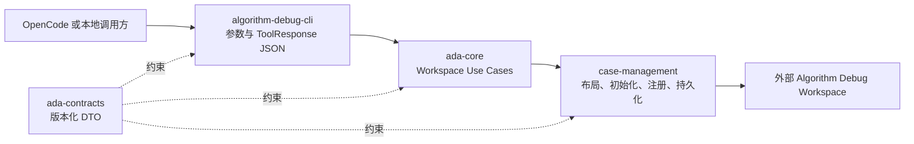
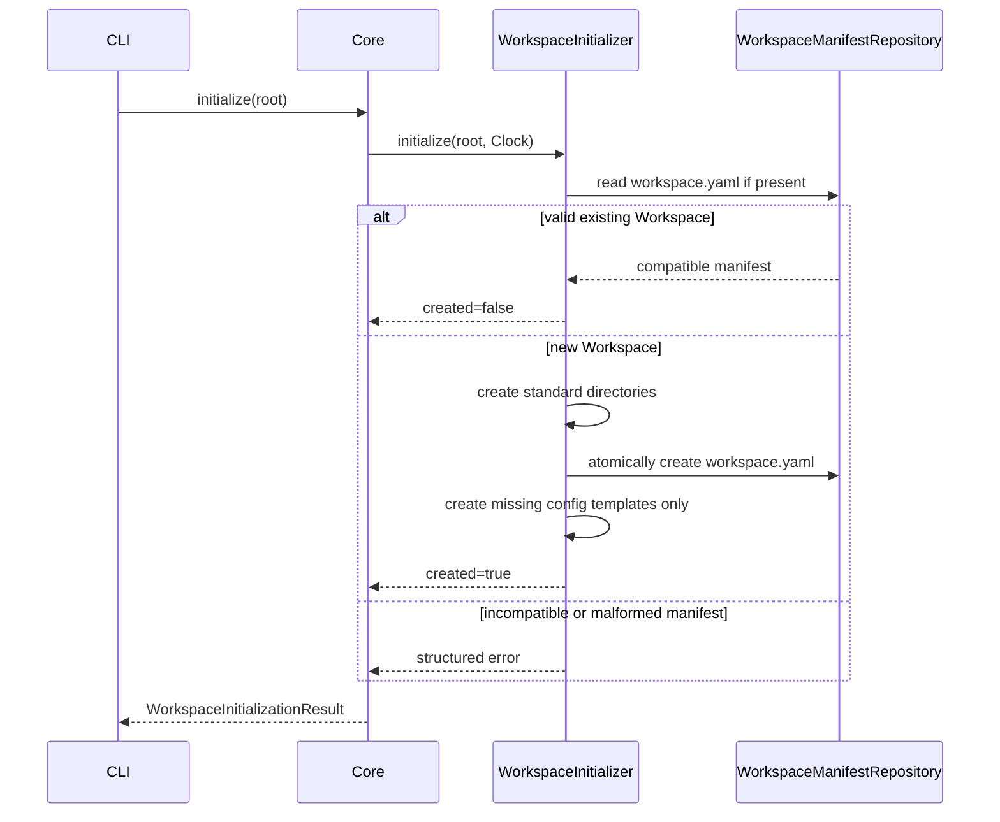
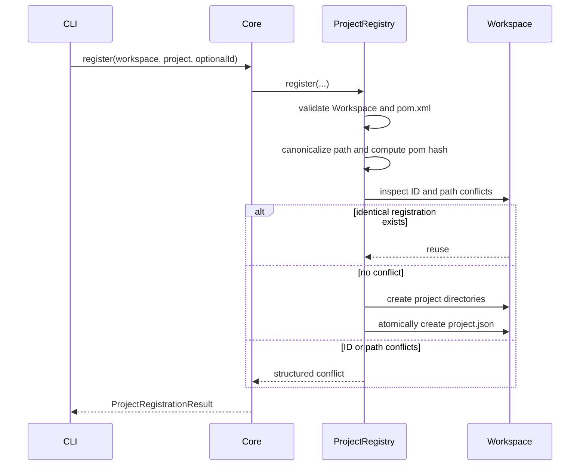

# 外部 Workspace 控制面可实施设计

- 文档状态：Review
- 设计版本：0.1
- 创建日期：2026-08-16
- 负责人：Codex / mh90901119-oss
- 目标里程碑：P0 - 外部 Workspace 控制面
- 关联需求：现状审计与目标架构差距分析；用户确认采用现有模块分层方案
- 关联决策：`ADR-006-case-as-analysis-dossier.md`、`ADR-007-opencode-adapter-via-cli.md`

## 1. 背景与问题

当前 `CaseWorkspace` 接受调用方提供的目录，因此底层类并未强制把 Case 写入目标算法仓库；但产品默认配置仍使用
`.algorithm-debug/runs`，也不存在 Workspace 初始化、项目注册、配置发现、环境诊断或可执行 CLI。结果是已经实现的
Harness、Adapter 和 Baseline 能力无法通过稳定控制面组合，OpenCode 薄适配也找不到真实 `ada` 命令。

最新产品边界要求严格区分：

- Agent 安装目录：保存可执行程序、内置 Schema、默认配置和 Collector bundle；
- Agent 数据 Workspace：保存用户配置、项目登记、知识、Case、Artifact、日志和缓存；
- 目标算法仓库：只作为被分析的源码和 UT，不默认保存 Agent Case 数据。

本切片先建立外部 Workspace 控制面。它不提前实现 Input Analysis、完整 Case Repository、OpenCode 安装器或动态采集。

## 2. 目标与非目标

### 2.1 目标

- 幂等初始化一个独立的 Algorithm Debug Workspace；
- 将 Maven 目标项目注册到 Workspace，且不写目标项目；
- 通过确定性目录布局派生项目 Case 根目录；
- 建立 CLI、项目配置、Workspace 配置和内置默认值的优先级基础；
- 提供 Java 21、Maven、Workspace 和目标项目的只读/最小写入诊断；
- 提供可执行 Java CLI 主类，stdout 只输出 `ToolResponse` JSON；
- 保持 `ada-contracts`、`case-management`、`ada-core`、`algorithm-debug-cli` 的依赖方向；
- 修正文档和默认配置中与外部 Workspace、简化 Case 模型、JDWP-MCP 边界及 `/debug-case` 正式入口冲突的表述；
- 使用 Red-Green-Refactor 实现行为，并在每个模块完成后执行代码审计和测试。

### 2.2 非目标

- 不实现 Context 输入快照、input overview/search/get；
- 不实现完整 Case、Context、Run、Analysis、Evidence Repository；
- 不运行目标 UT，也不接入 Debug Harness；
- 不实现 CodePathTracer/JDWP Collector、Plan、Trace 或 Evidence；
- 不实现 OpenCode 安装、升级或卸载；
- 不创建 Algorithm Debug MCP Server；
- 不支持其他 Agent Runtime；
- 不实现旧 `.algorithm-debug` 数据自动迁移；检测到旧目录时仅由后续调用方提示。

## 3. 方案选择

### 3.1 采用方案

复用现有模块边界：

- `ada-contracts` 保存跨进程稳定 DTO 和 Schema 版本；
- `case-management` 保存 Workspace 布局、初始化、项目注册和文件持久化；
- `ada-core` 暴露 Workspace、Project 和 Doctor Use Case；
- `algorithm-debug-cli` 只负责参数解析、调用 Core、序列化 ToolResponse 和退出码。

不新增 `workspace-management` 模块。当前职责规模不足以支撑独立模块，新增模块只会扩大空壳和依赖面。

### 3.2 拒绝方案

- CLI 直接读写 Workspace：会让确定性业务规则绑定 OpenCode 客户端入口，无法复用于测试和后续入口；
- 新建 `workspace-management`：边界看似独立，但与 Case 目录和项目注册高度内聚，当前阶段违反 YAGNI；
- 继续使用目标仓库 `.algorithm-debug`：与已确认产品目录边界直接冲突。

## 4. 总体架构



依赖方向固定为：

```text
algorithm-debug-cli -> ada-core -> case-management -> ada-contracts
algorithm-debug-cli -> ada-contracts
```

`case-management` 不依赖 `ada-core`；`ada-contracts` 不依赖任何实现模块；CLI 不直接创建目录或写 JSON/YAML。

## 5. Workspace 目录契约

`ada workspace init --root <path>` 创建或验证以下结构：

```text
<workspaceRoot>/
├─ workspace.yaml
├─ config/
│  ├─ application.yaml
│  ├─ execution.yaml
│  ├─ collection-limits.yaml
│  ├─ security-policy.yaml
│  └─ projects/
├─ knowledge/
│  └─ shared/
├─ projects/
├─ system/
│  ├─ locks/
│  ├─ indexes/
│  └─ logs/
├─ cache/
└─ temp/
```

注册项目后新增：

```text
projects/<PROJECT-ID>/
├─ project.json
├─ knowledge/
│  ├─ sources/
│  ├─ manifests/
│  └─ indexes/
└─ cases/
```

`system/installation.json` 由后续安装器切片负责，本切片不伪造安装完成状态。

所有目录通过 `WorkspaceLayout` 从规范化 Workspace 根路径派生。实现必须验证最终路径仍位于根路径内，拒绝 `/`、`\\`、
`.`、`..`、盘符或控制字符构成的 ProjectId 路径段。不得以字符串拼接构造路径。

## 6. 数据与 Schema

### 6.1 `workspace.yaml`

```yaml
schemaVersion: "1.0"
kind: "ALGORITHM_DEBUG_WORKSPACE"
createdAt: "2026-08-16T00:00:00Z"
```

不保存 `workspaceRoot`，使整个 Workspace 可移动。初始化时间由注入的 `Clock` 生成，测试不得依赖真实时间。

### 6.2 `project.json`

```json
{
  "schemaVersion": "1.0",
  "projectId": "hellomvn-a1b2c3d4e5f6",
  "displayName": "hellomvn",
  "projectRoot": "D:/javacode/hellomvn",
  "buildTool": "MAVEN",
  "pomSha256": "<64 lowercase hex characters>",
  "registeredAt": "2026-08-16T00:00:00Z"
}
```

注册表需要保存规范化绝对路径，以便 Agent 从任意目标仓库会话解析项目；该路径只用于本机确定性控制面，不默认进入最终报告。
`pomSha256` 只标识注册时 POM，不代替后续 Context 的源码和 classpath Fingerprint。

如果未显式传入 ProjectId，默认值为：

```text
sanitize(lowercase(target-directory-name)) + "-" + first12(sha256(canonical-project-path))
```

生成规则必须确定、无随机数、无真实时间，并将不安全字符折叠为单个 `-`。调用方显式提供的 ID 仍需执行安全路径段校验。

### 6.3 跨模块 DTO

`ada-contracts` 新增以下不可变 DTO：

| DTO | 关键字段 | 用途 |
|---|---|---|
| `WorkspaceInitializationResult` | root、created、schemaVersion | 初始化结果 |
| `ProjectRegistration` | schemaVersion、ProjectId、displayName、projectRoot、buildTool、pomSha256、registeredAt | 项目注册事实及 `project.json` 契约 |
| `ProjectRegistrationResult` | registration、created | 区分首次注册与幂等复用 |
| `DoctorCheck` | name、status、code、message | 单项环境诊断 |
| `DoctorReport` | overallStatus、checks | 有界诊断摘要 |

Doctor 状态只使用 `PASS`、`WARN`、`FAIL`。Doctor 命令本身成功执行时返回成功 ToolResponse；环境不满足要求通过
`DoctorReport.overallStatus=FAIL` 表达，避免丢失各项诊断数据。

新增 Schema：

- `schemas/workspace/workspace-manifest-v1.schema.json`；
- `schemas/workspace/project-registration-v1.schema.json`；
- `schemas/workspace/doctor-report-v1.schema.json`。

Schema 版本常量集中加入 `SchemaVersions`。已有 Schema 不覆盖、不改变主版本。

## 7. 模块与类设计

### 7.1 `case-management`

| 类 | 职责 |
|---|---|
| `WorkspaceLayout` | 规范化根路径并安全派生所有标准目录 |
| `WorkspaceInitializer` | 幂等创建目录、模板和 Workspace Manifest |
| `WorkspaceManifestRepository` | 原子 create-new、读取并验证 `workspace.yaml` |
| `ProjectIdGenerator` | 根据规范化目标路径生成确定性 ProjectId |
| `ProjectRegistry` | 校验 Maven 项目、注册、读取和冲突检测 |
| `ProjectRegistrationRepository` | 原子写入和读取 `project.json` |
| `WorkspaceConfigurationResolver` | 按固定层级合并 YAML 配置并拒绝不支持的 Schema |
| `AtomicDocumentWriter` | 同目录临时文件、flush、原子移动；不覆盖终态文档 |

`CaseWorkspace` 保持接收外部 `casesRoot` 的接口，但新增调用点必须通过
`WorkspaceLayout.projectCases(ProjectId)` 获得该路径，不再读取 `caseRoot` 配置。

### 7.2 `ada-core`

| 类 | 职责 |
|---|---|
| `WorkspaceApplicationService` | 执行 initialize Use Case |
| `ProjectApplicationService` | 执行 register Use Case |
| `DoctorApplicationService` | 聚合 Java、Maven、Workspace 和 Project 检查 |
| `MavenExecutableLocator` | 按显式路径、`MAVEN_HOME`、`M2_HOME`、PATH 查找 Maven，不依赖 `maven.home` |

Core 返回 DTO 或有错误码的领域异常，不打印 stdout，不依赖 CLI 参数类型。

### 7.3 `algorithm-debug-cli`

| 类 | 职责 |
|---|---|
| `AdaMain` | Java 主入口、退出码和依赖装配 |
| `CliArguments` | 严格解析三个命令及其选项 |
| `CliCommandExecutor` | 将解析结果映射到 Core Use Case |
| `CliResponseWriter` | 将 ToolResponse 2.0 作为单个 JSON 文档写 stdout |

第一批命令：

```text
ada workspace init --root <workspaceRoot>
ada project register --workspace <workspaceRoot> --project <projectRoot> [--project-id <id>]
ada doctor --workspace <workspaceRoot> [--project <projectRoot>]
```

在 OpenCode 安装器完成前，构建产物通过可执行 fat JAR 验证。安装后的 `ada.cmd` 和 PATH 登记属于后续安装切片。

本切片不引入 Picocli；只有三个固定命令，使用小型严格解析器，拒绝未知选项、重复选项和缺失值。

## 8. 配置优先级

统一优先级为：

```text
本次 CLI 显式参数
  > Workspace 项目级配置 config/projects/<PROJECT-ID>/<name>.yaml
  > Workspace 用户级配置 config/<name>.yaml
  > Agent 安装目录内置默认 config/<name>-default.yaml
```

YAML 合并规则：

- Object 节点递归合并；
- Scalar 和 Array 由高优先级整体替换；
- 每一层必须声明同一受支持的 `schemaVersion`；
- 未知顶层配置文档不自动加载；
- CLI 覆盖只接受该命令声明的字段，不允许任意 `key=value` 注入。

本切片实现并测试解析器与优先级，但不为尚未实现的 Collector 发明新配置字段。现有 application、collection-limits、security-policy
模板继续保留已定义字段；`application` 删除 `caseRoot`。`execution.yaml` 仅包含 Schema 版本，具体执行字段在 Harness 配置切片设计后增加。

## 9. 核心流程

### 9.1 Workspace 初始化



已有配置永不被初始化命令覆盖。部分目录存在但没有 `workspace.yaml` 时，命令可以补齐目录并创建 Manifest；存在无法识别的
Manifest 时必须失败，不得猜测或重写。

### 9.2 项目注册



同一个规范化项目路径和同一个 ProjectId 重复注册是成功的幂等操作。以下情况失败：

- 同一 ProjectId 指向另一个路径；
- 同一路径以另一个 ProjectId 重复注册；
- 目标目录不存在、不是目录或没有普通文件 `pom.xml`；
- ProjectId 造成路径逃逸；
- Workspace Manifest 缺失或版本不支持。

### 9.3 Doctor

Doctor 顺序执行并保留所有检查结果：Java 版本、Maven 可执行文件、Workspace Manifest、Workspace 写入能力、可选项目目录和 POM。
检查之间不得因为一个 FAIL 而中断其他只读检查。写入能力测试只在 `<workspace>/system` 创建唯一临时文件并立即删除，不触碰目标仓库。

## 10. 错误与 CLI 契约

稳定错误码至少包括：

| 错误码 | 含义 |
|---|---|
| `CLI_INVALID_ARGUMENTS` | 未知命令、选项、重复项或缺失值 |
| `WORKSPACE_PATH_INVALID` | Workspace 路径不可创建或不是目录 |
| `WORKSPACE_MANIFEST_INVALID` | Manifest 格式或必填字段无效 |
| `WORKSPACE_SCHEMA_UNSUPPORTED` | Schema 版本不支持 |
| `WORKSPACE_WRITE_FAILED` | Workspace 原子写入失败 |
| `PROJECT_NOT_MAVEN` | 目标项目缺少普通文件 `pom.xml` |
| `PROJECT_ID_CONFLICT` | ProjectId 已指向其他路径 |
| `PROJECT_PATH_CONFLICT` | 项目路径已使用其他 ProjectId 注册 |
| `PROJECT_REGISTRATION_INVALID` | `project.json` 无效 |
| `CONFIG_INVALID` | YAML、Schema 或配置形状无效 |
| `INTERNAL_ERROR` | 未预期 Agent 错误；保留 cause 到本地日志，不回显堆栈 |

stdout 必须只有一个 UTF-8 ToolResponse JSON 文档。普通诊断写 stderr；不得输出堆栈、凭据或完整环境变量。CLI 参数错误和领域错误
返回失败 ToolResponse；成功命令返回成功 ToolResponse。退出码约定：成功为 0、参数错误为 2、确定性领域失败为 3、未预期 Agent
错误为 10。

## 11. 安全、兼容与依赖

- 目标项目只读；项目注册不在目标项目创建文件；
- Workspace 所有写入目标必须经过根路径边界校验；
- 终态 Manifest 和注册记录使用 create-new 语义，不允许覆盖；
- 临时文件必须和目标文件位于同一目录，优先原子移动；不支持原子移动时明确失败，不静默降级为覆盖；
- 不读取或输出凭据环境变量；
- `projectRoot` 保存在本机注册文件中，但不得默认进入报告或 LLM 摘要；
- 不自动导入旧 `.algorithm-debug`；
- 新增 Jackson Dataformat YAML 用于 YAML 解析。它与项目已有 Jackson BOM 同版本，许可证为 Apache-2.0；不引入 CLI 框架；
- fat JAR 使用 Apache Maven Shade Plugin，仅用于构建分发产物，不改变模块运行时 API。

## 12. 性能与容量预算

本切片不处理大型 Trace，但所有控制面输入仍有硬边界：

| 项目 | 默认上限 | 超限行为 |
|---|---:|---|
| 单个 YAML/JSON 控制文件 | 1 MiB | 拒绝读取并返回结构化错误 |
| ProjectId | 128 个字符，且必须为安全路径段 | 拒绝 |
| displayName | 256 个字符 | 拒绝 |
| Doctor 检查数 | 32 | 实现固定集合，不接受外部无界扩展 |
| CLI stdout | 1 MiB | CLI 在序列化前拒绝；同时满足 OpenCode Wrapper 上限 |

Workspace 初始化和项目注册的目录扫描不得递归遍历目标仓库；只读取目标根目录和 `pom.xml`。

## 13. 测试设计

### 13.1 Contracts 与 Schema

- Workspace、Project、Doctor DTO 构造不变量；
- JSON round-trip；
- DTO 示例对三个 JSON Schema 校验；
- 旧 ToolResponse、RunOutcome 和 Baseline Schema 回归不变。

### 13.2 `case-management` 单元测试

- `WorkspaceLayoutTest.shouldDeriveProjectCasesOutsideTargetRepository`；
- `WorkspaceLayoutTest.shouldRejectEscapingProjectId`；
- `WorkspaceInitializerTest.shouldCreateStandardWorkspace`；
- `WorkspaceInitializerTest.shouldBeIdempotentAndPreserveUserConfiguration`；
- `WorkspaceInitializerTest.shouldRejectUnsupportedExistingManifest`；
- `ProjectRegistryTest.shouldRegisterMavenProjectWithoutWritingTarget`；
- `ProjectRegistryTest.shouldReturnExistingIdenticalRegistration`；
- `ProjectRegistryTest.shouldRejectProjectIdConflict`；
- `ProjectRegistryTest.shouldRejectProjectPathConflict`；
- `ProjectRegistryTest.shouldRejectMissingPom`；
- `WorkspaceConfigurationResolverTest.shouldApplyCliProjectWorkspaceDefaultPriority`；
- `AtomicDocumentWriterTest.shouldRejectOverwrite`。

测试使用 `@TempDir`、固定 `Clock` 和最小 POM Fixture，不依赖网络、真实用户目录或真实时间。

### 13.3 `ada-core` 单元测试

- 初始化和注册 Use Case 只委托领域服务并返回契约 DTO；
- Maven 显式路径、`MAVEN_HOME`、`M2_HOME`、PATH 查找顺序；
- 所有 Maven 来源缺失时 Doctor 返回 FAIL 而不是抛 NPE；
- Doctor 一个检查失败时仍返回其他检查结果；
- Doctor 不写目标项目。

### 13.4 CLI 测试

- 三个命令的成功 JSON；
- 未知/重复/缺失参数；
- stdout 可被 ToolResponse 2.0 反序列化且无额外文本；
- stderr 与 stdout 分离；
- 领域失败不输出堆栈；
- fat JAR 通过 `java -jar` 初始化临时 Workspace。

### 13.5 回归与审计

- `mvn -pl ada-contracts,case-management,ada-core,algorithm-debug-cli -am test`；
- `mvn test`；
- `node --test integrations/opencode/test/ada-cli.test.mjs`；
- `rg` 验证活动文档不再把目标仓库 `.algorithm-debug`、直接 JDWP-MCP 或 `/debug-case` fallback 描述为当前正式方案；
- 审计新增公共 API 中文 Javadoc、依赖方向、路径逃逸、原子写入和未提交文件范围。

## 14. 实施顺序

1. 同步活动架构文档和配置模板，建立唯一外部 Workspace 事实源；
2. 先增加 Workspace/Project/Doctor DTO 与 Schema 失败测试，再实现契约；
3. 先增加 WorkspaceLayout、Initializer、Manifest Repository 失败测试，再实现；
4. 先增加 Project Registry、冲突和目标仓库只读测试，再实现；
5. 先增加配置优先级失败测试，再实现 YAML Resolver；
6. 先增加 Core Use Case 和 Maven 定位回归测试，再实现；
7. 先增加 CLI 参数、JSON、错误和 fat JAR 测试，再实现；
8. 分模块代码审计，修复发现的本切片缺陷；
9. 执行受影响模块、根 Reactor、OpenCode Wrapper 和 fat JAR 集成验证；
10. 更新 README、模块状态和实现完成记录。

## 15. 回滚与迁移

这是尚未发布的新控制面，不修改已有 Baseline Schema，也不迁移临时测试目录。回滚代码时保留用户已经创建的外部 Workspace；
因为 Manifest 和 Project Registration 都是版本化独立文件，旧版本不能识别时应拒绝写入，而不是删除或覆盖数据。

默认配置移除 `caseRoot` 是目标行为变化。已有直接调用 `CaseWorkspace.create(casesRoot, caseId)` 的测试和库 API 继续兼容；只有后续
产品调用必须使用 `WorkspaceLayout.projectCases(projectId)`。

## 16. 风险与已决事项

| 风险/问题 | 影响 | 决策 |
|---|---|---|
| 为 Workspace 新增独立模块 | 增加空壳和循环边界风险 | 不新增，归入 case-management |
| 项目移动后路径变化 | 原注册无法自动确认同一项目 | 明确重新注册或后续迁移，不猜测 |
| 初始化覆盖用户配置 | 丢失本地设置 | 只创建缺失文件，已有文件只验证不覆盖 |
| Doctor 使用 `maven.home` | 当前集成测试已出现 NPE | 按显式路径、环境变量、PATH 查找，缺失作为诊断结果 |
| Windows 路径大小写/符号链接 | 重复注册或路径逃逸 | 使用规范化绝对路径；存在路径优先 `toRealPath` |
| 通用 YAML 合并过度复杂 | 隐式配置难以理解 | 固定四层、固定合并规则、固定文档集合 |
| 当前工作区已有未提交修改 | 误覆盖用户工作 | 原地工作但只修改本切片文件；每次提交精确暂存 |

## 17. 文档同步清单

- [ ] `docs/architecture/algorithm-debug-agent-module-detailed-design-v1.md`
- [ ] `docs/architecture/algorithm-debug-agent-complete-design.md`
- [ ] `docs/designs/2026-08-12-case-context-run-outcome-multiturn-analysis-design.md`
- [ ] `docs/decisions/ADR-007-opencode-adapter-via-cli.md`
- [ ] `config/README.md` 与配置模板
- [ ] `integrations/opencode/README.md`
- [ ] 根 README 与受影响模块 README
- [ ] Workspace/Project/Doctor Schema 示例

## 18. 自审结果

- 不存在占位标记或未定义的核心边界；
- 未把目标架构描述成当前实现；
- 未新增无需求支撑的 Maven 模块；
- CLI、Core、Case Management 和 Contracts 的依赖方向一致；
- Workspace 数据不默认进入目标算法仓库；
- 保留 LLM 决策与确定性代码执行的现有边界；
- 测试覆盖成功、幂等、冲突、损坏配置、路径逃逸和 Maven 缺失；
- 本切片没有提前实现 Input Analysis、Collector 或 MCP。

## 19. 变更记录

| 日期 | 版本 | 变更内容 | 作者 |
|---|---|---|---|
| 2026-08-16 | 0.1 | 根据完整现状审计和用户确认，定义外部 Workspace 控制面首个实施切片 | Codex / mh90901119-oss |
