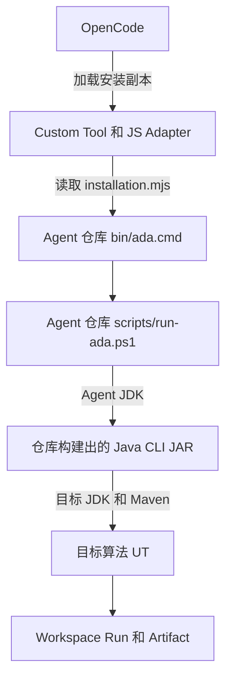

# OpenCode Algorithm Debug Agent 调试指南

本文用于定位以下问题：OpenCode 已经能够发现 `algorithm-debug` Agent，但端到端执行目标 UT、
归档 Gantt、静态分析、CodePath 或 JDWP 时失败。本文描述当前代码的真实加载方式、故障分层和
修改后的生效动作，不把“安装成功”误认为“运行时可用”。

## 1. 先区分发现成功与端到端成功

安装器的 `Check` 会校验安装文件并调用：

```powershell
opencode --version
opencode debug skill
opencode debug agent algorithm-debug
opencode debug config
```

这些命令只证明 OpenCode 能发现 Agent、Skill、Command 和 Custom Tools。它们不执行 Java CLI、
Maven、目标 UT、CodePath 或 JDWP，也不验证 Gantt 归档。因此：

| 状态 | 准确含义 |
|---|---|
| `OPENCODE_ADAPTER_OK` | OpenCode 接入资产已安装且能够被发现 |
| Launcher 可用 | `ada.cmd -> run-ada.ps1 -> Java CLI` 可以启动 |
| Toolchain 可用 | Agent JDK、目标 JDK 和 Maven 可以执行 |
| 目标 UT 可用 | 指定 Maven 模块能够独立运行 `class#method` |
| 端到端可用 | Case、输入、Run、日志和可选 Gantt 均正确归档 |
| Collector 可用 | CodePath 或 JDWP 能在独立重跑中产生有效证据 |

必须根据实际失败阶段判断，不能仅凭 OpenCode 已发现 Agent 排除 Agent 故障。

## 2. 当前安装和运行模型

当前采用“复制 OpenCode 接入资产，运行 Agent 仓库后端”的模型。

安装器复制以下文件到配置的 `openCodeConfigDirectory`：

| 类型 | 安装副本 |
|---|---|
| Agent、Skill、Command | 有 |
| Custom Tool TypeScript、JS Adapter | 有 |
| `lib/installation.mjs` | 安装时根据 `config/agent-settings.json` 生成 |
| Java Agent JAR | 无 |
| `bin/ada.cmd`、`scripts/run-ada.ps1` | 无 |
| CodePath Launcher JAR、JDWP Collector JAR | 无 |

`installation.mjs` 保存 Agent 仓库中 `bin/ada.cmd` 的绝对路径。运行链路为：



图中箭头含义：OpenCode 只加载安装副本；JS Adapter 启动安装时记录的仓库 Launcher；Launcher
再启动仓库中的脚本和构建产物。因此安装后不得删除或移动 Agent 仓库。仓库移动后必须在新位置
重新执行安装器。

## 3. 普通 UT 的完整命令链

大模型调用 `analysis_begin` 时，JS Adapter 先执行：

```text
ada workspace init --root <workspace>
ada project register --workspace <workspace> --project <OpenCode当前目录> --result-directory <Gantt目录>
ada case open --workspace <workspace> --project-id <projectId> --test <class#method> ...
```

`analysis_begin` 不运行 UT。`algorithm_input_capture` 成功归档唯一的 `input.json` 后，大模型调用
`run_test`，JS Adapter 执行：

```text
ada run execute --workspace <workspace> --project-id <projectId> --case-id <caseId> --analysis-id <analysisId>
```

Windows 上的 `ada` 实际是仓库中的 `bin\ada.cmd`。它调用 `scripts\run-ada.ps1`，脚本使用
Agent JDK 启动：

```text
<agentJavaHome>\bin\java.exe -jar <algorithm-debug-cli-*-all.jar> run execute ...
```

Java Agent 读取项目注册信息后，在注册的 Maven 模块根目录启动：

```text
<mvn.cmd绝对路径> -Dtest=<完整测试类名#测试方法名> -DfailIfNoTests=true test
```

参数含义：

| 参数 | 含义 |
|---|---|
| `-Dtest=class#method` | 只让 Surefire 执行指定测试，不限制 Maven 编译范围 |
| `-DfailIfNoTests=true` | 没有匹配到测试时失败，避免把“未执行测试”误判为通过 |
| `test` | 执行 Maven test 生命周期，包括当前模块的 main/test 编译和 Surefire |

Agent 不主动增加 `clean`、`package`、`install`、`-pl`、`-am`、`-P` 或 `-s`。如果 OpenCode
从聚合 POM 目录启动，Maven 可能处理整个 Reactor；如果从真正包含目标 UT 和 `pom.xml` 的模块
目录启动，Maven 仍会编译该模块的全部 main/test 源码，然后只执行指定 UT。这是 Maven 的正常行为。

## 4. 五层故障定位

| 层级 | 典型现象 | 首要检查位置 |
|---|---|---|
| OpenCode 发现层 | Agent、Skill、Tool 不存在 | 安装器 `Check` 和 OpenCode 输出 |
| JS Adapter 层 | 参数映射、CLI 启动或 ToolResponse 校验失败 | OpenCode Tool 返回和 Case `interaction.jsonl` |
| Launcher 层 | JDK、JAR、Maven 路径错误 | Tool 错误和 bootstrap Java 日志 |
| Java Agent 层 | Case、输入、归档、状态转换或采集异常 | Case `logs/agent-YYYY-MM-DD.log` |
| Maven/UT 层 | 编译失败、业务异常、断言失败 | Run 的 stdout、stderr 和 Surefire 报告 |

目标 UT 失败不等于 Agent Tool 失败。Agent 正常归档业务异常或断言失败时，Tool 调用可以成功，
`run-outcome.json` 记录目标失败事实。只有 Launcher、Java CLI、Maven 启动、协议或归档等 Agent 边界
失败时，才应优先调试 Agent 或环境。

## 5. 日志和数据从哪里看

默认 Case 根目录为：

```text
<workspace>/projects/<projectId>/cases/<caseId>/
```

按以下顺序检查：

| 文件 | 作用 |
|---|---|
| `interaction.jsonl` | OpenCode Tool 和 CLI 的调用顺序、状态、耗时、错误码及关联 ID |
| `logs/agent-YYYY-MM-DD.log` | Java CLI、输入、UT、静态分析、CodePath、JDWP 的执行阶段和异常栈 |
| `runs/<runId>/run-outcome.json` | 进程、测试、失败诊断和 Gantt 的结构化结果 |
| `runs/<runId>/raw/stdout.log` | Maven/JUnit stdout |
| `runs/<runId>/raw/stderr.log` | Maven/JUnit stderr，合法情况下可以是零字节 |
| `runs/<runId>/raw/surefire/` | 本次目标测试变化的 Surefire 报告 |
| `runs/<runId>/raw/gantt.json` | 本次 UT 新增或变化且已归档的 Gantt，未产生时不存在 |
| `collections/<collectionId>/logs/` | CodePath 或 JDWP 的目标进程和 Collector 日志 |

Case 创建前的 Java CLI 失败写入：

```text
<dfxDirectory>/java/agent-bootstrap-YYYY-MM-DD.log
```

先用 `interaction.jsonl` 确定失败工具和 ID，再进入对应 Run 或 Collection；不要先在整个 Workspace
无目标搜索。Java 未预期异常应在 Agent 日志中保留调用栈，用类名和行号定位生产源码。逻辑错误但
没有异常栈时，结合稳定错误码、阶段日志和相应自动化测试定位。

## 6. 修复后需要 Build、Install 还是重启

| 修改内容 | Build Agent | Install OpenCode | 重启 OpenCode |
|---|---:|---:|---:|
| Java `.java` | 需要 | 不需要 | 通常不需要 |
| Agent Maven `pom.xml` | 需要 | 不需要 | 不需要 |
| CodePath Launcher、JDWP Collector 源码 | 需要 | 不需要 | 不需要 |
| `bin/ada.cmd`、`scripts/run-ada.ps1` | 不需要 | 不需要 | 不需要 |
| Custom Tool `.ts`、JS Adapter `.mjs` | 不需要 | 需要 | 需要 |
| Agent、Skill、Command Markdown | 不需要 | 需要 | 需要 |
| `config/agent-settings.json` | 视代码构建而定 | 需要 | 需要 |
| Agent 仓库移动 | 不需要 | 需要 | 需要 |

Java 修改后的最短闭环：

```powershell
cd <Agent仓库>
.\scripts\build-agent.ps1
```

每次 Tool 调用都会启动新的 Java CLI 进程，下一次调用会使用刚构建的 JAR，所以不需要重新安装
OpenCode 接入资产。

Tool、JS Adapter、Agent 或 Skill 修改后的闭环：

```powershell
cd <Agent仓库>
.\scripts\install-opencode.ps1 -Mode Install
.\scripts\install-opencode.ps1 -Mode Check
```

然后关闭并重新启动 OpenCode。普通更新不要求先卸载；`Install` 会校验现有受管文件后幂等覆盖。
只有受管安装副本被人工修改、manifest 丢失或需要彻底移除时才执行 Uninstall。

配置修改后统一重新 Install，是因为 OpenCode 使用安装时生成的 `installation.mjs`；只修改仓库配置
而不重装，可能导致 JS Adapter 与 Launcher 使用不同配置。

## 7. 推荐调试闭环

1. 从真正包含目标 UT 和 `pom.xml` 的 Maven 模块目录启动 OpenCode。
2. 确认安装器 `Check` 只代表发现成功，不把它当成端到端验收。
3. 复现一次失败，不要先修改目标算法 POM 或进行全量构建尝试。
4. 打开 Case `interaction.jsonl`，确认最后一个开始和完成或失败的 Tool。
5. 打开 Case Agent 日志；若没有 Case，打开 bootstrap 日志。
6. 如果 Maven 已启动，检查 Run stdout、stderr、Surefire 和 `run-outcome.json`。
7. 先判断故障属于 OpenCode、JS、Launcher、Java Agent、Maven 环境还是目标 UT。
8. 只修改对应层，按上一节执行 Build 或 Install。
9. 使用同一模块目录、同一目标 UT 重新执行，避免同时改变多个变量。

如果手动在目标模块执行同一条 Maven 命令成功，而 Agent 失败，优先核对 OpenCode 当前目录、项目
注册的 `moduleRoot`、Agent 实际 Maven 路径、目标 JDK 和继承的 Maven 环境。IDEA 中运行成功不能
替代这项比较，因为 IDEA 可能使用不同 Maven、JDK、Profile、settings.xml 或测试 Classpath。

## 8. 可直接交给 OpenCode 的排障约束

需要 OpenCode 调试 Agent 自身时，可以明确要求：

```text
请先阅读 Agent 仓库 docs/testing/opencode-agent-debugging.md。
按 OpenCode、JS Adapter、Launcher、Java Agent、Maven/UT 五层定位本次失败。
先读取已有 interaction.jsonl、Agent 日志、run-outcome、stdout/stderr 和 Surefire，
不要因为 IDEA 与 Maven 环境不同就直接修改目标算法 POM，也不要先执行全仓 clean/install。
说明故障层、直接证据、需要修改的仓库文件，以及修改后应 Build、Install 还是重启 OpenCode。
```

完整安装流程见 [目标环境源码 ZIP 安装与验证](target-algorithm-environment-installation.md)，Workspace
产物见 [工作流与产物指南](../algorithm-debug-workflow-and-artifacts.md)，卸载规则见
[OpenCode Algorithm Debug Agent 卸载与重新安装](opencode-uninstallation.md)。
