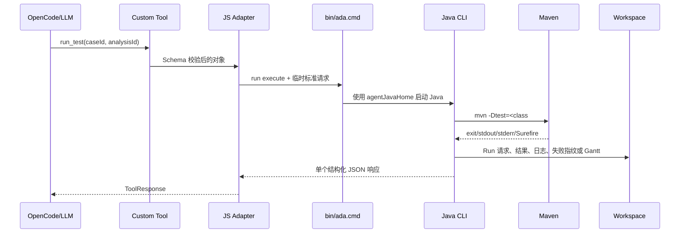

# OpenCode Agent 调试指南

## 1. 先区分源码与安装副本

OpenCode 默认加载 `openCodeConfigDirectory` 中的复制文件，不直接运行 Agent 仓库源码：

```text
仓库源码 -> build -> install -> OpenCode 安装副本
```

因此在代码仓修改 Java、Skill、Tool 或脚本后，OpenCode 仍可能运行旧版本。正确循环：

```powershell
.\scripts\build-agent.ps1
.\scripts\uninstall-opencode.ps1
.\scripts\install-opencode.ps1 -Mode Install
.\scripts\install-opencode.ps1 -Mode Check
```

不建议复制单个文件覆盖，因为 Java JAR、JS Tool、Skill 和安装清单可能失配。

## 2. Agent 执行一个 UT 的实际调用



普通 Java 日志不能写 stdout，因为 stdout 是 Tool 的 JSON 协议；日志写入 Case 的 `logs/agent-YYYY-MM-DD.log`，异常保留调用栈。

## 3. 分层定位

### 安装层

```powershell
.\scripts\install-opencode.ps1 -Mode Check
```

若 Agent/Skill/Tool 缺失，先重新安装，不分析算法。

### Java 启动层

在目标模块目录：

```powershell
D:\path\to\algorithm-debug-agent\scripts\verify-ada-launcher.ps1
```

若失败，检查 `agentJavaHome`、构建产物和 `dfxDirectory/java/agent-bootstrap-YYYY-MM-DD.log`。

### Maven/UT 层

```powershell
mvn "-Dtest=com.example.AlgorithmTest#targetMethod" "-DfailIfNoTests=true" test
```

若手动 Maven 失败，OpenCode 也无法成功。比较 IDE 与命令行的 JDK、Maven、settings.xml、Profile、环境变量和工作目录。

### Tool 交互层

查看 Case 根的 `interaction.jsonl`：

- `tool.request`：LLM 实际提交的参数。
- `tool.response`：Adapter 返回结果、耗时和关联 ID。
- 连续调用顺序可判断是否遵守输入优先和增量采集。

### Java 业务层

查看 Case `logs/agent-YYYY-MM-DD.log`。根据 `caseId`、`analysisId`、`runId`、`collectionId` 关联对应目录。发生异常时日志保留 cause 和调用栈；Tool 仍返回结构化错误，因此日志不会替代错误响应。

### 产物层

调用 `case_audit` 或查看审计响应，重点检查：

- 控制文件是否缺失。
- Artifact 文件与注册 SHA 是否一致。
- 是否存在未注册文件、非法 JSONL 或空目录。
- Collection 是否有 Raw、Manifest、Derived 和 Validation。

## 4. 常见现象

| 现象 | 最可能层次 | 处理 |
| --- | --- | --- |
| OpenCode 看不到 Agent | 安装层 | Check，确认 `openCodeConfigDirectory` |
| 看得到 Skill 但 Tool 缺失 | 安装/Tool API | 重新安装，查看能力发现错误 |
| 修改代码后行为不变 | 安装副本过期 | build + uninstall + install |
| IDE UT 成功但 Agent 失败 | Maven 环境差异 | 手动运行同一 Maven 命令 |
| `NO_TESTS` | UT 名称或模块目录错误 | 确认 package、类、方法和 OpenCode 启动目录 |
| `NO_JSON_CHANGED` | 结果路径/算法行为 | 检查解析后的日期目录和 UT 是否产生结果 |
| CodePath 没有事件 | classpath/目标方法计划 | 查看 Collection stderr、Plan 与 method catalog |
| JDWP attach 超时 | JDK/端口/安全软件 | 运行 loopback 验证 |
| JDWP 命中但无快照 | 条件未匹配或预算 | 查看 observed/matched/captured 与 unavailable reason |

## 5. 开发期验证顺序

1. 受影响 Node 或 Java 单元测试。
2. `mvn -Pcodepath-launcher test`。
3. `node --test integrations/opencode/test/*.test.mjs agent-evals/test/*.test.mjs`。
4. `build-agent.ps1`。
5. 临时 Installer 验证。
6. 本机卸载、重新安装、Check。
7. Launcher 和 JDWP loopback。
8. 真实 OpenCode Eval，并检查 Workspace 与日志。

完整安装见 [目标环境安装与验证](target-algorithm-environment-installation.md)，Workspace 文件见 [工作流与产物](../algorithm-debug-workflow-and-artifacts.md)。
