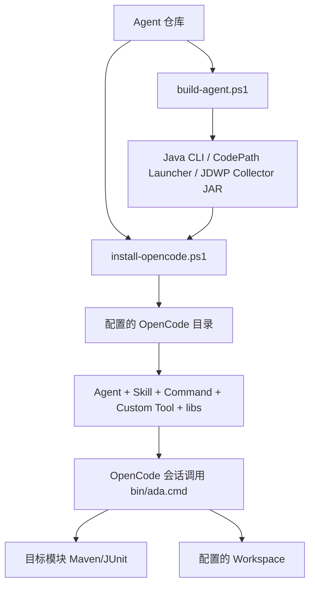

# 目标环境源码 ZIP 安装与验证

本文适用于：目标电脑已有可用 OpenCode 和大模型；Agent 仓库通过 GitHub ZIP 或 Git 获取；JDK 21 可以手动安装；目标算法 UT 已能在 IDE 中运行。

## 1. 安装原理

Agent 不安装 Windows Service，也不修改目标算法源码。流程是：



安装器复制文件，不创建符号链接。因此仓库代码修改后必须重新构建、卸载并安装，OpenCode 才会使用新版本。

## 2. 前提检查

### 2.1 OpenCode

```powershell
opencode --version
```

不要求固定版本。安装器最终通过能力发现检查 Agent、Skill 和关键 Tool；命令或插件 API 不兼容时会给出明确错误。

### 2.2 Agent JDK 21

可以和系统 JDK 17 并存，不必修改全局 `JAVA_HOME`。在配置中填写 JDK 21：

```json
"agentJavaHome": "D:\\tools\\jdk-21"
```

Agent 构建、Java CLI 和 Collector 使用它。

### 2.3 目标 UT JDK

目标算法继续使用其兼容 JDK，例如：

```json
"targetJavaHome": "D:\\tools\\jdk-17"
```

为空时回退到可发现 Java。Agent JDK 与目标 JDK 分离，不改变 IDE 工程 SDK。

### 2.4 Maven

Maven 的作用是让 Agent 在命令行精确执行同一个 UT，并为 CodePath 解析测试 classpath。IDE 中运行成功不自动保证外部 Maven 成功，因为 IDE 可能使用自己的 Maven、Profile、环境变量、工作目录或未写入 POM 的依赖。

在目标算法 Maven 模块目录先手动验证：

```powershell
mvn "-Dtest=com.example.AlgorithmTest#targetMethod" "-DfailIfNoTests=true" test
```

这里的完整类名是测试源码 `package` 加类名，方法名是 `@Test` 方法。Maven 3.9.9 可用。若项目使用 Maven Wrapper，可将配置写为其可执行脚本；否则设置 `mavenExecutable` 或确保 `mvn` 在 `PATH`。

命令失败时先解决目标项目的 Profile、Settings、镜像和依赖，不要让安装器修改目标 POM。只有该 UT 本身在 Maven 下确实缺少测试依赖时，才由目标项目维护者决定是否补充。

## 3. 解压仓库

将 ZIP 解压到稳定路径，例如：

```text
D:\tools\algorithm-debug-agent
```

不要从临时下载目录安装后再删除仓库。当前安装副本包含运行 JAR，但重新构建、验证和卸载仍需要仓库脚本。

## 4. 配置路径

编辑仓库内 `config/agent-settings.json`。所有默认值都保留在文件中，用户直接修改即可，不通过命令参数传业务路径。

示例：

```json
{
  "schemaVersion": "1.0",
  "openCodeConfigDirectory": "%USERPROFILE%\\.config\\opencode",
  "workspaceDirectory": "%LOCALAPPDATA%\\algorithm-debug-agent\\workspace",
  "dfxDirectory": "%LOCALAPPDATA%\\algorithm-debug-agent\\diagnostics",
  "evalDirectory": "%LOCALAPPDATA%\\algorithm-debug-agent\\evals",
  "resultJsonDirectory": "D:\\log\\scheduler\\${runDate}\\gant",
  "agentJavaHome": "D:\\tools\\jdk-21",
  "targetJavaHome": "D:\\tools\\jdk-17",
  "mavenExecutable": "mvn",
  "dfxEnabled": true
}
```

用户通常只需确认：

- `openCodeConfigDirectory` 是当前 OpenCode 实际配置目录。
- `workspaceDirectory` 有写权限，可按需要改为其他绝对路径。
- `resultJsonDirectory` 与目标算法真实输出一致；绝对路径完全支持。
- `${runDate}` 会解析为运行当天的 `yyyy-MM-dd`，例如 `2026-09-01`。
- 两个 JDK 和 Maven 可执行文件存在。

安装脚本会打印解析后的关键路径。结果目录不必在安装时已经存在，因为算法可能在 UT 运行时创建；Run 后没有发现 JSON 时会返回明确捕获状态和已解析目录。

## 5. 构建 Agent

在 Agent 仓库根目录：

```powershell
.\scripts\build-agent.ps1
```

脚本读取配置的 Agent JDK 和 Maven，执行带 `codepath-launcher` Profile 的 Maven package，并准备：

- Algorithm Debug Java CLI 及依赖。
- CodePath JUnit Launcher JAR。
- JDWP Batch Collector JAR。

目标算法不能从受限 Maven 镜像下载 CodePath/JDWP 依赖并不影响这一步，因为运行所需 JAR 随 Agent 安装副本提供，不要求加入目标算法 POM。Agent 自身构建依赖仍需在下载 ZIP 前构建好，或在目标电脑 Maven 仓库可用；正式仓库提交应包含安装所需归档资产的既定交付方式。

## 6. 安装到 OpenCode

```powershell
.\scripts\install-opencode.ps1 -Mode Install
```

安装内容包括 Agent、Skill、Command、Custom Tool、JS Runtime、`bin/ada.cmd`、Java CLI 和 Collector。脚本创建 ownership manifest，后续卸载只处理本次安装拥有的文件。

安装器不会：

- 修改目标算法仓库、源码或 POM。
- 修改系统 `JAVA_HOME`。
- 安装 Maven 或 OpenCode。
- 把目标算法模块路径写进配置。

## 7. 检查安装能力

```powershell
.\scripts\install-opencode.ps1 -Mode Check
```

检查必须发现 Agent、Skill、基础分析 Tool、输入捕获 Tool、静态分析、CodePath、JDWP 和收尾 Tool。Check 失败表示当前安装副本或 OpenCode API 不兼容，不应绕过继续 E2E。

## 8. 验证 Java Launcher

切换到目标算法 Maven 模块目录：

```powershell
D:\tools\algorithm-debug-agent\scripts\verify-ada-launcher.ps1
```

脚本使用当前目录作为目标模块，在临时 Workspace 执行 Doctor。它验证 Java CLI 能否启动、Maven/JDK 是否可用，以及 CodePath/JDWP 运行资产是否存在。它不永久注册当前项目，也不要求传路径参数。

## 9. 验证 JDWP loopback

在 Agent 仓库根目录：

```powershell
.\scripts\verify-jdwp-loopback.ps1
```

此验证启动本地测试 JVM 和 Collector，通过 `127.0.0.1` attach。通过说明 JDK、Collector、loopback 网络和条件快照基础链路可用；失败时查看脚本输出及 `dfxDirectory/java/` 日志，安全软件拦截通常表现为 attach 超时、连接拒绝或子进程被终止。

## 10. 启动 OpenCode

在目标算法 Maven 模块目录启动：

```powershell
opencode
```

当前工作目录用于确定目标模块和稳定 `projectId`。不要在 Agent 仓库目录提问目标算法 UT，否则 Maven 会运行错误项目。

## 11. 首次手动分析

明确指定完整 UT：

```text
使用 algorithm-debug 分析
com.example.AlgorithmTest#targetMethod：
解释 Gantt 中 WAFER-2 为什么在 60 秒才开始 PICK。
```

正常顺序是 `analysis_begin`、`algorithm_input_capture`、`artifact_read`，随后由证据缺口决定是否运行 UT、静态分析、CodePath 或 JDWP。用户不需要在问题中重复 Workspace、结果目录或 JDK 路径。

## 12. 查看产物与日志

打开配置的 `workspaceDirectory`：

```text
projects/<projectId>/cases/<caseId>/
```

本 Case 的输入、Run、Collection、Evidence、交互日志和 Java 日志都在同一 Case 目录。尚未建立 Case 的启动错误在 `dfxDirectory/java/agent-bootstrap-YYYY-MM-DD.log`。

## 13. 运行真实 Eval

切换到目标算法 Maven 模块，使它成为当前工作目录，再调用 Agent 仓库中的脚本：

```powershell
Set-Location <TargetAlgorithmMavenModule>
& "<AgentRepository>\scripts\run-agent-evals.ps1" -Suite Smoke
```

Eval 使用当前工作目录启动 OpenCode，不接收目标项目路径参数，也不会把验证项目写进 Suite。
报告写入 `evalDirectory`。

## 14. 修改 Agent 后重新安装

仓库源码修改不会自动影响 OpenCode 已安装副本：

```powershell
.\scripts\build-agent.ps1
.\scripts\uninstall-opencode.ps1
.\scripts\install-opencode.ps1 -Mode Install
.\scripts\install-opencode.ps1 -Mode Check
```

卸载不会删除 Workspace 或目标算法文件。详细规则见 [卸载与重新安装](opencode-uninstallation.md)。安装后调试见 [OpenCode Agent 调试](opencode-agent-debugging.md)。

## 常见阻塞的判断顺序

1. 手动 Maven 精确 UT 是否成功。
2. `build-agent.ps1` 是否成功。
3. Installer Check 是否发现全部能力。
4. Launcher Doctor 是否通过。
5. JDWP loopback 是否通过。
6. OpenCode Tool 的 Case 日志和 `interaction.jsonl` 指向哪一层失败。

按层处理，不要在 Maven 失败时修改 Skill，也不要在安装副本过期时修改 Java 业务逻辑。
